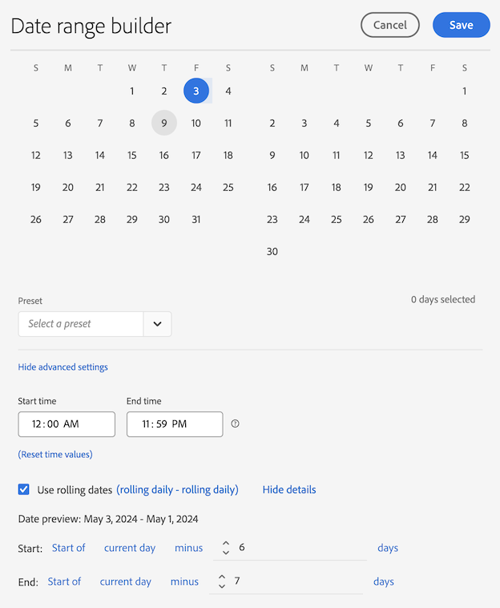

# Ejemplo de intervalos de fechas personalizados

Este artículo muestra más ejemplos de intervalos de fechas personalizados.

## Últimos dos meses

+++ Detalles

Desea definir un intervalo de fechas personalizado que defina hace dos meses. Utilice uno de los ajustes preestablecidos.

+++

## Móvil hasta el final de la semana pasada

+++ Detalles

Desea definir un intervalo de fechas que define el período entre el día actual hace una semana y el final de esa misma semana pasada. Por ejemplo, si hoy es miércoles, 11 de septiembre de 2024. Desea un intervalo de fechas del miércoles 4 de septiembre de 2024 al sábado 7 de septiembre de 2024.

+++

<!--
## Example: Use a 7-day rolling date range

You can create a date range that specifies a 7-day rolling window that ends one week ago:

Use *`rolling daily`*.

* The Start settings would be *`current day minus 6 days`*.

* The End settings would be *`current day minus 7 days`*.

This date range can be a component that you drag onto any freeform table.
-->