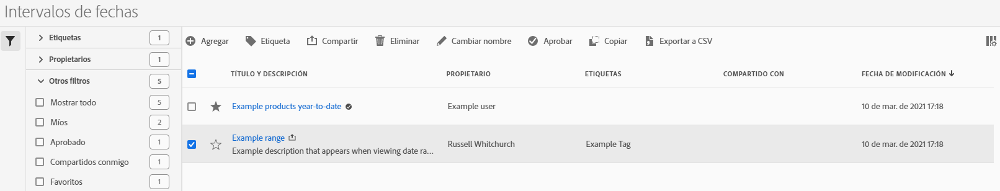

# Administrar intervalos de fechas

>[!NOTE]
>
>Está viendo la documentación de Analysis Workspace en Customer Journey Analytics. Su conjunto de funciones difiere ligeramente del [Analysis Workspace de la versión tradicional de Adobe Analytics](https://docs.adobe.com/content/help/es-ES/analytics/analyze/analysis-workspace/home.html). [Más información...](/help/getting-started/cja-aa.md)

Utilice el administrador de intervalos de fechas para compartir, cambiar el nombre o eliminar intervalos de fechas. Para llegar al administrador de fechas:

1. Log in to [analytics.adobe.com](https://analytics.adobe.com) using your AdobeID credentials.
1. Vaya a [!UICONTROL Componentes] > Intervalos [!UICONTROL de fechas].

## Interfaz

El administrador de intervalos de fechas incluye las siguientes opciones:

* **Añadir**: Cree un nuevo intervalo de fechas. Consulte [Creación de un intervalo](create.md) de fechas para obtener más información.
* **Buscar por título**: Busque un intervalo de fechas por título. Los resultados se filtran según el texto introducido aquí.
* **Filtro**: Filtre los intervalos de fechas utilizando la columna izquierda. Puede filtrar por etiqueta personalizada, propietario, creado por usted, sus favoritos, aprobado o compartido con usted. También puede buscar filtros deseados.
* **Favorito**: Haga clic en el icono de  junto a un intervalo de fechas para agregarlo a sus favoritos.
* **Personalizar columnas**: Haga clic en el icono de  para mostrar u ocultar las columnas en el administrador de intervalos de fechas.

Haga clic en la casilla de verificación situada junto a uno o varios intervalos de fechas para ver más opciones.

* **Etiqueta**: Aplicar una etiqueta a todos los intervalos de fechas seleccionados. Las etiquetas ayudan a organizar los intervalos de fechas y permiten filtrarlos mediante la columna izquierda.
* **Compartir**: Comparta un intervalo de fechas con otros usuarios Experience Cloud. Si es administrador de productos, también puede compartir con toda la organización o grupos. Los intervalos de fechas que se comparten con otros usuarios de la organización incluyen un icono  junto al título.
* **Eliminar**: Eliminar permanentemente los intervalos de fechas seleccionados.
* **Cambiar nombre**: Si se selecciona un solo intervalo de fechas, puede cambiar su título.
* **Aprobar**: Si es administrador de un producto, puede agregar un sello de aprobación a un intervalo de fechas. Los intervalos de fechas aprobados informan a los usuarios de su organización de que son &quot;oficiales&quot;, diferenciándolos de los intervalos de fechas creados por otros usuarios de su organización. Los intervalos de fechas aprobados incluyen un icono  junto al título.
* **Desaprobar**: Si es administrador de un producto y selecciona un intervalo de fechas ya aprobado, puede desaprobarlo.
* **Copiar**: Cree una copia de los intervalos de fechas seleccionados. La copia de intervalos de fechas se anexa `(Copy)` al final del título de los intervalos de fechas recién copiados.
* **Exportar a CSV**: Exporta todos los intervalos de fechas seleccionados en un archivo CSV. Las columnas del archivo CSV resultante incluyen todas las columnas visibles en el administrador de intervalos de fechas.
