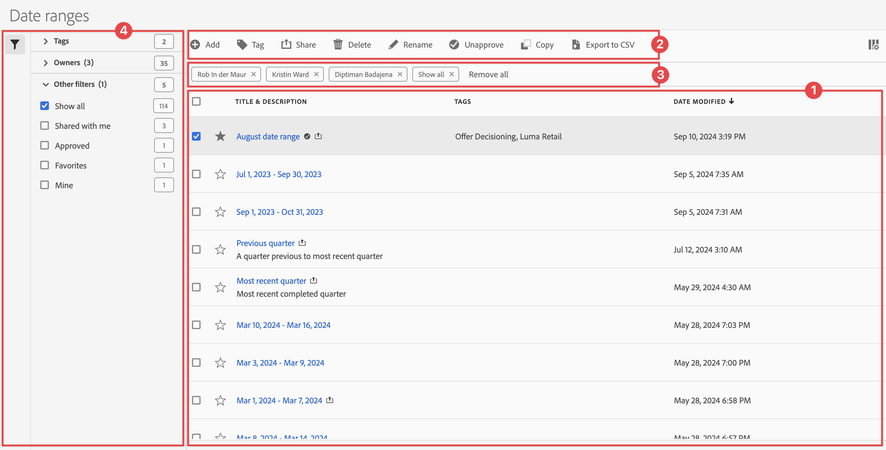

# Administrar intervalos de fechas

Puede compartir, filtrar, etiquetar, aprobar, copiar, compartir y eliminar intervalos de fechas y marcar los intervalos de fechas como favoritos desde una interfaz de administración central de [!UICONTROL intervalos de fechas]. Para administrar intervalos de fechas:

* Seleccione **[!UICONTROL Componentes]** en la interfaz principal y luego seleccione **[!UICONTROL Intervalos de fechas]**.

## Administrador de intervalos de fechas

El administrador de intervalos de fechas tiene los siguientes elementos de interfaz:

### Lista de intervalos de fechas

La lista de intervalos de fechas ➊ muestra todos los intervalos de fechas. La lista tiene las siguientes columnas:

| Columna | Descripción |
| --- | --- |
|  | Seleccione para favorecer a  o para anular la preferencia de  en un intervalo de fechas. |
| **[!UICONTROL Título y descripción]** | Para editar el título y la descripción, seleccione el vínculo del título, que abre el [Generador de intervalos de fechas](/help/components/date-ranges/create.md#date-range-builder). |
| **[!UICONTROL Propietario]** | El propietario del intervalo de fecha. |
| **[!UICONTROL Etiquetas]** | Las etiquetas para este intervalo de fechas. |
| **[!UICONTROL Compartido con]** | Las personas o grupos con los que compartió el intervalo de fechas. Seleccione para abrir el cuadro de diálogo **[!UICONTROL Compartir intervalo de fechas]**. |
| **[!UICONTROL Fecha de modificación]** | Muestra la fecha y la hora de la última modificación del intervalo de fechas. |

{style="table-layout:auto"}

Usa  para especificar qué columnas deseas mostrar.

### Barra de acciones

Puede realizar acciones en intervalos de fechas utilizando la barra de acciones ➋. La barra de acciones contiene las siguientes acciones:

| Icono | Acción | Descripción |
|:---:|---|---|
|  | **[!UICONTROL Agregue]** | Agregue otro intervalo de fechas utilizando el generador de intervalos de fechas [1&rbrace;.](create.md#date-range-builder) |
|  | [!UICONTROL *Buscar por título*] | Cuando no se selecciona ningún intervalo de fechas en la lista, busque intervalos de fechas utilizando este campo de búsqueda. |
|  | **[!UICONTROL Etiqueta]** | Etiquete los intervalos de fechas seleccionados. En el cuadro de diálogo **[!UICONTROL Intervalo de fecha de etiqueta]**, seleccione o anule la selección de las etiquetas para los intervalos de fecha seleccionados. Seleccione **[!UICONTROL Guardar]** para guardar las etiquetas de los intervalos de fechas seleccionados. |
|  | **[!UICONTROL Compartir]** | Compartir los intervalos de fechas seleccionados. En el cuadro de diálogo **[!UICONTROL Compartir intervalo de fechas]**, puede  *Buscar individuos o grupos* o puede seleccionar **[!UICONTROL Organización]** o **[!UICONTROL Grupos]**. Seleccione **[!UICONTROL Guardar]** para guardar los detalles de uso compartido de los intervalos de fechas seleccionados. |
|  | **[!UICONTROL Eliminar]** | Eliminar los intervalos de fechas seleccionados. Se te pedirá una confirmación. |
|  | **[!UICONTROL Cambiar el nombre]** | Cambie el nombre de un solo intervalo de fechas seleccionado. Cuando se selecciona, puede cambiar el nombre del intervalo de fechas en línea. |
|  | **[!UICONTROL Aprobar]** | Apruebe los intervalos de fechas seleccionados. |
|  | **[!UICONTROL Copiar]** | Copie los intervalos de fechas seleccionados. Los nuevos intervalos de fechas se crean con el mismo nombre y sufijo (Copiar) |
|  | **[!UICONTROL Exportar a CSV]** | Exportar los intervalos de fechas seleccionados a un archivo de `Date ranges List.csv`. |

### Barra de filtro activa

La barra de filtros ➌ muestra los filtros activos (si los hay). Puedes quitar rápidamente un filtro con . Si se especifica más de un filtro, use **[!UICONTROL Quitar todos]** para quitar todos los filtros.

### Panel Filtro

Puede filtrar intervalos de fechas utilizando el panel izquierdo **[!UICONTROL Filtro]** ➍. El panel Filtro muestra el tipo de filtro y el número de intervalos de fechas que respetan el filtro. Selecciona  para alternar la visualización del panel de filtros.

Filtrar la lista de filtros

1. Selecciona  para abrir el panel Filtros. Si necesitas más espacio para la lista Filtros, puedes seleccionar  una vez más para cerrar el panel.
1. Puede filtrar los intervalos de fechas utilizando cualquiera de las [secciones de filtros](#filter-sections) disponibles.

   >[!INFO]
   >
   >*Elementos* hacen referencia a los elementos de intervalo de fechas mostrados en la [lista de intervalos de fechas](#date-ranges-list).
   > 

#### Filtrar secciones

{{tagfiltersection}}
{{ownerfiltersection}}
{{otherfiltersfiltersection}}

La [lista de intervalos de fechas](#date-ranges-list) se actualiza automáticamente según la configuración del filtro. Puedes ver los filtros configurados en la [barra de filtros activa](#active-filter-bar).

## Editar intervalos de fechas

Un intervalo de fecha se edita de dos formas:

* En un proyecto de Workspace, usa el icono [Información del componente](/help/components/use-components-in-workspace.md#component-info).

* En la lista [[!UICONTROL Intervalos de fechas]](#date-ranges-list), seleccione el título del intervalo de fechas.

Utiliza el [Generador de intervalos de fechas](/help/components/date-ranges/create.md#date-range-builder) para editar el intervalo de fechas.

Utilice el administrador de intervalos de fechas para compartir, cambiar el nombre o eliminar intervalos de fechas. Para llegar al administrador de fechas:

1. Inicie sesión en [analytics.adobe.com](https://analytics.adobe.com) con sus credenciales de Adobe ID.
1. Vaya a [!UICONTROL Componentes] > [!UICONTROL Intervalos de fechas].

<!--

## Interface

The date range manager includes the following options:

* **Add**: Create a new date range. See [create a date range](create.md) for more information.
* **Search by title**: Search for a date range by title. Results are filtered based on text entered here.
* **Filter**: Filter date ranges using the left column. You can filter by custom tag, owner, created by you, your favorites, approved, or shared with you. You can also search for desired filters.
* **Favorite**: Click the  icon next to a date range to add it to your favorites.
* **Customize columns**: Click the  icon to show or hide columns in the date range manager.

Click the checkbox next to one or more date ranges for more options.

* **Tag**: Apply a tag to all selected date ranges. Tags help you organize date ranges, and let you filter them using the left column.
* **Share**: Share a date range to other Experience Cloud users. If you are a product administrator, you can also share to the entire organization or groups. Date ranges that are shared to other users in your organization include a  icon next to the title.
* **Delete**: Permanently delete the selected date range(s).
* **Rename**: If a single date range is selected, you can change its title.
* **Approve**: If you are a product admin, you can add a stamp of approval to a date range. Approved date ranges inform users in your organization that they are 'official', differentiating them from date ranges created by other users in your organization. Approved date ranges include a  icon next to the title.
* **Unapprove**: If you are a product admin and select a date range that is already approved, you can unapprove it.
* **Copy**: Create a copy of the selected date range(s). Copying date ranges appends `(Copy)` to the end of the title of the newly copied date range(s).
* **Export to CSV**: Exports all selected date ranges into a CSV file. Columns in the resulting CSV file include all visible columns in the date range manager.
-->