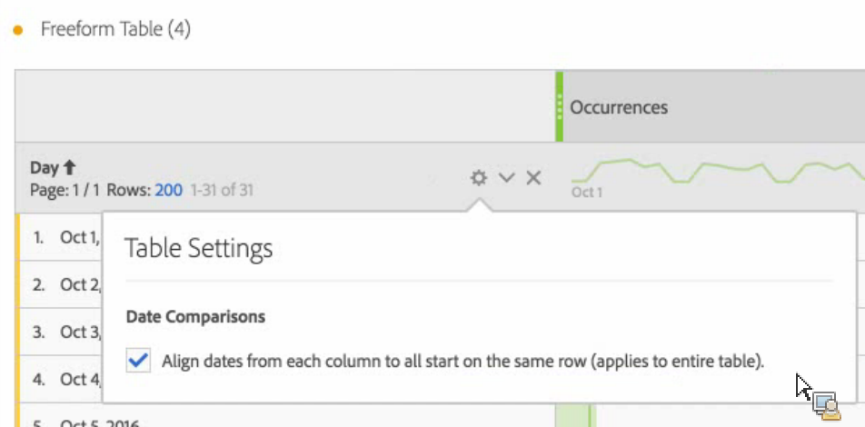

# Comparación de fechas

>[!NOTE]
>
>Está viendo la documentación de Analysis Workspace en Customer Journey Analytics. Su conjunto de funciones difiere ligeramente del [Analysis Workspace de la versión tradicional de Adobe Analytics](https://experienceleague.adobe.com/docs/analytics/analyze/analysis-workspace/home.html?lang=es). [Más información...](/help/getting-started/cja-aa.md)

La comparación de fechas de Analysis Workspace le permite tomar cualquier columna que contenga un intervalo de fechas y crear una comparación de fechas comunes, por ejemplo, año tras año, trimestre tras trimestre, mes tras mes, etc.

## Comparar periodos de tiempo

El análisis requiere contexto, y este lo proporciona a menudo un periodo de tiempo previo. Por ejemplo, la pregunta “¿En qué medida nos va mejor/peor que en este mismo momento del año pasado?” es fundamental para comprender su negocio. Las comparaciones de fechas incluyen automáticamente una columna “diferencia” que muestra el porcentaje de cambio en comparación con un periodo de tiempo concreto.

1. Cree una tabla improvisada con cualquier dimensión y métrica que quiera comprobar a lo largo de un periodo de tiempo.
1. Haga clic con el botón secundario en una fila de la tabla y seleccione **[!UICONTROL Comparar periodos de tiempo]**.

   

   >[!IMPORTANT]
   >
   >Esta opción del botón secundario está deshabilitada para filas de métricas, filas de intervalos de fechas y filas de dimensiones de tiempo.

1. Dependiendo de cómo haya establecido el intervalo de fechas de la tabla, dispone de estas opciones para la comparación:

   | Opción | Descripción |
   |---|---|
   | **[!UICONTROL Semana/mes/trimestre/año anterior a este intervalo de fechas]** | Compara la semana/mes/etc. inmediatamente anterior a este intervalo de fechas. |
   | **[!UICONTROL Esta semana/mes/trimestre/año el año pasado]** | Lo compara con el mismo intervalo de fechas hace un año. |
   | **[!UICONTROL Seleccionar intervalo]** | Le permite seleccionar un intervalo de fechas personalizado. |

   >[!NOTE]
   >
   >Cuando selecciona un número personalizado de días, por ejemplo 7 de octubre-20 de octubre (un intervalo de 14 días), solo dispone de dos opciones: **[!UICONTROL 14 días anteriores a este intervalo de fechas]** y **[!UICONTROL Seleccionar intervalo]**.

1. La comparación resultante tiene este aspecto:

   

   Las filas en la columna Cambio porcentual aparecen en rojo para los valores negativos y en verde para los positivos.

1. (Opcional) Como en cualquier otro proyecto de Workspace, puede crear visualizaciones basadas en estas comparaciones de tiempo. Por ejemplo, aquí tiene un gráfico de barras:

   

   Fíjese en que, para mostrar el cambio porcentual en el gráfico de barras, debe tener marcado el ajuste [!UICONTROL Porcentajes] en la [!UICONTROL Configuración de visualización].

## Agregar una columna Periodo de tiempo para comparar

Ahora puede agregar un periodo de tiempo a cada columna en una tabla, lo que permite agregar un periodo diferente al periodo en que está establecido el calendario. Esta es otra manera de comparar fechas.

1. Haga clic con el botón secundario en una columna de la tabla y seleccione **[!UICONTROL Agregar columna de periodo de tiempo]** 

1. Dependiendo de cómo haya establecido el intervalo de fechas de la tabla, dispone de estas opciones para la comparación:

   | Opción | Descripción |
   |---|---|
   | **[!UICONTROL Semana/mes/trimestre/año anterior a este intervalo de fechas]** | Agrega una columna con la semana/mes/etc. inmediatamente anterior a este intervalo de fechas. |
   | **[!UICONTROL Esta semana/mes/trimestre/año el año pasado]** | Agrega el mismo intervalo de fechas hace un año. |
   | **[!UICONTROL Seleccionar intervalo]** | Le permite seleccionar un intervalo de fechas personalizado. |

   >[!NOTE]
   >
   >Cuando selecciona un número personalizado de días, por ejemplo 7 de octubre-20 de octubre (un intervalo de 14 días), solo dispone de dos opciones: **[!UICONTROL 14 días anteriores a este intervalo de fechas]** y **[!UICONTROL Seleccionar intervalo]**.

1. El periodo de tiempo se insertará en la parte superior de la columna seleccionada:

   

1. Puede agregar todas las columnas de tiempo que desee, así como combinar a voluntad distintos intervalos de fechas:

   

1. Además, puede ordenar en función de cualquier columna, lo que cambiará el orden de los días, dependiendo de la columna elegida.

## Alinear fechas de columnas para que comiencen en la misma fila {#section_5085E200082048CB899C3F355062A733}

Un nuevo ajuste para todas las tablas le permite **[!UICONTROL Alinear fechas de cada columna para que todas empiecen en la misma fila (se aplica a toda la tabla)]**. “Se aplica a toda la tabla” significa que si, por ejemplo, realiza un desglose en la tabla y cambia este ajuste para el desglose, cambiará el ajuste en la tabla entera.

>[!IMPORTANT]
>
>Esta configuración está **deshabilitada** (desmarcada) para todos los proyectos existentes y **habilitada** (marcada) para todos los proyectos nuevos.

Ejemplo: Cuando elija alinear las fechas, si realiza una comparación mes tras mes entre octubre y septiembre de 2016, la columna izquierda comenzará el 1 de octubre y la de la derecha comenzará el 1 de septiembre:

<!-- 

See Jonny Moon's email from November 3. 

 -->
