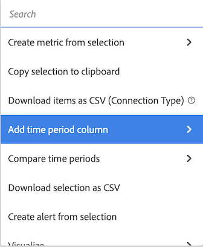

# Comparación de fechas

La comparación de fechas de Analysis Workspace le permite tomar cualquier columna que contenga un intervalo de fechas y crear una comparación de fechas comunes, por ejemplo, año tras año, trimestre tras trimestre, mes tras mes, etc.

## Comparar períodos de tiempo

El análisis requiere contexto, y este lo proporciona a menudo un período de tiempo previo. Por ejemplo, la pregunta *¿Cuánto mejor o peor estás haciendo ahora en comparación con esta época del año pasado?* es fundamental para comprender su negocio. Las comparaciones de fechas incluyen automáticamente una columna *diferencia* que muestra el cambio porcentual en comparación con un período de tiempo concreto.

1. Cree una [tabla de forma libre](/help/analysis-workspace/visualizations/freeform-table/freeform-table.md) con cualquier dimensión y métrica que quiera comparar a lo largo de un período de tiempo.
1. Establezca el período de tiempo en el panel o la columna para determinar el lapso de tiempo de comparación, y si es una comparación de tiempo móvil o fijo.

   Para crear una comparación de tiempo móvil, establezca el intervalo de fechas del panel o la columna en un intervalo de fechas móvil (por ejemplo, **[!UICONTROL últimos siete días]**, **[!UICONTROL últimos 30 días]**, etc.).

   Para crear una comparación de tiempo fijo, establezca el intervalo de fechas del panel o la columna en un intervalo de fechas personalizado.

1. Abra el menú contextual de una fila de la tabla y seleccione **[!UICONTROL Comparar períodos de tiempo]**.

   

   >[!NOTE]
   >
   >Esta opción del botón secundario está deshabilitada para filas de métricas, filas de intervalos de fechas y filas de dimensiones de tiempo.

1. En función de cómo haya configurado el intervalo de fechas de la tabla, tiene estas opciones para comparar:

   | Opción | Descripción |
   |---|---|
   | **[!UICONTROL *x* semanas/meses/trimestres/años anteriores a este intervalo de fechas]** | Compare con el intervalo de fechas seleccionado inmediatamente antes de este intervalo de fechas. |
   | **[!UICONTROL Estas x semanas/meses/trimestres/años desde el año pasado hasta este intervalo de fechas]** | Compárelo con el mismo intervalo de fechas de hace un año. |
   | **[!UICONTROL Intervalo de fechas personalizado hasta este intervalo de fechas]** | Le permite definir un intervalo de fechas personalizado. |

   >[!NOTE]
   >
   >Cuando seleccione un número de días personalizado, por ejemplo del 7 al 20 de octubre (un intervalo de 14 días), solo obtendrá dos opciones: **[!UICONTROL los 14 días anteriores a este intervalo de fechas]** y un **[!UICONTROL Intervalo de fechas personalizado hasta este intervalo de fechas]**.

1. La comparación resultante tiene este aspecto:

   

   Las filas en la columna Cambio porcentual aparecen en rojo para los valores negativos y en verde para los positivos.

## Agregar una columna Periodo de tiempo para comparar

Ahora puede añadir un período de tiempo a cada columna en una tabla, lo que permite añadir un período diferente al período en que está establecido el calendario.

1. Haga clic con el botón secundario en una columna de la tabla y seleccione **[!UICONTROL Añadir columna de periodo de tiempo]**.

   

1. En función de cómo haya configurado el intervalo de fechas de la tabla, tiene estas opciones para comparar:

   | Opción | Descripción |
   |---|---|
   | **[!UICONTROL *x* semanas/meses/trimestres/años anteriores a este intervalo de fechas]** | Agregue una columna con la semana, el mes, etc. inmediatamente antes de este intervalo de fechas. |
   | **[!UICONTROL Estas *x* semanas/meses/trimestres/años desde el año pasado hasta este intervalo de fechas]** | Añada el mismo intervalo de fechas de hace un año. |
   | **[!UICONTROL Intervalo de fechas personalizado hasta este intervalo de fechas]** | Le permite crear un intervalo de fechas personalizado. |

   >[!NOTE]
   >
   >Cuando seleccione un número de días personalizado, por ejemplo del 7 al 20 de octubre (un intervalo de 14 días), solo obtendrá dos opciones: **[!UICONTROL los 14 días anteriores a este intervalo de fechas]** y un **[!UICONTROL Intervalo de fechas personalizado hasta este intervalo de fechas]**.

1. El período de tiempo se inserta en la parte superior de la columna seleccionada:

   

1. Puede agregar todas las columnas de tiempo que desee, así como combinar a voluntad distintos intervalos de fechas:

1. Además, puede ordenar cada columna, lo que cambia el orden de los días, dependiendo de la columna que esté ordenando.

## Alinear fechas de columnas para que comiencen en la misma fila

Puede alinear fechas de cada columna con todas a partir de la misma fila.

Por ejemplo, realiza una comparación día tras día de la última semana (que termina el 5 de octubre de 2024) y de la semana anterior. De forma predeterminada, la columna izquierda comenzará el 22 de septiembre y la columna derecha comenzará el 29 de septiembre.

Puede habilitar **[!UICONTROL Alinear fechas de cada columna para que todas empiecen en la misma fila]** en [Configuración](/help/analysis-workspace/visualizations/freeform-table/freeform-table.md#settings-1) para la visualización de tabla de forma libre a fin de alinear las fechas de las columnas para que comiencen en la misma fila.

Tenga en cuenta lo siguiente al utilizar esta opción:

* Esta configuración está habilitada de forma predeterminada para todos los proyectos nuevos.

* Esta configuración se aplica a toda la tabla. Por ejemplo, si cambia esta configuración para un desglose dentro de la tabla, se aplicará la configuración a toda la tabla.

