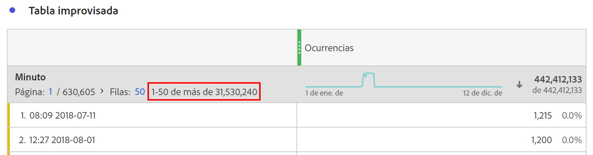

# Dimensión con muy alta cardinalidad

Customer Journey Analytics (CJA) no impone límites al número de valores únicos o elementos de dimensión que se pueden registrar dentro de una sola dimensión. Sin embargo, en algunas circunstancias, las dimensiones con un número extremadamente grande de artículos únicos —también conocidas como dimensiones de alta cardinalidad— pueden afectar a qué se puede informar.

## Limitaciones

Dependiendo del número de eventos en una conexión CJA específica, las dos limitaciones siguientes pueden ocurrir junto con dimensiones de alta cardinalidad:

### 1. Es posible que los recuentos de filas no se puedan registrar con precisión

Es posible que los recuentos de filas en dimensiones de alta cardinalidad no se puedan registrar con precisión. Cuando esto sucede, las tablas improvisadas proporcionan una indicación, como se muestra a continuación:

### 2. Las métricas calculadas pueden utilizar estimaciones para algunas funciones y para el criterio de ordenación

Cuando se utilizan con dimensiones de alta cardinalidad, algunas funciones de métricas calculadas pueden devolver estimaciones, entre las que se incluyen: Máximo de columna, Mínimo de columna, Recuento de fila, Media, Mediana, Percentil, Cuartil, Desviación estándar, Variación, Funciones de regresión, y Funciones T y Z.

Además, ordenar una columna de tabla mediante una métrica calculada puede basarse en una estimación y no reflejar siempre el orden exacto. Aparecerá un mensaje de advertencia para avisarle de que se pueden haber utilizado estimaciones.

Tenga en cuenta que, aunque las métricas calculadas a veces pueden devolver estimaciones, los totales de columnas siempre son precisos y nunca se basan en estimaciones. Del mismo modo, cuando se utilizan métricas estándares, nunca se usan estimaciones y siempre reflejan órdenes de clasificación exactos.

### Donde se consideran todos los valores de dimensión

Aunque existen limitaciones para algunas métricas calculadas y recuentos de filas de dimensión, tenga en cuenta que las siguientes capacidades siempre tienen en cuenta todos los valores únicos en cualquier dimensión, independientemente de si una dimensión es altamente cardinal o no:

* Atribución de métrica y asignación de dimensión
* Búsquedas de elementos de línea aplicadas a una tabla improvisada
* Filtros que utilizan dimensiones o elementos de dimensión
* La función aproximada de recuento distinto dentro de Métricas calculadas
* Lógica de inclusión/exclusión aplicada a cualquier métrica o dimensión dentro de una vista de datos
* Búsqueda de conjuntos de datos agregados a una conexión

## Prácticas recomendadas para trabajar con dimensiones de alta cardinalidad

Para eliminar las advertencias o estimaciones que pueden producirse al utilizar dimensiones con alta cardinalidad, recomendamos reducir el número de filas consideradas en el informe mediante uno de los métodos siguientes:

* Añada un filtro a la columna o panel afectado.
* Aplique una búsqueda a la tabla improvisada.
* Aplique un desglose a las filas de interés o utilice la dimensión de alta cardinalidad como dimensión de desglose.
* Añada criterios de inclusión/exclusión a la configuración de vista de datos de la dimensión para reducir el número de valores únicos presentes en la dimensión.

El uso de estas técnicas, con frecuencia, puede eliminar cualquier estimación o advertencia no deseable que experimente al utilizar dimensiones de alta cardenalidad.
