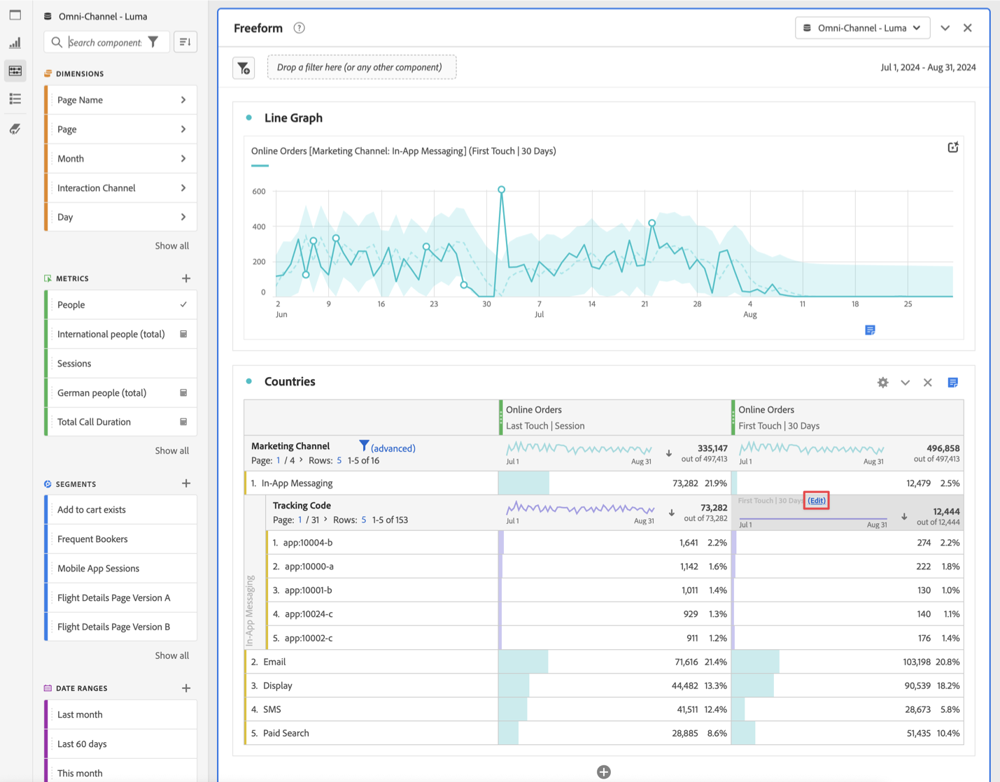

# Desglose de dimensiones

Puede desglosar los datos en Analysis Workspace de formas ilimitadas para sus necesidades específicas; crear consultas con métricas, dimensiones, segmentos, líneas de tiempo y otros valores de desglose de análisis relevantes.

1. En una [tabla de forma libre](/help/analysis-workspace/visualizations/freeform-table/freeform-table.md), en el menú contextual de una o más filas seleccionadas, seleccione **[!UICONTROL Desglose]** .

   

1. En el submenú, seleccione **[!UICONTROL Dimensiones]**, **[!UICONTROL Métricas]**, **[!UICONTROL Segmentos]** o **[!UICONTROL Intervalos de fechas]** y, a continuación, seleccione un elemento. O simplemente busque un componente en el campo **[!UICONTROL *Buscar *]**.

Puede desglosar métricas por elementos de dimensión o segmentos de público entre periodos de tiempo seleccionados. También puede continuar desglosando hasta un nivel más granular.

>[!NOTE]
>
>El número de desgloses de la tabla está limitado a 400 desgloses. Este límite aumenta para la exportación de desgloses.

## Desglose por posición

De forma predeterminada, los desgloses se corrigen a elementos de fila estáticos. Por ejemplo, supongamos que desglosa los 3 elementos de dimensión de página principales (página principal, resultados de búsqueda, cierre de compra) por canal de marketing. Después abandona el proyecto y regresa dos semanas más tarde. Al volver a abrir el proyecto, las 3 páginas principales han cambiado, y ahora la página principal, los resultados de búsqueda y el cierre de compra son las 4 o 6 páginas principales. De forma predeterminada, los desgloses del canal de marketing siguen apareciendo en la página principal, los resultados de búsqueda y el cierre de compra, aunque ahora se encuentren en las filas 4-6.

Por el contrario, **Desglose por posición**, siempre desglosa los 3 elementos principales, independientemente de cuáles sean. En referencia al ejemplo anterior, cuando vuelva a abrir el proyecto, los desgloses de canal de marketing se vinculan a las 3 páginas principales de la tabla. Y no a la página principal, los resultados de búsqueda y el cierre de compra, que ahora están en las filas 4-6. Consulte [Configuración de fila](/help/analysis-workspace/visualizations/freeform-table/column-row-settings/table-settings.md) para obtener información sobre cómo configurar esta opción.

## Aplicar modelos de atribución a desgloses

Cualquier desglose dentro de una tabla también puede tener aplicado cualquier modelo de atribución. Este modelo de atribución puede ser el mismo o diferente de la columna principal. Por ejemplo, puede analizar Pedidos lineales en su dimensión de Canales de marketing pero aplicar Pedidos en forma de U a los códigos de seguimiento específicos dentro de un Canal. Para editar el modelo de atribución aplicado a un desglose, pase el ratón sobre el modelo de desglose y seleccione **[!UICONTROL Editar]**.

Este es el comportamiento esperado al aplicar modelos de atribución a desgloses o editarlos:

* Si aplica una atribución cuando no existen otras atribuciones, esta se aplica a todo el árbol de columnas.

* Si añade un desglose después de aplicar una atribución, utilizará el valor predeterminado para el desglose dado que se añadió (si esa dimensión tiene un valor predeterminado). De lo contrario, se utiliza el desglose de la columna principal. Algunas dimensiones tienen una asignación predeterminada. Por ejemplo, las dimensiones temporales y el remitente del reenvío utilizan el mismo contacto. La dimensión Producto utiliza Último contacto. Otras dimensiones no tienen un valor predeterminado y utilizarán la asignación de columna principal.

* Si ya hay atribuciones en el árbol de columnas, cambiar la atribución solo afecta al que esté editando.

>[!BEGINSHADEBOX]

Consulte  [Dimension en Analysis Workspace](https://experienceleague.adobe.com/en/docs/analytics-learn/tutorials/analysis-workspace/dimensions/adding-dimensions-and-metrics-to-your-project-in-analysis-workspace){target="_blank"} para ver un vídeo de demostración.

{{videoaa}}

>[!ENDSHADEBOX]

>[!BEGINSHADEBOX]

Vea  [desgloses de Dimension](https://video.tv.adobe.com/v/23969?quality=12&learn=on){target="_blank"} para ver un vídeo de demostración.

{{videoaa}}

>[!ENDSHADEBOX]

>[!BEGINSHADEBOX]

Vea  [Agregar dimensiones y métricas](https://experienceleague.adobe.com/en/docs/analytics-learn/tutorials/analysis-workspace/dimensions/adding-dimensions-and-metrics-to-your-project-in-analysis-workspace){target="_blank"} para ver un vídeo de demostración.

{{videoaa}}

>[!ENDSHADEBOX]

>[!BEGINSHADEBOX]

Vea  [Trabajo con dimensiones en una tabla de forma libre](https://experienceleague.adobe.com/en/docs/analytics-learn/tutorials/analysis-workspace/building-freeform-tables/working-with-dimensions-in-a-freeform-table){target="_blank"} para ver un vídeo de demostración.

{{videoaa}}

>[!ENDSHADEBOX]

>[!BEGINSHADEBOX]

Vea  [Desglose de Dimension por posición](https://video.tv.adobe.com/v/24033){target="_blank"} para ver un vídeo de demostración.

{{videoaa}}

>[!ENDSHADEBOX]

