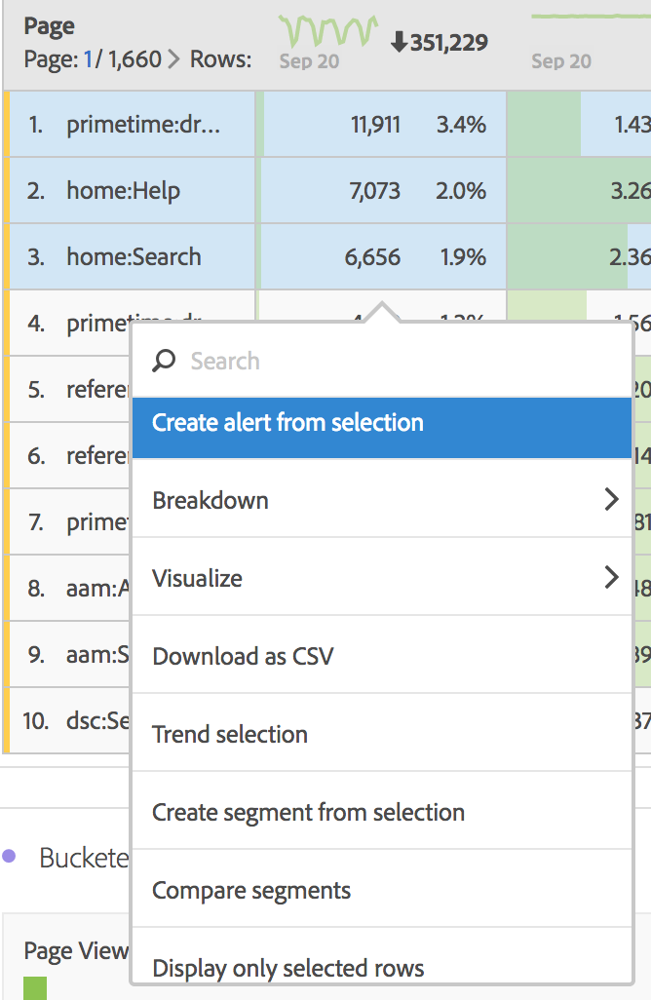

# Desglose de dimensiones en Workspace

>[!NOTE]
>
>Está viendo la documentación de Analysis Workspace en Customer Journey Analytics. Su conjunto de funciones difiere ligeramente del [Analysis Workspace de la versión tradicional de Adobe Analytics](https://experienceleague.adobe.com/docs/analytics/analyze/analysis-workspace/home.html?lang=es). [Más información...](/help/getting-started/cja-aa.md)

Desglose de dimensiones y elementos de dimensión en Analysis Workspace.

Desglose los datos de manera ilimitada según sus necesidades específicas; genere consultas utilizando métricas, dimensiones, filtros, líneas de tiempo y otros valores de desglose de análisis relevantes.

1. [Cree un proyecto](/help/analysis-workspace/home.md) con una tabla de datos.
1. En la tabla de datos, haga clic con el botón secundario en un elemento de línea y seleccione **[!UICONTROL Desglosar]** > *`<item>`*.

   

   Puede desglosar métricas por elementos de dimensión o filtros de audiencia entre periodos de tiempo seleccionados. También puede continuar desglosando hasta un nivel más granular.

   >[!NOTE]
   >
   >El número de desgloses de la tabla está limitado a 200 desgloses. Este límite aumentará para la exportación de desgloses.

**Vídeo: Dimension en Analysis Workspace**

>[!VIDEO](https://video.tv.adobe.com/v/23971)

**Vídeo: Desgloses de Dimension**

>[!VIDEO](https://video.tv.adobe.com/v/23969)

## Aplicar modelos de atribución a desgloses

Cualquier desglose dentro de una tabla también puede tener aplicado cualquier modelo de atribución. Este modelo de atribución puede ser el mismo o diferente de la columna principal. Por ejemplo, puede analizar Pedidos lineales en su dimensión de Canales de marketing pero aplicar Pedidos en forma de U a los códigos de seguimiento específicos dentro de un Canal. Para editar el modelo de atribución aplicado a un desglose, simplemente sitúe el ratón encima del modelo de desglose y haga clic en **[!UICONTROL Editar]**:

