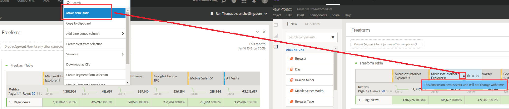

# Vista preliminar de dimensiones

>[!NOTE]
>
>Está viendo la documentación de Analysis Workspace en Customer Journey Analytics. Su conjunto de funciones difiere ligeramente del [Analysis Workspace de la versión tradicional de Adobe Analytics](https://docs.adobe.com/content/help/es-ES/analytics/analyze/analysis-workspace/home.html). [Más información...](/help/getting-started/cja-aa.md)

Sitúe el ratón encima del icono de información (i) que encontrará junto a una dimensión. Se mostrarán los cinco valores principales correspondientes a las dimensiones que no sean temporales. En el caso de las dimensiones temporales, se mostrarán los 15 valores principales. Anteriormente estos valores solían ser estáticos, es decir, los cinco valores seleccionados no cambiaban nunca.

Ahora, y de forma predeterminada, se mostrarán valores dinámicos en lugar de valores estáticos, con la opción de convertirlos en estáticos. Otros aspectos que considerar:

* A medida que los datos se actualicen, las columnas de dimensión dinámica se actualizarán para mostrar cinco de los quince elementos de dimensión actuales.
* Las columnas de dimensión dinámica que se copien o se muevan pasarán a ser de dimensión estática.
* Al pasar el ratón por encima de una columna de dimensión estática, verá un icono de bloqueo que indicará que la dimensión es estática.

## Mostrar los elementos de la dimensión

Al pasar el ratón por encima de una dimensión y hacer clic en la flecha derecha gris que se muestra al lado, aparece una lista de los elementos de su dimensión. Normalmente, en cualquier lista de elementos de dimensión se muestran los elementos principales de los últimos 30 días.

Si se desplaza hacia abajo hasta la parte final de la lista, verá **[!UICONTROL Mostrar los elementos principales de los últimos 6 meses]**. Haga clic en esta opción para ver los elementos principales de la dimensión durante los últimos 180 días.
