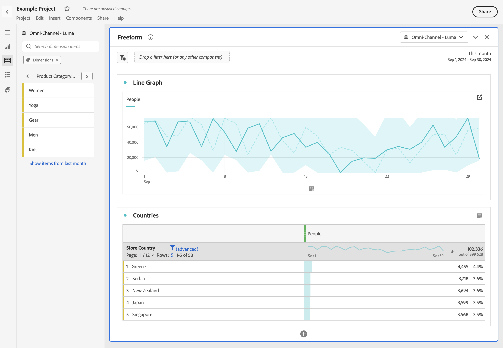

# Vista preliminar de dimensiones

Puede usar la [información de componente](/help/components/use-components-in-workspace.md#component-info) de un componente para mostrar los elementos principales de una dimensión.

<!--
Now, by default, we show dynamic values instead of static ones, with the option to turn them into static values. Other things to note:

* As your data updates, the dynamic dimension columns will update to show the current 5/15 dimension items.
* A dynamic dimension column that is copied or moved will become static.
* When hovering a static dimension column you will see a lock icon, indicating that the dimension is static.

-->

## Mostrar los elementos de la dimensión

Cuando selecciona  para una dimensión en el panel Componentes, aparece una lista de sus elementos de dimensión. La lista de elementos de dimensión generalmente muestra los elementos principales de los últimos 30 días. Cuando haya más elementos disponibles, fuera del intervalo de fechas seleccionado para el panel, seleccione el vínculo para mostrar más elementos. Por ejemplo, **[!UICONTROL mostrar elementos del mes pasado]**.

