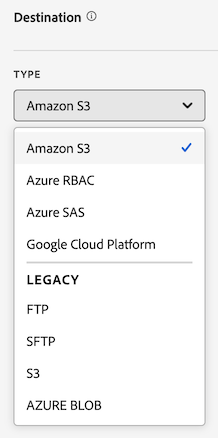

# Creación de un feed de datos

Al crear un feed de datos, debe proporcionar a Adobe lo siguiente:

* La información sobre el destino al que desea enviar los archivos de datos sin procesar

* Los datos que desea incluir en cada archivo

* La frecuencia con la que se debe enviar la fuente de datos (incluido el retraso de procesamiento para capturar las visitas que llegan tarde)

Antes de crear un feed de datos, es importante tener una comprensión básica de las fuentes de datos y asegurarse de que cumple todos los requisitos previos. Para obtener más información, consulte [Información general sobre feeds de datos](data-feed-overview.md).

## Crear o configurar una fuente de datos {#create-and-configure-data-feed}

<!-- markdownlint-disable MD034 -->

>[!CONTEXTUALHELP]
>id="cja_datafeed_export_file"
>title="Manifiesto"
>abstract="Elija si desea incluir un archivo de manifiesto con cada entrega de feed de datos. Los archivos de manifiesto contienen información para cada archivo incluido en el feed de datos. Al enviar datos del feed de datos en un solo paquete, también puede optar por incluir un archivo de finalización, pero se recomiendan los archivos de manifiesto. "

<!-- markdownlint-enable MD034 -->

<!-- markdownlint-disable MD034 -->

>[!CONTEXTUALHELP]
>id="cja_datafeed_notify"
>title="Notificar cuando se complete"
>abstract="Especifique una o varias direcciones de correo electrónico a las que se debe enviar una notificación después de enviar el feed de datos. Las múltiples direcciones de correo electrónico deben separarse con una coma."

<!-- markdownlint-enable MD034 -->

<!-- markdownlint-disable MD034 -->

>[!CONTEXTUALHELP]
>id="cja_datafeed_lookback_date_range"
>title="Intervalo de fecha de retroactividad"
>abstract="Controla la distancia a la que se muestra Customer Journey Analytics al procesar la entrega de fuentes de datos. Esta configuración no altera la ventana de frecuencia (hora o día). Sin embargo, el intervalo de fechas de retrospectiva puede influir en los datos que se envían. La calificación de segmentos, el cálculo de sesiones, algunas transformaciones de campos derivadas y la persistencia de dimensiones se ven afectados por el intervalo de fechas retrospectivo."

<!-- markdownlint-enable MD034 -->

1. Inicie sesión en [experiencecloud.adobe.com](https://experiencecloud.adobe.com) con sus credenciales de Adobe ID.

1. Selecciona [!UICONTROL **Customer Journey Analytics**] del conmutador de aplicaciones  en la parte superior derecha de la interfaz.

1. En la barra de navegación superior, vaya a [!UICONTROL **Administrador**] > [!UICONTROL **Fuentes de datos**].

1. Seleccione [!UICONTROL **Crear fuente de datos**].

   Aparece una página con las siguientes fichas: [!UICONTROL **Detalles**], [!UICONTROL **Estructura de datos**] y [!UICONTROL **Envío**].

   

1. En la sección [!UICONTROL **Detalles**], complete los campos siguientes:

   | Campo | Función |
   |---------|----------|
   | [!UICONTROL **Nombre**] | El nombre de la fuente de datos. Los nombres deben ser únicos en la vista de datos seleccionada y pueden tener hasta 255 caracteres de longitud. <!--[Learn more](/help/export/analytics-data-feed/df-faq.md#must-feed-names-be-unique)--> |
   | [!UICONTROL **Etiquetas**] | Aplique cualquier etiqueta a la fuente de datos para facilitar la categorización. <!--You can filter on tags as described in [Filter and search the list of data feeds](/help/export/analytics-data-feed/df-manage-feeds.md#filter-and-search-the-list-of-data-feeds) in [Manage data feeds](/help/export/analytics-data-feed/df-manage-feeds.md).--> |
   | [!UICONTROL **Descripción**] | Especifique una descripción para la fuente de datos. La descripción que agregue será visible al editar la fuente de datos. |
   | [!UICONTROL **Vista de datos**] | Seleccione la vista de datos que contiene los datos que desea exportar. |

1. En la sección [!UICONTROL **Estructura de datos**], asegúrese de que la vista de datos correcta esté seleccionada en el campo **[!UICONTROL Vista de datos]**. 
Tenga en cuenta lo siguiente al seleccionar una vista de datos:
 <ul><li>Si se crean varias fuentes de datos para la misma vista de datos, cada fuente de datos debe tener definiciones de columnas diferentes.</li><li>La lista de columnas disponibles depende de la empresa de inicio de sesión a la que pertenezca la vista de datos seleccionada. Si cambia la vista de datos, puede cambiar la lista de columnas disponibles. </li></ul>

1. Agregue columnas a la configuración de la fuente de datos. En la sección del carril de componente de la izquierda, localice las columnas que desee incluir y, a continuación, arrástrelas al lienzo para crear la estructura de datos. Para seleccionar varias columnas, mantenga presionada la tecla **[!UICONTROL Mayús]**, o bien mantenga presionada la tecla **[!UICONTROL Comando]** (en macOS) o la tecla **[!UICONTROL Ctrl]** (en Windows).

   Utilice la siguiente información para comprender las dimensiones que siempre se incluyen, las dimensiones que no se pueden incluir y las métricas que se deben sustituir:

   +++ Dimensiones que siempre se incluyen en las fuentes de datos

   Las siguientes dimensiones se incluyen de forma predeterminada en todas las fuentes de datos y no se pueden eliminar:

   | Nombre de la dimensión | Notas | Fuentes de datos | Otros informes |
   |---|---|---|---|
   | Marca de tiempo | Marca de tiempo del periodo del evento. Granularidad de microsegundos. Representado en UTC. | Obligatorio | No disponible |
   | Identificador de fila | Identificador de fila único | Obligatorio | No disponible |
   | ID de sesión | Identificador único de cada sesión | Obligatorio | No disponible |
   | ID de persona | El identificador personal de la vista de datos y la conexión | Obligatorio | Estándar opcional |
   | ID de cuenta [!BADGE B2B edition]{type=Informative url="https://experienceleague.adobe.com/es/docs/analytics-platform/using/cja-overview/cja-b2b/cja-b2b-edition" newtab=true tooltip="Customer Journey Analytics B2B Edition"} | ID de cuenta al utilizar el contenedor de cuenta | Obligatorio | Estándar opcional |

   +++

   +++ Dimensiones que no se pueden incluir en las fuentes de datos

   Las dimensiones estándar de Customer Journey Analytics no se pueden incluir en las fuentes de datos. En la tabla siguiente se enumeran estas dimensiones:

   | Nombre de la dimensión | Notas | Fuentes de datos |
   |---|---|---|
   | 5 minutos | Intervalos de cinco minutos cuando ocurrieron los eventos (redondeados hacia abajo) | No disponible |
   | 15 minutos | Intervalos de quince minutos cuando ocurrieron los eventos (redondeados hacia abajo) | No disponible |
   | 30 minutos | Intervalos de treinta minutos cuando ocurrieron los eventos (redondeados hacia abajo) | No disponible |
   | Día | Día en que se produjo un evento | No disponible |
   | Día de la semana | Día de la semana en que se produjo un evento | No disponible |
   | Día del mes | Día del mes en el que se produjo un evento | No disponible |
   | Profundidad del evento | Valor numérico secuencial (1, 2, 3, etc.) asignado a cada interacción de evento dentro de una sesión | No disponible |
   | Hora | Hora a la que se produjo un evento (redondeado hacia abajo) | No disponible |
   | Hora del día | Hora del día en que se produjo un evento (redondeado hacia abajo) | No disponible |
   | Minuto | Minuto en que se produjo un evento (redondeado hacia abajo) | No disponible |
   | Minuto de la hora | Minuto de la hora en que se produjo un evento (redondeado hacia abajo) | No disponible |
   | Mes | Mes en el que se produjo un evento | No disponible |
   | Mes del año | Mes del año en el que se produjo un evento | No disponible |
   | Trimestre | Trimestre en que se produjo un evento | No disponible |
   | Trimestre del año | Trimestre del año en el que se produjo un evento | No disponible |
   | Second | Segundo evento (redondeado hacia abajo) | No disponible |
   | Semana | Semana en que se produjo un evento | No disponible |
   | Semana del año | Semana del año en que se produjo un evento | No disponible |
   | Año | Año en el que se produjo un evento | No disponible |

   +++

   +++ Métricas que deben sustituirse en las fuentes de datos

   Se deben sustituir las siguientes métricas de Customer Journey Analytics:

   | Nombre de la métrica | Notas | Fuentes de datos |
   |---|---|---|
   | Cuentas [!BADGE B2B Edition]{type=Informative url="https://experienceleague.adobe.com/es/docs/analytics-platform/using/cja-overview/cja-b2b/cja-b2b-edition" newtab=true tooltip="Customer Journey Analytics B2B Edition"} | Según el ID de cuenta especificado en la conexión | No disponible. Utilice un recuento distinto del ID de cuenta. |
   | Comprando grupo [!BADGE B2B edition]{type=Informative url="https://experienceleague.adobe.com/es/docs/analytics-platform/using/cja-overview/cja-b2b/cja-b2b-edition" newtab=true tooltip="Customer Journey Analytics B2B Edition"} | Comprar grupos en función del ID del grupo de compra en la conexión | No disponible. Utiliza un recuento distinto del ID del grupo de compra. |
   | Eventos | Número de filas de todos los conjuntos de datos de evento de una conexión | No disponible. Utilice un recuento distinto del ID de fila. |
   | Cuentas globales [!BADGE B2B Edition]{type=Informative url="https://experienceleague.adobe.com/es/docs/analytics-platform/using/cja-overview/cja-b2b/cja-b2b-edition" newtab=true tooltip="Customer Journey Analytics B2B Edition"} | Según el ID de cuentas globales de la conexión | No disponible. Utilice un recuento distinto del ID de cuentas globales. |
   | Oportunidades [!BADGE B2B Edition]{type=Informative url="https://experienceleague.adobe.com/es/docs/analytics-platform/using/cja-overview/cja-b2b/cja-b2b-edition" newtab=true tooltip="Customer Journey Analytics B2B Edition"} | Oportunidades basadas en el ID de oportunidad en la conexión | No disponible. Utilice un recuento distinto del ID de oportunidad. |
   | Personas | Según el ID de persona especificado en una conexión | No disponible. Utilice un recuento distinto del ID de persona. |
   | Conversaciones | Número de conversaciones | No disponible. Utilice un recuento distinto del ID de conversación. |
   | Terminaciones de sesión | Número de eventos que fueron el último evento de una sesión | No disponible |
   | La sesión inicia | Número de eventos que fueron el primer evento de una sesión | No disponible |
   | Sesiones | Basado en la configuración de sesión de la vista de datos | No disponible. Utilice un recuento distinto del ID de sesión. |
   | Tiempo empleado (segundos) | Suma el tiempo entre dos valores de dimensión diferentes | No disponible |

   +++

   +++ Componentes estándar opcionales

   | Nombre del componente | Tipo | Notas | Fuentes de datos |
   |---|---|---|---|
   | AM/PM | Dimensión de partición de tiempo | a. m. o p. m. | No disponible |
   | ID de lote | Dimensión | Identificador de un lote de Experience Platform | Disponible |
   | ID de conjunto de datos | Dimensión | Identificador de un conjunto de datos de Experience Platform | Disponible |
   | Día del mes | Dimensión de partición de tiempo | 1-31 | No disponible |
   | Día de la semana | Dimensión de partición de tiempo | De lunes a domingo | No disponible |
   | Día del año | Dimensión de partición de tiempo | 1-366 | No disponible |
   | Hora del día | Dimensión de partición de tiempo | 0-23 | No disponible |
   | Mes del año | Dimensión de partición de tiempo | Enero-diciembre | No disponible |
   | Sesiones por primera vez | Métrica | Primera sesión definida por una persona dentro de la ventana de creación de informes | No disponible |
   | Sesiones de retorno | Métrica | Sesiones que no fueron la primera sesión de una persona | No disponible |
   | Área de nombres de ID de persona | Dimensión | Tipo de ID del que consta el ID de persona (por ejemplo, correo electrónico o ID de cookie) | Disponible |
   | ID de cuenta global [!BADGE B2B edition]{type=Informative url="https://experienceleague.adobe.com/es/docs/analytics-platform/using/cja-overview/cja-b2b/cja-b2b-edition" newtab=true tooltip="Customer Journey Analytics B2B Edition"} | Dimensión | ID de cuenta global al usar el contenedor de cuenta global | Disponible |
   | ID de oportunidad [!BADGE B2B edition]{type=Informative url="https://experienceleague.adobe.com/es/docs/analytics-platform/using/cja-overview/cja-b2b/cja-b2b-edition" newtab=true tooltip="Customer Journey Analytics B2B Edition"} | Dimensión | ID de oportunidad al utilizar el contenedor de oportunidad | Disponible |
   | Comprando el identificador de grupo [!BADGE B2B edition]{type=Informative url="https://experienceleague.adobe.com/es/docs/analytics-platform/using/cja-overview/cja-b2b/cja-b2b-edition" newtab=true tooltip="Customer Journey Analytics B2B Edition"} | Dimensión | ID del grupo de compra al utilizar el contenedor de grupo de compra | Disponible |
   | Trimestre del año | Dimensión de partición de tiempo | T1, T2, T3, T4 | No disponible |
   | Repetir sesión | Métrica | Sesiones que no fueron la primera sesión de una persona | No disponible |
   | Tipo de sesión | Dimensión | Dos valores: Primera vez o Retorno | No disponible |
   | Tiempo empleado por evento | Dimensión | Agrupa el Tiempo empleado de la métrica en bloques de eventos | No disponible |
   | Tiempo empleado por sesión | Dimensión | Agrupa el Tiempo empleado de la métrica en bloques de sesiones | No disponible |
   | Tiempo empleado por persona | Dimensión | Agrupa el Tiempo empleado de la métrica en bloques de personas | No disponible |
   | Fin de semana / Día de la semana | Dimensión de partición de tiempo | Fin de semana o día laborable | No disponible |

   +++

1. En la sección [!UICONTROL **Delivery**], especifique la siguiente información:

   | Campo | Función |
   |---------|----------|
   | [!UICONTROL **Tipo de fuente**] | Seleccione el tipo de fuente que desea crear:<ul><li>[!UICONTROL **Fuente activa**]: exporta datos actuales y futuros.</li><li>[!UICONTROL **Fuente de relleno**]: exporta datos históricos entre dos fechas pasadas.</li></ul> |
   | [!UICONTROL **Fecha de inicio**] | Especifique la fecha en la que desea que comience la fuente de datos. Para empezar a procesar fuentes de datos para datos históricos de inmediato, asegúrese de seleccionar [!UICONTROL **Fuente de relleno**] y luego establezca esta fecha en cualquier fecha del pasado en que se estén recopilando datos. La fecha de inicio se basa en la zona horaria de la vista de datos. |
   | [!UICONTROL **Fecha de finalización**] | Especifique la fecha en la que desea que finalice la fuente de datos. La fecha de finalización se basa en la zona horaria de la vista de datos. |
   | [!UICONTROL **Frecuencia**] | Seleccione la frecuencia con la que se debe enviar la fuente de datos. Los eventos con marcas de tiempo incluidas en la ventana de frecuencia se incluyen en la entrega de fuentes de datos. Los campos [!UICONTROL **Intervalo de fechas de retrospectiva**] y [!UICONTROL **Demora de procesamiento**] también pueden afectar qué eventos se incluyen en los datos para la frecuencia de envío que elija.
En el caso de las fuentes en directo, seleccione esta opción para incluir datos de una hora o de un día. Las fuentes de relleno deben ser diarias.
<ul><li>**Diario**: las fuentes contienen datos de un día completo, de medianoche a medianoche en el huso horario de la vista de datos. Utilice esta opción para fuentes de relleno o para fuentes activas.</li><li>**Por hora**: las fuentes contienen datos de una sola hora. Utilice esta opción para las fuentes activas.</li></ul> |
   | [!UICONTROL **Intervalo de fechas de retrospectiva**] | Controla la distancia a la que se muestra Customer Journey Analytics al procesar la entrega de fuentes de datos. 
Esta configuración no altera la ventana de frecuencia (hora o día), que define el lapso de tiempo de los eventos que se incluirán en la salida de fuente de datos. Sin embargo, el intervalo de fechas de retrospectiva puede influir en los datos que se envían de las siguientes maneras: 
<ul><li>**Calificación de segmentos**: Cuando se aplica un segmento a su definición de fuente de datos, cualquier evento dentro del intervalo de fechas retrospectivas determina si una persona cumple los requisitos. La configuración del contenedor del segmento determina el ámbito. (Los contenedores posibles son: Persona, Sesión o Evento. B2B tiene los siguientes contenedores adicionales: Cuenta global, Cuenta, Oportunidad, Grupo de compra).  
Por ejemplo, si se utiliza un contenedor de persona y la persona se califica durante el intervalo de fechas retrospectivas, también se calificarán todos los eventos de esa persona durante la ventana de frecuencia.
</li><li>**Cálculo de sesión**: los límites de sesión se calculan usando datos dentro del intervalo de fechas retrospectivo.</li><li>**Transformaciones de campo derivadas**: todas las funciones de campo derivadas que hacen referencia a contenedores utilizan el intervalo de fecha retrospectiva en las exportaciones de fuentes de datos.</li><li>**Persistencia de Dimension**: Si elige establecer la persistencia en una dimensión individual, también elige una caducidad para determinar cuánto tiempo persiste un elemento de dimensión más allá del evento en el que está establecido. 
El intervalo de fechas de retrospectiva afecta a la persistencia de la dimensión cuando la caducidad se establece en cualquiera de las siguientes opciones de la vista de datos:
<ul><li>Para cada dimensión de la definición de fuente de datos que usa [!UICONTROL **Ventana de informes**] como caducidad, el intervalo de fecha retrospectiva se convierte en la nueva ventana de informes.</li><li>Para cada dimensión de la definición de fuente de datos que usa [!UICONTROL **Tiempo personalizado**] como caducidad, y si la hora personalizada que se selecciona se extiende más allá del intervalo de fechas de retrospectiva, se ignora la hora personalizada y se usa el intervalo de fechas de retrospectiva para la caducidad de la dimensión.
Para obtener más información acerca de cómo establecer la persistencia en dimensiones dentro de la vista de datos, vea [Configuración del componente de persistencia](/help/data-views/component-settings/persistence.md).
</li></ul> |
   | [!UICONTROL **Retraso de procesamiento**] | Elija la cantidad de tiempo de espera antes de procesar un archivo de fuente de datos. Las visitas que llegan tarde y que se producen durante el retraso del procesamiento se incluyen en la fuente de datos. 
Un retraso puede resultar útil para ofrecer a las implementaciones móviles la oportunidad de que los dispositivos sin conexión se conecten y envíen datos. También se puede utilizar para dar cabida a los procesos del lado del servidor de su organización en la administración de archivos procesados anteriormente. 

Puede retrasar una fuente 2, 3, 4 u 8 horas.
Las sesiones deben comenzar después del límite de retraso de procesamiento para que se incluyan; no se incluyen las sesiones que comienzan antes del límite y finalizan dentro del retraso de procesamiento.
 |

1. En la sección [!UICONTROL **Destino**], configure el destino al que desea enviar los datos.

   >[!NOTE]
   >
   >Al configurar el destino de un informe, tenga en cuenta lo siguiente:
   >
   ><!--* Adobe recommends using a cloud account for your report destination. [Legacy FTP and SFTP accounts](/help/components/locations/configure-import-accounts.md) are available, but are not recommended.-->
   >* Todas las cuentas de nube que haya configurado anteriormente están disponibles para su uso en fuentes de datos. Puede configurar cuentas en la nube desde el administrador Ubicaciones, en [Componentes > Exportaciones > Cuentas de ubicación](/help/components/exports/cloud-export-accounts.md).
   >
   >* Las cuentas de nube de están asociadas a su cuenta de usuario de Customer Journey Analytics. Otros usuarios no pueden usar ni ver las cuentas de nube que configure a menos que las ponga a disposición de todos los usuarios de su organización.
   >
   >* Puede editar cualquier ubicación que cree desde el administrador Ubicaciones en [Componentes > Exportaciones > Ubicaciones](/help/components/exports/cloud-export-locations.md).

   Complete los campos siguientes:

   | Campo | Función |
   |---------|----------|
   | [!UICONTROL **Cuenta**] | Realice cualquiera de los siguientes pasos:<ul><li>**Usar una cuenta existente:** Seleccione el menú desplegable situado junto al campo **[!UICONTROL Cuenta]**. O bien, empiece a escribir el nombre de la cuenta y, a continuación, selecciónela en el menú desplegable. 
Las cuentas solo están disponibles si las ha configurado o si se comparten con una organización de la que forma parte.
</li><li>**Crear una nueva cuenta:** Seleccione **[!UICONTROL Agregar nuevo]** debajo del campo **[!UICONTROL Cuenta]**. Para obtener información sobre cómo configurar la cuenta, consulte [Configurar cuentas de exportación en la nube](/help/components/exports/cloud-export-accounts.md).</li></ul> |
   | [!UICONTROL **Ubicación**] | Realice cualquiera de los siguientes pasos:<ul><li>**Usar una ubicación existente:** Seleccione el menú desplegable situado junto al campo **[!UICONTROL Ubicación]**. O bien, empiece a escribir el nombre de la ubicación y, a continuación, selecciónela en el menú desplegable.</li><li>**Crear una nueva ubicación:** Seleccione **[!UICONTROL Agregar nuevo]** debajo del campo **[!UICONTROL Ubicación]**. Para obtener información sobre cómo configurar la ubicación, consulte [Configurar ubicaciones de exportación de la nube](/help/components/exports/cloud-export-locations.md).</li></ul> |
   | [!UICONTROL **Notificar cuando se complete**] | Especifique una o varias direcciones de correo electrónico a las que se debe enviar una notificación después de que la fuente de datos se haya enviado correctamente o no se haya enviado. Las múltiples direcciones de correo electrónico deben separarse con una coma. |
   | [!UICONTROL **Habilitar manifiesto**] | Elija si desea incluir un archivo de manifiesto con cada entrega de feed de datos. El archivo de manifiesto contiene información para cada archivo incluido en la fuente de datos. |

1. Seleccione **[!UICONTROL Guardar]**.

<!-- why would you want to do this? -->

<!--
I don't think we need anything after this, but saving here just in case:

1. In the [!UICONTROL **Feed Information**] section, complete the following fields:
   
   | Field | Function |
   |---------|----------|
   | [!UICONTROL **Name**] | The name of the data feed. Must be unique within the selected report suite, and can be up to 255 characters in length. [Learn more](/help/export/analytics-data-feed/df-faq.md#must-feed-names-be-unique) |
   | [!UICONTROL **Report suite**] | The report suite that the data feed is based on. If multiple data feeds are created for the same report suite, they must have different column definitions. Only source report suites support data feeds; virtual report suites are not supported. |
   | [!UICONTROL **Email when complete**] | The email address to be notified when a feed finishes processing. The email address must be properly formatted. |
   | [!UICONTROL **Feed interval**] | Select **Daily** for backfill or historical data. Daily feeds contain a full day's worth of data, from midnight to midnight in the report suite's time zone. Select **Hourly** for continuing data (Daily is also available for continuing feeds if you prefer). Hourly feeds contain a single hour's worth of data. |
   | [!UICONTROL **Delay processing**] | Wait a given amount of time before processing a data feed file. A delay can be useful to give mobile implementations an opportunity for offline devices to come online and send data. It can also be used to accommodate your organization's server-side processes in managing previously processed files. In most cases, no delay is needed. A feed can be delayed by up to 120 minutes. |
   | [!UICONTROL **Start & end dates**] | The start date indicates the date when you want the data feed to begin. To immediately begin processing data feeds for historical data, set this date to any date in the past when data is being collected. The start and end dates are based on the report suite's time zone. |
   | [!UICONTROL **Continuous feed**] | This checkbox removes the end date, allowing a feed to run indefinitely. When a feed finishes processing historical data, a feed waits for data to finish collecting for a given hour or day. Once the current hour or day concludes, processing begins after the specified delay. |
   
1. In the [!UICONTROL **Destination**] section, in the [!UICONTROL **Type**] drop-down menu, select the destination where you want the data to be sent. 

   >[!NOTE]
   >
   >Consider the following when configuring a report destination:
   >
   >* We recommend using a cloud account for your report destination. [Legacy FTP and SFTP accounts](#legacy-destinations) are available, but are not recommended.
   >* Any cloud accounts that you previously configured are available to use for Data Feeds. You can configure cloud accounts in any of the following ways:
   >
   >   * When configuring cloud accounts for [Data Warehouse](/help/export/data-warehouse/create-request/dw-request-report-destinations.md) 
   >   
   >   * When [importing Adobe Analytics classification data](/help/components/locations/locations-manager.md) (Any locations that are configured for importing classification data cannot be used.)
   >   
   >   * From the Locations manager, in [Components > Locations](/help/components/locations/configure-import-accounts.md) 
   >
   >* Cloud accounts are associated with your Adobe Analytics user account. Other users cannot use or view cloud accounts that you configure.
   >
   >* You can edit any locations that you create from the Locations manager in [Components > Locations](/help/components/locations/configure-import-accounts.md)

   

   Use any of the following destination types when creating a data feed. For configuration instructions, expand the destination type. (Additional [legacy destinations](#legacy-destinations) are also available, but are not recommended.)

   +++Amazon S3

   You can send feeds directly to Amazon S3 buckets. This destination type requires only your Amazon S3 account and the location (bucket). 

   Adobe Analytics uses cross-account authentication to upload files from Adobe Analytics to the specified location in your Amazon S3 instance.

   When using Amazon S3 with Data Feeds, only SSE-S3 encryption is supported.

   To configure an Amazon S3 bucket as the destination for a data feed:

   1. Begin creating a data feed as described in [Create and configure a data feed](#create-and-configure-a-data-feed).
   
   1. In the [!UICONTROL **Destination**] section, in the [!UICONTROL **Type**] drop-down menu, select [!UICONTROL **Amazon S3**].

      

   1. Select [!UICONTROL **Select location**].

      The Amazon S3 Export Locations page is displayed.

   1. (Conditional) If an Amazon S3 account (and a location on that account) has already been configured in Adobe Analytics, you can use it as your data feed destination: 

      >[!NOTE]
      >
      >Accounts are available to you only if you configured them or if they were shared with an organization you are a part of.
   
      1. Select the account from the [!UICONTROL **Select account**] drop-down menu.

         Any cloud accounts that were configured in any of the following areas of Adobe Analytics are available to use:
      
         * When importing Adobe Analytics classification data, as described in [Schema](/help/components/classifications/sets/manage/schema.md).
      
           However, any locations that are configured for importing classification data cannot be used. Instead, add a new destination as described below.

         * When configuring accounts and locations in the Locations area, as described in [Configure cloud import and export accounts](/help/components/locations/configure-import-accounts.md) and [Configure cloud import and export locations](/help/components/locations/configure-import-locations.md).
   
      1. Select the location from the [!UICONTROL **Select location**] drop-down menu.

      1. Select [!UICONTROL **Save**] > [!UICONTROL **Save**].

      The destination is now configured to send data to the Amazon S3 location that you specified.
   
   1. (Conditional) If you have not previously added an Amazon S3 account:

      1. Select [!UICONTROL **Add account**], then specify the following information:
   
         |Field | Function |
         |---------|----------|
         | [!UICONTROL **Account name**] | A name for the account. This can be any name you choose. |
         | [!UICONTROL **Account description**] | A description for the account. |
         | [!UICONTROL **Role ARN**] | You must provide a Role ARN (Amazon Resource Name) that Adobe can use to gain access to the Amazon S3 account. To do this, you create an IAM permission policy for the source account, attach the policy to a user, and then create a role for the destination account. For specific information, see [this AWS documentation](https://aws.amazon.com/premiumsupport/knowledge-center/cross-account-access-iam/). |
         | [!UICONTROL **User ARN**] | The User ARN (Amazon Resource Name) is provided by Adobe. You must attach this user to the policy you created. |

         {style="table-layout:auto"}

      1. Select [!UICONTROL **Add location**], then specify the following information:
   
         |Field | Function |
         |---------|----------|
         | [!UICONTROL **Name**] | A name for the account.  |
         | [!UICONTROL **Description**] | A description for the account. |
         | [!UICONTROL **Bucket**] | The bucket within your Amazon S3 account where you want Adobe Analytics data to be sent. 
Ensure that the User ARN that was provided by Adobe has the `S3:PutObject` permission in order to upload files to this bucket. This permission allows the User ARN to upload initial files and overwrite files for subsequent uploads.

Bucket names must meet specific naming rules. For example, they must be between 3 to 63 characters long, can consist only of lowercase letters, numbers, dots (.), and hyphens (-), and must begin and end with a letter or number. [A complete list of naming rules are available in the AWS documentation](https://docs.aws.amazon.com/AmazonS3/latest/userguide/bucketnamingrules.html). 
 |
         | [!UICONTROL **Prefix**] | The folder within the bucket where you want to put the data. Specify a folder name, then add a backslash after the name to create the folder. For example, `folder_name/` |

         {style="table-layout:auto"}

      1. Select [!UICONTROL **Create**] > [!UICONTROL **Save**].

         The destination is now configured to send data to the Amazon S3 location that you specified.

      1. (Conditional) If you need to manage the destination (account and location) that you just created, it is available in the [Locations manager](/help/components/locations/locations-manager.md).
   
   +++

   +++Azure RBAC

   You can send feeds directly to an Azure container by using RBAC authentication. This destination type requires an Application ID, Tenant ID, and Secret. 

   To configure an Azure RBAC account as the destination for a data feed:

   1. If you haven't already, create an Azure application that Adobe Analytics can use for authentication, then grant access permissions in access control (IAM). 
   
      For information, refer to the [Microsoft Azure documentation about how to create an Azure Active Directory application](https://learn.microsoft.com/en-us/azure/active-directory/develop/howto-create-service-principal-portal). 
   
   1. In the Adobe Analytics admin console, in the [!UICONTROL **Destination**] section, in the [!UICONTROL **Type**] drop-down menu, select [!UICONTROL **Azure RBAC**].

      

   1. Select [!UICONTROL **Select location**].

      The Azure RBAC Export Locations page is displayed.

   1. (Conditional) If an Azure RBAC account (and a location on that account) has already been configured in Adobe Analytics, you can use it as your data feed destination: 

      >[!NOTE]
      >
      >Accounts are available to you only if you configured them or if they were shared with an organization you are a part of.
   
      1. Select the account from the [!UICONTROL **Select account**] drop-down menu.

      Any cloud accounts that you configured in any of the following areas of Adobe Analytics are available to use:
      
         * When importing Adobe Analytics classification data, as described in [Schema](/help/components/classifications/sets/manage/schema.md).
      
           However, any locations that are configured for importing classification data cannot be used. Instead, add a new destination as described below.

         * When configuring accounts and locations in the Locations area, as described in [Configure cloud import and export accounts](/help/components/locations/configure-import-accounts.md) and [Configure cloud import and export locations](/help/components/locations/configure-import-locations.md).

      1. Select the location from the [!UICONTROL **Select location**] drop-down menu.

      1. Select [!UICONTROL **Save**] > [!UICONTROL **Save**].

         The destination is now configured to send data to the Azure RBAC location that you specified.

   1. (Conditional) If you have not previously added an Azure RBAC account:

      1. Select [!UICONTROL **Add account**], then specify the following information:
   
         |Field | Function |
         |---------|----------|
         | [!UICONTROL **Account name**] | A name for the Azure RBAC account. This name displays in the [!UICONTROL **Select account**] drop-down field and can be any name you choose. |
         | [!UICONTROL **Account description**] | A description for the Azure RBAC account. This description displays in the [!UICONTROL **Select account**] drop-down field and can be any name you choose.  |
         | [!UICONTROL **Application ID**] | Copy this ID from the Azure application that you created. In Microsoft Azure, this information is located on the **Overview** tab within your application. For more information, see the [Microsoft Azure documentation about how to register an application with the Microsoft identity platform](https://learn.microsoft.com/en-us/azure/active-directory/develop/quickstart-register-app). |
         | [!UICONTROL **Tenant ID**] | Copy this ID from the Azure application that you created. In Microsoft Azure, this information is located on the **Overview** tab within your application. For more information, see the [Microsoft Azure documentation about how to register an application with the Microsoft identity platform](https://learn.microsoft.com/en-us/azure/active-directory/develop/quickstart-register-app). |
         | [!UICONTROL **Secret**] | Copy the secret from the Azure application that you created. In Microsoft Azure, this information is located on the **Certificates & secrets** tab within your application. For more information, see the [Microsoft Azure documentation about how to register an application with the Microsoft identity platform](https://learn.microsoft.com/en-us/azure/active-directory/develop/quickstart-register-app). |

         {style="table-layout:auto"}

      1. Select [!UICONTROL **Add location**], then specify the following information: 
   
         |Field | Function |
         |---------|----------|
         | [!UICONTROL **Name**] | A name for the location. This name displays in the [!UICONTROL **Select location**] drop-down field and can be any name you choose. |
         | [!UICONTROL **Description**] | A description for the location. This description displays in the [!UICONTROL **Select location**] drop-down field and can be any name you choose. |
         | [!UICONTROL **Account**] | The Azure storage account. |
         | [!UICONTROL **Container**] | The container within the account you specified where you want Adobe Analytics data to be sent. Ensure that you grant permissions to upload files to the Azure application that you created earlier. |
         | [!UICONTROL **Prefix**] | The folder within the container where you want to put the data. Specify a folder name, then add a backslash after the name to create the folder. For example, `folder_name/`
Make sure the Application ID that you specified when configuring the Azure RBAC account has been granted the `Storage Blob Data Contributor` role in order to access the container (folder).
 
For more information, see [Azure built-in roles](https://learn.microsoft.com/en-us/azure/role-based-access-control/built-in-roles).
 |

         {style="table-layout:auto"}

      1. Select [!UICONTROL **Create**] > [!UICONTROL **Save**].

         The destination is now configured to send data to the Azure RBAC location that you specified.

      1. (Conditional) If you need to manage the destination (account and location) that you just created, it is available in the [Locations manager](/help/components/locations/locations-manager.md).
   
   +++

   +++Azure SAS

   You can send feeds directly to an Azure container by using SAS authentication. This destination type requires an Application ID, Tenant ID, Key vault URI, Key vault secret name, and secret. 

   To configure Azure SAS as the destination for a data feed:

   1. If you haven't already, create an Azure application that Adobe Analytics can use for authentication. 
   
      For information, refer to the [Microsoft Azure documentation about how to create an Azure Active Directory application](https://learn.microsoft.com/en-us/azure/active-directory/develop/howto-create-service-principal-portal). 
   
   1. In the Adobe Analytics admin console, in the [!UICONTROL **Destination**] section, select [!UICONTROL **Azure SAS**].

      

   1. Select [!UICONTROL **Select location**].

      The Azure SAS Export Locations page is displayed.

   1. (Conditional) If an Azure SAS account (and a location on that account) has already been configured in Adobe Analytics, you can use it as your data feed destination: 

      >[!NOTE]
      >
      >Accounts are available to you only if you configured them or if they were shared with an organization you are a part of.
   
      1. Select the account from the [!UICONTROL **Select account**] drop-down menu.

         Any cloud accounts that you configured in any of the following areas of Adobe Analytics are available to use:
      
         * When importing Adobe Analytics classification data, as described in [Schema](/help/components/classifications/sets/manage/schema.md).
      
           However, any locations that are configured for importing classification data cannot be used. Instead, add a new destination as described below.

         * When configuring accounts and locations in the Locations area, as described in [Configure cloud import and export accounts](/help/components/locations/configure-import-accounts.md) and [Configure cloud import and export locations](/help/components/locations/configure-import-locations.md).

      1. Select the location from the [!UICONTROL **Select location**] drop-down menu.

      1. Select [!UICONTROL **Save**] > [!UICONTROL **Save**].

         The destination is now configured to send data to the Azure SAS location that you specified.
   
   1. (Conditional) If you have not previously added an Azure SAS account:

      1. Select [!UICONTROL **Add account**], then specify the following information:
   
         |Field | Function |
         |---------|----------|
         | [!UICONTROL **Account name**] | A name for the Azure SAS account. This name displays in the [!UICONTROL **Select account**] drop-down field and can be any name you choose. |
         | [!UICONTROL **Account description**] | A description for the Azure SAS account. This description displays in the [!UICONTROL **Select account**] drop-down field and can be any name you choose. |
         | [!UICONTROL **Application ID**] | Copy this ID from the Azure application that you created. In Microsoft Azure, this information is located on the **Overview** tab within your application. For more information, see the [Microsoft Azure documentation about how to register an application with the Microsoft identity platform](https://learn.microsoft.com/en-us/azure/active-directory/develop/quickstart-register-app). |
         | [!UICONTROL **Tenant ID**] | Copy this ID from the Azure application that you created. In Microsoft Azure, this information is located on the **Overview** tab within your application. For more information, see the [Microsoft Azure documentation about how to register an application with the Microsoft identity platform](https://learn.microsoft.com/en-us/azure/active-directory/develop/quickstart-register-app). |
         | [!UICONTROL **Key vault URI**] | 
The path to the SAS URI in Azure Key Vault. To configure Azure SAS, you need to store an SAS URI as a secret using Azure Key Vault. For information, see the [Microsoft Azure documentation about how to set and retrieve a secret from Azure Key Vault](https://learn.microsoft.com/en-us/azure/key-vault/secrets/quick-create-portal?source=recommendations).

After the key vault URI is created:<ul><li>Add an access policy on the Key Vault in order to grant permission to the Azure application that you created.
For information, see the [Microsoft Azure documentation about how to assign a Key Vault access policy](https://learn.microsoft.com/en-us/azure/key-vault/general/assign-access-policy?tabs=azure-portal).

Or

If you want to grant an access role directly without creating an access policy, see the [Microsoft Azure documentation about how to assign Azure roles using Azure portal](https://learn.microsoft.com/en-us/azure/role-based-access-control/role-assignments-portal). This adds the role assignment for the application ID to access the key vault URI. 
</li><li>Make sure the Application ID has been granted the `Key Vault Certificate User` built-in role in order to access the key vault URI. 
For more information, see [Azure built-in roles](https://learn.microsoft.com/en-us/azure/role-based-access-control/built-in-roles).
</li></ul> |
         | [!UICONTROL **Key vault secret name**] | The secret name you created when adding the secret to Azure Key Vault. In Microsoft Azure, this information is located in the Key Vault you created, on the **Key Vault** settings pages. For information, see the [Microsoft Azure documentation about how to set and retrieve a secret from Azure Key Vault](https://learn.microsoft.com/en-us/azure/key-vault/secrets/quick-create-portal?source=recommendations). |
         | [!UICONTROL **Secret**] | Copy the secret from the Azure application that you created. In Microsoft Azure, this information is located on the **Certificates & secrets** tab within your application. For more information, see the [Microsoft Azure documentation about how to register an application with the Microsoft identity platform](https://learn.microsoft.com/en-us/azure/active-directory/develop/quickstart-register-app). |

         {style="table-layout:auto"}

      1. Select [!UICONTROL **Add location**], then specify the following information: 
   
         |Field | Function |
         |---------|----------|
         | [!UICONTROL **Name**] | A name for the location. This name displays in the [!UICONTROL **Select location**] drop-down field and can be any name you choose. |
         | [!UICONTROL **Description**] | A description for the location. This description displays in the [!UICONTROL **Select location**] drop-down field and can be any name you choose. |
         | [!UICONTROL **Container**] | The container within the account you specified where you want Adobe Analytics data to be sent. |
         | [!UICONTROL **Prefix**] | The folder within the container where you want to put the data. Specify a folder name, then add a backslash after the name to create the folder. For example, `folder_name/`
Make sure that the SAS URI store that you specified in the Key Vault secret name field when configuring the Azure SAS account has the `Write` permission. This allows the SAS URI to create files in your Azure container. 
If you want the SAS URI to also overwrite files, make sure that the SAS URI store has the `Delete` permission.

For more information, see [Blob storage resources](https://learn.microsoft.com/en-us/azure/storage/blobs/storage-blobs-introduction#blob-storage-resources) in the Azure Blob Storage documentation.
 |

         {style="table-layout:auto"}

      1. Select [!UICONTROL **Create**] > [!UICONTROL **Save**].

         The destination is now configured to send data to the Azure SAS location that you specified.

      1. (Conditional) If you need to manage the destination (account and location) that you just created, it is available in the [Locations manager](/help/components/locations/locations-manager.md).
   
   +++

   +++Google Cloud Platform

   You can send feeds directly to Google Cloud Platform (GCP) buckets. This destination type requires only your GCP account name and the location (bucket) name. 
   
   Adobe Analytics uses cross-account authentication to upload files from Adobe Analytics to the specified location in your GCP instance.

   To configure a GCP bucket as the destination for a data feed:

   1. In the Adobe Analytics admin console, in the [!UICONTROL **Destination**] section, select [!UICONTROL **Google Cloud Platform**].

      

   1. Select [!UICONTROL **Select location**].

      The GCP Export Locations page is displayed.

   1. (Conditional) If a Google Cloud Platform account (and a location on that account) has already been configured in Adobe Analytics, you can use it as your data feed destination: 

      >[!NOTE]
      >
      >Accounts are available to you only if you configured them or if they were shared with an organization you are a part of.
   
      1. Select the account from the [!UICONTROL **Select account**] drop-down menu.

         Any cloud accounts that you configured in any of the following areas of Adobe Analytics are available to use:
      
         * When importing Adobe Analytics classification data, as described in [Schema](/help/components/classifications/sets/manage/schema.md).
      
           However, any locations that are configured for importing classification data cannot be used. Instead, add a new destination as described below.

         * When configuring accounts and locations in the Locations area, as described in [Configure cloud import and export accounts](/help/components/locations/configure-import-accounts.md) and [Configure cloud import and export locations](/help/components/locations/configure-import-locations.md).

      1. Select the location from the [!UICONTROL **Select location**] drop-down menu.

      1. Select [!UICONTROL **Save**] > [!UICONTROL **Save**].

         The destination is now configured to send data to the Google Cloud Platform location that you specified.
   
   1. (Conditional) If you have not previously added a GCP account:

      1. Select [!UICONTROL **Add account**], then specify the following information:
   
         |Field | Function |
         |---------|----------|
         | [!UICONTROL **Account name**] | A name for the account. This can be any name you choose. |
         | [!UICONTROL **Account description**] | A description for the account. |
         | [!UICONTROL **Project ID**] | Your Google Cloud project ID. See the [Google Cloud documentation about getting a project ID](https://cloud.google.com/resource-manager/docs/creating-managing-projects#identifying_projects). |

         {style="table-layout:auto"}

      1. Select [!UICONTROL **Add location**], then specify the following information:
   
         |Field | Function |
         |---------|----------|
         | [!UICONTROL **Principal**] | The Principal is provided by Adobe. You must grant permission to receive feeds to this principal. |
         | [!UICONTROL **Name**] | A name for the account.  |
         | [!UICONTROL **Description**] | A description for the account. |
         | [!UICONTROL **Bucket**] | The bucket within your GCP account where you want Adobe Analytics data to be sent. 
Ensure that you have granted either of the following permissions to the Principal provided by Adobe: (For information about granting permissions, see [Add a principal to a bucket-level policy](https://cloud.google.com/storage/docs/access-control/using-iam-permissions#bucket-add) in the Google Cloud documentation.)<ul><li>`roles/storage.objectCreator`: Use this permission if you  want to limit the Principal to only create files in your GCP account.  **Important:** If you use this permission with scheduled reporting, you must use a unique file name for each new scheduled export. Otherwise, the report generation will fail because the Principal does not have access to overwrite existing files.</li><li>(Recommended) `roles/storage.objectUser`: Use this permission if you want the Principal to have access to view, list, update, and delete files in your GCP account. This permission allows the Principal to overwrite existing files for subsequent uploads, without the need to auto-generate unique file names for each new scheduled export.</li></ul>
If your organization is using [Organization policy constraints](https://cloud.google.com/storage/docs/org-policy-constraints) to allow only the Google Cloud Platform account in your allow list, you need the following Adobe-owned Google Cloud Platform organization ID: <ul><li>`DISPLAY_NAME`: `adobe.com`</li><li>`ID`: `178012854243`</li><li>`DIRECTORY_CUSTOMER_ID`: `C02jo8puj`</li></ul> 
 |
         | [!UICONTROL **Prefix**] | The folder within the bucket where you want to put the data. Specify a folder name, then add a backslash after the name to create the folder. For example, `folder_name/` |

         {style="table-layout:auto"}

      1. Select [!UICONTROL **Create**] > [!UICONTROL **Save**].

         The destination is now configured to send data to the GCP location that you specified.

      1. (Conditional) If you need to manage the destination (account and location) that you just created, it is available in the [Locations manager](/help/components/locations/locations-manager.md).
   
   +++

1. In the  [!UICONTROL **Data Column Definitions**] section, select the latest [!UICONTROL **All Adobe Columns**] template in the drop-down menu, then complete the following fields:
   
   |Field | Function |
   |---------|----------|
   | [!UICONTROL **Remove escaped characters**] | When collecting data, some characters (such as newlines) can cause issues. Check this box if you would like these characters removed from feed files. |
   | [!UICONTROL **Compression format**] | The type of compression used. **Gzip** outputs files in `.tar.gz` format. **Zip** outputs files in `.zip` format. |
   | [!UICONTROL **Packaging type**] | Select [!UICONTROL **Multiple files**] for most data feeds. This option paginates your data into uncompressed 2GB chunks. (If the [!UICONTROL **Multiple files**] option is selected and uncompressed data for the reporting window is less than 2GB, one file is sent.) Selecting **Single file** outputs the `hit_data.tsv` file in a single, potentially massive file. |
   | [!UICONTROL **Manifest**] | Determines whether Adobe should deliver a [manifest file](c-df-contents/datafeeds-contents.md#feed-manifest) to the destination when no data is collected for a feed interval. If you select **Manifest File**, you receive a manifest file similar to the following when no data is collected:
`text`

`Datafeed-Manifest-Version: 1.0`

`Lookup-Files: 0`

`Data-Files: 0`

 `Total-Records: 0`
 |
   | [!UICONTROL **Column templates**] | When creating many data feeds, Adobe recommends creating a column template. Selecting a column template automatically includes the specified columns in the template. Adobe also provides several templates by default. |
   | [!UICONTROL **Available columns**] | All available data columns in Adobe Analytics. Click [!UICONTROL Add all] to include all columns in a data feed. |
   | [!UICONTROL **Included columns**] | The columns to include in a data feed. Click [!UICONTROL Remove all] to remove all columns from a data feed. |
   | [!UICONTROL **Download CSV**] | Downloads a CSV file containing all included columns. |

1. Select [!UICONTROL **Save**] in the top-right.

    Historical data processing begins immediately. When data finishes processing for a day, the file is sent to the destination that you configured.

    For information about how to access the data feed and to get a better understanding of its contents, see [Data feed contents - overview](/help/export/analytics-data-feed/c-df-contents/datafeeds-contents.md).

## Legacy destinations

>[!IMPORTANT]
>
>The destinations described in this section are legacy, and are not recommended. Instead, use one of the following destinations when creating a data feed: Amazon S3, Google Cloud Platform, Azure RBAC, or Azure SAS. See [Create and configure a data feed](#create-and-configure-a-data-feed) for detailed information about each of these recommended destinations. 

The following information provides configuration information for each of the legacy destinations:

### FTP

Data feed data can be delivered to an Adobe or customer-hosted FTP location. Requires an FTP host, username, and password. Use the path field to place feed files in a folder. Folders must already exist; feeds throw an error if the specified path does not exist.

Use the following information when completing the available fields:

* [!UICONTROL **Host**]: Enter the desired FTP destination URL. For example, `ftp://ftp.omniture.com`.
* [!UICONTROL **Path**]: Can be left blank
* [!UICONTROL **Username**]: Enter the username to log in to the FTP site.
* [!UICONTROL **Password and confirm password**]: Enter the password to log in to the FTP site.

### SFTP

SFTP support for data feeds is available. Requires an SFTP host, username, and the destination site to contain a valid RSA or DSA public key. You can download the appropriate public key when creating the feed.

### S3

You can send feeds directly to Amazon S3 buckets. This destination type requires a Bucket name, an Access Key ID, and a Secret Key. See [Amazon S3 bucket naming requirements](https://docs.aws.amazon.com/awscloudtrail/latest/userguide/cloudtrail-s3-bucket-naming-requirements.html) within the Amazon S3 docs for more information.

The user you provide for uploading data feeds must have the following [permissions](https://docs.aws.amazon.com/AmazonS3/latest/API/API_Operations_Amazon_Simple_Storage_Service.html):

* s3:GetObject
* s3:PutObject
* s3:PutObjectAcl

  >[!NOTE]
  >
  >For each upload to an Amazon S3 bucket, [!DNL Analytics] adds the bucket owner to the BucketOwnerFullControl ACL, regardless of whether the bucket has a policy that requires it. For more information, see "[What is the BucketOwnerFullControl setting for Amazon S3 data feeds?](df-faq.md#BucketOwnerFullControl)"

The following 16 standard AWS regions are supported (using the appropriate signature algorithm where necessary):

* us-east-2
* us-east-1
* us-west-1
* us-west-2
* ap-south-1
* ap-northeast-2
* ap-southeast-1
* ap-southeast-2
* ap-northeast-1
* ca-central-1
* eu-central-1
* eu-west-1
* eu-west-2
* eu-west-3
* eu-north-1
* sa-east-1

>[!NOTE]
>
>The cn-north-1 region is not supported.

### Azure Blob

Data feeds support Azure Blob destinations. Requires a container, account, and a key. Amazon automatically encrypts the data at rest. When you download the data, it gets decrypted automatically. See [Create a storage account](https://docs.microsoft.com/en-us/azure/storage/common/storage-quickstart-create-account?tabs=azure-portal#view-and-copy-storage-access-keys) within the Microsoft Azure docs for more information.

>[!NOTE]
>
>You must implement your own process to manage disk space on the feed destination. Adobe does not delete any data from the server.

-->
