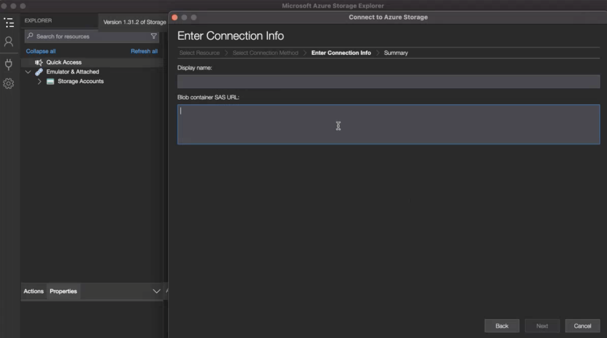
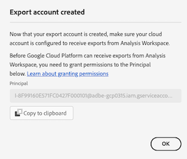
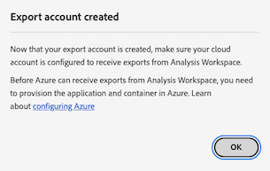
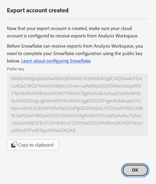

# Configuración de cuentas de exportación en la nube

{{release-limited-testing}}

Antes de poder exportar informes de Customer Journey Analytics a un destino de nube, tal como se describe en [Exportar informes de Customer Journey Analytics a la nube](/help/analysis-workspace/export/export-cloud.md), debe añadir y configurar el destino al que desea enviar los datos.

Este proceso consiste en agregar y configurar la cuenta (como Amazon S3, Google Cloud Platform, etc.) tal como se describe en este artículo y, a continuación, agregar y configurar la ubicación dentro de esa cuenta (como una carpeta dentro de la cuenta) tal como se describe en [Configuración de ubicaciones de exportación de nube](/help/components/exports/cloud-export-locations.md).

Para obtener información sobre cómo administrar cuentas existentes, como ver, editar y eliminar cuentas, consulte [Administrar ubicaciones y cuentas de exportación en la nube](/help/components/exports/manage-export-locations.md).

## Empiece a crear una cuenta de exportación de nube

1. En Customer Journey Analytics, seleccione [!UICONTROL **Componentes**] > [!UICONTROL **Exportaciones**].
1. En el [!UICONTROL Exportaciones] , seleccione la [!UICONTROL **Cuentas de ubicación**] pestaña.
1. Seleccionar [!UICONTROL **Añadir cuenta**].

   

   Se muestra el cuadro de diálogo Agregar cuenta.

1. En el [!UICONTROL **Nombre de cuenta de ubicación**] , especifique un nombre para la cuenta de ubicación. Este nombre aparece al crear una ubicación.

1. En el [!UICONTROL **Descripción de cuenta de ubicación**] , proporcione una breve descripción de la cuenta para ayudar a diferenciarla de otras cuentas del mismo tipo de cuenta.

1. En el [!UICONTROL **Tipo de cuenta**] , seleccione el tipo de cuenta de nube a la que está exportando. Los tipos de cuenta disponibles son Amazon S3 Role ARN, Google Cloud Platform, Azure SAS, Azure RBAC, Snowflake y AEP Data Landing Zone.

1. Continúe con la sección siguiente que corresponde a la [!UICONTROL **Tipo de cuenta**] ha seleccionado.

   * [Zona de aterrizaje de datos de AEP](#adobe-experience-platform)

   * [Amazon S3 Role ARN](#amazon-s3-role-arn)

   * [Google Cloud Platform](#google-cloud-platform)

   * [Azure SAS](#azure-sas)

   * [Azure RBAC](#azure-rbac)

   * [Snowflake](#snowflake)

### Zona de aterrizaje de datos de AEP

>[!IMPORTANT]
>
>Al exportar informes de Customer Journey Analytics a la zona de aterrizaje de datos de Adobe Experience Platform, asegúrese de descargar los datos en un plazo de 7 días y, a continuación, elimínelos de la zona de aterrizaje de datos de AEP. Después de 7 días, los datos se eliminan automáticamente de la zona de aterrizaje de datos de AEP.

1. [Empiece a crear una cuenta de exportación de nube](#begin-creating-a-cloud-export-account), tal como se ha descrito anteriormente.

1. Seleccione [!UICONTROL **Guardar**].

   El [!UICONTROL **Cuenta de exportación creada**] se muestra.

   

1. Copie el contenido del [!UICONTROL **URI de SAS**] al portapapeles. Utilizará este URI de SAS para acceder a los datos exportados desde Analysis Workspace desde la zona de aterrizaje de datos de AEP.

   Si este campo está vacío, se le debe otorgar permiso para acceder a Adobe Experience Platform.

1. En Adobe Experience Platform, configure el contenedor de zona de aterrizaje de datos para que utilice el URI de SAS que ha copiado.

   >[!NOTE]
   >
   >Dado que la cuenta de la zona de aterrizaje de datos de AEP se basa en Azure, la forma más sencilla de acceder a los informes que exporta a la zona de aterrizaje de datos de AEP es mediante el Explorador de almacenamiento de Azure. Los siguientes pasos utilizan este método.

   1. Si aún no lo ha hecho, descargue el [Explorador de almacenamiento de Microsoft Azure](https://azure.microsoft.com/en-us/products/storage/storage-explorer/).

   1. En la documentación de Adobe Experience Platform, siga los pasos descritos en [Conecte el contenedor de la zona de aterrizaje de datos al Explorador de almacenamiento de Azure](https://experienceleague.adobe.com/docs/experience-platform/destinations/catalog/cloud-storage/data-landing-zone.html?lang=en#connect-your-data-landing-zone-container-to-azure-storage-explorer).

      Puede omitir las tareas descritas en las secciones [Recuperación de las credenciales de la zona de aterrizaje de datos](https://experienceleague.adobe.com/docs/experience-platform/destinations/catalog/cloud-storage/data-landing-zone.html?lang=en#retrieve-dlz-credentials) y [Actualizar credenciales de zona de aterrizaje de datos](https://experienceleague.adobe.com/docs/experience-platform/destinations/catalog/cloud-storage/data-landing-zone.html?lang=en#update-dlz-credentials), porque el URI que ha copiado contiene estas credenciales.

   1. Al seguir la documentación de Adobe Experience Platform y llegar a la [!UICONTROL **URL SAS del contenedor de blob**] , pegue el URI SAS que copió en el paso 3.

      >[!NOTE]
      >
      >Debe realizar esta acción cada 7 días, ya que el URI de SAS caduca 7 días después de crearse. Puede crear un script para automatizar este proceso.


      

   1. Seleccionar [!UICONTROL **Siguiente**] > [!UICONTROL **Connect**].

1. En Customer Journey Analytics, en la variable [!UICONTROL **Cuenta de exportación creada**] diálogo, seleccione [!UICONTROL **OK**].

   

1. Continuar con [Configuración de ubicaciones de exportación de nube](/help/components/exports/cloud-export-locations.md).

### Amazon S3 Role ARN

1. [Empiece a crear una cuenta de exportación de nube](#begin-creating-a-cloud-export-account), tal como se ha descrito anteriormente.

1. En el [!UICONTROL **Propiedades de cuenta**] de la sección [!UICONTROL **Añadir cuenta**] , especifique la siguiente información:

   | Campo | Función |
   |---------|----------|
   | [!UICONTROL **ARN de función**] | Debe proporcionar un ARN de la función (nombre de recurso de Amazon) que el Adobe pueda utilizar para obtener acceso a la cuenta de Amazon S3. Para ello, se crea una directiva de permisos de IAM para la cuenta de origen, se adjunta la directiva a un usuario y, a continuación, se crea un rol para la cuenta de destino. Para obtener información específica, consulte [esta documentación de AWS](https://aws.amazon.com/premiumsupport/knowledge-center/cross-account-access-iam/). |

   {style="table-layout:auto"}

1. Seleccione [!UICONTROL **Guardar**].

   El [!UICONTROL **Cuenta de exportación creada**] se muestra.

   

1. Copie el contenido del [!UICONTROL **ARN del usuario**] al portapapeles. El ARN del usuario (nombre del recurso de Amazon) lo proporciona Adobe. Debe adjuntar este usuario a la directiva que creó en el ARN de la función de Amazon S3.

1. Seleccionar [!UICONTROL **OK**].

1. Continuar con [Configuración de ubicaciones de exportación de nube](/help/components/exports/cloud-export-locations.md).

### Google Cloud Platform

1. [Empiece a crear una cuenta de exportación de nube](#begin-creating-a-cloud-export-account), tal como se ha descrito anteriormente.

1. En el [!UICONTROL **Propiedades de cuenta**] de la sección [!UICONTROL **Añadir cuenta**] , especifique la siguiente información:

   | Campo | Función |
   |---------|----------|
   | [!UICONTROL **ID del proyecto**] | El ID del proyecto de Google Cloud que copió de su cuenta de Google Cloud. Consulte la [Documentación de Google Cloud sobre la obtención de un ID de proyecto](https://cloud.google.com/resource-manager/docs/creating-managing-projects#identifying_projects). |

   {style="table-layout:auto"}

1. Seleccione [!UICONTROL **Guardar**].

   El [!UICONTROL **Cuenta de exportación creada**] se muestra.

   

1. Copie el contenido del [!UICONTROL **Principal**] en el portapapeles y, a continuación, asegúrese de conceder permiso al principal para cargar archivos en este bloque en Google Cloud Platform. <!-- add link to Google Cloud docs on how to do this -->

1. Seleccionar [!UICONTROL **OK**].

1. Continuar con [Configuración de ubicaciones de exportación de nube](/help/components/exports/cloud-export-locations.md).

### Azure SAS

1. [Empiece a crear una cuenta de exportación de nube](#begin-creating-a-cloud-export-account), tal como se ha descrito anteriormente.

1. En el [!UICONTROL **Propiedades de cuenta**] de la sección [!UICONTROL **Añadir cuenta**] , especifique la siguiente información:

   | Campo | Función |
   |---------|----------|
   | [!UICONTROL **ID de la aplicación**] | Copie este ID de la aplicación de Azure que ha creado. En Microsoft Azure, esta información se encuentra en **Información general** dentro de la aplicación. Para obtener más información, consulte la [Documentación de Microsoft Azure sobre cómo registrar una aplicación con Microsoft identity platform](https://learn.microsoft.com/en-us/azure/active-directory/develop/quickstart-register-app). |
   | [!UICONTROL **ID de inquilino**] | Copie este ID de la aplicación de Azure que ha creado. En Microsoft Azure, esta información se encuentra en **Información general** dentro de la aplicación. Para obtener más información, consulte la [Documentación de Microsoft Azure sobre cómo registrar una aplicación con Microsoft identity platform](https://learn.microsoft.com/en-us/azure/active-directory/develop/quickstart-register-app). |
   | [!UICONTROL **URI de almacén de claves**] | <p>Ruta al token SAS en Azure Key Vault.  Para configurar Azure SAS, debe almacenar un token SAS como secreto mediante Azure Key Vault. Para obtener más información, consulte [Documentación de Microsoft Azure sobre cómo establecer y recuperar un secreto de Azure Key Vault](https://learn.microsoft.com/en-us/azure/key-vault/secrets/quick-create-portal?source=recommendations).</p><p>Una vez creado el URI del almacén de claves, agregue una directiva de acceso en el almacén de claves para conceder permiso a la aplicación de Azure que ha creado. Para obtener más información, consulte [Documentación de Microsoft Azure sobre cómo asignar una directiva de acceso de Key Vault](https://learn.microsoft.com/en-us/azure/key-vault/general/assign-access-policy?tabs=azure-portal).</p> |
   | [!UICONTROL **Nombre secreto del almacén de claves**] | El nombre secreto que creó al agregar el secreto a Azure Key Vault. En Microsoft Azure, esta información se encuentra en Key Vault que ha creado, en **Key Vault** páginas de configuración. Para obtener más información, consulte [Documentación de Microsoft Azure sobre cómo establecer y recuperar un secreto de Azure Key Vault](https://learn.microsoft.com/en-us/azure/key-vault/secrets/quick-create-portal?source=recommendations). |
   | [!UICONTROL **Secreto de cuenta de ubicación**] <!-- nothing for us to have them do on the second screen. Just need to permission the container if they haven't --> | Copie el secreto de la aplicación de Azure que ha creado. En Microsoft Azure, esta información se encuentra en **Certificados y secretos** dentro de la aplicación. Para obtener más información, consulte la [Documentación de Microsoft Azure sobre cómo registrar una aplicación con Microsoft identity platform](https://learn.microsoft.com/en-us/azure/active-directory/develop/quickstart-register-app). <!-- need to grant permission to the bucket. Jun will send info on where that is documented) --> |

   {style="table-layout:auto"}

1. Seleccione [!UICONTROL **Guardar**].

   El [!UICONTROL **Cuenta de exportación creada**] se muestra.

   

1. Si aún no lo ha hecho, asegúrese de conceder permisos al bloque en Azure SAS. <!-- add link to Google Cloud docs on how to do this -->

1. Seleccionar [!UICONTROL **OK**].

1. Continuar con [Configuración de ubicaciones de exportación de nube](/help/components/exports/cloud-export-locations.md).

### Azure RBAC

1. [Empiece a crear una cuenta de exportación de nube](#begin-creating-a-cloud-export-account), tal como se ha descrito anteriormente.

1. En el [!UICONTROL **Propiedades de cuenta**] de la sección [!UICONTROL **Añadir cuenta**] , especifique la siguiente información:

   | Campo | Función |
   |---------|----------|
   | [!UICONTROL **ID de la aplicación**] | Copie este ID de la aplicación de Azure que ha creado. En Microsoft Azure, esta información se encuentra en **Información general** dentro de la aplicación. Para obtener más información, consulte la [Documentación de Microsoft Azure sobre cómo registrar una aplicación con Microsoft identity platform](https://learn.microsoft.com/en-us/azure/active-directory/develop/quickstart-register-app). |
   | [!UICONTROL **ID de inquilino**] | Copie este ID de la aplicación de Azure que ha creado. En Microsoft Azure, esta información se encuentra en **Información general** dentro de la aplicación. Para obtener más información, consulte la [Documentación de Microsoft Azure sobre cómo registrar una aplicación con Microsoft identity platform](https://learn.microsoft.com/en-us/azure/active-directory/develop/quickstart-register-app). |
   | [!UICONTROL **Secreto de cuenta de ubicación**] | Copie el secreto de la aplicación de Azure que ha creado. En Microsoft Azure, esta información se encuentra en **Certificados y secretos** dentro de la aplicación. Para obtener más información, consulte la [Documentación de Microsoft Azure sobre cómo registrar una aplicación con Microsoft identity platform](https://learn.microsoft.com/en-us/azure/active-directory/develop/quickstart-register-app). |

   {style="table-layout:auto"}

1. Seleccione [!UICONTROL **Guardar**].

   El [!UICONTROL **Cuenta de exportación creada**] se muestra.

   

1. Si aún no lo ha hecho, asegúrese de conceder permisos al bloque en Azure RBAC. <!-- add link to Google Cloud docs on how to do this -->

1. Seleccionar [!UICONTROL **OK**].

1. Continuar con [Configuración de ubicaciones de exportación de nube](/help/components/exports/cloud-export-locations.md).

### Snowflake

1. [Empiece a crear una cuenta de exportación de nube](#begin-creating-a-cloud-export-account), tal como se ha descrito anteriormente.

1. En el [!UICONTROL **Propiedades de cuenta**] de la sección [!UICONTROL **Añadir cuenta**] , especifique la siguiente información:

   | Campo | Función |
   |---------|----------|
   | [!UICONTROL **Identificador de cuenta**] | Identifica de forma exclusiva una cuenta de Snowflake dentro de su organización, así como en toda la red global de plataformas en la nube y regiones de la nube compatibles con Snowflake. <p>Debe obtener el identificador de la cuenta de Snowflake y, a continuación, pegar la información aquí.</p><p>Para saber de dónde obtener esta información, consulte la [Página Identificadores de Cuenta en la documentación del Snowflake](https://docs.snowflake.com/en/user-guide/admin-account-identifier).</p> |
   | [!UICONTROL **Usuario**] | El nombre de inicio de sesión del usuario que se utilizará para la conexión. Se recomienda crear un nuevo usuario que se utilice específicamente para el Adobe. Especifique el nombre aquí y, a continuación, cree un usuario en el Snowflake con el mismo nombre. Puede crear un usuario en Snowflake utilizando el `CREATE USER` comando.  <p>Para obtener más información, consulte la [Comandos de usuario, rol y privilegio](https://docs.snowflake.com/en/sql-reference/commands-user-role).</p> |
   | [!UICONTROL **Función**] | La función que se asignará al usuario. Se recomienda crear una función nueva que se utilice específicamente para el Adobe. Especifique la función aquí y, a continuación, cree una función en el Snowflake con el mismo nombre y otorgue la función al usuario. Puede crear una función en Snowflake utilizando el `CREATE ROLE` comando. <p>Para obtener más información, consulte la [Comandos de usuario, rol y privilegio](https://docs.snowflake.com/en/sql-reference/commands-user-role).</p> |

   {style="table-layout:auto"}

1. Seleccione [!UICONTROL **Guardar**].

   El [!UICONTROL **Cuenta de exportación creada**] se muestra.

   

1. Copie el contenido del [!UICONTROL **Clave pública**] al portapapeles. La clave pública la proporciona el Adobe.

   Utilice la clave pública en Snowflake para conectarse a su cuenta de Snowflake. Debe asociar el usuario que ha creado con esta clave pública.

   Por ejemplo, en Snowflake, especifique el siguiente comando:

   ```
   CREATE USER <your_adobe_user> RSA_PUBLIC_KEY = '<your_public_key>';
   ```

   Para obtener más información, consulte la [Página Autenticación de Par de Claves y Rotación de Par de Claves en la documentación del Snowflake](https://docs.snowflake.com/en/user-guide/key-pair-auth).

1. Seleccionar [!UICONTROL **OK**].

1. Continuar con [Configuración de ubicaciones de exportación de nube](/help/components/exports/cloud-export-locations.md).
