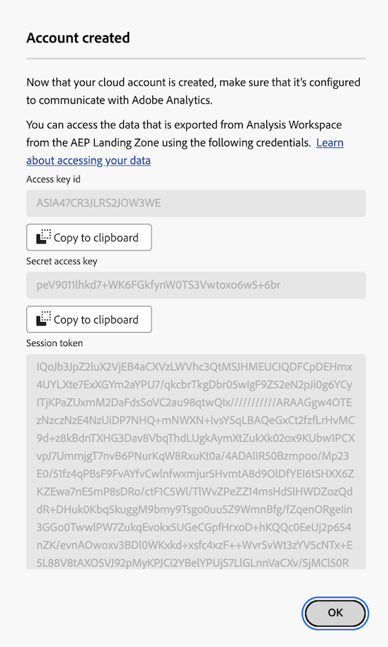

# Configuración de cuentas de exportación en la nube

Para poder exportar informes de Customer Journey Analytics a un destino de nube (desde Analysis Workspace, como se describe en [Exportar informes de Customer Journey Analytics a la nube](/help/analysis-workspace/export/export-cloud.md) o desde Report Builder, como se describe en [Exportar informes desde Report Builder](/help/report-builder/report-builder-export.md)), debe agregar y configurar el destino al que desea enviar los datos.

Este proceso consiste en agregar y configurar la cuenta (como Amazon S3, Google Cloud Platform, etc.) tal como se describe en este artículo y, a continuación, agregar y configurar la ubicación dentro de esa cuenta (como una carpeta dentro de la cuenta) tal como se describe en [Configuración de ubicaciones de exportación en la nube](/help/components/exports/cloud-export-locations.md).

Para obtener información sobre cómo administrar cuentas existentes, como ver, editar y eliminar cuentas, consulte [Administrar ubicaciones y cuentas de exportación en la nube](/help/components/exports/manage-export-locations.md).

## Empiece a crear una cuenta de exportación de nube

1. Asegúrese de cumplir con los [requisitos mínimos](/help/analysis-workspace/export/export-cloud.md#minimum-requirements) para exportar informes a la nube.
1. En Customer Journey Analytics, seleccione [!UICONTROL **Componentes**] > [!UICONTROL **Exportaciones**].
1. En la página [!UICONTROL Exportaciones], seleccione la pestaña [!UICONTROL **Cuentas de ubicación**].

   

1. Seleccione [!UICONTROL **Agregar cuenta**].

   Se muestra el cuadro de diálogo Agregar cuenta.

1. En el campo [!UICONTROL **Nombre de cuenta de ubicación**], especifique un nombre para la cuenta de ubicación. Este nombre aparece al crear una ubicación.

1. En el campo [!UICONTROL **Descripción de la cuenta de ubicación**], proporcione una breve descripción de la cuenta para ayudar a diferenciarla de otras cuentas del mismo tipo de cuenta.

1. Habilite la opción para [!UICONTROL **Hacer que la cuenta esté disponible para todos los usuarios de su organización**] si desea permitir que otros usuarios de su organización la usen.

   Tenga en cuenta lo siguiente al compartir cuentas:

   * Las cuentas que comparta no se pueden dejar de compartir.

   * Solo el propietario de la cuenta puede editar las cuentas compartidas.

   * Cualquiera puede crear una ubicación para la cuenta compartida.

1. En el campo [!UICONTROL **Tipo de cuenta**], seleccione el tipo de cuenta de nube a la que está exportando. Los tipos de cuenta disponibles son ARN de la función Amazon S3, Google Cloud Platform, Azure SAS, Azure RBAC, Snowflake y Zona de aterrizaje de datos de AEP.

1. Continúe con la sección siguiente que corresponde al [!UICONTROL **tipo de cuenta**] que seleccionó.

   * [Zona de aterrizaje de datos de AEP](#aep-data-landing-zone)

   * [Amazon S3 Role ARN](#amazon-s3-role-arn)

   * [Google Cloud Platform](#google-cloud-platform)

   * [Azure SAS](#azure-sas)

   * [Azure RBAC](#azure-rbac)

   * [Snowflake](#snowflake)

### Zona de aterrizaje de datos de AEP

>[!IMPORTANT]
>
>Tenga en cuenta lo siguiente al utilizar la zona de aterrizaje de datos de AEP para su cuenta de exportación:
>
> * Al exportar informes de Customer Journey Analytics a la zona de aterrizaje de datos de Adobe Experience Platform, asegúrese de descargar los datos en un plazo de 7 días y, a continuación, elimínelos de la zona de aterrizaje de datos de AEP. Después de 7 días, los datos se eliminan automáticamente de la zona de aterrizaje de datos de AEP.
> * La zona de aterrizaje de datos de AEP utiliza el almacenamiento de Azure o AWS. Si su organización utiliza una empresa de inicio de sesión configurada para utilizar Azure, la zona de aterrizaje de datos de AEP utilizará Azure. Si la empresa de inicio de sesión está configurada para utilizar AWS, la zona de aterrizaje de datos de AEP utiliza AWS.
>

1. Comience a crear una cuenta de exportación en la nube de cualquiera de las siguientes maneras:

   * Desde la página Exportaciones como se describió anteriormente, en [Empiece a crear una cuenta de exportación en la nube](#begin-creating-a-cloud-export-account)

   * Al [exportar tablas completas desde Analysis Workspace](/help/analysis-workspace/export/export-cloud.md#export-full-tables-from-analysis-workspace)

1. Después de seleccionar **[!UICONTROL AEP Data Landing Zone]** en el campo **[!UICONTROL Tipo de cuenta]**, seleccione [!UICONTROL **Guardar**].

   Se muestra cualquiera de los siguientes cuadros de diálogo, en función de si la zona de aterrizaje de datos de AEP está configurada para utilizar Azure o AWS Storage:

   * **Almacenamiento de Azure:**

     Se muestra el cuadro de diálogo [!UICONTROL **Exportar cuenta creada**].

     

   * **Almacenamiento de AWS:**

     >[!AVAILABILITY]
     >
     >Esta sección corresponde a las implementaciones de Experience Platform que se ejecutan en Amazon Web Service (AWS). Experience Platform que se ejecuta en AWS está disponible actualmente para un número limitado de clientes. Para obtener más información sobre la infraestructura de Experience Platform compatible, consulte [Información general sobre la nube múltiple de Experience Platform](https://experienceleague.adobe.com/es/docs/experience-platform/landing/multi-cloud).

     Se muestra el cuadro de diálogo [!UICONTROL **Cuenta creada**].

     

1. (Condicional) Si utiliza el almacenamiento de Azure:

   1. Copie el contenido del campo [!UICONTROL **URI de SAS**] en el portapapeles. Utilizará este URI de SAS para acceder a los datos exportados desde Analysis Workspace desde la zona de aterrizaje de datos de AEP.

      Si este campo está vacío, se le debe otorgar permiso para acceder a Adobe Experience Platform.

   1. En Adobe Experience Platform, configure el contenedor de zona de aterrizaje de datos para que utilice el URI de SAS que ha copiado.

      >[!NOTE]
      >
      >Al usar una cuenta de la zona de aterrizaje de datos de AEP basada en Azure, la forma más sencilla de acceder a los informes que exporta a la zona de aterrizaje de datos de AEP es mediante el Explorador de almacenamiento de Azure. Los siguientes pasos utilizan este método.

      1. Si aún no lo ha hecho, descargue [Microsoft Azure Storage Explorer](https://azure.microsoft.com/en-us/products/storage/storage-explorer/).

      1. En la documentación de Adobe Experience Platform, siga los pasos descritos en [Conecte su contenedor de zona de aterrizaje de datos al Explorador de almacenamiento de Azure](https://experienceleague.adobe.com/docs/experience-platform/destinations/catalog/cloud-storage/data-landing-zone.html?lang=es#connect-your-data-landing-zone-container-to-azure-storage-explorer).

         Puede omitir las tareas descritas en las secciones [Recuperar las credenciales de la zona de aterrizaje de datos](https://experienceleague.adobe.com/docs/experience-platform/destinations/catalog/cloud-storage/data-landing-zone.html?lang=es#retrieve-dlz-credentials) y [Actualizar las credenciales de la zona de aterrizaje de datos](https://experienceleague.adobe.com/docs/experience-platform/destinations/catalog/cloud-storage/data-landing-zone.html?lang=es#update-dlz-credentials), ya que el URI que copió contiene estas credenciales.

      1. Cuando siga la documentación de Adobe Experience Platform y llegue al campo [!UICONTROL **URL SAS del contenedor de blobs**], pegue el URI SAS que copió en el paso 3.

         >[!NOTE]
         >
         >Debe realizar esta acción cada 7 días, ya que el URI de SAS caduca 7 días después de crearse. Puede crear un script para automatizar este proceso.

         

   1. Seleccione [!UICONTROL **Siguiente**] > [!UICONTROL **Conectar**].

   1. En Customer Journey Analytics, en el cuadro de diálogo [!UICONTROL **Exportar cuenta creada**], seleccione [!UICONTROL **Aceptar**].

      

1. (Condicional) Si utiliza el almacenamiento de AWS:

   1. Copie el contenido de los campos siguientes en el portapapeles (utilizará esta información para acceder a los datos exportados desde Analysis Workspace desde la zona de aterrizaje de datos de AEP):

      * [!UICONTROL **Id. de clave de acceso**]

      * **[!UICONTROL Clave de acceso secreta]**

      * **[!UICONTROL Token de sesión]**

      * **[!UICONTROL Nombre del bloque]**

      * **[!UICONTROL Carpeta DLZ]**

      

   1. Seleccione [!UICONTROL **Aceptar**].

1. Continúe con [Configurar ubicaciones de exportación en la nube](/help/components/exports/cloud-export-locations.md).

### Amazon S3 Role ARN

1. Comience a crear una cuenta de exportación en la nube de cualquiera de las siguientes maneras:

   * Desde la página Exportaciones como se describió anteriormente, en [Empiece a crear una cuenta de exportación en la nube](#begin-creating-a-cloud-export-account)

   * Al [exportar tablas completas desde Analysis Workspace](/help/analysis-workspace/export/export-cloud.md#export-full-tables-from-analysis-workspace)

1. En la sección [!UICONTROL **Propiedades de la cuenta**] del cuadro de diálogo [!UICONTROL **Agregar cuenta**], especifique la siguiente información:

   | Campo | Función |
   |---------|----------|
   | [!UICONTROL **ARN de función**] | Debe proporcionar un ARN de función (nombre de recurso de Amazon) que Adobe pueda utilizar para obtener acceso a la cuenta de Amazon S3. Para ello, se crea una directiva de permisos de IAM para la cuenta de origen, se adjunta la directiva a un usuario y, a continuación, se crea una función para la cuenta de destino. Para obtener información específica, consulte [esta documentación de AWS](https://aws.amazon.com/premiumsupport/knowledge-center/cross-account-access-iam/). |

   {style="table-layout:auto"}

1. Seleccione [!UICONTROL **Guardar**].

   Se muestra el cuadro de diálogo [!UICONTROL **Exportar cuenta creada**].

   

1. Copie el contenido del campo [!UICONTROL **ARN del usuario**] en el portapapeles. El ARN (nombre del recurso de Amazon) del usuario lo proporciona Adobe. Debe adjuntar este usuario a la directiva que creó en el ARN de la función de Amazon S3.

1. Seleccione [!UICONTROL **Aceptar**].

1. Continúe con [Configurar ubicaciones de exportación en la nube](/help/components/exports/cloud-export-locations.md).

### Google Cloud Platform

1. Comience a crear una cuenta de exportación en la nube de cualquiera de las siguientes maneras:

   * Desde la página Exportaciones como se describió anteriormente, en [Empiece a crear una cuenta de exportación en la nube](#begin-creating-a-cloud-export-account)

   * Al [exportar tablas completas desde Analysis Workspace](/help/analysis-workspace/export/export-cloud.md#export-full-tables-from-analysis-workspace)

1. En la sección [!UICONTROL **Propiedades de la cuenta**] del cuadro de diálogo [!UICONTROL **Agregar cuenta**], especifique la siguiente información:

   | Campo | Función |
   |---------|----------|
   | [!UICONTROL **ID del proyecto**] | El ID del proyecto de Google Cloud que copió de su cuenta de Google Cloud. Consulte la [documentación de Google Cloud sobre cómo obtener un ID de proyecto](https://cloud.google.com/resource-manager/docs/creating-managing-projects#identifying_projects). |

   {style="table-layout:auto"}

1. Seleccione [!UICONTROL **Guardar**].

   Se muestra el cuadro de diálogo [!UICONTROL **Exportar cuenta creada**].

   

1. Copie el contenido del campo [!UICONTROL **Principal**] en el portapapeles y, a continuación, asegúrese de conceder permiso al principal para cargar archivos en este bloque en Google Cloud Platform. <!-- add link to Google Cloud docs on how to do this -->

1. Seleccione [!UICONTROL **Aceptar**].

1. Continúe con [Configurar ubicaciones de exportación en la nube](/help/components/exports/cloud-export-locations.md).

### Azure SAS

1. Comience a crear una cuenta de exportación en la nube de cualquiera de las siguientes maneras:

   * Desde la página Exportaciones como se describió anteriormente, en [Empiece a crear una cuenta de exportación en la nube](#begin-creating-a-cloud-export-account)

   * Al [exportar tablas completas desde Analysis Workspace](/help/analysis-workspace/export/export-cloud.md#export-full-tables-from-analysis-workspace)

1. En la sección [!UICONTROL **Propiedades de la cuenta**] del cuadro de diálogo [!UICONTROL **Agregar cuenta**], especifique la siguiente información:

   | Campo | Función |
   |---------|----------|
   | [!UICONTROL **ID de aplicación**] | Copie este ID de la aplicación de Azure que ha creado. En Microsoft Azure, esta información se encuentra en la pestaña **Información general** dentro de la aplicación. Para obtener más información, consulte la [documentación de Microsoft Azure sobre cómo registrar una aplicación con la plataforma de identidad de Microsoft](https://learn.microsoft.com/en-us/azure/active-directory/develop/quickstart-register-app). |
   | [!UICONTROL **ID de inquilino**] | Copie este ID de la aplicación de Azure que ha creado. En Microsoft Azure, esta información se encuentra en la pestaña **Información general** dentro de la aplicación. Para obtener más información, consulte la [documentación de Microsoft Azure sobre cómo registrar una aplicación con la plataforma de identidad de Microsoft](https://learn.microsoft.com/en-us/azure/active-directory/develop/quickstart-register-app). |
   | [!UICONTROL **URI de almacén de claves**] | <p>La ruta al URI de SAS en Azure Key Vault.  Para configurar Azure SAS, debe almacenar un URI de SAS como un secreto mediante Azure Key Vault. Para obtener más información, consulte la [documentación de Microsoft Azure sobre cómo establecer y recuperar un secreto de Azure Key Vault](https://learn.microsoft.com/en-us/azure/key-vault/secrets/quick-create-portal?source=recommendations).</p><p>Una vez creado el URI del almacén de claves:<ul><li>Añada una directiva de acceso en el almacén de claves para poder conceder permiso a la aplicación de Azure que ha creado.<p><p>Para obtener más información, consulte [Documentación de Microsoft Azure sobre cómo asignar una directiva de acceso de almacén de claves](https://learn.microsoft.com/en-us/azure/key-vault/general/assign-access-policy?tabs=azure-portal).</p>O bien</p><p>Si desea conceder un rol de acceso directamente sin crear una directiva de acceso, consulte la [documentación de Microsoft Azure sobre cómo asignar roles de Azure mediante Azure Portal](https://learn.microsoft.com/en-us/azure/role-based-access-control/role-assignments-portal). Esto agrega la asignación de funciones para que el ID de aplicación acceda al URI del almacén de claves. </p></li><li>Asegúrese de que al ID de aplicación se le haya concedido la `Key Vault Certificate User` función integrada para acceder al URI de almacén de claves.</br><p>Para obtener más información, consulte [Funciones integradas de Azure](https://learn.microsoft.com/en-us/azure/role-based-access-control/built-in-roles).</p></li></ul> |
   | [!UICONTROL **Nombre secreto del almacén de claves**] | El nombre secreto que creó al añadir el secreto a Azure Key Vault. En Microsoft Azure, esta información se encuentra en el almacén de claves que ha creado, en las páginas de configuración del **Almacén de claves**. Para obtener más información, consulte [Documentación de Microsoft Azure sobre cómo establecer y recuperar un secreto de Azure Key Vault](https://learn.microsoft.com/en-us/azure/key-vault/secrets/quick-create-portal?source=recommendations). |
   | [!UICONTROL **Secreto de cuenta de ubicación**] | Copie el secreto de la aplicación de Azure que ha creado. En Microsoft Azure, esta información se encuentra en la pestaña **Certificados y secretos** dentro de la aplicación. Para obtener más información, consulte la [documentación de Microsoft Azure sobre cómo registrar una aplicación con Microsoft Identity Platform](https://learn.microsoft.com/en-us/azure/active-directory/develop/quickstart-register-app). <!-- need to grant permission to the bucket. Jun will send info on where that is documented) --> |

   {style="table-layout:auto"}

1. Seleccione [!UICONTROL **Guardar**].

   Se muestra el cuadro de diálogo [!UICONTROL **Exportar cuenta creada**].

   

1. Si aún no lo ha hecho, asegúrese de conceder permisos al bloque en Azure SAS. <!-- add link to Google Cloud docs on how to do this -->

1. Seleccione [!UICONTROL **Aceptar**].

1. Continúe con [Configurar ubicaciones de exportación en la nube](/help/components/exports/cloud-export-locations.md).

### Azure RBAC

1. Comience a crear una cuenta de exportación en la nube de cualquiera de las siguientes maneras:

   * Desde la página Exportaciones como se describió anteriormente, en [Empiece a crear una cuenta de exportación en la nube](#begin-creating-a-cloud-export-account)

   * Al [exportar tablas completas desde Analysis Workspace](/help/analysis-workspace/export/export-cloud.md#export-full-tables-from-analysis-workspace)

1. En la sección [!UICONTROL **Propiedades de la cuenta**] del cuadro de diálogo [!UICONTROL **Agregar cuenta**], especifique la siguiente información:

   | Campo | Función |
   |---------|----------|
   | [!UICONTROL **ID de aplicación**] | Copie este ID de la aplicación de Azure que ha creado. En Microsoft Azure, esta información se encuentra en la pestaña **Información general** dentro de la aplicación. Para obtener más información, consulte la [documentación de Microsoft Azure sobre cómo registrar una aplicación con la plataforma de identidad de Microsoft](https://learn.microsoft.com/en-us/azure/active-directory/develop/quickstart-register-app). |
   | [!UICONTROL **ID de inquilino**] | Copie este ID de la aplicación de Azure que ha creado. En Microsoft Azure, esta información se encuentra en la pestaña **Información general** dentro de la aplicación. Para obtener más información, consulte la [documentación de Microsoft Azure sobre cómo registrar una aplicación con la plataforma de identidad de Microsoft](https://learn.microsoft.com/en-us/azure/active-directory/develop/quickstart-register-app). |
   | [!UICONTROL **Secreto de cuenta de ubicación**] | Copie el secreto de la aplicación de Azure que ha creado. En Microsoft Azure, esta información se encuentra en la pestaña **Certificados y secretos** dentro de la aplicación. Para obtener más información, consulte la [Documentación de Microsoft Azure sobre cómo registrar una aplicación con la plataforma de identidad de Microsoft](https://learn.microsoft.com/en-us/azure/active-directory/develop/quickstart-register-app). |

   {style="table-layout:auto"}

1. Seleccione [!UICONTROL **Guardar**].

   Se muestra el cuadro de diálogo [!UICONTROL **Exportar cuenta creada**].

   

1. Si aún no lo ha hecho, asegúrese de conceder permisos al bloque en Azure RBAC. <!-- add link to Google Cloud docs on how to do this -->

1. Seleccione [!UICONTROL **Aceptar**].

1. Continúe con [Configurar ubicaciones de exportación en la nube](/help/components/exports/cloud-export-locations.md).

### Snowflake

1. Comience a crear una cuenta de exportación en la nube de cualquiera de las siguientes maneras:

   * Desde la página Exportaciones como se describió anteriormente, en [Empiece a crear una cuenta de exportación en la nube](#begin-creating-a-cloud-export-account)

   * Al [exportar tablas completas desde Analysis Workspace](/help/analysis-workspace/export/export-cloud.md#export-full-tables-from-analysis-workspace)

1. En la sección [!UICONTROL **Propiedades de la cuenta**] del cuadro de diálogo [!UICONTROL **Agregar cuenta**], especifique la siguiente información:

   | Campo | Función |
   |---------|----------|
   | [!UICONTROL **Identificador de cuenta**] | Identifica de forma exclusiva una cuenta de Snowflake dentro de su organización, así como en toda la red global de plataformas en la nube y regiones de la nube compatibles con Snowflake. <p>Debe obtener el identificador de la cuenta de Snowflake y, a continuación, pegar la información aquí.</p><p>Para saber de dónde obtener esta información, consulte la [página Identificadores de cuenta en la documentación de Snowflake](https://docs.snowflake.com/en/user-guide/admin-account-identifier).</p> |
   | [!UICONTROL **Usuario**] | El nombre de inicio de sesión del usuario que se utilizará para la conexión. Se recomienda crear un nuevo usuario que se utilice específicamente para Adobe. Especifique el nombre aquí y, a continuación, cree un usuario en Snowflake con el mismo nombre. Puede crear un usuario en Snowflake mediante el comando `CREATE USER`.  <p>Para obtener más información, consulte [Comandos de usuario, rol y privilegios](https://docs.snowflake.com/en/sql-reference/commands-user-role).</p> |
   | [!UICONTROL **Rol**] | La función que se asignará al usuario. Se recomienda crear una función nueva que se utilice específicamente para Adobe. Especifique la función aquí y, a continuación, cree una función en Snowflake con el mismo nombre y otorgue la función al usuario. Puede crear un rol en Snowflake usando el comando `CREATE ROLE`. <p>Para obtener más información, consulte [Comandos de usuario, rol y privilegios](https://docs.snowflake.com/en/sql-reference/commands-user-role).</p> |

   {style="table-layout:auto"}

1. Seleccione [!UICONTROL **Guardar**].

   Se muestra el cuadro de diálogo [!UICONTROL **Exportar cuenta creada**].

   

1. Copie el contenido del campo [!UICONTROL **Clave pública**] en el portapapeles. Adobe proporciona la clave pública.

   Utilice la clave pública en Snowflake para conectarse a su cuenta de Snowflake. Debe asociar el usuario que ha creado con esta clave pública.

   Por ejemplo, en Snowflake, especifique el siguiente comando:

   ```
   CREATE USER <your_adobe_user> RSA_PUBLIC_KEY = '<your_public_key>';
   ```

   Para obtener más información, consulte la página [Autenticación de par de claves y rotación de pares de claves en la documentación de Snowflake](https://docs.snowflake.com/en/user-guide/key-pair-auth).

1. Seleccione [!UICONTROL **Aceptar**].

1. Continúe con [Configurar ubicaciones de exportación en la nube](/help/components/exports/cloud-export-locations.md).
