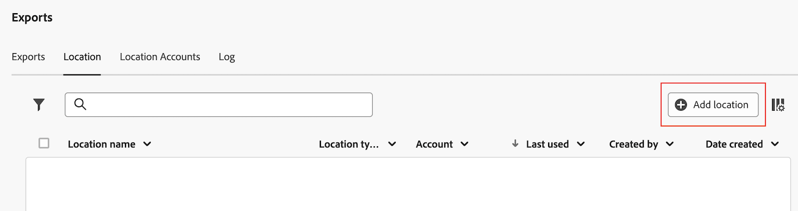
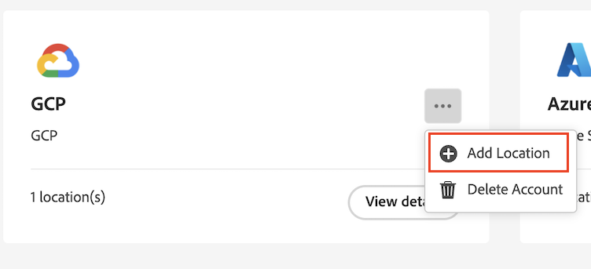
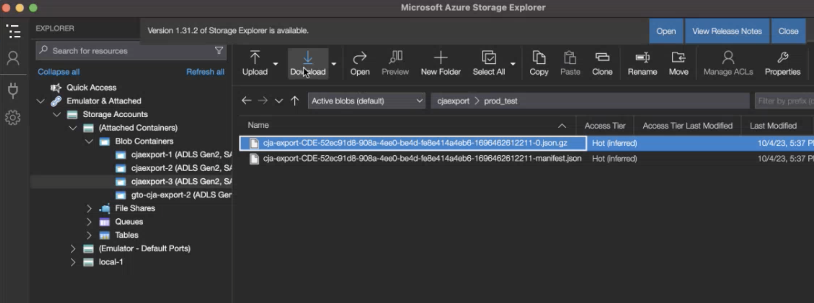

# Configuración de ubicaciones de exportación de nube

Antes de poder exportar informes de Customer Journey Analytics a un destino de nube, tal como se describe en [Exportar informes de Customer Journey Analytics a la nube](/help/analysis-workspace/export/export-cloud.md), debe agregar y configurar la ubicación a la que desea enviar los datos.

Este proceso consiste en añadir y configurar la cuenta (como Amazon S3, Google Cloud Platform, etc.) tal como se describe en [Configuración de cuentas de exportación en la nube](/help/components/exports/cloud-export-accounts.md)y, a continuación, agregue y configure la ubicación dentro de esa cuenta (por ejemplo, una carpeta dentro de la cuenta) tal como se describe en este artículo.

Para obtener información sobre cómo administrar ubicaciones existentes, incluida la visualización, edición y eliminación de ubicaciones, consulte [Administrar ubicaciones y cuentas de exportación en la nube](/help/components/exports/manage-export-locations.md).

## Comience a crear una ubicación de exportación de nube

1. Debe agregar una cuenta antes de agregar una ubicación. Si aún no lo ha hecho, agregue una cuenta como se describe en [Configuración de cuentas de exportación en la nube](/help/components/exports/cloud-export-accounts.md).

1. En Customer Journey Analytics, seleccione [!UICONTROL **Componentes**] > [!UICONTROL **Exportaciones**].

1. Seleccione el [!UICONTROL **Ubicaciones**] pestaña, luego seleccione [!UICONTROL **Añadir ubicación**].

   

   O

   Seleccione el [!UICONTROL **Cuentas de ubicación**] , seleccione el icono de 3 puntos en una cuenta existente donde desee añadir una ubicación y, a continuación, seleccione [!UICONTROL **Añadir ubicación**].

   

   Se muestra el cuadro de diálogo Ubicación.

1. Especifique la siguiente información: |Campo | Función | |---------|----------| | [!UICONTROL **Nombre**] | El nombre de la ubicación.  | | [!UICONTROL **Descripción**] | Proporcione una breve descripción de la ubicación para diferenciarla de otras ubicaciones de la cuenta. | | [!UICONTROL **Cuenta de ubicación**] | Seleccione la cuenta en la que desea crear la ubicación. Para obtener información sobre cómo crear una cuenta, consulte [Configuración de cuentas de exportación en la nube](/help/components/exports/cloud-export-accounts.md). |

1. En la sección [!UICONTROL **Propiedades de ubicación**], especifique información específica para el tipo de cuenta de su cuenta de ubicación.

   Continúe con la sección siguiente que corresponde al tipo de cuenta seleccionado en la [!UICONTROL **Cuenta de ubicación**] field.

   * [Zona de aterrizaje de datos de AEP](#aep-data-landing-zone)
   * [Amazon S3 Role ARN](#amazon-s3-role-arn)
   * [Google Cloud Platform](#google-cloud-platform)
   * [Azure SAS](#azure-sas)
   * [Azure RBAC](#azure-rbac)
   * [Snowflake](#snowflake)

### Zona de aterrizaje de datos de AEP

>[!IMPORTANT]
>
>Al exportar informes de Customer Journey Analytics a la zona de aterrizaje de datos de Adobe Experience Platform, asegúrese de descargar los datos en un plazo de 7 días y, a continuación, elimínelos de la zona de aterrizaje de datos de AEP. Después de 7 días, los datos se eliminan automáticamente de la zona de aterrizaje de datos de AEP.

1. Comience a crear una ubicación de exportación en la nube de cualquiera de las siguientes maneras:

   * En la página Exportaciones como se ha descrito anteriormente, en [Comience a crear una ubicación de exportación de nube](#begin-creating-a-cloud-export-location)

   * Cuándo [exportación de tablas completas desde Analysis Workspace](/help/analysis-workspace/export/export-cloud.md#export-full-tables-from-analysis-workspace)

1. En el [!UICONTROL **Propiedades de ubicación**] de la sección [!UICONTROL **Añadir ubicación**] , especifique la siguiente información para configurar una ubicación de zona de aterrizaje de datos de Adobe Experience Platform:

   <!-- still need to update; can't create AEP account -->

   | Campo | Función |
   |---------|----------|
   | [!UICONTROL **Prefijo**] | La carpeta dentro del contenedor en la que desea colocar los datos. Especifique un nombre de carpeta y, a continuación, añada una barra diagonal después del nombre para crear la carpeta. Por ejemplo, `folder_name/` |

   {style="table-layout:auto"}

1. Seleccione [!UICONTROL **Guardar**].

1. Ahora puede exportar datos de Analysis Workspace a la cuenta y la ubicación configuradas. Para obtener información sobre cómo exportar datos a la nube, consulte [Exportación de datos del proyecto a la nube](/help/analysis-workspace/export/export-cloud.md).

1. La forma más sencilla de acceder a sus datos en la zona de aterrizaje de datos de AEP es utilizar el Explorador de almacenamiento de Microsoft Azure. Es la misma herramienta que se utiliza en las instrucciones para configurar el [Cuenta de zona de aterrizaje de datos de AEP](/help/components/exports/cloud-export-accounts.md#aep-data-landing-zone).

   1. Abra el [Explorador de almacenamiento de Microsoft Azure](https://azure.microsoft.com/en-us/products/storage/storage-explorer/).

   1. Ir a [!UICONTROL **Cuentas de almacenamiento**] > [!UICONTROL **(Contenedores adjuntos)**] > [!UICONTROL **Contenedores de blob**] > **[!UICONTROL cjaexport-_número_]**>*** your_container_name ***.

      >[!NOTE]
      >
      >El nombre de la carpeta **[!UICONTROL cjaexport-_número_]**es el nombre predeterminado que proporciona el Explorador de almacenamiento de Azure. Si solo tiene una conexión asociada a su URI SAS (lo cual es normal), el nombre de esta carpeta será&#x200B;**[!UICONTROL cjaexport-1]**.

      

   1. Seleccione la exportación que desee descargar y, a continuación, seleccione [!UICONTROL **Descargar**] para descargar.

### Amazon S3 Role ARN

1. Comience a crear una ubicación de exportación en la nube de cualquiera de las siguientes maneras:

   * En la página Exportaciones como se ha descrito anteriormente, en [Comience a crear una ubicación de exportación de nube](#begin-creating-a-cloud-export-location)

   * Cuándo [exportación de tablas completas desde Analysis Workspace](/help/analysis-workspace/export/export-cloud.md#export-full-tables-from-analysis-workspace)

1. En el [!UICONTROL **Propiedades de ubicación**] de la sección [!UICONTROL **Añadir ubicación**] , especifique la siguiente información para configurar una ubicación ARN de la función de Amazon S3:

   <!-- still need to update; can't create S3 role ARN account -->

   | Campo | Función |
   |---------|----------|
   | [!UICONTROL **Cubo**] | El bloque de su cuenta de Amazon S3 al que desea enviar los datos del Customer Journey Analytics. 
Asegúrese de que el ARN del usuario proporcionado por el Adobe tiene el `S3:PutObject` para cargar archivos en este bloque. 

Los nombres de bloques deben cumplir reglas de nomenclatura específicas. Los nombres bloques deben tener entre 3 y 63 caracteres de longitud, solo pueden constar de letras minúsculas, números, puntos (.) y guiones (-), y deben empezar y terminar con una letra o un número. [En la documentación de AWS encontrará una lista completa de las reglas de nomenclatura](https://docs.aws.amazon.com/AmazonS3/latest/userguide/bucketnamingrules.html). 
 |
   | [!UICONTROL **Prefijo**] | La carpeta dentro del bloque en el que quiere colocar los datos. Especifique un nombre de carpeta y, a continuación, añada una barra diagonal después del nombre para crear la carpeta. Por ejemplo, folder_name/ |

   {style="table-layout:auto"}

1. Seleccione [!UICONTROL **Guardar**].

1. Ahora puede exportar datos de Analysis Workspace a la cuenta y la ubicación configuradas. Para obtener información sobre cómo exportar datos a la nube, consulte [Exportación de datos del proyecto a la nube](/help/analysis-workspace/export/export-cloud.md).

### Google Cloud Platform

1. Comience a crear una ubicación de exportación en la nube de cualquiera de las siguientes maneras:

   * En la página Exportaciones como se ha descrito anteriormente, en [Comience a crear una ubicación de exportación de nube](#begin-creating-a-cloud-export-location)

   * Cuándo [exportación de tablas completas desde Analysis Workspace](/help/analysis-workspace/export/export-cloud.md#export-full-tables-from-analysis-workspace)

1. En el [!UICONTROL **Propiedades de ubicación**] de la sección [!UICONTROL **Añadir ubicación**] , especifique la siguiente información para configurar una ubicación de Google Cloud Platform:

   | Campo | Función |
   |---------|----------|
   | [!UICONTROL **Cubo**] | El bloque de su cuenta de GCP al que desea enviar los datos del Customer Journey Analytics. 
Asegúrese de que ha concedido la `roles/storage.objectCreator` Permiso de acceso al principal proporcionado por el Adobe. (La entidad de seguridad se proporciona cuando [configuración de la cuenta de Google Cloud Platform](/help/components/exports/cloud-export-accounts.md).) 
Para obtener información sobre la concesión de permisos, consulte [Adición de un principal a una política de nivel de bloque](https://cloud.google.com/storage/docs/access-control/using-iam-permissions#bucket-add) en la documentación de Google Cloud.

Si su organización utiliza [Restricciones de política de organización](https://cloud.google.com/storage/docs/org-policy-constraints) para permitir solo la cuenta de Google Cloud Platform en la lista de permitidos, necesita el siguiente ID de organización de Google Cloud Platform, propiedad del Adobe: <ul><li>`DISPLAY_NAME`: `adobe.com`</li><li>`ID`: `178012854243`</li><li>`DIRECTORY_CUSTOMER_ID`: `C02jo8puj`</li></ul> 
 |
   | [!UICONTROL **Prefijo**] | La carpeta dentro del bloque en el que quiere colocar los datos. Especifique un nombre de carpeta y, a continuación, añada una barra diagonal después del nombre para crear la carpeta. Por ejemplo, folder_name/ |

   {style="table-layout:auto"}

1. Seleccione [!UICONTROL **Guardar**].

1. Ahora puede exportar datos de Analysis Workspace a la cuenta y la ubicación configuradas. Para obtener información sobre cómo exportar datos a la nube, consulte [Exportación de datos del proyecto a la nube](/help/analysis-workspace/export/export-cloud.md).

### Azure SAS

1. Comience a crear una ubicación de exportación en la nube de cualquiera de las siguientes maneras:

   * En la página Exportaciones como se ha descrito anteriormente, en [Comience a crear una ubicación de exportación de nube](#begin-creating-a-cloud-export-location)

   * Cuándo [exportación de tablas completas desde Analysis Workspace](/help/analysis-workspace/export/export-cloud.md#export-full-tables-from-analysis-workspace)

1. En el [!UICONTROL **Propiedades de ubicación**] de la sección [!UICONTROL **Añadir ubicación**] , especifique la siguiente información para configurar una ubicación SAS de Azure:

   | Campo | Función |
   |---------|----------|
   | [!UICONTROL **Nombre de contenedor**] | El contenedor de la cuenta que especificó a la que desea enviar los datos del Customer Journey Analytics. |
   | [!UICONTROL **Prefijo**] | La carpeta dentro del contenedor en la que desea colocar los datos. Especifique un nombre de carpeta y, a continuación, añada una barra diagonal después del nombre para crear la carpeta. Por ejemplo, `folder_name/`
Asegúrese de que el almacén de tokens SAS que especificó en el campo Nombre secreto del almacén de claves al configurar la cuenta SAS de Azure tenga el permiso `Write`. Esto permite que el token de SAS cree archivos en el contenedor de Azure. 
Si desea que el token de SAS sobrescriba también los archivos, asegúrese de que el almacén de tokens SAS tenga el permiso `Delete`.

Para obtener más información, consulte [Recursos de almacenamiento de blob](https://learn.microsoft.com/en-us/azure/storage/blobs/storage-blobs-introduction#blob-storage-resources) en la documentación de almacenamiento de Azure Blob.
 |

   {style="table-layout:auto"}

1. Seleccione [!UICONTROL **Guardar**].

1. Ahora puede exportar datos de Analysis Workspace a la cuenta y la ubicación configuradas. Para obtener información sobre cómo exportar datos a la nube, consulte [Exportación de datos del proyecto a la nube](/help/analysis-workspace/export/export-cloud.md).

### Azure RBAC

1. Comience a crear una ubicación de exportación en la nube de cualquiera de las siguientes maneras:

   * En la página Exportaciones como se ha descrito anteriormente, en [Comience a crear una ubicación de exportación de nube](#begin-creating-a-cloud-export-location)

   * Cuándo [exportación de tablas completas desde Analysis Workspace](/help/analysis-workspace/export/export-cloud.md#export-full-tables-from-analysis-workspace)

1. En el [!UICONTROL **Propiedades de ubicación**] de la sección [!UICONTROL **Añadir ubicación**] , especifique la siguiente información para configurar una ubicación RBAC de Azure:

   | Campo | Función |
   |---------|----------|
   | [!UICONTROL **Contenedor**] | El contenedor de la cuenta que especificó a la que desea enviar los datos del Customer Journey Analytics. Asegúrese de conceder permisos para cargar archivos en la aplicación de Azure que creó anteriormente. |
   | [!UICONTROL **Prefijo**] | La carpeta dentro del contenedor en la que desea colocar los datos. Especifique un nombre de carpeta y, a continuación, añada una barra diagonal después del nombre para crear la carpeta. Por ejemplo, `folder_name/`
Asegúrese de que el ID de aplicación que especificó al configurar la cuenta de Azure RBAC tenga concedida la función `Storage Blob Data Contributor` para acceder al contenedor (carpeta).
 
Para obtener más información, consulte [Funciones integradas de Azure](https://learn.microsoft.com/en-us/azure/role-based-access-control/built-in-roles).
 |
   | [!UICONTROL **Cuenta**] | La cuenta de almacenamiento de Azure. |

   {style="table-layout:auto"}

1. Seleccione [!UICONTROL **Guardar**].

1. Ahora puede exportar datos de Analysis Workspace a la cuenta y la ubicación configuradas. Para obtener información sobre cómo exportar datos a la nube, consulte [Exportación de datos del proyecto a la nube](/help/analysis-workspace/export/export-cloud.md).

### Snowflake

1. Comience a crear una ubicación de exportación en la nube de cualquiera de las siguientes maneras:

   * En la página Exportaciones como se ha descrito anteriormente, en [Comience a crear una ubicación de exportación de nube](#begin-creating-a-cloud-export-location)

   * Cuándo [exportación de tablas completas desde Analysis Workspace](/help/analysis-workspace/export/export-cloud.md#export-full-tables-from-analysis-workspace)

1. En el [!UICONTROL **Propiedades de ubicación**] de la sección [!UICONTROL **Añadir ubicación**] , especifique la siguiente información para configurar una ubicación de Snowflake:

   | Campo | Función |
   |---------|----------|
   | [!UICONTROL **DB**] | La base de datos especificada debe ser una base de datos existente. La función que ha creado debe tener privilegios para acceder a esta base de datos.
Es la base de datos asociada al nombre de la etapa.

Puede otorgar estos privilegios de rol a la base de datos en Snowflake mediante el siguiente comando: `GRANT USAGE ON DATABASE <your_database> TO ROLE <your_role>;`
 
Para obtener más información, consulte la [Página Comandos de base de datos, esquema y uso compartido en la documentación del Snowflake](https://docs.snowflake.com/en/sql-reference/commands-database).
 |
   | [!UICONTROL **Esquema**] | El esquema especificado debe ser un esquema existente. La función que ha creado debe tener privilegios para acceder a este esquema.
Este es el esquema asociado al nombre de la etapa.
Puede otorgar al esquema del Snowflake la función que ha creado privilegios mediante el siguiente comando: `GRANT USAGE ON SCHEMA <your_database>.<your_schema> TO ROLE <your_role>;`

Para obtener más información, consulte la [Página Comandos de base de datos, esquema y uso compartido en la documentación del Snowflake](https://docs.snowflake.com/en/sql-reference/commands-database).
 |
   | [!UICONTROL **Nombre del escenario**] | Nombre de la fase interna en la que se almacenan los archivos de datos en Snowflake.
Asegúrese de que la función especificada en la cuenta tiene acceso de lectura y escritura a este nombre de fase. (Como está concediendo acceso de lectura y escritura, se recomienda utilizar una fase que solo se utilice en Adobe).
Puede conceder acceso de lectura y escritura al nombre de la fase en Snowflake mediante el siguiente comando: `GRANT READ, WRITE ON STAGE <your_database>.<your_schema>.<your_stage_name> TO ROLE <your_role>;`
 
Para obtener información sobre la concesión de privilegios a un rol, consulte [Conceder privilegios en la documentación de Snowflake](https://docs.snowflake.com/en/sql-reference/sql/grant-privilege). 
Para obtener más información sobre el nombre de la fase, consulte la [Selección de una fase interna para archivos locales en la documentación de Snowflake](https://docs.snowflake.com/en/user-guide/data-load-local-file-system-create-stage).
 |
   | [!UICONTROL **Ruta del escenario**] | Ruta de acceso a la ubicación donde se almacenan los archivos de datos en el Snowflake. 
Para obtener más información, consulte la [Selección de una fase interna para archivos locales en la documentación de Snowflake](https://docs.snowflake.com/en/user-guide/data-load-local-file-system-create-stage).
 |

   {style="table-layout:auto"}

1. Seleccione [!UICONTROL **Guardar**].

1. Ahora puede exportar datos de Analysis Workspace a la cuenta y la ubicación configuradas. Para obtener información sobre cómo exportar datos a la nube, consulte [Exportación de datos del proyecto a la nube](/help/analysis-workspace/export/export-cloud.md).
