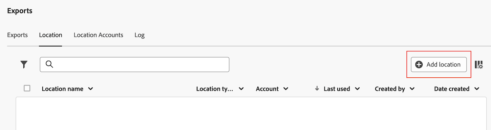

# Configuración de ubicaciones de exportación en la nube {#configure-cloud-export-locations}

<!-- markdownlint-disable MD034 -->

>[!CONTEXTUALHELP]
>id="cja-export-prefix"
>title="Prefijo"
>abstract="Carpeta raíz dentro del contenedor en el que desea colocar los datos. Especifique un nombre de carpeta estática y, a continuación, añada una barra diagonal después del nombre para crear la carpeta. Por ejemplo, `folder_name/`"

<!-- markdownlint-enable MD034 -->

<!-- markdownlint-disable MD034 -->

>[!CONTEXTUALHELP]
>id="cja-export-file-name"
>title="Nombre y ruta del archivo"
>abstract="Especifique un nombre de archivo personalizado dinámico para usar en las exportaciones automatizadas enviadas a esta ubicación. También puede anteponer al nombre del archivo una ruta de acceso dinámica personalizada.  Use variables en el nombre de archivo y ruta de acceso para hacerlas dinámicas.  Por ejemplo, si especifica `${yyyy}/${MM}/${dd}/my-report-${instance_id}-${idx}`, una exportación que se envíe automáticamente a este destino el 15 de enero de 2026 tendría la siguiente ruta de archivo y nombre: `[prefix_folder_name]/2026/01/15/my-report-[UUID]-1.csv`  Haga clic en el vínculo siguiente para obtener una lista de variables disponibles."

<!-- markdownlint-enable MD034 -->

Para poder exportar informes de Customer Journey Analytics a un destino de la nube (desde [Analysis Workspace](/help/analysis-workspace/export/export-cloud.md) o desde [Report Builder](/help/report-builder/report-builder-export.md)), debes agregar y configurar la ubicación a la que deseas que se envíen los datos. Este proceso consta de:

1. Agregar y configurar la cuenta (como Amazon S3, Google Cloud Platform, etc.) tal como se describe en [Configuración de cuentas de exportación en la nube](/help/components/exports/cloud-export-accounts.md)

1. Agregar y configurar la ubicación dentro de esa cuenta (como una carpeta dentro de la cuenta) tal como se describe en este artículo.

Para obtener información sobre cómo administrar ubicaciones existentes, como ver, editar y eliminar ubicaciones, consulte [Administrar ubicaciones y cuentas de exportación en la nube](/help/components/exports/manage-export-locations.md).

## Comience a crear una ubicación de exportación de nube

1. Debe agregar una cuenta antes de agregar una ubicación. Si aún no lo ha hecho, agregue una cuenta como se describe en [Configurar cuentas de exportación en la nube](/help/components/exports/cloud-export-accounts.md).

1. En Customer Journey Analytics, seleccione [!UICONTROL **Componentes**] > [!UICONTROL **Exportaciones**].

1. Seleccione la ficha [!UICONTROL **Ubicaciones**] y luego seleccione [!UICONTROL **Agregar ubicación**].

   

   O bien

   Seleccione la ficha [!UICONTROL **Cuentas de ubicación**], seleccione el icono de 3 puntos en una cuenta existente donde desee agregar una ubicación y, a continuación, seleccione [!UICONTROL **Agregar ubicación**].

   

   Se muestra el cuadro de diálogo Ubicación.

1. Especifique la siguiente información:

   | Campo | Función |
   |---------|----------|
   | [!UICONTROL **Nombre**] | El nombre de la ubicación. |
   | [!UICONTROL **Descripción**] | Proporcione una breve descripción de la ubicación para diferenciarla de otras ubicaciones de la cuenta. |
   | [!UICONTROL **Poner la ubicación a disposición de todos los usuarios de su organización**] | Active esta opción para permitir que otros usuarios de su organización utilicen la ubicación. 
Tenga en cuenta lo siguiente al compartir ubicaciones:
<ul><li>Las ubicaciones que comparte no se pueden dejar de compartir.</li><li>Solo el propietario de la ubicación puede editar las ubicaciones compartidas.</li><li>Las ubicaciones solo se pueden compartir si también se comparte la cuenta a la que está asociada la ubicación.</li></ul> |
   | [!UICONTROL **Cuenta de ubicación**] | Seleccione la cuenta en la que desea crear la ubicación. Para obtener información sobre cómo crear una cuenta, consulte [Configurar cuentas de exportación en la nube](/help/components/exports/cloud-export-accounts.md). |

1. En la sección [!UICONTROL **Propiedades de ubicación**], especifique información específica para el tipo de cuenta de su cuenta de ubicación.

   Continúe con la sección siguiente que corresponde al tipo de cuenta seleccionado en el campo [!UICONTROL **Cuenta de ubicación**].

   * [Zona de aterrizaje de datos de AEP](#aep-data-landing-zone)
   * [Amazon S3 Role ARN](#amazon-s3-role-arn)
   * [Google Cloud Platform](#google-cloud-platform)
   * [Azure SAS](#azure-sas)
   * [Azure RBAC](#azure-rbac)
   * [Snowflake](#snowflake)

### Zona de aterrizaje de datos de AEP

>[!IMPORTANT]
>
>Al exportar informes de Customer Journey Analytics a la zona de aterrizaje de datos de Adobe Experience Platform, asegúrese de descargar los datos en un plazo de 7 días y, a continuación, elimínelos de la zona de aterrizaje de datos de AEP. Después de 7 días, los datos se eliminan automáticamente de la zona de aterrizaje de datos de AEP.

1. Comience a crear una ubicación de exportación en la nube de cualquiera de las siguientes maneras:

   * Desde la página Exportaciones como se describió anteriormente, en [Empiece a crear una ubicación de exportación en la nube](#begin-creating-a-cloud-export-location)

   * Al [exportar tablas completas desde Analysis Workspace](/help/analysis-workspace/export/export-cloud.md#export-full-tables)

1. En la sección [!UICONTROL **Propiedades de ubicación**] del cuadro de diálogo [!UICONTROL **Agregar ubicación**], especifique la siguiente información para configurar una ubicación de zona de aterrizaje de datos de Adobe Experience Platform:

   | Campo | Función |
   |---------|----------|
   | [!UICONTROL **Prefijo**] | La carpeta dentro del contenedor en la que desea colocar los datos. Especifique un nombre de carpeta estática y, a continuación, añada una barra diagonal después del nombre para crear la carpeta. Por ejemplo, `folder_name/` |
   | [!UICONTROL **Nombre de archivo y ruta**] | Especifique un nombre de archivo personalizado dinámico para usar en las exportaciones automatizadas enviadas a esta ubicación. También puede anteponer al nombre del archivo una ruta de acceso dinámica personalizada. 
Esta opción le permite automatizar la creación de nombres de archivo y la ubicación de carpetas, de modo que los nombres de archivo sean predecibles y estén organizados en carpetas de forma lógica. Por ejemplo, los nombres de archivo pueden asignarse según el día en que se entregaron y luego colocarse en carpetas que correspondan con cada mes.

Utilice cualquiera de las siguientes variables en el nombre de archivo y ruta para hacerlas dinámicas:
<ul><li>**{yyyy}**: año natural de 4 dígitos (distingue mayúsculas de minúsculas)</li><li>**{yy}**: año natural de 2 dígitos (distingue mayúsculas de minúsculas)</li><li>**{MM}**: mes de 2 dígitos (distingue mayúsculas de minúsculas)</li><li>**{dd}**: día de 2 dígitos (distingue mayúsculas de minúsculas)</li><li>**{HH}**: hora de 2 dígitos (distingue mayúsculas de minúsculas)</li><li>**{mm}**: minutos de 2 dígitos (distingue mayúsculas de minúsculas)</li><li>**{ss}**: segundos de 2 dígitos (distingue mayúsculas de minúsculas)</li><li>**{fff}**: nanosegundos de 3 dígitos (distingue mayúsculas de minúsculas)</li><li>**{instance_id}**: UUID de solicitud (instancia)</li><li>**{export_id}**: UUID de exportación (programación)</li><li>**{idx}**: inicio del índice desde 0 (incrementado para cada archivo)</li><li>**{total}**: número total de archivos para todo el trabajo de transferencia</li><li>**{completion_millis}**: tiempo de transferencia en milisegundos</li></ul>

Por ejemplo, si especifica `${yyyy}/${MM}/${dd}/my-report-${instance_id} -${idx}`, una exportación que se envíe automáticamente a este destino el 15 de enero de 2026 tendría la siguiente ruta de archivo y nombre: [prefix_folder_name]/2026/01/15/my-report-[UUID]-1.csv
 |

   {style="table-layout:auto"}

1. Seleccione [!UICONTROL **Guardar**].

1. Ahora puede exportar datos de Analysis Workspace a la cuenta y la ubicación configuradas. Para obtener información sobre cómo exportar datos a la nube, consulte [Exportar datos de proyecto a la nube](/help/analysis-workspace/export/export-cloud.md).

1. La forma más sencilla de acceder a los datos de la zona de aterrizaje de datos de AEP es utilizar el Explorador de almacenamiento de Azure de Microsoft. El Explorador de almacenamiento es la misma herramienta que se usa en las instrucciones para configurar la [cuenta de la zona de aterrizaje de datos de AEP](/help/components/exports/cloud-export-accounts.md#aep-data-landing-zone).

   1. Abra [Microsoft Azure Storage Explorer](https://azure.microsoft.com/en-us/products/storage/storage-explorer/).

   1. Vaya a [!UICONTROL **Cuentas de almacenamiento**] > [!UICONTROL **(Contenedores adjuntos)**] > [!UICONTROL **Contenedores de blob**] > **[!UICONTROL cjaexport-_number_]**>*** your_container_name ***.

      >[!NOTE]
      >
      >El nombre de carpeta **[!UICONTROL cjaexport-_number_]**es el nombre predeterminado proporcionado por el Explorador de almacenamiento de Azure. Si solo tiene una conexión asociada a su URI SAS (lo cual es normal), el nombre de esta carpeta será&#x200B;**[!UICONTROL cjaexport-1]**.

      

   1. Seleccione la exportación que desee descargar y, a continuación, seleccione [!UICONTROL **Descargar**] para descargar.

### Amazon S3 Role ARN

1. Comience a crear una ubicación de exportación en la nube de cualquiera de las siguientes maneras:

   * Desde la página Exportaciones como se describió anteriormente, en [Empiece a crear una ubicación de exportación en la nube](#begin-creating-a-cloud-export-location)

   * Al [exportar tablas completas desde Analysis Workspace](/help/analysis-workspace/export/export-cloud.md#export-full-tables)

1. En la sección [!UICONTROL **Propiedades de ubicación**] del cuadro de diálogo [!UICONTROL **Agregar ubicación**], especifique la siguiente información para configurar una ubicación ARN de la función de Amazon S3:

   | Campo | Función |
   |---------|----------|
   | [!UICONTROL **Despósito**] | El bloque de su cuenta de Amazon S3 al que desea enviar los datos de Customer Journey Analytics. 
Asegúrese de que el ARN del usuario proporcionado por Adobe tiene el permiso `S3:PutObject` para cargar archivos en este bloque. 

Los nombres de bloques deben cumplir reglas de nomenclatura específicas. Los nombres bloques deben tener entre 3 y 63 caracteres de longitud, solo pueden constar de letras minúsculas, números, puntos (.) y guiones (-), y deben empezar y terminar con una letra o un número. [Hay disponible una lista completa de reglas de nomenclatura en la documentación de AWS](https://docs.aws.amazon.com/AmazonS3/latest/userguide/bucketnamingrules.html). 
 |
   | [!UICONTROL **Prefijo**] | La carpeta dentro del bloque en el que quiere colocar los datos. Especifique un nombre de carpeta estática y, a continuación, añada una barra diagonal después del nombre para crear la carpeta. Por ejemplo, folder_name/ |
   | [!UICONTROL **Nombre de archivo y ruta**] | Especifique un nombre de archivo personalizado dinámico para usar en las exportaciones automatizadas enviadas a esta ubicación. También puede anteponer al nombre del archivo una ruta de acceso dinámica personalizada. 
Esta opción le permite automatizar la creación de nombres de archivo y la ubicación de carpetas, de modo que los nombres de archivo sean predecibles y estén organizados en carpetas de forma lógica. Por ejemplo, los nombres de archivo pueden asignarse según el día en que se entregaron y luego colocarse en carpetas que correspondan con cada mes.

Utilice cualquiera de las siguientes variables en el nombre de archivo y ruta para hacerlas dinámicas:
<ul><li>**{yyyy}**: año natural de 4 dígitos (distingue mayúsculas de minúsculas)</li><li>**{yy}**: año natural de 2 dígitos (distingue mayúsculas de minúsculas)</li><li>**{MM}**: mes de 2 dígitos (distingue mayúsculas de minúsculas)</li><li>**{dd}**: día de 2 dígitos (distingue mayúsculas de minúsculas)</li><li>**{HH}**: hora de 2 dígitos (distingue mayúsculas de minúsculas)</li><li>**{mm}**: minutos de 2 dígitos (distingue mayúsculas de minúsculas)</li><li>**{ss}**: segundos de 2 dígitos (distingue mayúsculas de minúsculas)</li><li>**{fff}**: nanosegundos de 3 dígitos (distingue mayúsculas de minúsculas)</li><li>**{instance_id}**: UUID de solicitud (instancia)</li><li>**{export_id}**: UUID de exportación (programación)</li><li>**{idx}**: inicio del índice desde 0 (incrementado para cada archivo)</li><li>**{total}**: número total de archivos para todo el trabajo de transferencia</li><li>**{completion_millis}**: tiempo de transferencia en milisegundos</li></ul>

Por ejemplo, si especifica `${yyyy}/${MM}/${dd}/my-report-${instance_id} -${idx}`, una exportación que se envíe automáticamente a este destino el 15 de enero de 2026 tendría la siguiente ruta de archivo y nombre: [prefix_folder_name]/2026/01/15/my-report-[UUID]-1.csv
 |

   {style="table-layout:auto"}

1. Seleccione [!UICONTROL **Guardar**].

1. Ahora puede exportar datos de Analysis Workspace a la cuenta y la ubicación configuradas. Para obtener información sobre cómo exportar datos a la nube, consulte [Exportar datos de proyecto a la nube](/help/analysis-workspace/export/export-cloud.md).

### Google Cloud Platform

1. Comience a crear una ubicación de exportación en la nube de cualquiera de las siguientes maneras:

   * Desde la página Exportaciones como se describió anteriormente, en [Empiece a crear una ubicación de exportación en la nube](#begin-creating-a-cloud-export-location)

   * Al [exportar tablas completas desde Analysis Workspace](/help/analysis-workspace/export/export-cloud.md#export-full-tables)

1. En la sección [!UICONTROL **Propiedades de ubicación**] del cuadro de diálogo [!UICONTROL **Agregar ubicación**], especifique la siguiente información para configurar una ubicación de Google Cloud Platform:

   | Campo | Función |
   |---------|----------|
   | [!UICONTROL **Despósito**] | El bloque de su cuenta de GCP al que desea enviar los datos de Customer Journey Analytics. 
Asegúrese de que ha concedido el permiso `roles/storage.objectCreator` a la entidad de seguridad proporcionada por Adobe. (La entidad de seguridad se proporciona al [configurar la cuenta de Google Cloud Platform](/help/components/exports/cloud-export-accounts.md)). 
Para obtener información sobre la concesión de permisos, consulte [Adición de un principal a una política de nivel de bloque](https://cloud.google.com/storage/docs/access-control/using-iam-permissions#bucket-add) en la documentación de Google Cloud.

Si su organización utiliza [Restricciones de política de organización](https://cloud.google.com/storage/docs/org-policy-constraints) para permitir únicamente la cuenta de Google Cloud Platform en su lista de permitidos, necesita el siguiente ID de organización de Google Cloud Platform propiedad de Adobe: <ul><li>`DISPLAY_NAME`: `adobe.com`</li><li>`ID`: `178012854243`</li><li>`DIRECTORY_CUSTOMER_ID`: `C02jo8puj`</li></ul> 
 |
   | [!UICONTROL **Prefijo**] | La carpeta dentro del bloque en el que quiere colocar los datos. Especifique un nombre de carpeta estática y, a continuación, añada una barra diagonal después del nombre para crear la carpeta. Por ejemplo, folder_name/ |
   | [!UICONTROL **Nombre de archivo y ruta**] | Especifique un nombre de archivo personalizado dinámico para usar en las exportaciones automatizadas enviadas a esta ubicación. También puede anteponer al nombre del archivo una ruta de acceso dinámica personalizada. 
Esta opción le permite automatizar la creación de nombres de archivo y la ubicación de carpetas, de modo que los nombres de archivo sean predecibles y estén organizados en carpetas de forma lógica. Por ejemplo, los nombres de archivo pueden asignarse según el día en que se entregaron y luego colocarse en carpetas que correspondan con cada mes.

Utilice cualquiera de las siguientes variables en el nombre de archivo y ruta para hacerlas dinámicas:
<ul><li>**{yyyy}**: año natural de 4 dígitos (distingue mayúsculas de minúsculas)</li><li>**{yy}**: año natural de 2 dígitos (distingue mayúsculas de minúsculas)</li><li>**{MM}**: mes de 2 dígitos (distingue mayúsculas de minúsculas)</li><li>**{dd}**: día de 2 dígitos (distingue mayúsculas de minúsculas)</li><li>**{HH}**: hora de 2 dígitos (distingue mayúsculas de minúsculas)</li><li>**{mm}**: minutos de 2 dígitos (distingue mayúsculas de minúsculas)</li><li>**{ss}**: segundos de 2 dígitos (distingue mayúsculas de minúsculas)</li><li>**{fff}**: nanosegundos de 3 dígitos (distingue mayúsculas de minúsculas)</li><li>**{instance_id}**: UUID de solicitud (instancia)</li><li>**{export_id}**: UUID de exportación (programación)</li><li>**{idx}**: inicio del índice desde 0 (incrementado para cada archivo)</li><li>**{total}**: número total de archivos para todo el trabajo de transferencia</li><li>**{completion_millis}**: tiempo de transferencia en milisegundos</li></ul>

Por ejemplo, si especifica `${yyyy}/${MM}/${dd}/my-report-${instance_id} -${idx}`, una exportación que se envíe automáticamente a este destino el 15 de enero de 2026 tendría la siguiente ruta de archivo y nombre: [prefix_folder_name]/2026/01/15/my-report-[UUID]-1.csv
 |

   {style="table-layout:auto"}

1. Seleccione [!UICONTROL **Guardar**].

1. Ahora puede exportar datos de Analysis Workspace a la cuenta y la ubicación configuradas. Para obtener información sobre cómo exportar datos a la nube, consulte [Exportar datos de proyecto a la nube](/help/analysis-workspace/export/export-cloud.md).

### Azure SAS

1. Comience a crear una ubicación de exportación en la nube de cualquiera de las siguientes maneras:

   * Desde la página Exportaciones como se describió anteriormente, en [Empiece a crear una ubicación de exportación en la nube](#begin-creating-a-cloud-export-location)

   * Al [exportar tablas completas desde Analysis Workspace](/help/analysis-workspace/export/export-cloud.md#export-full-tables)

1. En la sección [!UICONTROL **Propiedades de ubicación**] del cuadro de diálogo [!UICONTROL **Agregar ubicación**], especifique la siguiente información para configurar una ubicación SAS de Azure:

   | Campo | Función |
   |---------|----------|
   | [!UICONTROL **Nombre de contenedor**] | El contenedor de la cuenta que especificó a donde desea enviar los datos de Customer Journey Analytics. |
   | [!UICONTROL **Prefijo**] | La carpeta dentro del contenedor en la que desea colocar los datos. Especifique un nombre de carpeta estática y, a continuación, añada una barra diagonal después del nombre para crear la carpeta. Por ejemplo, `folder_name/`
Asegúrese de que el almacén de tokens SAS que especificó en el campo Nombre secreto del almacén de claves al configurar la cuenta SAS de Azure tenga el permiso `Write`. Esto permite que el token de SAS cree archivos en el contenedor de Azure. 
Si desea que el token de SAS sobrescriba también los archivos, asegúrese de que el almacén de tokens SAS tenga el permiso `Delete`.

Para obtener más información, consulte [Recursos de almacenamiento de blob](https://learn.microsoft.com/en-us/azure/storage/blobs/storage-blobs-introduction#blob-storage-resources) en la documentación de almacenamiento de Azure Blob.
 |
   | [!UICONTROL **Nombre de archivo y ruta**] | Especifique un nombre de archivo personalizado dinámico para usar en las exportaciones automatizadas enviadas a esta ubicación. También puede anteponer al nombre del archivo una ruta de acceso dinámica personalizada. 
Esta opción le permite automatizar la creación de nombres de archivo y la ubicación de carpetas, de modo que los nombres de archivo sean predecibles y estén organizados en carpetas de forma lógica. Por ejemplo, los nombres de archivo pueden asignarse según el día en que se entregaron y luego colocarse en carpetas que correspondan con cada mes.

Utilice cualquiera de las siguientes variables en el nombre de archivo y ruta para hacerlas dinámicas:
<ul><li>**{yyyy}**: año natural de 4 dígitos (distingue mayúsculas de minúsculas)</li><li>**{yy}**: año natural de 2 dígitos (distingue mayúsculas de minúsculas)</li><li>**{MM}**: mes de 2 dígitos (distingue mayúsculas de minúsculas)</li><li>**{dd}**: día de 2 dígitos (distingue mayúsculas de minúsculas)</li><li>**{HH}**: hora de 2 dígitos (distingue mayúsculas de minúsculas)</li><li>**{mm}**: minutos de 2 dígitos (distingue mayúsculas de minúsculas)</li><li>**{ss}**: segundos de 2 dígitos (distingue mayúsculas de minúsculas)</li><li>**{fff}**: nanosegundos de 3 dígitos (distingue mayúsculas de minúsculas)</li><li>**{instance_id}**: UUID de solicitud (instancia)</li><li>**{export_id}**: UUID de exportación (programación)</li><li>**{idx}**: inicio del índice desde 0 (incrementado para cada archivo)</li><li>**{total}**: número total de archivos para todo el trabajo de transferencia</li><li>**{completion_millis}**: tiempo de transferencia en milisegundos</li></ul>

Por ejemplo, si especifica `${yyyy}/${MM}/${dd}/my-report-${instance_id} -${idx}`, una exportación que se envíe automáticamente a este destino el 15 de enero de 2026 tendría la siguiente ruta de archivo y nombre: [prefix_folder_name]/2026/01/15/my-report-[UUID]-1.csv
 |

   {style="table-layout:auto"}

1. Seleccione [!UICONTROL **Guardar**].

1. Ahora puede exportar datos de Analysis Workspace a la cuenta y la ubicación configuradas. Para obtener información sobre cómo exportar datos a la nube, consulte [Exportar datos de proyecto a la nube](/help/analysis-workspace/export/export-cloud.md).

### Azure RBAC

1. Comience a crear una ubicación de exportación en la nube de cualquiera de las siguientes maneras:

   * Desde la página Exportaciones como se describió anteriormente, en [Empiece a crear una ubicación de exportación en la nube](#begin-creating-a-cloud-export-location)

   * Al [exportar tablas completas desde Analysis Workspace](/help/analysis-workspace/export/export-cloud.md#export-full-tables)

1. En la sección [!UICONTROL **Propiedades de ubicación**] del cuadro de diálogo [!UICONTROL **Agregar ubicación**], especifique la siguiente información para configurar una ubicación RBAC de Azure:

   | Campo | Función |
   |---------|----------|
   | [!UICONTROL **Contenedor**] | El contenedor de la cuenta que especificó a donde desea enviar los datos de Customer Journey Analytics. Asegúrese de conceder permisos para cargar archivos en la aplicación de Azure que creó anteriormente. |
   | [!UICONTROL **Prefijo**] | La carpeta dentro del contenedor en la que desea colocar los datos. Especifique un nombre de carpeta estática y, a continuación, añada una barra diagonal después del nombre para crear la carpeta. Por ejemplo, `folder_name/`
Asegúrese de que el ID de aplicación que especificó al configurar la cuenta de Azure RBAC tenga concedida la función `Storage Blob Data Contributor` para acceder al contenedor (carpeta).
 
Para obtener más información, consulte [Funciones integradas de Azure](https://learn.microsoft.com/en-us/azure/role-based-access-control/built-in-roles).
 |
   | [!UICONTROL **Nombre de archivo y ruta**] | Especifique un nombre de archivo personalizado dinámico para usar en las exportaciones automatizadas enviadas a esta ubicación. También puede anteponer al nombre del archivo una ruta de acceso dinámica personalizada. 
Esta opción le permite automatizar la creación de nombres de archivo y la ubicación de carpetas, de modo que los nombres de archivo sean predecibles y estén organizados en carpetas de forma lógica. Por ejemplo, los nombres de archivo pueden asignarse según el día en que se entregaron y luego colocarse en carpetas que correspondan con cada mes.
 
Utilice cualquiera de las siguientes variables en el nombre de archivo y ruta para hacerlas dinámicas:
<ul><li>**{yyyy}**: año natural de 4 dígitos (distingue mayúsculas de minúsculas)</li><li>**{yy}**: año natural de 2 dígitos (distingue mayúsculas de minúsculas)</li><li>**{MM}**: mes de 2 dígitos (distingue mayúsculas de minúsculas)</li><li>**{dd}**: día de 2 dígitos (distingue mayúsculas de minúsculas)</li><li>**{HH}**: hora de 2 dígitos (distingue mayúsculas de minúsculas)</li><li>**{mm}**: minutos de 2 dígitos (distingue mayúsculas de minúsculas)</li><li>**{ss}**: segundos de 2 dígitos (distingue mayúsculas de minúsculas)</li><li>**{fff}**: nanosegundos de 3 dígitos (distingue mayúsculas de minúsculas)</li><li>**{instance_id}**: UUID de solicitud (instancia)</li><li>**{export_id}**: UUID de exportación (programación)</li><li>**{idx}**: inicio del índice desde 0 (incrementado para cada archivo)</li><li>**{total}**: número total de archivos para todo el trabajo de transferencia</li><li>**{completion_millis}**: tiempo de transferencia en milisegundos</li></ul>

Por ejemplo, si especifica `${yyyy}/${MM}/${dd}/my-report-${instance_id} -${idx}`, una exportación que se envíe automáticamente a este destino el 15 de enero de 2026 tendría la siguiente ruta de archivo y nombre: [prefix_folder_name]/2026/01/15/my-report-[UUID]-1.csv
 |
   | [!UICONTROL **Cuenta**] | La cuenta de almacenamiento de Azure. |

   {style="table-layout:auto"}

1. Seleccione [!UICONTROL **Guardar**].

1. Ahora puede exportar datos de Analysis Workspace a la cuenta y la ubicación configuradas. Para obtener información sobre cómo exportar datos a la nube, consulte [Exportar datos de proyecto a la nube](/help/analysis-workspace/export/export-cloud.md).

### Snowflake

1. Comience a crear una ubicación de exportación en la nube de cualquiera de las siguientes maneras:

   * Desde la página Exportaciones como se describió anteriormente, en [Empiece a crear una ubicación de exportación en la nube](#begin-creating-a-cloud-export-location)

   * Al [exportar tablas completas desde Analysis Workspace](/help/analysis-workspace/export/export-cloud.md#export-full-tables)

1. En la sección [!UICONTROL **Propiedades de ubicación**] del cuadro de diálogo [!UICONTROL **Agregar ubicación**], especifique la siguiente información para configurar una ubicación de Snowflake:

   | Campo | Función |
   |---------|----------|
   | [!UICONTROL **DB**] | La base de datos especificada debe ser una base de datos existente. La función que ha creado debe tener privilegios para acceder a esta base de datos.
Es la base de datos asociada al nombre de la etapa.

Puede otorgar privilegios de este rol a la base de datos en Snowflake mediante el siguiente comando: `GRANT USAGE ON DATABASE <your_database> TO ROLE <your_role>;`
 
Para obtener más información, consulte la página [Base de datos, esquema y comandos compartidos en la documentación de Snowflake](https://docs.snowflake.com/en/sql-reference/commands-database).
 |
   | [!UICONTROL **Esquema**] | El esquema especificado debe ser un esquema existente. La función que ha creado debe tener privilegios para acceder a este esquema.
Este es el esquema asociado al nombre de la etapa.

Puede conceder al rol que ha creado privilegios al esquema en Snowflake mediante el siguiente comando: `GRANT USAGE ON SCHEMA <your_database>.<your_schema> TO ROLE <your_role>;`

Para obtener más información, consulte la página [Base de datos, esquema y comandos compartidos en la documentación de Snowflake](https://docs.snowflake.com/en/sql-reference/commands-database).
 |
   | [!UICONTROL **Nombre del escenario**] | Nombre de la fase interna en la que se almacenan los archivos de datos en Snowflake.
Asegúrese de que la función especificada en la cuenta tiene acceso de lectura y escritura a este nombre de fase. (Dado que concede acceso de lectura y escritura, le recomendamos que utilice una fase que solo utilice Adobe).

Puede conceder acceso de lectura y escritura al nombre de la fase en Snowflake mediante el siguiente comando: `GRANT READ, WRITE ON STAGE <your_database>.<your_schema>.<your_stage_name> TO ROLE <your_role>;`
 
Para obtener información acerca de cómo conceder privilegios a un rol, vea [Conceder privilegios en la documentación de Snowflake](https://docs.snowflake.com/en/sql-reference/sql/grant-privilege).
 
Para obtener más información sobre el nombre de la fase, consulte la página [Elección de una fase interna para archivos locales en la documentación de Snowflake](https://docs.snowflake.com/en/user-guide/data-load-local-file-system-create-stage).
 |
   | [!UICONTROL **Ruta de fase**] | La ruta a la ubicación donde se almacenan los archivos de datos en Snowflake. 
Para obtener más información, consulte la página [Elección de una fase interna para archivos locales en la documentación de Snowflake](https://docs.snowflake.com/en/user-guide/data-load-local-file-system-create-stage).
 |

   {style="table-layout:auto"}

1. Seleccione [!UICONTROL **Guardar**].

1. Ahora puede exportar datos de Analysis Workspace a la cuenta y la ubicación configuradas. Para obtener información sobre cómo exportar datos a la nube, consulte [Exportar datos de proyecto a la nube](/help/analysis-workspace/export/export-cloud.md).
