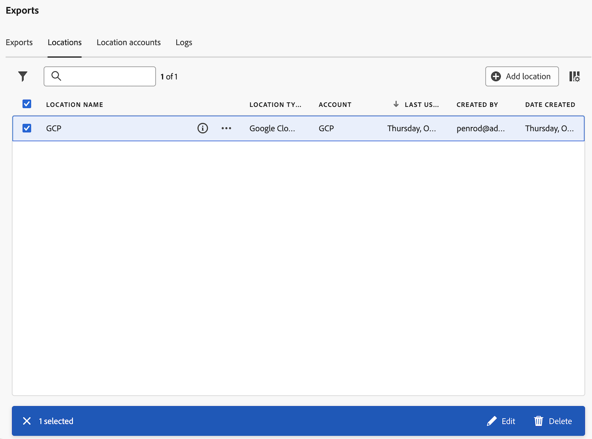
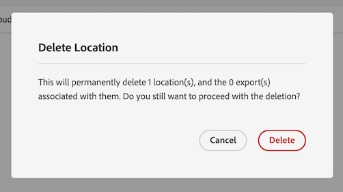
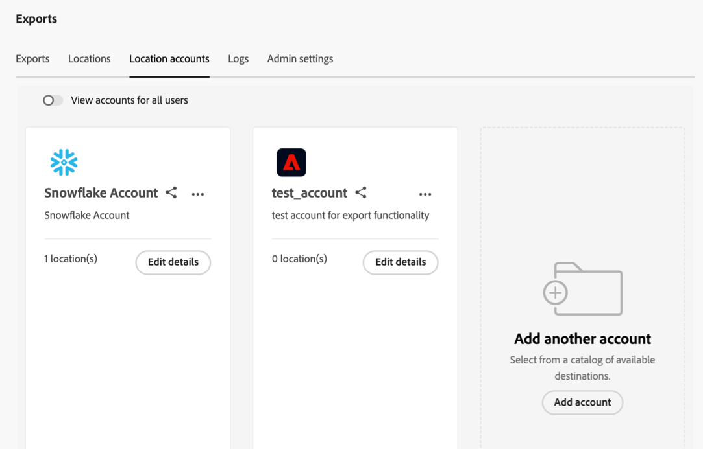

# Administrar ubicaciones y cuentas de exportación en la nube

Puede ver, editar y eliminar ubicaciones de exportación de la nube.

Para obtener información sobre cómo crear una nueva ubicación, consulte [Configuración de ubicaciones de exportación de nube](/help/components/exports/cloud-export-locations.md).

## Filtrar y buscar ubicaciones

Para encontrar la información que necesita, puede filtrar la lista de ubicaciones o buscar una ubicación.

### Filtrado de la lista de ubicaciones

1. En Customer Journey Analytics, seleccione [!UICONTROL **Componentes**] > [!UICONTROL **Exportaciones**].

1. Seleccione el [!UICONTROL **Ubicaciones**] pestaña.

1. Seleccione el **Filtrar** icono.

   <!-- add screenshot -->

   Puede filtrar por los siguientes criterios:

   | Filtro | Descripción |
   |---------|----------|
   | [!UICONTROL **Tipo de ubicación**]<!--should this be changed to Account type?--> | El tipo de cuenta con el que está asociada la ubicación. Pueden estar disponibles los siguientes tipos de cuenta: <ul><li>[!UICONTROL **Zona de aterrizaje de datos de AEP**]</li><li>[!UICONTROL **ARN de la función de Amazon S3**]</li><li>[!UICONTROL **Azure SAS**]</li><li>[!UICONTROL **Azure RBAC**]</li><li>[!UICONTROL **Google Cloud Platform**]</li><li>[!UICONTROL **Snowflake**]</li></ul> |
   | [!UICONTROL **Cuenta**] | El nombre de la cuenta a la que está asociada la ubicación. |
   | [!UICONTROL **Creado por**] | La dirección de correo electrónico del usuario que creó la ubicación. |

   {style="table-layout:auto"}

### Buscar ubicaciones

1. En Customer Journey Analytics, seleccione [!UICONTROL **Componentes**] > [!UICONTROL **Exportaciones**].

1. Seleccione el [!UICONTROL **Ubicaciones**] pestaña.

1. (Condicional) Si es administrador del sistema, puede habilitar la variable [!UICONTROL **Ver ubicaciones para todos los usuarios**] para ver las ubicaciones creadas por todos los usuarios de su organización.

1. En el campo de búsqueda, empiece a escribir cualquier información asociada con la ubicación que está buscando. Puede buscar datos de cualquier columna disponible en la tabla.

## Editar ubicaciones

1. En Customer Journey Analytics, seleccione [!UICONTROL **Componentes**] > [!UICONTROL **Exportaciones**].

1. Seleccione el [!UICONTROL **Ubicaciones**] pestaña.

1. (Condicional) Si es administrador del sistema, puede habilitar la variable [!UICONTROL **Ver ubicaciones para todos los usuarios**] para ver las ubicaciones creadas por todos los usuarios de su organización.

1. Seleccione la ubicación que desee editar.

   

1. Seleccione [!UICONTROL **Editar**].

1. Realice los cambios que desee y seleccione [!UICONTROL **Guardar**].

## Eliminar ubicaciones

Si elimina una ubicación, también se eliminarán todas las exportaciones que utilicen la ubicación. Compruebe el cuadro de diálogo de confirmación al eliminar para asegurarse de que no haya exportaciones asociadas a la ubicación.

Para eliminar una ubicación:

1. En Customer Journey Analytics, seleccione [!UICONTROL **Componentes**] > [!UICONTROL **Exportaciones**].

1. Seleccione el [!UICONTROL **Ubicaciones**] pestaña.

1. (Condicional) Si es administrador del sistema, puede habilitar la variable [!UICONTROL **Ver ubicaciones para todos los usuarios**] para ver las ubicaciones creadas por todos los usuarios de su organización.

1. Seleccione una o varias ubicaciones que desee eliminar.

   

1. Seleccione [!UICONTROL **Eliminar**].

   Aparece el cuadro de diálogo Eliminar ubicación.

1. En el cuadro de diálogo Eliminar ubicación, asegúrese de que la ubicación no esté asociada a ninguna exportación antes de confirmar la eliminación.

   

1. Seleccionar [!UICONTROL **Eliminar**] de nuevo para confirmar.

## Editar cuentas

1. En Customer Journey Analytics, seleccione [!UICONTROL **Componentes**] > [!UICONTROL **Exportaciones**].

1. Seleccione el [!UICONTROL **Cuentas de ubicación**] pestaña.

   

1. (Condicional) Si es administrador del sistema, puede habilitar la variable [!UICONTROL **Ver cuentas de todos los usuarios**] para ver las ubicaciones creadas por todos los usuarios de su organización.

1. Seleccionar [!UICONTROL **Ver detalles**] en la cuenta que desee editar.

1. Realice los cambios que desee y seleccione [!UICONTROL **Guardar**].

## Ver claves de cuenta

Después de crear una cuenta, puede ver todas las claves de cuenta asociadas a ella. Es posible que deba ver esta información si no ha terminado de configurar la cuenta con su proveedor de la nube [cuando configuró originalmente la cuenta](/help/components/exports/cloud-export-accounts.md).

Para ver las claves asociadas a una cuenta de exportación:

1. En Customer Journey Analytics, seleccione [!UICONTROL **Componentes**] > [!UICONTROL **Exportaciones**].

1. Seleccione el [!UICONTROL **Cuentas de ubicación**] pestaña.

   

1. (Condicional) Si es administrador del sistema, puede habilitar la variable [!UICONTROL **Ver cuentas de todos los usuarios**] para ver las ubicaciones creadas por todos los usuarios de su organización.

1. Seleccione el icono de 3 puntos en la cuenta que desee editar y, a continuación, seleccione [!UICONTROL **Claves de cuenta**].

## Eliminar cuentas

1. En Customer Journey Analytics, seleccione [!UICONTROL **Componentes**] > [!UICONTROL **Exportaciones**].

1. Seleccione el [!UICONTROL **Cuentas de ubicación**] pestaña.

   

1. (Condicional) Si es administrador del sistema, puede habilitar la variable [!UICONTROL **Ver cuentas de todos los usuarios**] para ver las ubicaciones creadas por todos los usuarios de su organización.

1. Seleccione el icono de 3 puntos en la cuenta que desee editar y, a continuación, seleccione [!UICONTROL **Eliminar cuenta**].

1. Seleccionar [!UICONTROL **Eliminar**] de nuevo en el cuadro de diálogo de confirmación.
