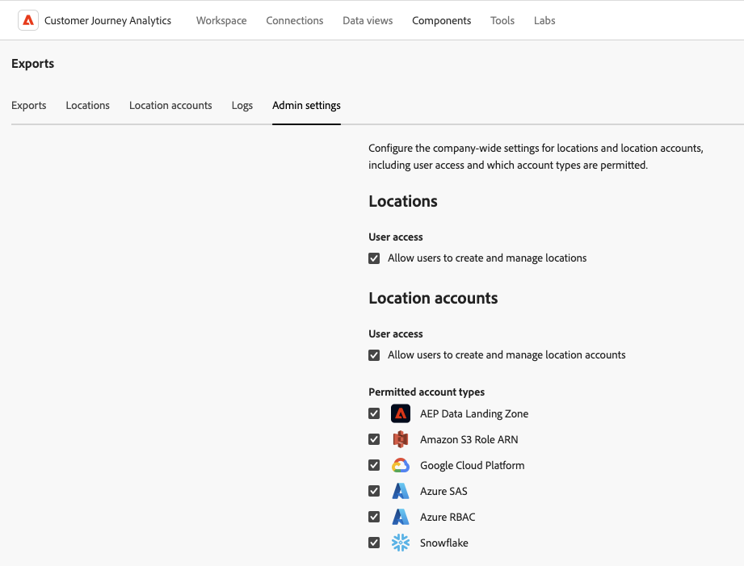

# Administrar ubicaciones y cuentas de exportación en la nube

Puede ver, editar y eliminar ubicaciones de exportación de la nube.

Para obtener información sobre cómo crear una nueva ubicación, consulte [Configurar ubicaciones de exportación de la nube](/help/components/exports/cloud-export-locations.md).

## Filtrar y buscar ubicaciones

Para encontrar la información que necesita, puede filtrar la lista de ubicaciones o buscar una ubicación.

### Filtrado de la lista de ubicaciones

1. En Customer Journey Analytics, seleccione [!UICONTROL **Componentes**] > [!UICONTROL **Exportaciones**].

1. Seleccione la ficha [!UICONTROL **Ubicaciones**].

1. Seleccione el icono **Filter**.

   <!-- add screenshot -->

   Puede filtrar por los siguientes criterios:

   | Filtrar | Descripción |
   |---------|----------|
   | [!UICONTROL **Tipo de ubicación**]<!--should this be changed to Account type?--> | El tipo de cuenta con el que está asociada la ubicación. Pueden estar disponibles los siguientes tipos de cuenta: <ul><li>[!UICONTROL **Zona de aterrizaje de datos de AEP**]</li><li>[!UICONTROL **ARN de la función Amazon S3**]</li><li>[!UICONTROL **Azure SAS**]</li><li>[!UICONTROL **Azure RBAC**]</li><li>[!UICONTROL **Google Cloud Platform**]</li><li>[!UICONTROL **Snowflake**]</li></ul> |
   | [!UICONTROL **Cuenta**] | El nombre de la cuenta a la que está asociada la ubicación. |
   | [!UICONTROL **Creado por**] | La dirección de correo electrónico del usuario que creó la ubicación. |

   {style="table-layout:auto"}

### Buscar ubicaciones

1. En Customer Journey Analytics, seleccione [!UICONTROL **Componentes**] > [!UICONTROL **Exportaciones**].

1. Seleccione la ficha [!UICONTROL **Ubicaciones**].

1. (Condicional) Si es administrador del sistema, puede habilitar la opción [!UICONTROL **Ver ubicaciones de todos los usuarios**] para ver las ubicaciones creadas por todos los usuarios de su organización.

1. En el campo de búsqueda, empiece a escribir cualquier información asociada con la ubicación que está buscando. Puede buscar datos de cualquier columna disponible en la tabla.

## Editar ubicaciones

Una ubicación solo la puede editar el usuario que la creó o un administrador del sistema.

Para editar una ubicación:

1. En Customer Journey Analytics, seleccione [!UICONTROL **Componentes**] > [!UICONTROL **Exportaciones**].

1. Seleccione la ficha [!UICONTROL **Ubicaciones**].

1. (Condicional) Si es administrador del sistema, puede habilitar la opción [!UICONTROL **Ver ubicaciones de todos los usuarios**] para ver las ubicaciones creadas por todos los usuarios de su organización.

1. Seleccione la ubicación que desee editar.

   

1. Seleccione [!UICONTROL **Editar**].

1. Realice los cambios que desee y, a continuación, seleccione [!UICONTROL **Guardar**].

## Eliminar ubicaciones

Si elimina una ubicación, también se eliminarán todas las exportaciones que utilicen la ubicación. Compruebe el cuadro de diálogo de confirmación al eliminar para asegurarse de que no haya exportaciones asociadas a la ubicación.

Para eliminar una ubicación:

1. En Customer Journey Analytics, seleccione [!UICONTROL **Componentes**] > [!UICONTROL **Exportaciones**].

1. Seleccione la ficha [!UICONTROL **Ubicaciones**].

1. (Condicional) Si es administrador del sistema, puede habilitar la opción [!UICONTROL **Ver ubicaciones de todos los usuarios**] para ver las ubicaciones creadas por todos los usuarios de su organización.

1. Seleccione una o varias ubicaciones que desee eliminar.

   

1. Seleccione [!UICONTROL **Eliminar**].

   Aparece el cuadro de diálogo Eliminar ubicación.

1. En el cuadro de diálogo Eliminar ubicación, asegúrese de que la ubicación no esté asociada a ninguna exportación antes de confirmar la eliminación.

   

1. Seleccione [!UICONTROL **Eliminar**] de nuevo para confirmar.

## Editar cuentas

Solamente el usuario que la creó o un administrador del sistema pueden editar una cuenta.

Para editar una cuenta:

1. En Customer Journey Analytics, seleccione [!UICONTROL **Componentes**] > [!UICONTROL **Exportaciones**].

1. Seleccione la ficha [!UICONTROL **Cuentas de ubicación**].

   

1. (Condicional) Si es administrador del sistema, puede habilitar la opción [!UICONTROL **Ver cuentas de todos los usuarios**] para ver las ubicaciones creadas por todos los usuarios de su organización.

1. Seleccione [!UICONTROL **Ver detalles**] en la cuenta que desee editar.

1. Realice los cambios que desee y, a continuación, seleccione [!UICONTROL **Guardar**].

## Ver claves de cuenta

Después de crear una cuenta, puede ver todas las claves de cuenta asociadas a ella. Es posible que tenga que ver esta información si no terminó de configurar la cuenta con su proveedor de la nube [cuando configuró originalmente la cuenta](/help/components/exports/cloud-export-accounts.md).

Para ver las claves asociadas a una cuenta de exportación:

1. En Customer Journey Analytics, seleccione [!UICONTROL **Componentes**] > [!UICONTROL **Exportaciones**].

1. Seleccione la ficha [!UICONTROL **Cuentas de ubicación**].

   

1. (Condicional) Si es administrador del sistema, puede habilitar la opción [!UICONTROL **Ver cuentas de todos los usuarios**] para ver las ubicaciones creadas por todos los usuarios de su organización.

1. Seleccione el icono de 3 puntos en la cuenta que desea editar y, a continuación, seleccione [!UICONTROL **Claves de cuenta**].

## Eliminar cuentas

1. En Customer Journey Analytics, seleccione [!UICONTROL **Componentes**] > [!UICONTROL **Exportaciones**].

1. Seleccione la ficha [!UICONTROL **Cuentas de ubicación**].

   

1. (Condicional) Si es administrador del sistema, puede habilitar la opción [!UICONTROL **Ver cuentas de todos los usuarios**] para ver las ubicaciones creadas por todos los usuarios de su organización.

1. Seleccione el icono de 3 puntos en la cuenta que desee editar y, a continuación, seleccione [!UICONTROL **Eliminar cuenta**].

1. Vuelva a seleccionar [!UICONTROL **Eliminar**] en el cuadro de diálogo de confirmación.

## Configuración en toda la empresa (solo administradores)

Los administradores del sistema pueden restringir la creación de cuentas y ubicaciones por parte de los usuarios, o bien pueden limitar los tipos de cuentas que los usuarios pueden crear y utilizar.

### Configurar si los usuarios pueden crear y editar cuentas

De manera predeterminada, todos los usuarios de la organización pueden crear cuentas y editar las que creen en su entorno de Customer Journey Analytics, tal como se describe en [configurar cuentas de exportación en la nube](/help/components/exports/cloud-export-accounts.md).

Puede restringir la creación de cuentas de los usuarios. Cuando lo haga, los usuarios podrán seguir utilizando las cuentas que hayan creado, pero ya no podrán editarlas. Puede eliminar las cuentas que hayan creado los usuarios, tal como se describe en [Eliminar una cuenta](#delete-an-account).

Para restringir la creación y edición de cuentas a todos los usuarios:

1. En Customer Journey Analytics, seleccione **[!UICONTROL Componentes]** > **[!UICONTROL Exportaciones]** y, a continuación, seleccione la pestaña [!UICONTROL **Configuración de administración**].

1. En la sección [!UICONTROL **Cuentas de ubicaciones**], anule la selección de la opción [!UICONTROL **Permitir a los usuarios crear y administrar cuentas de ubicación**].

1. Seleccione [!UICONTROL **Guardar**].

1. (Opcional) Elimine las cuentas que hayan creado los usuarios y que ya no desee que utilicen, tal como se describe en [Eliminar una cuenta](#delete-an-account).

### Configurar si los usuarios pueden crear y editar ubicaciones

De manera predeterminada, todos los usuarios de la organización pueden crear ubicaciones y editar las que creen en su entorno de Customer Journey Analytics, tal como se describe en [configurar ubicaciones de exportación en la nube](/help/components/exports/cloud-export-locations.md).

Puede restringir la creación de ubicaciones por parte de los usuarios. Cuando lo haga, los usuarios podrán seguir utilizando cualquier ubicación que ya hayan creado, pero ya no podrán editarlas. Puede eliminar ubicaciones que hayan creado los usuarios, tal como se describe en [Eliminar ubicaciones](#delete-a-location).

Para restringir la creación y edición de ubicaciones a todos los usuarios:

1. En Customer Journey Analytics, seleccione **[!UICONTROL Componentes]** > **[!UICONTROL Informes]** y, a continuación, seleccione la pestaña [!UICONTROL **Configuración de administración**].

1. En la sección [!UICONTROL **Ubicaciones**], anule la selección de la opción [!UICONTROL **Permitir a los usuarios crear y administrar ubicaciones**].

1. Seleccione [!UICONTROL **Guardar**].

1. (Opcional) Elimine las ubicaciones que hayan creado los usuarios y que ya no desee que utilicen, tal como se describe en [Eliminar una ubicación](#delete-a-location).

### Limitar los tipos de cuentas que los usuarios pueden crear y utilizar

Puede limitar los tipos de cuenta que ven los usuarios en las siguientes circunstancias:

* Al [crear nuevas cuentas](/help/components/exports/cloud-export-accounts.md).
* Al elegir qué cuentas usar al exportar archivos usando [exportación de tabla completa](/help/analysis-workspace/export/export-cloud.md).

Al limitar los tipos de cuenta como se describe en esta sección, los usuarios ya no podrán ver las cuentas del tipo que limite. Esto significa que no se pueden crear nuevas cuentas de ese tipo y que no se pueden utilizar cuentas existentes de ese tipo al exportar archivos mediante la exportación de tabla completa.

Sin embargo, las cuentas existentes configuradas para exportaciones programadas deben eliminarse si desea restringir su uso.

#### Asegúrese de que las cuentas no se utilicen para las exportaciones programadas

Al limitar los tipos de cuenta, las cuentas existentes se ocultan, no se eliminan.

Si las programaciones ya están configuradas para enviar datos a una cuenta del tipo que usted limite, las programaciones seguirán ejecutándose incluso después de limitar el tipo de cuenta y los datos se seguirán enviando a la cuenta. Por ejemplo, si se programa una exportación de tabla completa para enviar datos a un tipo de cuenta que limite, la programación seguirá ejecutándose.

Si necesita asegurarse de que no se utilicen cuentas de un tipo determinado en las exportaciones programadas, puede eliminar las cuentas antes de [limitar los tipos de cuentas](#limit-the-account-types-that-are-available-to-users).

Para eliminar cuentas:

1. Busque las cuentas del tipo de cuenta que planea limitar y que se están utilizando para exportaciones programadas.

1. Elimine las cuentas, tal como se describe en [Eliminar una cuenta](#delete-an-account).

1. Continúe con la siguiente sección: [Limitar los tipos de cuenta disponibles para los usuarios](#limit-the-account-types-that-are-available-to-users).

#### Limitar los tipos de cuenta disponibles para los usuarios

Para limitar los tipos de cuentas disponibles para los usuarios al crear y utilizar cuentas:

1. En Customer Journey Analytics, seleccione **[!UICONTROL Componentes]** > **[!UICONTROL Exportaciones]** y, a continuación, seleccione la pestaña [!UICONTROL **Configuración de administración**].

1. Busque la sección [!UICONTROL **Tipos de cuenta permitidos**].

   Los siguientes tipos de cuenta están disponibles para los usuarios de forma predeterminada. Anule la selección de cualquiera de estos tipos de cuenta para impedir que los usuarios los utilicen.

   * [!UICONTROL **Zona de aterrizaje de datos de AEP**]

   * [!UICONTROL **ARN de la función Amazon S3**]

   * [!UICONTROL **Google Cloud Platform**]

   * [!UICONTROL **Azure SAS**]

   * [!UICONTROL **Azure RBAC**]

   * [!UICONTROL **Snowflake**]

1. Seleccione [!UICONTROL **Guardar**].
