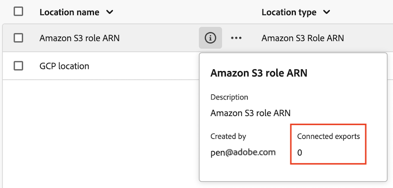
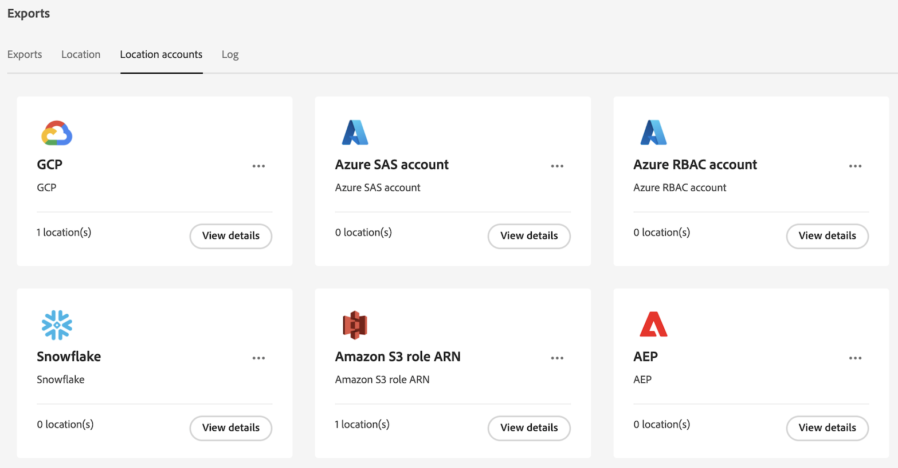

# Administrar ubicaciones y cuentas de exportación en la nube

{{select-package}}

Puede ver, editar y eliminar ubicaciones de exportación de la nube.

Para obtener información sobre cómo crear una nueva ubicación, consulte [Configuración de ubicaciones de exportación de nube](/help/components/exports/cloud-export-locations.md).

## Filtrar y buscar ubicaciones

Para encontrar la información que necesita, puede filtrar la lista de ubicaciones o buscar una ubicación.

### Filtrado de la lista de ubicaciones

1. En Customer Journey Analytics, seleccione [!UICONTROL **Componentes**] > [!UICONTROL **Exportaciones**].

1. Seleccione el [!UICONTROL **Ubicación**] pestaña.

1. Seleccione el **Filtrar** icono.

   <!-- add screenshot -->

   Puede filtrar por los siguientes criterios:

   | Filtro | Descripción |
   |---------|----------|
   | [!UICONTROL **Tipo de ubicación**]<!--should this be changed to Account type?--> | El tipo de cuenta con el que está asociada la ubicación. Pueden estar disponibles los siguientes tipos de cuenta: <ul><li>[!UICONTROL **Amazon S3 Role ARN**]</li><li>[!UICONTROL **Google Cloud Platform**]</li><li>[!UICONTROL **Azure SAS**]</li><li>[!UICONTROL **Azure RBAC**]</li><li>[!UICONTROL **Snowflake**]</li><li>[!UICONTROL **Adobe Experience Manager**]</li></ul> |
   | [!UICONTROL **Cuenta**] | El nombre de la cuenta a la que está asociada la ubicación. |
   | [!UICONTROL **Creado por**] | La dirección de correo electrónico del usuario que creó la ubicación. |

   {style="table-layout:auto"}

### Buscar ubicaciones

1. En Customer Journey Analytics, seleccione [!UICONTROL **Componentes**] > [!UICONTROL **Exportaciones**].

1. Seleccione el [!UICONTROL **Ubicación**] pestaña.

1. En la ficha de búsqueda, empiece a escribir la información asociada con la ubicación que está buscando. Puede buscar datos de cualquier columna disponible en la tabla.

## Editar ubicaciones

1. En Customer Journey Analytics, seleccione [!UICONTROL **Componentes**] > [!UICONTROL **Exportaciones**].

1. Seleccione el [!UICONTROL **Ubicación**] y, a continuación, seleccione la ubicación que desee editar.

   <!-- add screenshot? -->

1. Seleccione [!UICONTROL **Editar**].

1. Realice los cambios que desee y seleccione [!UICONTROL **Guardar**].

## Eliminar ubicaciones

Si elimina una ubicación, también se eliminarán todas las exportaciones que utilicen la ubicación.

Antes de eliminar una ubicación, compruebe si alguna exportación la está utilizando seleccionando el icono de información junto al nombre de la ubicación.

Para eliminar una ubicación:

1. En Customer Journey Analytics, seleccione [!UICONTROL **Componentes**] > [!UICONTROL **Exportaciones**].

1. Seleccione el [!UICONTROL **Ubicación**] y, a continuación, seleccione una o varias ubicaciones que desee eliminar.

   <!-- add screenshot? -->

1. Seleccionar [!UICONTROL **Eliminar**], luego seleccione [!UICONTROL **Eliminar**] de nuevo en el cuadro de diálogo de confirmación.

## Editar cuentas

1. En Customer Journey Analytics, seleccione [!UICONTROL **Componentes**] > [!UICONTROL **Exportaciones**].

1. Seleccione el [!UICONTROL **Cuentas de ubicación**] pestaña.

   

1. Seleccionar [!UICONTROL **Ver detalles**] en la cuenta que desee editar.

1. Realice los cambios que desee y seleccione [!UICONTROL **Guardar**].

## Eliminar cuentas

1. En Customer Journey Analytics, seleccione [!UICONTROL **Componentes**] > [!UICONTROL **Exportaciones**].

1. Seleccione el [!UICONTROL **Cuentas de ubicación**] pestaña.

   

1. Seleccione el icono de 3 puntos en la cuenta que desee editar y, a continuación, seleccione [!UICONTROL **Eliminar cuenta**].

1. Seleccionar [!UICONTROL **Eliminar**] de nuevo en el cuadro de diálogo de confirmación.
