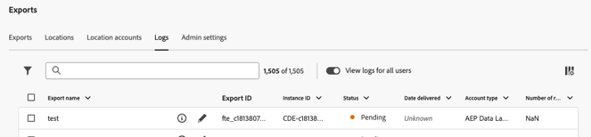
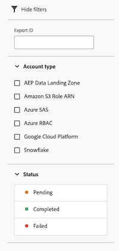

# Administración de registros de exportación

Los registros de exportación proporcionan detalles sobre cada exportación y se generan cada vez que los datos de Analysis Workspace se exportan a la nube. (Para obtener información sobre cómo se pueden exportar datos a la nube, consulte [Exportar informes de Customer Journey Analytics a la nube](/help/analysis-workspace/export/export-cloud.md)).

En el caso de las exportaciones programadas, los registros reflejan la configuración de exportación tal y como estaba cuando se envió el registro. No se pueden eliminar los registros.

## Ver registros de exportación

1. En Customer Journey Analytics, seleccione [!UICONTROL **Componentes**] > [!UICONTROL **Exportaciones**].

1. Seleccione la ficha [!UICONTROL **Registros**].

   

   Los detalles de cada registro se muestran en las columnas disponibles.

1. Realice una de las siguientes acciones:

   * [Personalizar las columnas](#configure-columns) que se muestran.

   * Seleccione el **icono de información**  junto al nombre del registro para ver la exportación asociada con el registro.

   * Seleccione el **icono Editar exportación**  junto al nombre del registro para editar la exportación asociada con el registro.

     Para obtener más información sobre cómo editar una exportación, consulte [Exportar informes de Customer Journey Analytics a la nube](/help/analysis-workspace/export/export-cloud.md).

## Filtrado y búsqueda de registros

Para encontrar la información que necesita, puede filtrar la lista de registros o buscar un registro.

### Filtrado de la lista de registros

1. En Customer Journey Analytics, seleccione [!UICONTROL **Componentes**] > [!UICONTROL **Exportaciones**].

1. Seleccione la ficha [!UICONTROL **Registros**].

1. Seleccione el icono **Filter**.

   

   Puede filtrar por los siguientes criterios:

   | Filtrar | Descripción |
   |---------|----------|
   | [!UICONTROL **ID de exportación**] | Especifique el ID de exportación del registro de exportación que desea ver. |
   | [!UICONTROL **Tipo de cuenta**] | El tipo de cuenta con el que está asociado el registro. Están disponibles los siguientes tipos de cuenta: <ul><li>[!UICONTROL **Zona de aterrizaje de datos de AEP**]</li><li>[!UICONTROL **ARN de la función Amazon S3**]</li><li>[!UICONTROL **Azure SAS**]</li><li>[!UICONTROL **Azure RBAC**]</li><li>[!UICONTROL **Google Cloud Platform**]</li><li>[!UICONTROL **Snowflake**]</li></ul>. |
   | [!UICONTROL **Estado**] | El estado de la exportación. Los siguientes estados están disponibles: <ul><li>[!UICONTROL **Pendiente**]: se ha iniciado una instancia específica de una exportación, pero aún no se ha completado.
Si se vuelve a ejecutar una exportación con el estado Pendiente, se retrasará el proceso de exportación.
</li><li>[!UICONTROL **Completado**]: una instancia específica de una exportación ha finalizado el procesamiento y está disponible en la cuenta de exportación.</li><li>[!UICONTROL **Fallido**]
Varias situaciones pueden provocar un error en la exportación. Pase el ratón sobre el estado Error para ver los detalles del error.
Para obtener más información acerca de los posibles motivos de un error, vea [Solucionar problemas de exportaciones con errores](/help/components/exports/troubleshoot-exports.md).
 |

   {style="table-layout:auto"}

### Buscar registros

1. En Customer Journey Analytics, seleccione [!UICONTROL **Componentes**] > [!UICONTROL **Exportaciones**].

1. Seleccione la ficha [!UICONTROL **Registros**].

1. En el campo de búsqueda, empiece a escribir cualquier información asociada con el registro que está buscando. Puede buscar datos de cualquier columna disponible en la tabla.

<!-- removed for MVP: Retry an export You can re-run the export associated with the selected log, using the data as it was on the day the log was originally exported. This is useful when selecting a log that show a failed export or when selecting a log that was accidentally deleted. 

Retrying an export that has a status of Pending will delay the export process.

This option is not available when selecting multiple logs. -->

<!-- 1. In Customer Journey Analytics, select [!UICONTROL **Components**] > [!UICONTROL **Exports**].

1. Select the [!UICONTROL **Logs**] tab, then select a log.

1. Select [!UICONTROL **Retry**]. -->

## Edición de una exportación

Puede editar la exportación asociada a un registro específico.

Esta opción no está disponible cuando se seleccionan varios registros.

1. En Customer Journey Analytics, seleccione [!UICONTROL **Componentes**] > [!UICONTROL **Exportaciones**].

1. Seleccione la ficha [!UICONTROL **Registros**].

1. Busque el registro asociado a la exportación que desea editar.

1. Seleccione el icono **Editar exportación**  junto al nombre del registro.

   O bien

   Seleccione la casilla que hay junto al registro y, a continuación, seleccione [!UICONTROL **Editar exportación**].

## Configuración de columnas

Puede agregar o quitar columnas en la ficha [!UICONTROL Registros] para configurar qué información se muestra.

Seleccione un encabezado de columna para ordenar los registros por esa columna. De forma predeterminada, los registros se ordenan por la fecha y la hora de inicio de la exportación.

Para configurar columnas en la ficha [!UICONTROL Registros]:

1. En Customer Journey Analytics, seleccione [!UICONTROL **Componentes**] > [!UICONTROL **Exportaciones**].

1. Seleccione la ficha [!UICONTROL **Registros**].

1. Seleccione el icono **Personalizar tabla**  en la parte superior derecha de la página [!UICONTROL Registros].

   Las columnas disponibles son las siguientes:

   | Columna disponible | Descripción |
   |---------|----------|
   | Nombre de exportación | Nombre de la exportación. Los usuarios asignan un nombre a las exportaciones cuando las crean, tal como se describe en [Exportar informes de Customer Journey Analytics a la nube](/help/analysis-workspace/export/export-cloud.md). |
   | ID de exportación | El ID asignado automáticamente a la exportación cuando se crea. <!-- True? --> |
   | ID de instancia | El ID de la instancia de Customer Journey Analytics. <!-- True? --> |
   | Nombre de la vista de datos | Nombre de la vista de datos asociada con la exportación. Los usuarios pueden seleccionar la vista de datos cuando creen la exportación, tal como se describe en [Exportar informes de Customer Journey Analytics a la nube](/help/analysis-workspace/export/export-cloud.md). |
   | Número de archivos | El número de archivos incluidos en la exportación. |
   | Tamaño | El tamaño de la exportación.
El tamaño del archivo se calcula con una base de 1024, que a veces se representa como KIB y MIB. Si el proveedor de la nube calcula el tamaño con una base de 1000, es posible que el tamaño que se muestra en el proveedor sea ligeramente diferente del que se muestra aquí.
 |
   | Ubicación | Ubicación de la cuenta donde se exportaron los datos. |
   | Cuenta | Cuenta en la que se exportaron los datos. |
   | Estado | El estado de la exportación. Los estados disponibles son [!UICONTROL Pendientes], [!UICONTROL Entregados] y [!UICONTROL Fallidos]. |
   | Fecha de entrega | La fecha en la que se realizó la exportación. |
   | Tipo de cuenta | El tipo de cuenta de nube donde se exportaron los datos. Los tipos de cuenta disponibles son [!UICONTROL Amazon S3 Role ARN], [!UICONTROL Google Cloud Platform], [!UICONTROL Azure SAS], [!UICONTROL Azure RBAC], [!UICONTROL Snowflake] y [!UICONTROL Adobe Experience Platform]. |
   | Número de filas | Número de filas incluidas en la tabla exportada. |

   {style="table-layout:auto"}

1. Asegúrese de que todas las columnas que desee mostrar estén seleccionadas. Las columnas seleccionadas aparecen en la página [!UICONTROL Registros] y muestran la información relevante.

## Ver registros de auditoría

Las exportaciones de tabla completa también se rastrean en los [registros de auditoría de Customer Journey Analytics](/help/privacy/audit-log.md). <!-- Need to see what the Component Type for full-table export will be and add it here. Also, under "Event type captured by audit logs" there would be a new event type called "Full-table export". 4 actions would be "Create, Delete, Edit, Export" and "API_Request"? Also information about the locations. Probably have a different component for the location credentials.-->
