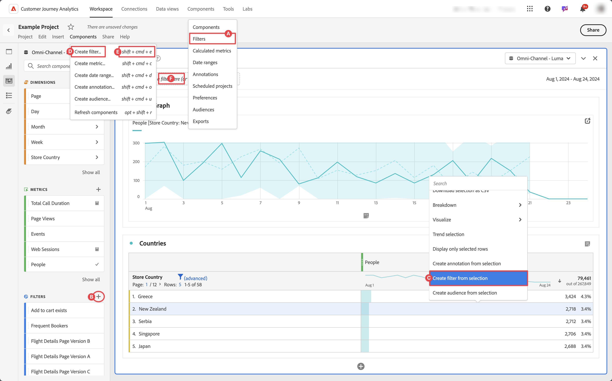

# Crear filtros

Puede crear diferentes tipos de filtros en Customer Journey Analytics.  El tipo que seleccione dependerá de la complejidad de los filtros y de si solo deben aplicarse al proyecto de Workspace actual o a todos los proyectos. Puede crear filtros directamente en la interfaz principal de Customer Journey Analytics o cuando trabaje en un proyecto de Workspace.

De forma predeterminada, solo los administradores pueden crear filtros. Los usuarios tienen derechos para ver filtros, de forma similar a como ven otros componentes (como anotaciones, métricas calculadas, etc.).

Sin embargo, los administradores pueden dar permiso a **[!UICONTROL Creación de filtros]** para **[!UICONTROL Herramientas de creación de informes]** en **[!UICONTROL Editar permisos para el acceso a Workspace de CJA]** a los usuarios a través del [Admin Console](/help/technotes/access-control.md#user-level-access).

Puede crear un filtro de las siguientes maneras:

* ?? En la interfaz principal, seleccione **[!UICONTROL Componentes]** y seleccione **[!UICONTROL Filtros]**. Seleccione  [!UICONTROL **[!UICONTROL Add]**] del administrador de [[!UICONTROL Filtros]](/help/components/filters/manage-filters.md).
* ?? En un proyecto de Workspace, en el panel izquierdo Componentes, seleccione  en  **Filtros**.
* ?? En un proyecto de Workspace, en el menú contextual de una visualización, seleccione **[!UICONTROL Crear filtro a partir de la selección]**.
* ?? En un proyecto de Workspace, seleccione **[!UICONTROL Componentes]** en el menú y seleccione **[!UICONTROL Crear filtro]**.
* ?? En un proyecto de Workspace, use el acceso directo **[!UICONTROL mayús+cmd+e]** (macOS) o **[!UICONTROL mayús+ctrl+e]** (Windows).
* ?? Seleccione  en ***Colocar un filtro aquí (o en cualquier otro componente)*** zona de colocación. Esta acción crea un filtro solo de proyecto.

Para definir el nuevo filtro, usa el [Generador de filtros](/help/components/filters/filter-builder.md).

Cuando se encuentra en un proyecto de Workspace, también puede crear un filtro rápidamente mediante [Filtro rápido](/help/components/filters/quick-filters.md).
