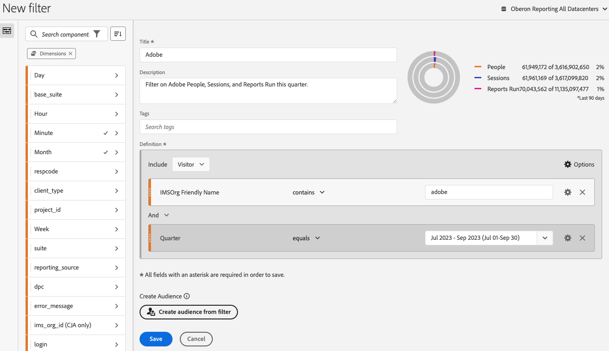
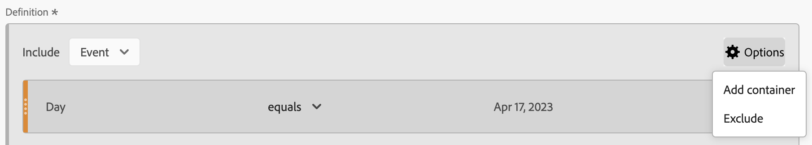

# Generador de filtros

La variable [!UICONTROL Generador de filtros] permite crear filtros simples o complejos que identifican atributos y acciones de visitantes en visitas y visitas individuales de páginas. Proporciona un lienzo al que arrastrar y en el que soltar dimensiones de métricas, eventos u otros filtros para filtrar a los visitantes según la lógica de jerarquía, las reglas y los operadores.

Para obtener información sobre cómo crear filtros rápidos que se apliquen únicamente al proyecto en el que se han creado, consulte [Filtros rápidos](/help/components/filters/quick-filters.md).

## Acceso al Generador de filtros

Puede acceder al Generador de filtros de cualquiera de estas formas:

* **Navegación superior de Analytics**: Haga clic en **[!UICONTROL Analytics]** > **[!UICONTROL Componentes]** > **[!UICONTROL Filtros]**.
* **[!UICONTROL Analysis Workspace]**: Con un proyecto abierto en Analysis Workspace, seleccione **[!UICONTROL + Componentes]** > **[!UICONTROL Crear filtro]**.
* **[!UICONTROL Informes y análisis]**: Haga clic en **[!UICONTROL Analytics]** > **[!UICONTROL Informes]**, abra un informe existente y haga clic en el botón **Filtro** en el panel de navegación izquierdo y, a continuación, haga clic en **[!UICONTROL Agregar]**.
* **[!UICONTROL Report Builder]**: [Añadir o editar filtros en el Report Builder](https://experienceleague.adobe.com/docs/analytics/analyze/report-builder/data-requests/segmentation.html?lang=es).

## Información general sobre los criterios del generador {#section_F61C4268A5974C788629399ADE1E6E7C}

Puede agregar definiciones de reglas y contenedores para definir los filtros. (Para obtener información sobre el acceso al Generador de filtros, consulte [Acceso al Generador de filtros](#access-the-filter-builder).)

1. **[!UICONTROL Título]**: Asigne un nombre al filtro.
1. **[!UICONTROL Descripción]**: Proporcione una descripción para el filtro.
1. **[!UICONTROL Etiquetas]**: [Etiquetar el filtro](/help/components/filters/manage-filters.md) la creación se realiza seleccionando una lista de etiquetas existentes o creando una etiqueta nueva.
1. **[!UICONTROL Definiciones]**: Aquí es donde [crear y configurar filtros](/help/components/filters/filters-overview.md), agregue reglas y anide y secuencie contenedores.
1. **[!UICONTROL Mostrar]**: (Selector de contenedor superior). Permite seleccionar el nivel superior [container](/help/components/filters/filters-overview.md) ( [!UICONTROL Persona], [!UICONTROL Sesión], [!UICONTROL Evento]). El contenedor de nivel superior predeterminado es el contenedor de evento.
1. Icono de **[!UICONTROL opciones]** (engranaje)

   * **[!UICONTROL + Agregar contenedor]**: Le permite agregar un contenedor nuevo (debajo del contenedor de nivel superior) a la definición del filtro.
   * **[!UICONTROL Excluir]**: Permite definir el filtro excluyendo una o más dimensiones, filtros o métricas.

1. **[!UICONTROL Dimensiones]**: Las dimensiones se arrastran y sueltan desde la lista Dimensiones (barra lateral naranja).
1. **[!UICONTROL Operador]**: Puede comparar y restringir valores utilizando una selección de operadores.
1. **[!UICONTROL Valor]**: Valor introducido o seleccionado para la dimensión, filtro o métrica.
1. **[!UICONTROL Modelos de atribución]**: Disponible solo para dimensiones, estos modelos determinan qué valores de una dimensión se van a filtrar. Los modelos de Dimension son especialmente útiles en los filtros secuenciales.

   * **[!UICONTROL Repetido]** (por defecto): Incluye instancias y valores persistentes para la dimensión.
   * **[!UICONTROL Instancia]**: Incluye instancias para la dimensión.
   * **[!UICONTROL Instancia no repetida]**: Incluye instancias únicas (no repetitivas) para la dimensión. Este es el modelo aplicado en Flujo cuando se excluyen instancias repetidas.

   

   **Ejemplo: Filtro de eventos donde eVar1 = A**

   | Ejemplo | A | A | A (persistió) | B | A | C |
   |---|---|---|---|---|---|---|
   | Repetido | X | X | X | - | X | - |
   | Instancia | X | X | - | - | X | - |
   | Instancia no repetida | X | - | - | - | X | - |
1. **[!UICONTROL And/Or/Then]**: Asigna los operadores [!UICONTROL AND/OR/THEN] entre contenedores o reglas. El operador THEN le permite [definir filtros secuenciales](/help/components/filters/filters-overview.md).
1. **[!UICONTROL Métrica]**: Métrica arrastrada y soltada a partir de la lista Métricas.
1. Operador de **[!UICONTROL comparación]**: Puede comparar y restringir valores utilizando una selección de operadores.
1. **[!UICONTROL Valor]**: Valor introducido o seleccionado para la dimensión, filtro o métrica.
1. **[!UICONTROL X]**: (Eliminar) Permite eliminar esta parte de la definición del filtro.
1. **[!UICONTROL Publicación de Experience Cloud]**: Al publicar un filtro de Adobe Analytics en el Experience Cloud, puede utilizarlo para la actividad de marketing en [!DNL Audience Manager] y en otros canales de activación. [Más información...](https://experienceleague.adobe.com/docs/analytics/components/segmentation/segmentation-workflow/seg-publish.html?lang=es)
1. **[!UICONTROL Biblioteca de audiencias]**: Los servicios de audiencia de Adobe administran la traducción de datos del visitante en filtros de audiencia. De este modo, la creación y gestión de audiencias es similar a la creación y el uso de filtros, con la capacidad añadida de compartir el filtro de audiencia con el Experience Cloud. [Más información...](https://experienceleague.adobe.com/docs/core-services/interface/audiences/audience-library.html?lang=es)
1. **[!UICONTROL Buscar]**: Permite buscar la lista de dimensiones, filtros o métricas.
1. **[!UICONTROL Dimensiones]**: (Lista) Haga clic en el encabezado para ampliarlo.
1. **[!UICONTROL Métricas]**: Haga clic en el encabezado para ampliarlo.
1. **[!UICONTROL Filtros]**: Haga clic en el encabezado para ampliarlo.
1. **[!UICONTROL Selector de grupos de informes]**: Permite seleccionar el grupo de informes en el que se guardará este filtro. Puede seguir utilizando el filtro en todos los grupos de informes.
1. **[!UICONTROL Vista previa del filtro]**: Permite previsualizar las métricas clave para ver si tiene un filtro válido y su amplitud. Representa el desglose del conjunto de datos que verá si aplica este filtro. Muestra tres círculos concéntricos y una lista para mostrar el número y el porcentaje de coincidencias de [!UICONTROL Evento], [!UICONTROL Persona]y [!UICONTROL Sesión] para un filtro ejecutado con un conjunto de datos. Este gráfico se actualiza inmediatamente después de crear o realizar cambios en la definición del filtro.
1. **[!UICONTROL Compatibilidad del producto]**: Proporciona una lista de los productos de Adobe Analytics (Analysis Workspace, [!UICONTROL Informes y análisis], Data Warehouse) con la que es compatible el filtro que ha creado. La mayoría de los filtros son compatibles con todos los productos. Sin embargo, no todos los operadores y dimensiones son compatibles con todos los productos de Analytics, en especial [Data Warehouse](https://experienceleague.adobe.com/docs/analytics/components/segmentation/segment-reference/seg-compatibility.html). Este gráfico se actualiza inmediatamente después de realizar cambios en la definición del filtro.
1. **[!UICONTROL Guardar]** o **[!UICONTROL Cancelar]**: Guarda o cancela el filtro. Después de hacer clic en **[!UICONTROL Guardar]**, se le redirigirá al Administrador de filtros, donde podrá administrar el filtro.

Los filtros con intervalos de fechas incorporados siguen operando de forma diferente en Analysis Workspace que en [!UICONTROL Informes y análisis]: En Workspace, un filtro con un intervalo de fechas integrado anula el intervalo de fechas del panel. Por el contrario, [!UICONTROL Informes y análisis] proporciona la intersección del intervalo de fechas del informe y el intervalo de fechas integrado del filtro.

## Generar un filtro {#build-filters}

1. Basta con arrastrar un Dimension, un filtro o un evento de métrica desde el panel izquierdo hasta el panel izquierdo [!UICONTROL Definiciones] campo .

   

1. Establezca el [operador](https://experienceleague.adobe.com/docs/analytics/components/segmentation/segment-reference/seg-operators.html?lang=es) en el menú desplegable.
1. Introduzca o seleccione un valor para el elemento seleccionado.
1. Agregue contenedores adicionales si es necesario, utilizando las reglas **[!UICONTROL AND]**, **[!UICONTROL OR]** o **[!UICONTROL THEN]**.
1. Después de colocar los contenedores y configurar las reglas, consulte los resultados del filtro en la tabla de validación en la parte superior derecha. El validador indica el porcentaje y el número absoluto de vistas de página, visitas y visitantes únicos que coinciden con el filtro que ha creado.
1. En **[!UICONTROL Etiquetas]**, [etiqueta](/help/components/filters/manage-filters.md) el contenedor seleccionando una etiqueta existente o creando una nueva.
1. Haga clic en **[!UICONTROL Guardar]** para guardar el filtro.

   Se le redirige al [Administrador de filtros](/help/components/filters/manage-filters.md), donde puede etiquetar, compartir y administrar el filtro de varias formas.

## Añadir contenedores {#section_1C38F15703B44474B0718CEF06639EFD}

Puede [generar un marco de contenedores](/help/components/filters/filters-overview.md) y luego colocar reglas lógicas y operadores entre medias.

1. Haga clic en **[!UICONTROL Opciones > Agregar contenedor]**.

   Un nuevo [!UICONTROL **Evento**] El contenedor se abre sin [!UICONTROL **Evento**] (Vista de página) identificadas.

   

1. Cambie el tipo de contenedor según sea necesario.
1. Arrastre un Dimension, un filtro o un evento desde el panel izquierdo hasta el contenedor.
1. Siga agregando nuevos contenedores desde el botón **[!UICONTROL Opciones]** > **[!UICONTROL Agregar contenedor]** del nivel superior situado en la parte superior de la definición, o agregue contenedores desde dentro de un contenedor para anidar la lógica.

   **OR**

   Seleccione una o más reglas y luego haga clic en **[!UICONTROL Opciones]** > **[!UICONTROL Agregar contenedor de selección]**. Esto convierte su selección en un contenedor separado.

## Usar intervalos de fechas {#concept_252A83D43B6F4A4EBAB55F08AB2A1ACE}

Puede crear filtros que contengan intervalos de fechas móviles para responder a preguntas sobre campañas o eventos en curso.

Por ejemplo, puede crear fácilmente un filtro que incluya a &quot;todas las personas que hayan realizado una compra en los últimos 60 días&quot;.

Puede crear un contenedor de sesión y, dentro de él, agregar la variable [!UICONTROL Últimos 60 días] intervalo de tiempo y la métrica [!UICONTROL Pedidos es bueno o igual a 1], con un operador AND.

Este es un vídeo sobre el uso de intervalos de fechas móviles en filtros:

>[!VIDEO](https://video.tv.adobe.com/v/25403/?quality=12)

## Apilado de filtros {#task_58140F17FFD64FF1BC30DC7B0A1B0E6D}

El apilamiento de filtros funciona combinando los criterios de cada filtro utilizando un operador &quot;y&quot; y, a continuación, aplicando los criterios combinados. Esto se puede hacer directamente en un proyecto de Workspace o en el Generador de filtros.

Por ejemplo, apilar un filtro &quot;usuarios de teléfono móvil&quot; y un filtro &quot;geografía de EE. UU.&quot; devolverá datos solamente para usuarios de teléfono móvil en EE. UU.

Piense en estos filtros como bloques de construcción o módulos que puede incluir en una biblioteca de filtros, para que los usuarios los utilicen como mejor les convenga. De esta manera, puede reducir drásticamente la cantidad de filtros necesarios. Por ejemplo, supongamos que tiene 40 filtros:

* 20 para usuarios de teléfonos móviles en diferentes países (EEUU_móvil, Alemania_móvil, Francia_móvil, Brasil_móvil, etc.).
* 20 para usuarios de tabletas en diferentes países (EEUU_tableta, Alemania_tableta, Francia_tableta, Brasil_tableta, etc.).

Al utilizar el apilamiento de filtros, puede reducir el recuento de filtros a 22 y apilarlos según sea necesario. Debe crear estos filtros:

* un filtro para usuarios móviles
* un filtro para usuarios de tabletas
* 20 filtros para las diferentes regiones geográficas

>[!NOTE]
>
>Al apilar dos filtros, se unen de forma predeterminada con una instrucción AND. No es posible cambiarlo a una instrucción OR.

1. Vaya al Generador de filtros.

1. Proporcione un título y una descripción para el filtro.

1. Haga clic en **[!UICONTROL Mostrar filtros]** para que aparezca la lista de filtros en el panel de navegación izquierdo.

1. Arrastre los filtros que desee apilar al lienzo de definición del filtro.

1. Seleccione [!UICONTROL **Guardar**].

## Filtrar plantillas {#concept_5098446CC78D441E93B8E4D1D1EA6558}

Las plantillas de filtro se proporcionan para casos de uso de filtros comunes, como &quot;Visitas por primera vez&quot; o &quot;Visitas desde dispositivos móviles&quot;. Están disponibles en proyectos de Workspace y en el Generador de filtros como componentes básicos para nuevos filtros.

Las plantillas se identifican con el logotipo “A” de Adobe. A continuación puede consultar una muestra de las plantillas:

<table id="table_98B87D807E9344C9BEBF072C65D87B1B"> 
 <thead> 
  <tr> 
   <th colname="col1" class="entry"> Nombre de plantilla </th> 
   <th colname="col2" class="entry"> Definición </th> 
  </tr> 
 </thead>
 <tbody> 
  <tr> 
   <td colname="col1"> Abandonar carro </td> 
   <td colname="col2">Ver datos de visitantes que agregaron elementos al carro pero no realizaron ningún pedido. En la definición del filtro, el contenedor es Visita. La regla para este filtro secuencial es 
 Adiciones al carro no es nulo 
 
Entonces 
 
Pedidos es igual a 0. 
 </td> 
  </tr> 
  <tr> 
   <td colname="col1"> Visitas por primera vez </td> 
   <td colname="col2">Ver datos de visitantes que han visitado el sitio como máximo una [1] vez. En la definición del filtro, el contenedor es Visita. La regla es: 
Número de visitas es igual a 1. 
 </td> 
  </tr> 
  <tr> 
   <td colname="col1"> No compradores </td> 
   <td colname="col2">Ver datos de los visitantes que no participaron en un evento de pedido. En la definición del filtro, el contenedor es Visitante. Este filtro utiliza la lógica Exclude . La regla es: 
El pedido no es nulo. 
 </td> 
  </tr> 
  <tr> 
   <td colname="col1"> Visita de página no única (no rebotes) </td> 
   <td colname="col2">Ver datos de los visitantes que visitaron más de una vez. En la definición del filtro, el contenedor es Visitante. Este filtro utiliza la lógica Exclude . La regla es: 
El acceso único no es nulo. 
 </td> 
  </tr> 
  <tr> 
   <td colname="col1"> Búsqueda de pago </td> 
   <td colname="col2">Ver datos de visitantes procedentes de una búsqueda de pago. En la definición del filtro, el contenedor es Visita. La regla es: 
La búsqueda de pago es igual a 1. 
 </td> 
  </tr> 
  <tr> 
   <td colname="col1"> Compradores </td> 
   <td colname="col2">Ver datos de los visitantes que participaron en un evento de pedido. En la definición del filtro, el contenedor es Visitante. La regla es: 
El pedido no es nulo. 
 </td> 
  </tr> 
  <tr> 
   <td colname="col1"> Visitas de retorno </td> 
   <td colname="col2">Ver datos de los visitantes que han visitado por lo menos una vez. En la definición del filtro, el contenedor es Visita. La regla es: 
Número de visitas es mayor que 1. 
 </td> 
  </tr> 
  <tr> 
   <td colname="col1"> Visitas de página única </td> 
   <td colname="col2"> Ver datos de las visitas en las que se ve el valor de una sola página, aunque se envíen varias vistas de página durante esa visita. Las visitas a una sola página con eventos de vínculo de salida se incluyen en el filtro. En la definición del filtro, el contenedor es Visita. La regla es: 
Visitas de página única es igual a 1. 
 </td> 
  </tr> 
  <tr> 
   <td colname="col1"> Producto visto no se agregó al carro </td> 
   <td colname="col2">Ver datos de los visitantes que vieron productos pero no agregaron nada al carro. En la definición del filtro, el contenedor es Visita. La regla para este filtro secuencial es 
Vistas de producto no es nulo 
 
Entonces 
 
 Adiciones al carro es igual a 0. 
 </td> 
  </tr> 
  <tr> 
   <td colname="col1"> Visitas desde campaña </td> 
   <td colname="col2">Ver datos de visitantes remitidos desde campañas. En la definición del filtro, el contenedor es Visita. La regla es: 
El código de seguimiento no es nulo. 
 </td> 
  </tr> 
  <tr> 
   <td colname="col1"> Visitas desde dispositivos móviles </td> 
   <td colname="col2">Ver datos de visitantes que utilizan dispositivos móviles. En la definición del filtro, el contenedor es Visita. La regla es: 
El dispositivo móvil no es nulo. 
 </td> 
  </tr> 
  <tr> 
   <td colname="col1"> Visitas de búsqueda natural </td> 
   <td colname="col2">Ver datos de visitantes que no proceden de una búsqueda de pago. En la definición del filtro, el contenedor es Visita. La regla es: 
La búsqueda de pago es igual a 0. 
 </td> 
  </tr> 
  <tr> 
   <td colname="col1"> Visitas desde un dispositivo no móvil </td> 
   <td colname="col2">Ver datos de visitantes que no utilizan dispositivos móviles. En la definición del filtro, el contenedor es Visita. Este filtro utiliza la lógica Exclude . La regla es: 
El tipo de dispositivo móvil es igual a teléfono móvil 
 
o 
 
El tipo de dispositivo móvil es igual a tableta. 
 </td> 
  </tr> 
  <tr> 
   <td colname="col1"> Visitas desde teléfonos </td> 
   <td colname="col2">Ver datos de los visitantes que utilizan teléfonos. En la definición del filtro, el contenedor es Visita. La regla es: 
El tipo de dispositivo es igual a teléfono móvil. 
 </td> 
  </tr> 
  <tr> 
   <td colname="col1"> Visitas desde motores de búsqueda </td> 
   <td colname="col2">Ver datos de visitantes remitidos desde motores de búsqueda. En la definición del filtro, el contenedor es Visita. La regla es: 
El tipo de referente es igual a motores de búsqueda. 
 </td> 
  </tr> 
  <tr> 
   <td colname="col1"> Visitas provenientes de sitios sociales </td> 
   <td colname="col2">Ver datos de visitantes remitidos desde sitios sociales. En la definición del filtro, el contenedor es Visita. La regla es: 
El tipo de referente es igual a redes sociales. 
 </td> 
  </tr> 
  <tr> 
   <td colname="col1"> Visitas desde tabletas </td> 
   <td colname="col2">Ver datos de los visitantes que utilizan tabletas. En la definición del filtro, el contenedor es Visita. La regla es: 
El tipo de dispositivo es igual a tableta. 
 </td> 
  </tr> 
  <tr> 
   <td colname="col1"> Visitas con cookie de ID de visitante </td> 
   <td colname="col2">Ver datos de los visitantes del sitio con los que se requiere una cookie persistente. En la definición del filtro, el contenedor es Visita. La regla es: 
La cookie persistente es igual a 1. 
 </td> 
  </tr> 
 </tbody> 
</table>