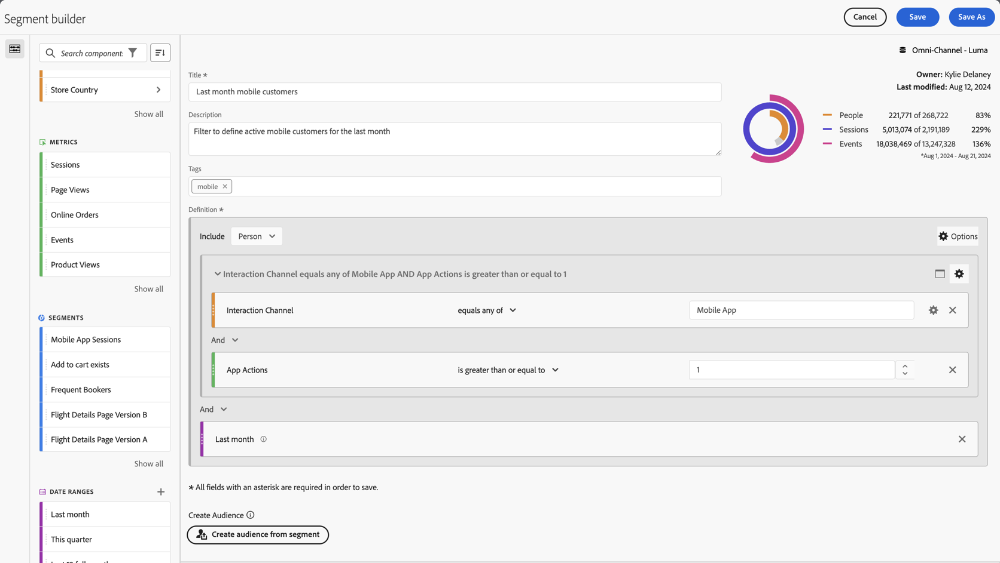
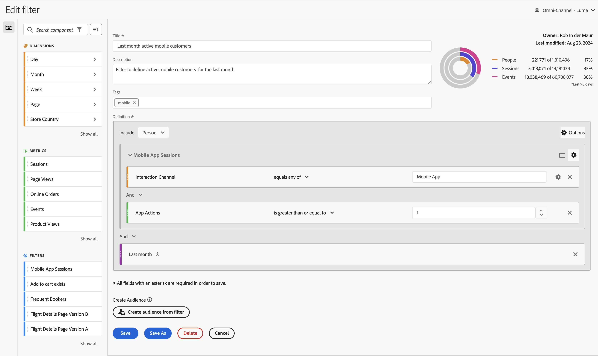
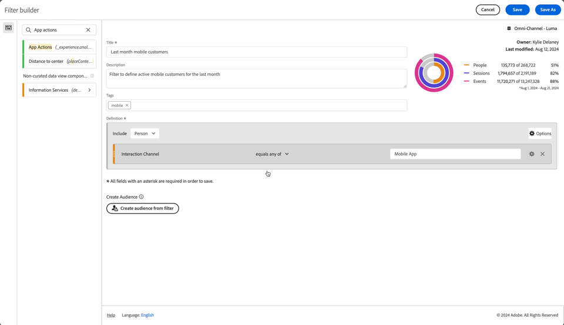
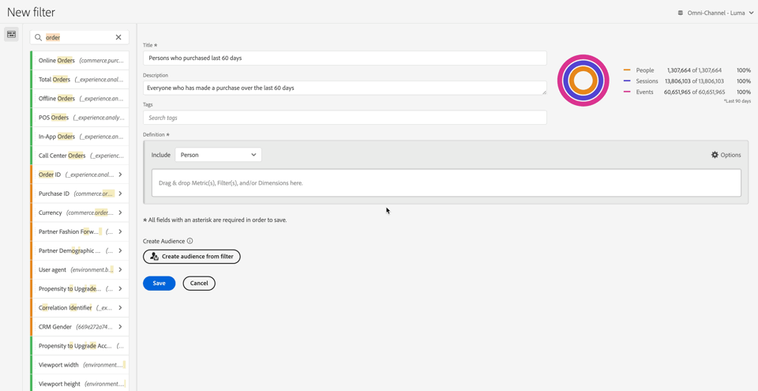
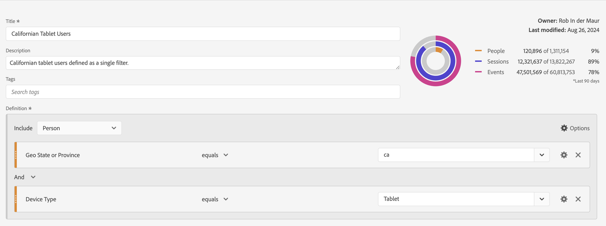
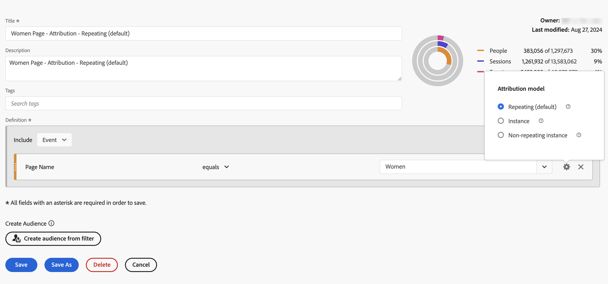
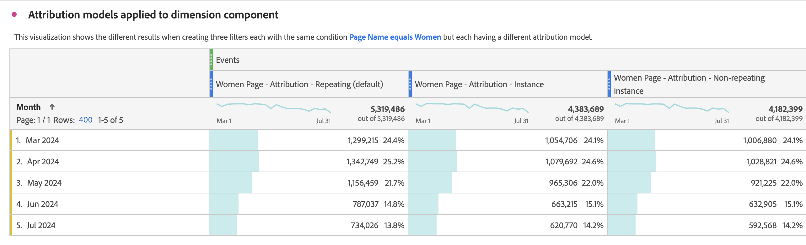

# Generar segmentos {#build-segments}

<!-- markdownlint-disable MD034 -->

>[!CONTEXTUALHELP]
>id="components_filters_createaudience"
>title="Creación de públicos"
>abstract="Las audiencias se pueden crear a partir de un segmento y compartir con Adobe Experience Platform para su activación."

>[!CONTEXTUALHELP]
>id="components_filters_datapreview"
>title="Previsualización de datos"
>abstract="Compara los datos de este segmento con los datos de la vista de datos. El porcentaje de vista previa se basa en el número total de la vista de datos de los **últimos 90 días**.  Si la vista previa no se carga, es posible que la conexión aún esté reponiendo los datos."

El cuadro de diálogo **[!UICONTROL Generador de segmentos]** se usa para crear segmentos nuevos o editar los existentes. El cuadro de diálogo se titula **[!UICONTROL Nuevo segmento]** o **[!UICONTROL Editar segmento]** para los segmentos que cree o administre desde el administrador de [[!UICONTROL segmentos]](/help/components/filters/manage-filters.md).

>[!BEGINTABS]

>[!TAB Generador de segmentos]

>[!TAB Crear o editar segmento]

>[!ENDTABS]

1. Especifica los siguientes detalles ( es obligatorio):

   | Elemento | Descripción |
   | --- | --- |
   | **[!UICONTROL Vista de datos]** | Puede seleccionar la vista de datos para el segmento.  El segmento que defina estará disponible como segmento en la ficha [Configuración](/help/data-views/create-dataview.md#settings-filters) de una vista de datos. |
   | **[!UICONTROL Segmento solo de proyecto]** | Un cuadro de información para explicar que el segmento solo está visible en el proyecto en el que se crea y que el segmento no se añadirá a la lista de componentes. Habilite **[!UICONTROL Ponga este segmento a disposición de todos sus proyectos y agréguelo a su lista de componentes]** para cambiar esa configuración. Este cuadro de información solo está visible cuando crea un [segmento rápido](quick-filters.md) y convierte la información de segmento rápido en un segmento normal mediante **[!UICONTROL Abrir generador]** desde la interfaz de [!UICONTROL Segmento rápido]. |
   | **[!UICONTROL Título]**  | Asigne un nombre al segmento, por ejemplo, `Last month mobile customers`. |
   | **[!UICONTROL Descripción]** | Proporcione una descripción para el segmento, por ejemplo, `Segment to define the mobile customers for the last month`. |
   | **[!UICONTROL Etiquetas]** | Organice el segmento creando o aplicando una o más etiquetas. Empiece a escribir para buscar las etiquetas existentes que puede seleccionar. O presione **[!UICONTROL Entrar]** para agregar una etiqueta nueva. Selecciona  para quitar una etiqueta. |
   | **[!UICONTROL Definición]**  | Defina su segmento con el [generador de definiciones](#definition-builder). |

   {style="table-layout:auto"}

1. Para comprobar si la definición del segmento es correcta, utilice la previsualización de los resultados del segmento actualizada constantemente en la parte superior derecha.
1. Para crear una audiencia a partir del segmento y compartir la audiencia con Experience Platform, seleccione **[!UICONTROL Crear audiencia a partir del segmento]**. Consulte [Crear y publicar audiencias](/help/components/audiences/publish.md) para obtener más información.
1. Seleccionar…
   * **[!UICONTROL Guardar]** para guardar el segmento.
   * **[!UICONTROL Guardar como]** para guardar una copia del segmento.
   * **[!UICONTROL Eliminar]** para eliminar el segmento.
   * **[!UICONTROL Cancelar]** para cancelar cualquier cambio que haya hecho en el segmento o cancelar la creación de un nuevo segmento.

## Generador de definiciones

Utilice el Generador de definiciones para crear la definición del segmento. En esa construcción, se utilizan componentes, contenedores, operadores y lógica.

Se puede configurar el tipo y el ámbito de la definición:

1. Para especificar el tipo de definición, especifique si desea que la generación incluya o excluya una definición. Seleccione  **[!UICONTROL Opciones]** y en el menú desplegable **[!UICONTROL Incluir]** o **[!UICONTROL Excluir]**.
1. Para especificar el ámbito de su definición, seleccione en el menú desplegable **[!UICONTROL Incluir]** o **[!UICONTROL Excluir]** si desea que el ámbito de la definición sea **[!UICONTROL Evento]**, **[!UICONTROL Sesión]**, **[!UICONTROL Persona]**, **[!UICONTROL Cuenta global]** [!BADGE B2B edition]{type=Informative url="https://experienceleague.adobe.com/es/docs/analytics-platform/using/cja-overview/cja-b2b/cja-b2b-edition" newtab=true tooltip="Customer Journey Analytics B2B edition"}, **[!UICONTROL Cuenta]** [!BADGE B2B edition]{type=Informative url="https://experienceleague.adobe.com/es/docs/analytics-platform/using/cja-overview/cja-b2b/cja-b2b-edition" newtab=true tooltip="Customer Journey Analytics B2B edition"}, **[!UICONTROL Oportunidad]** [!BADGE B2B edition]{type=Informative url="https://experienceleague.adobe.com/es/docs/analytics-platform/using/cja-overview/cja-b2b/cja-b2b-edition" newtab=true tooltip="Customer Journey Analytics B2B edition"}, o **[!UICONTROL Grupo comprador]** [!BADGE B2B edition]{type=Informative url="https://experienceleague.adobe.com/es/docs/analytics-platform/using/cja-overview/cja-b2b/cja-b2b-edition" newtab=true tooltip="Customer Journey Analytics B2B edition"}

Siempre puede cambiar esta configuración más adelante.

### Componentes

Una parte vital de la creación de su definición de segmento es el uso de dimensiones, métricas, segmentos existentes e intervalos de fechas. Todos estos componentes están disponibles en el panel de componentes del Generador de segmentos.

{width=100%}

Para añadir un componente:

1. Arrastre y suelte un componente del panel Componentes en **[!UICONTROL Arrastre y suelte las métricas, segmentos o dimensiones aquí]**. Puede utilizar la  en la barra de componentes para buscar componentes específicos.
1. Especifique los detalles del componente. Por ejemplo, seleccione un valor en **[!UICONTROL Seleccionar valor]**. O bien, introduzca un valor El hecho de especificar uno o varios valores y cómo hacerlo dependen del componente y del operador.
1. Si lo desea, modifique el operador predeterminado. Por ejemplo, de **[!UICONTROL es igual a]** a **[!UICONTROL es igual a cualquiera de]**. Consulte [Operadores](operators.md) para obtener información general sobre los operadores disponibles.

Para editar un componente:

* Seleccione un operador nuevo para el componente en el menú desplegable del operador.
* Seleccione o especifique un valor diferente para el operador, si procede.
* Si el tipo de componente es una dimensión, puede definir el modelo de atribución. Consulte [Modelo de atribución](#attribution-models) para obtener más información.

Para eliminar un componente:

* Seleccione  en un componente.

### Contenedores

Puede agrupar varios componentes en uno o varios contenedores y definir la lógica dentro de los contenedores y entre ellos. Los contenedores le permiten crear definiciones complejas para su segmento.

{Width=100%}

* Para añadir un contenedor, seleccione **[!UICONTROL Añadir contenedor]** en  **[!UICONTROL Opciones]**.
* Para añadir un componente existente al contenedor, arrastre y suelte el componente en el contenedor.
* Para añadir otro componente al contenedor, arrastre y suelte un componente del panel del componente en el contenedor. Utilice la línea de inserción azul como guía.
* Para añadir otro componente fuera del contenedor, arrastre y suelte un componente del panel del componente fuera del contenedor, pero dentro del contenedor de definición principal. Utilice la línea de inserción azul como guía.
* Para modificar la lógica entre los componentes de un contenedor, entre contenedores o entre un contenedor y un componente, seleccione los operadores **[!UICONTROL And]**, **[!UICONTROL Or]**, **[!UICONTROL Then]** adecuados. Al seleccionar Entonces, convierte el segmento en un segmento secuencial. Consulte [Crear segmento secuencial](seg-sequential-build.md) para obtener más información.
* Para cambiar el nivel de contenedor, selecciona  **[!UICONTROL Cuenta global]** [!BADGE B2B edition]{type=Informative url="https://experienceleague.adobe.com/es/docs/analytics-platform/using/cja-overview/cja-b2b/cja-b2b-edition" newtab=true tooltip="Customer Journey Analytics B2B edition"},  **[!UICONTROL Cuenta]** [!BADGE B2B edition]{type=Informative url="https://experienceleague.adobe.com/es/docs/analytics-platform/using/cja-overview/cja-b2b/cja-b2b-edition" newtab=true tooltip="Customer Journey Analytics B2B edition"},  **[!UICONTROL Oportunidad]** [!BADGE B2B edition]{type=Informative url="https://experienceleague.adobe.com/es/docs/analytics-platform/using/cja-overview/cja-b2b/cja-b2b-edition" newtab=true tooltip="Customer Journey Analytics B2B edition"},  **[!UICONTROL Grupo de compra]** [!BADGE B2B edition]{type=Informative url="https://experienceleague.adobe.com/es/docs/analytics-platform/using/cja-overview/cja-b2b/cja-b2b-edition" newtab=true tooltip="Customer Journey Analytics B2B edition"},  **[!UICONTROL Evento]**,  **[!UICONTROL Sesión]** o  **[!UICONTROL Persona]**.

Puede usar  en un contenedor para las siguientes acciones:

| Acción del contenedor | Descripción |
|---|---|
| **[!UICONTROL Añadir contenedor]** | Añada un contenedor anidado al contenedor. |
| **[!UICONTROL Exclusión]** | Excluya el resultado del contenedor en la definición del segmento. Una fina barra izquierda roja identifica un contenedor de exclusión. |
| **[!UICONTROL Inclusión]** | Incluya el resultado del contenedor en la definición del segmento. Incluir es la opción. Una fina barra gris a la izquierda identifica un contenedor de inclusión. |
| **[!UICONTROL Contenedor de nombres]** | Cambie el nombre del contenedor desde la descripción predeterminada. Escriba un nombre en el campo de texto. Si no proporciona ninguna entrada, se utiliza la descripción predeterminada. |
| **[!UICONTROL Eliminar contenedor]** | Elimine el contenedor de la definición. |

## Intervalos de fechas

Puede generar segmentos que contengan intervalos de fechas móviles. De este modo, puede responder preguntas acerca de campañas o eventos en curso. Por ejemplo, puede generar un segmento que incluya a *todas las personas que hayan realizado una compra en línea en los últimos 60 días*.

>[!BEGINSHADEBOX]

Vea  [Intervalos de fechas móviles en segmentos](https://video.tv.adobe.com/v/25403/?quality=12&learn=on){target="_blank"} para ver un vídeo de demostración.

>[!ENDSHADEBOX]

## Apilar segmentos {#stack}

Puede generar un segmento utilizando segmentos. Cuando utiliza segmentos en un segmento, puede optimizarlos y reducir la complejidad.

Imagine que desea segmentar la combinación de tipo de dispositivo (2) y estados de Estados Unidos (50). Puede generar 100 segmentos, cada uno para la combinación única de tipo de dispositivo (teléfono móvil frente a tableta) y estado de EE. UU. Para conseguir los usuarios de tabletas en California, utilizaría uno de los 100 segmentos:

O bien, puede definir 52 segmentos: 50 segmentos para los estados de Estados Unidos, uno para el teléfono móvil y otro para la tableta. Y luego apilar los segmentos para obtener los mismos resultados. Para obtener los usuarios de tabletas de California, apilaría dos segmentos:

## Atribución {#attribution}

>[!CONTEXTUALHELP]
>id="components_filters_attribution_repeating"
>title="Repetido"
>abstract="Incluye instancias y valores persistentes para la dimensión."

>[!CONTEXTUALHELP]
>id="components_filters_attribution_instance"
>title="Instancia"
>abstract="Incluye instancias y valores persistentes para la dimensión."

>[!CONTEXTUALHELP]
>id="components_filters_attribution_nonrepeatinginstance"
>title="Instancia no repetida"
>abstract="Incluye instancias únicas (no repetitivas) para la dimensión."

Cuando se utiliza una dimensión en el Generador de segmentos, se tienen las opciones para especificar el modelo de atribución para esa dimensión. El modelo de atribución que seleccione determina si los datos cumplen los requisitos para la condición especificada para el componente de dimensión.

Seleccione  dentro del componente de dimensión y seleccione uno de los modelos de atribución en la ventana emergente:

| Modelos | Descripción |
|---|---|
| **[!UICONTROL Modelo repetitivo (predeterminado)]** | Incluya valores de instancia y persistentes para la dimensión para determinar la calificación. |
| **[!UICONTROL Instancia]** | Incluya solo valores de instancia para la dimensión para determinar la calificación. |
| **[!UICONTROL Instancia no repetida]** | Incluya valores de instancia únicos (no repetitivos) para la dimensión para determinar la calificación. |

### Ejemplo

Como parte de una definición de segmento, ha especificado la siguiente condición: Nombre de página es igual a Mujeres. Similar al ejemplo anterior. Repita esta definición de segmento utilizando los otros dos modelos de atribución. Por lo tanto, tiene tres segmentos, cada uno con su propio modelo de atribución:

* Página Mujeres - Atribución - Repetición (predeterminada)
* Página Mujeres - Atribución - Instancia
* Página Mujeres - Atribución - Instancia no repetida

La tabla siguiente explica, para cada modelo de atribución, qué eventos entrantes se clasifican como  para esa condición.

| Página Mujeres - Atribución -  *modelo de atribución* | Evento 1: Nombre de página igual a Mujeres | Evento 2: Nombre de página igual a Hombres | Evento 3: Nombre de página igual a Mujer | Evento 4: Nombre de página igual a Mujer (persistió) | Evento 5: Nombre de página igual a Cierre de compra | Evento 6: Nombre de página igual a Mujeres | Evento 7: Nombre de página igual a Inicio |
|---|:---:|:---:|:---:|:---:|:---:|:---:|:--:|
| Repetido (predeterminado) |  |  |  |  |  |  |  |
| Instancia |  |  |  |  |  |  |  |
| Instancia no repetida |  |  |  |  |  |  |  |

Un informe de ejemplo sobre los eventos que utilizan los tres segmentos tiene este aspecto:

<!-- markdownlint-enable MD034 -->