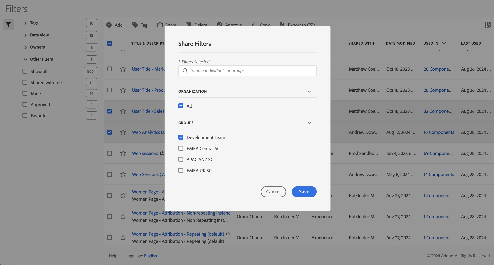

# Compartir segmentos

En [Administrador de segmentos](manage-filters.md), puede compartir segmentos. En función de sus permisos, puede compartir segmentos con toda su organización, con grupos o con usuarios individuales:

* **Administradores**: Los administradores pueden compartir segmentos con toda la organización, con grupos dentro de una organización y con usuarios individuales. Consulte la [Documentación de Admin Console](https://helpx.adobe.com/es/enterprise/using/manage-products.html) para obtener más información.
* **No administradores**: Los no administradores solo pueden compartir los segmentos que han creado y solo con usuarios individuales. |

Para compartir uno o más segmentos:

1. En el [Administrador de segmentos](manage-filters.md), seleccione uno o varios de los segmentos que desee compartir.
1. En la barra de acciones, seleccione  **[!UICONTROL Compartir]**.
1. En el diálogo **[!UICONTROL Compartir segmentos]**:

   

   1. (Opcionalmente) use  para *Buscar personas o grupos* y limitar la lista de grupos o personas con los que desea compartir el segmento.

   1. Seleccione una o más opciones de la sección **[!UICONTROL Organización]** o **[!UICONTROL Grupos]**, o busque y seleccione una o más personas. Las opciones disponibles dependen de la función que tenga.

   1. Seleccione **[!UICONTROL Guardar]** para compartir los segmentos. Seleccione **[!UICONTROL Cancelar]** para cancelar.

## Prácticas recomendadas

A continuación se describen algunas prácticas recomendadas sobre cuándo debe compartir segmentos y con quién debe compartirlos.

* Como administrador, comparta un segmento únicamente con Todos si está seguro de que cualquier persona de su organización se siente cómoda utilizando los segmentos. También puede considerar la posibilidad de favorecer estos segmentos. Consulte [Marcar un segmento como favorito](filters-favorite.md) para obtener más información.

* Como administrador, comparta un segmento con un grupo específico si ese segmento proporciona valor empresarial para los usuarios que forman parte de ese grupo.

* Como administrador o usuario individual, comparta un segmento con una o más personas para validar un segmento. Si los segmentos no resultan útiles, puede eliminarlos.
