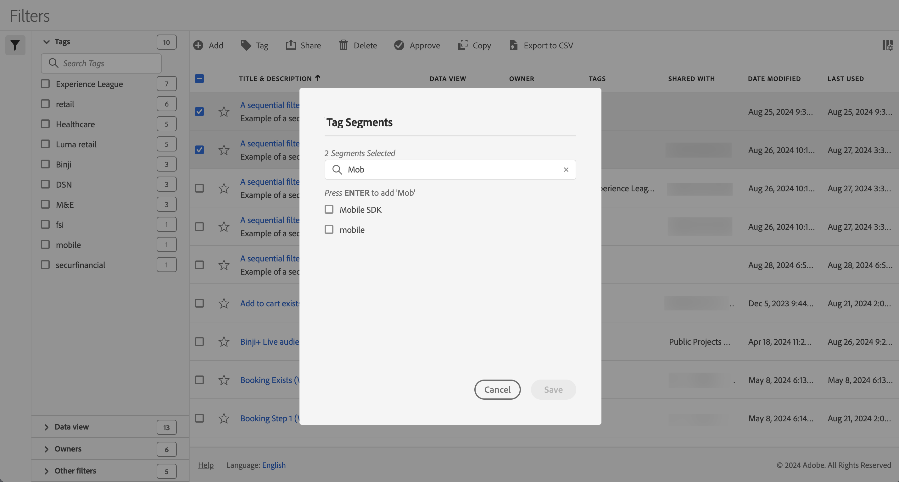

# Etiquetar segmentos

En el [Administrador de segmentos](manage-filters.md), puede usar etiquetas para organizar los segmentos. Los administradores pueden etiquetar todos los segmentos. Los usuarios que no son administradores pueden etiquetar solo los segmentos que crean o que se han compartido con ellos.

Para etiquetar uno o más segmentos:

1. En el [Administrador de segmentos](manage-filters.md), seleccione uno o varios de los segmentos que desee etiquetar.
1. En la barra de acciones, seleccione  **[!UICONTROL Etiqueta]**.
1. En el diálogo **[!UICONTROL Etiquetar segmentos]**:

   

   1. (opcionalmente) use  para buscar y limitar la lista de etiquetas.

   2. Según la lista de etiquetas:

      * seleccione una o varias etiquetas existentes de la lista, o bien
      * escriba una etiqueta nueva y presione **[!UICONTROL ENTRAR]**. Repita el proceso para agregar más de una etiqueta nueva.

1. Seleccione **[!UICONTROL Guardar]** para guardar las etiquetas del segmento. Seleccione **[!UICONTROL Cancelar]** para cancelar.

Una vez guardadas, las etiquetas se enumeran en el campo [!UICONTROL Etiqueta] para los segmentos seleccionados en el [Generador de segmentos](filter-builder.md).

## Sugerencias

A continuación se presentan algunas sugerencias para organizar las etiquetas en función de:

* **Equipo**: Por ejemplo, Marketing social, Marketing móvil.

* **Proyecto**: por ejemplo, análisis de página de entrada.

* **Categoría**:. Por ejemplo, Hombres, Mujeres, Niños.

* **Área geográfica**: Por ejemplo: Estados Unidos, California.

* **Flujo de trabajo**: Por ejemplo: Para aprobar, Revisado

