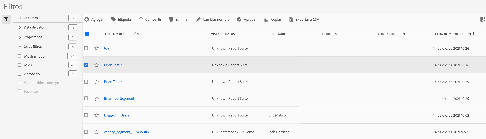

# Administrar filtros

El Administrador de filtros ofrece muchas maneras de conservar los filtros, como compartir, etiquetar, aprobar, copiar, eliminar y marcar como favoritos.

El Administrador de filtros le muestra todos los filtros que posee y que han compartido con usted. Los usuarios con nivel de administrador pueden ver todos los filtros de la organización. Esta introducción presenta la interfaz de usuario y las capacidades del Administrador de filtros.

Para acceder al Administrador de filtros, vaya a **[!UICONTROL Análisis del Recorrido del cliente]** > **[!UICONTROL Componentes]** > **[!UICONTROL Filtros]** en la barra de navegación superior.

## Interfaz de usuario del Administrador de filtros

| # | Función de la interfaz de usuario | Descripción |
|---|---|---|
| 1 | Barra de herramientas del Administrador de filtros | Cuando marque un filtro, aparecerá esta barra de herramientas. Puede realizar la mayoría de las tareas de gestión desde esta barra de herramientas. |
| 2 | Casillas de verificación | Marque un filtro para administrarlo. |
| 4 | Favoritos | Si hace clic en la estrella que aparece junto a un filtro, esta se pondrá de color amarillo y el filtro se marcará como favorito. |
| 5 | Título y descripción | Aparecen en el Generador de filtros. Para editar el título y la descripción, haga clic en el vínculo del título. Se le redirigirá al Generador de filtros. |
| 7 | Propietario | Indica a quién pertenece el filtro. Si no es el administrador, solo podrá ver los filtros que le pertenecen o que compartieron con usted. |
| 8 | Etiquetas (la columna no aparece porque no está marcada en el selector de columnas) | Etiquetas que se aplicaron al filtro, tanto por su parte como por parte de las personas que compartieron el filtro con usted. |
| 9 | Compartido con | Enumera las personas o los grupos (solo administrador) o todos (solo administrador) con los que compartió el filtro. |
| 10 | Fecha de modificación | Muestra la última fecha de modificación del filtro. |
| 11 | Selector de columnas | (Parte superior derecha) Permite seleccionar qué columnas mostrar en el Administrador de filtros. |
| 12 | Icono compartido | Indica que usted compartió este filtro con otra persona o que lo han compartido con usted. |
| 13 | Icono de aprobado | Indica que un administrador ha aprobado este filtro. |
| 14 | Otros filtros | Permite ver los filtros de Etiquetas, Vistas de datos, Propietarios y Otros (Mostrar todo, Míos, Compartidos conmigo, Aprobados y Favoritos). |

## Filtros del plan

El hecho de dedicar algún tiempo a la planificación de filtros aumenta las probabilidades de que sean útiles para su organización y de que sus números se mantengan bajo control.

* Tome en consideración la audiencia: ¿quién lo consumirá? ¿Con quién lo compartirá? ¿Qué grupos de personas utilizarán este filtro y, por lo tanto, cómo debo etiquetarlo? Esto también conlleva la necesidad de describir el filtro correctamente. Como mínimo, la descripción debe responder a las siguientes preguntas:

   * ¿Para qué sirve este filtro?

   * ¿Cuándo debo usar este filtro?

* Determine el ámbito del filtro. ¿Qué [contenedor de filtro](/help/components/filters/filters-overview.md) representa mejor el ámbito? Utilice el contenedor más pequeño posible.

* Decida qué elementos y qué valores incluirá en la definición del filtro.

* Piense en cómo desea que se desarrolle su proceso de aprobación. ¿Se encargará una sola persona de revisar y aprobar los filtros, o bien se tratará de una decisión tomada por un comité?

* Defina sus filtros con miras a una biblioteca de filtros que ofrezca a los usuarios empresariales la posibilidad de apilar y reutilizar filtros o componentes de segmentos de manera modular. ¿Qué &quot;módulos&quot; necesita definir para que dicha biblioteca se haga realidad?

### Filtros de etiquetas

En el Administrador de filtros, el etiquetado de filtros le permite organizarlos. Todos los usuarios pueden crear etiquetas para los filtros y aplicar una o más a un filtro. Sin embargo, solo verá las etiquetas de los filtros que sean suyos o que se hayan compartido con usted.

¿Qué tipo de etiquetas debería crear? A continuación encontrará una serie de sugerencias para crear etiquetas útiles:

* Etiquetas basadas en nombres de equipos, como Marketing social o Marketing móvil.

* Etiquetas de proyectos (etiquetas de análisis), como análisis de Páginas de entrada.

* Etiquetas de categorías: Para hombres o Área geográfica.

* Etiquetas de flujo de trabajo: pendiente de aprobación, conservado para (una unidad empresarial específica).

Para etiquetar un filtro:

1. En el Administrador de filtros, marque la casilla que aparece junto al filtro que desea etiquetar. Aparecerá la barra de herramientas para la administración de filtros.

1. Haga clic en **[!UICONTROL Etiqueta]** y:

   * Seleccione una de las etiquetas existentes, o bien

   * introduzca un nuevo nombre de etiqueta y pulse **[!UICONTROL Enter]**.

1. Haga clic en **[!UICONTROL Tag]** de nuevo para etiquetar el filtro.

La etiqueta debería aparecer en la columna de etiquetas. (Haga clic en el icono del engranaje en la esquina superior derecha para administrar las columnas.)
También puede filtrar las etiquetas accediendo a **[!UICONTROL Filtros > Etiquetas]**.

### Aprobar filtros

En el Administrador de filtros, puede establecer un flujo de trabajo que incluya la aprobación de filtros para varios niveles de aplicación, para departamentos específicos o para grupos, y coherente con las políticas de creación de informes.

Así es como se marca un filtro como aprobado:

1. En el Administrador de filtros, marque la casilla a la izquierda del título del filtro.

1. Haga clic en **[!UICONTROL Aprobar]** en la barra de tareas de administración de filtros.

1. Considere la posibilidad de compartir los filtros aprobados con su organización.

1. Haga clic en **[!UICONTROL Aceptar]**.

   Fíjese en el icono de aprobación que aparece junto al filtro en la lista:

   

1. También puede desaprobar un filtro aprobado haciendo clic en **[!UICONTROL Desaprobar]**.

### Compartir filtros

En función de sus permisos, puede compartir filtros con toda su organización, con grupos o con usuarios individuales.

| Administrador | No administrador |
|---|---|
| Puede compartir filtros con Todos, con Grupos y con Usuarios. Consulte la [Documentación de Admin Console](https://helpx.adobe.com/es/enterprise/using/manage-products-and-profiles.html) para obtener más información. | Puede compartir filtros únicamente con usuarios individuales. |

¿Cuándo debe compartir filtros con toda la compañía en vez de con un grupo de usuarios o personas? A continuación se indica una serie de prácticas recomendadas seguir:

* Como administrador, comparta un filtro con Todos si resulta útil para toda la compañía y si todos se sienten cómodos al utilizarla. En este caso, debe considerar la posibilidad de marcarla como filtro aprobado.

* Como Administrador, comparta un filtro con un Perfil de producto específico si el filtro aporta valor empresarial al equipo. No apruebe oficialmente este tipo de filtros.

* Como Administrador o usuario individual, comparta un filtro con otras personas para examinar y validar un filtro. Si finalmente no resulta útil, descártela. No apruebe oficialmente este tipo de filtros.

Para compartir un filtro:

1. En el Administrador de filtros, marque la casilla que aparece junto al filtro que desea compartir.

1. En la barra de herramientas de administración de filtros, haga clic en **[!UICONTROL Compartir]**.

1. Si es administrador, puede seleccionar Todos o elegir entre Grupos y Usuarios de su organización. Si no es administrador, solo verá usuarios individuales. Utilice el campo Buscar para buscar grupos o usuarios. Haga clic en **[!UICONTROL Compartir]**. El icono Compartido aparece junto al filtro: 

1. Puede filtrar los filtros que se han compartido con usted accediendo a Filtros > Otros filtros > Compartido conmigo.

### Marcar filtros como favoritos

Marcar los filtros como favoritos es otra manera de organizarlos para que su uso sea más sencillo.

1. En el Administrador de filtros, haga clic en la estrella que aparece junto a cualquier filtro que desee marcar como favorito. La estrella se vuelve amarilla cuando la selecciona.

1. También puede filtrar por favoritos con Filtros > Otros filtros > Favoritos.
