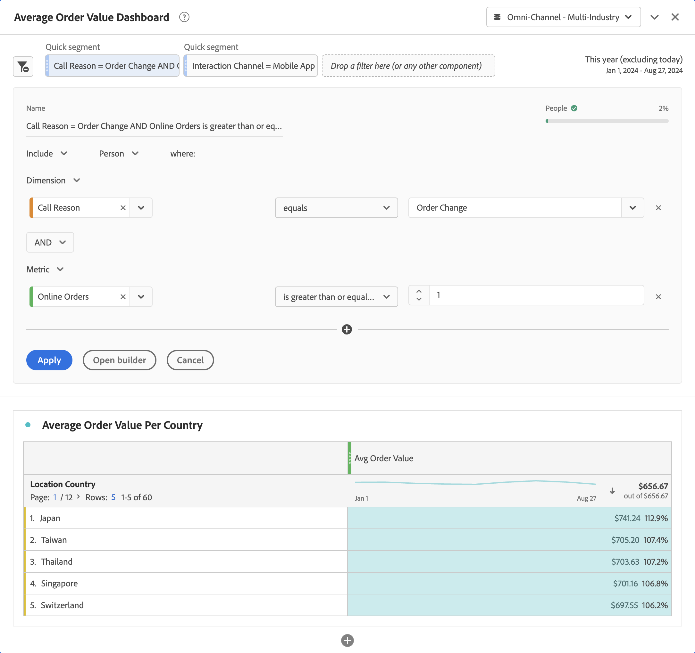

# Filtros rápidos

Los filtros rápidos le permiten explorar datos rápidamente dentro de un proyecto de Workspace, sin necesidad de crear un filtro en [Generador de filtros](/help/components/filters/create-filters.md).

+++ El siguiente vídeo muestra cómo utilizar filtros rápidos.

>[!VIDEO](https://video.tv.adobe.com/v/341466/?quality=12&learn=on)

+++

Si desea utilizar filtros rápidos, tenga en cuenta lo siguiente:

* Los filtros rápidos se crean directamente en un proyecto de Workspace. Como resultado, un filtro rápido se aplica solo al proyecto de Workspace en el que crea el filtro rápido. Los filtros rápidos del proyecto de Workspace no están disponibles en otros proyectos y no se pueden compartir con otros usuarios.
* Solo se pueden especificar tres condiciones como parte de un filtro rápido.
* Los filtros rápidos no admiten contenedores anidados ni condiciones secuenciales.
* Puede editar filtros rápidos dentro de un proyecto compartido de Workspace. Por lo tanto, otros usuarios pueden editar los filtros rápidos de un proyecto de Workspace que haya compartido con estos usuarios.

## Crear

Los filtros rápidos se aplican a los paneles. Puede crear uno o más filtros rápidos para cada panel del proyecto de Workspace. Cualquier usuario de Analysis Workspace puede crear filtros rápidos.

Para crear un filtro rápido:

* Seleccione  en la parte superior del panel.  A continuación, edite directamente el filtro en el [Generador de filtros rápidos](#quick-filter-builder).
* Arrastre un componente desde el panel de componentes hasta la zona de colocación de filtros del encabezado del panel. Una vez colocado, pasa el ratón sobre el filtro y selecciona  para editar el filtro en el [Generador de filtros rápidos](#quick-filter-builder).

Cuando cree un filtro rápido arrastrando y soltando, tenga en cuenta lo siguiente:

* No se admiten todos los tipos de componentes. Las métricas calculadas no son compatibles y solo son compatibles las dimensiones y métricas a partir de las cuales se pueden crear filtros.
* Para los componentes de dimensiones y métricas, el [Generador de filtros rápidos](#quick-filter-builder) crea automáticamente `exists` condiciones. Por ejemplo, si arrastra y suelta `City`, se creará la condición `City exists`.
* Para los valores de dimensión, el [generador de filtros rápidos](#quick-filter-builder) crea automáticamente una condición `equals`. Por ejemplo, si arrastra y suelta `amsterdam` desde la dimensión `City`, se creará la condición `City equals amsterdam`.
* Si arrastra y suelta `unspecified` o `none`, el [generador de filtros rápidos](#quick-filter-builder) crea automáticamente una condición `does not exist`.

Los filtros rápidos que cree aparecerán en la parte superior del panel. Los filtros rápidos tienen una barra izquierda fina de color azul claro. Cuando un filtro rápido se encuentra en modo de edición con el [Generador de filtros rápidos](#quick-filter-builder), el fondo del filtro rápido es de color azul claro.

Los resultados de los filtros rápidos que cree en un panel se aplican (mediante la lógica AND) a todas las visualizaciones que forman parte del panel.

## Administrar

Para administrar un filtro rápido, pasa el ratón sobre el **[!UICONTROL filtro rápido]** específico.

* Seleccione  para abrir el [Generador de filtros rápidos](#quick-filter-builder) y editar el filtro rápido.
* Seleccione  para abrir una ventana emergente. La ventana emergente muestra información sobre el filtro. Puede seleccionar **[!UICONTROL Poner a disposición de todos los proyectos y agregar a su lista de componentes]** Para agregar el filtro a la lista de componentes  **[!UICONTROL Filtros]** en el panel de componentes. Verá un cuadro de diálogo **[!UICONTROL Guardar filtro rápido]**, que le pedirá que especifique un nombre para el filtro. Seleccione **[!UICONTROL Guardar]** para continuar. Tu [!UICONTROL filtro rápido] se convierte en un **[!UICONTROL filtro]**. Ya no puede editar el filtro con el [Generador de filtros rápidos](#quick-filter-builder). En su lugar, debe editar el filtro como filtro normal, usando el [Generador de filtros](filter-builder.md).

## Generador de filtros rápidos

Consulte a continuación un ejemplo del Generador de filtros rápidos. En el ejemplo, se abre el generador para un filtro rápido denominado `Call Reason = Order Change AND Online Orders is greater than or equal 1`. Ambos filtros rápidos de la parte superior se aplican al panel [!UICONTROL Tablero de valor de pedido promedio] y a todas las visualizaciones de, como la tabla de forma libre [!UICONTROL Valor de pedido promedio por país].

El generador de filtros rápidos consta de las siguientes áreas y botones.

### Área de encabezado

El área de encabezado determina el nombre, tipo y ámbito del filtro rápido. También muestra una representación visual de los resultados del filtro rápido.

| Elemento | Descripción |
|---|---|
| **[!UICONTROL Nombre]** | El nombre se deriva automáticamente de la definición del filtro rápido. |
| **[!UICONTROL Personas]**    | Vista previa de los datos resultantes del filtro rápido. Una barra y un porcentaje proporcionan una perspectiva de la cantidad de datos generales que forman parte del resultado del filtro rápido. Una  roja indica que el filtro rápido no devuelve datos. |
| **[!UICONTROL Incluir]** **[!UICONTROL Excluir]** | Seleccione en el menú desplegable  si desea incluir o excluir los resultados del filtro rápido de los datos del panel. |
| **[!UICONTROL Evento]** **[!UICONTROL Sesión]** **[!UICONTROL Persona]** | Seleccione en el menú desplegable  el ámbito del filtro rápido. |

### Área de condición

El área de condición especifica las condiciones (hasta un máximo de tres). Para cada condición, puede especificar lo siguiente:

| Elemento | Descripción |
|---|---|
| **[!UICONTROL Dimension]** **[!UICONTROL Métrica]** **[!UICONTROL Intervalo de fecha]** | Seleccione en el menú desplegable  si desea especificar una condición para una dimensión, métrica o intervalo de fecha. |
| **[!UICONTROL *componente *]** | El campo de componente de la condición. Puede [!UICONTROL *escribir para agregar*] un componente, seleccionar un componente de la lista o arrastrar y soltar un componente desde el panel de componentes. Solo puede soltar componentes similares en el campo de componente de la condición. Por ejemplo, solo puede soltar un componente de dimensión del panel de componentes en una condición de dimensión.  También puede arrastrar y soltar para reemplazar un componente existente. Seleccione  para eliminar el componente del campo de componente. |
| **[!UICONTROL *operador *]** | El operador del componente. Consulte [Operadores](operators.md) para obtener más información. Solo está disponible para dimensiones y métricas. |
| **[!UICONTROL *value *]** | El valor de la condición. Según el operador seleccionado, el valor puede seleccionarse de una lista o introducirse un valor. |
|  | Seleccione esta opción para eliminar una condición del filtro rápido. |

### Botones

| Botón | Descripción |
|---|---|
| **[!UICONTROL Y]** **[!UICONTROL O]** | Solo está disponible cuando define más de una condición. Seleccione en el menú desplegable  entre las condiciones. La selección determina la lógica booleana para el filtro rápido. No se puede mezclar lógica cuando se tienen tres condiciones. La lógica booleana es **[!UICONTROL AND]** o **[!UICONTROL OR]**. |
|  | Agrega otra condición al filtro rápido. Este botón sólo está disponible cuando se han definido una o dos condiciones para el filtro rápido. |
| **[!UICONTROL Aplicar]** | Aplique los cambios al filtro rápido. |
| **[!UICONTROL Abrir creador]** | Se le pedirá confirmación con un **[!UICONTROL ¿Está seguro?Cuadro de diálogo]**. Si seleccionas **[!UICONTROL Aceptar]**, ya no podrás modificar tu filtro en el [Generador de filtros rápidos](#quick-filter-builder). Se ha cambiado el nombre de tu filtro rápido a **[!UICONTROL Filtro]** y ahora tiene una barra izquierda delgada de color azul más oscuro. Se abre el generador de filtros [normal](filter-builder.md) con la opción de **[!UICONTROL Poner este filtro a disposición de todos los proyectos y agregarlo a la lista de componentes]**. <ul><li>Si selecciona esta opción y selecciona **[!UICONTROL Aplicar]**, el filtro se agrega a la lista de componentes  **[!UICONTROL Filtros]** del panel de componentes.</li><li>Si no selecciona esta opción y selecciona **[!UICONTROL Aplicar]**, el filtro sigue siendo un filtro solo de proyecto de Workspace.</li></ul> |
| **[!UICONTROL Cancelar]** | Seleccione para cancelar la creación o edición de un filtro rápido. |

## Filtros rápidos frente a filtros

Los filtros rápidos son exactamente como se llaman. Puede crear y editar filtros rápidos rápidamente en línea y ver los efectos inmediatamente en el panel.

Los filtros tienen las siguientes ventajas en comparación con los filtros rápidos.

* Los filtros se pueden publicar en todos sus proyectos de Workspace
* Los filtros admiten una mayor complejidad mediante el uso de contenedores anidados y jerárquicos, y secuencias (mediante filtros de secuencia).

