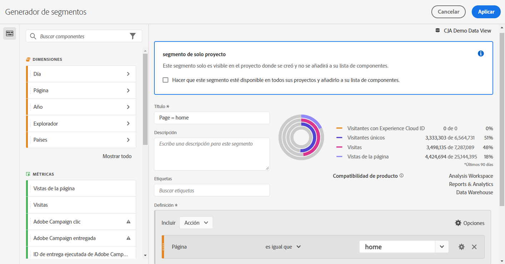
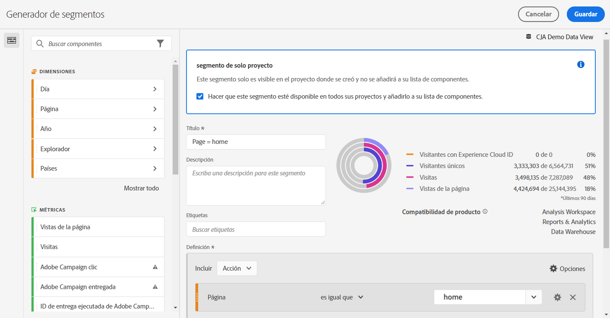

# Filtros rápidos

Puede crear filtros rápidos dentro de un proyecto para evitar la complejidad del [Generador de filtros](/help/components/filters/create-filters.md) completo. Filtros rápidos

* Aplicar como [filtros solo de proyecto](https://experienceleague.adobe.com/docs/analytics-platform/using/cja-components/cja-filters/quick-filters.html#project-only).
* Permitir hasta 3 reglas
* No se admiten contenedores anidados ni reglas secuenciales.

Para ver una comparación de lo que pueden hacer los filtros rápidos frente a los filtros de lista de componentes completa, acceda [aquí](/help/components/filters/filters-overview.md).

Aquí hay un vídeo sobre los filtros rápidos (tenga en cuenta que en su lugar utiliza el término &quot;segmentos rápidos&quot;). Sin embargo, la funcionalidad es la misma.

>[!VIDEO](https://video.tv.adobe.com/v/341466/?quality=12&learn=on)

## Requisitos previos {#prereqs}

Cualquier persona puede crear un filtro rápido. Sin embargo, necesita el permiso de creación de filtros en el [Adobe Admin Console](https://experienceleague.adobe.com/docs/analytics/admin/admin-console/permissions/summary-tables.html#analytics-tools) para poder guardar filtros rápidos o abrirlos en el Generador de filtros.

## Crear filtros rápidos {#create}

En una tabla improvisada, haga clic en el icono filtrar+ del encabezado del panel:

| Configuración | Descripción |
| --- | --- |
| [!UICONTROL Nombre] | El nombre predeterminado de un filtro es una combinación de los nombres de reglas del filtro. Puede cambiar el nombre del filtro por otro más descriptivo. |
| [!UICONTROL Incluir/excluir] | Puede incluir o excluir componentes en la definición del filtro, pero no ambos. |
| [!UICONTROL Contenedor de visita/visita individual/visitante] | Los filtros rápidos incluyen un [contenedor de filtros](https://experienceleague.adobe.com/docs/analytics-platform/using/cja-components/cja-filters/filters-overview.html#filter-containers) que solo permite incluir una dimensión, métrica o intervalo de fechas en el filtro (o excluirlo de) él. [!UICONTROL Visitante] contiene datos globales específicos del visitante en las visitas y vistas de páginas. Un contenedor de [!UICONTROL Visita] le permite establecer reglas para desglosar los datos del visitante en función de las visitas, y un contenedor de [!UICONTROL Visita individual] le permite desglosar la información del visitante según las vistas de página individuales. El contenedor predeterminado es [!UICONTROL Visita individual]. |
| [!UICONTROL Componentes] (Dimension/métrica/intervalo de fechas) | Defina hasta 3 reglas añadiendo componentes (dimensiones, métricas, intervalos de fechas o valores de dimensión). Existen tres formas de encontrar el componente correcto:<ul><li>Empiece a escribir y el [!UICONTROL Generador de filtros rápidos] encuentra automáticamente el componente apropiado.</li><li>Utilice la lista desplegable para buscar el componente.</li><li>Arrástrelos y suéltelos desde el carril izquierdo.</li></ul> |
| [!UICONTROL Operador] | Utilice el menú desplegable para buscar operadores estándar y operadores de [!UICONTROL recuento distintos]. Consulte [Operadores de filtro](operators.md). |
| Signo más (+) | Añadir otra regla |
| Calificadores AND/OR | Puede agregar calificadores AND u OR a las reglas, pero no puede combinar AND y OR en una sola definición de filtro. |
| [!UICONTROL Aplicar] | Aplique este filtro al panel. Si el filtro no contiene datos, se le preguntará si desea continuar. |
| [!UICONTROL Abrir creador] | Se abre el Generador de filtros. Una vez guardado o aplicado el filtro en el Generador de filtros, ya no se considera un “filtro rápido”. Forma parte de la biblioteca de filtros de lista de componentes. |
| [!UICONTROL Cancelar] | Cancele este filtro rápido: no lo aplique. |
| [!UICONTROL Intervalo de fechas] | El validador utiliza el intervalo de fechas del panel para la búsqueda de datos. Sin embargo, cualquier intervalo de fechas aplicado en un filtro rápido anula el intervalo de fechas del panel en la parte superior del panel. |
| Vista previa (parte superior derecha) | Le permite ver si tiene un filtro válido y su amplitud. Representa el desglose del conjunto de datos que verá si aplica este filtro. Podría recibir un aviso que indique que este filtro no tiene datos. En este caso, puede continuar o cambiar la definición del filtro. |

Este es un ejemplo de filtro que combina dimensiones y métricas:

El filtro aparece en la parte superior. Fíjese en su barra lateral con bandas azules, a diferencia de la barra lateral azul para los filtros de nivel de componente en la biblioteca de filtros de la izquierda.

## Editar filtros rápidos {#edit}

1. Pase el ratón sobre el filtro rápido y seleccione el icono de lápiz.
1. Edite la definición del filtro o el nombre del filtro.
1. Haga clic en [!UICONTROL Aplicar].

## Guardar filtros rápidos {#save}

Puede elegir guardar filtros rápidos en el [!UICONTROL Generador de filtros rápidos] o en el [!UICONTROL Generador de filtros].

>[!IMPORTANT]
>Una vez guardado o aplicado el filtro, ya no puede editarlo en el Generador de filtros rápidos, solo en el Generador de filtros normal.

### Guardar en el generador de filtros rápidos {#save2}

1. Una vez aplicado el filtro rápido, pase el ratón sobre él y seleccione el icono de información (i).
1. Haga clic en **[!UICONTROL Hacer disponible en todos los proyectos y añadir a la lista de componentes]**.
1. (Opcional) Cambie el nombre del filtro.
1. Haga clic en **[!UICONTROL Guardar]**.

Observe cómo la barra lateral del filtro cambia de azul a rayas a un azul más claro. Ahora aparece en la lista de componentes en el carril izquierdo.

### Guardar en el Generador de filtros {#save3}

1. Pase el ratón sobre el filtro rápido y seleccione el icono de información (i).
1. Seleccione **[!UICONTROL Guardar filtro]**
1. Deje el nombre tal cual o cambie el nombre del filtro.

   Vuelva al espacio de trabajo y observe cómo el filtro ahora tiene una barra lateral azul claro. Esto indica que ya no se puede editar ni abrir en el Generador de filtros rápidos. Al guardarlo, pasa a formar parte de la lista de componentes.

   

Después de aplicar el filtro, puede elegir agregarlo a la lista de componentes del filtro y ponerlo a disposición de todos los proyectos.

1. Pase el ratón sobre el filtro guardado y seleccione el icono de lápiz.

1. En la parte superior del Generador de filtros, observe este cuadro de diálogo:

   

1. Seleccione la casilla de verificación situada junto a **[!UICONTROL Poner a disposición de todos los proyectos y añadirlos a la lista de componentes.]**
1. Haga clic en **[!UICONTROL Guardar]**.
1. El filtro ahora aparece en la lista de componentes del filtro para todos los proyectos.
1. También puede [compartir el filtro](/help/components/filters/manage-filters.md) con otras personas de su organización.

## ¿Qué son los filtros de solo proyecto? {#project-only}

Los filtros de solo proyecto son filtros que solo se aplican al proyecto actual en el que se crearon. No están disponibles en otros proyectos y no se pueden compartir con otros usuarios. Están pensados para una exploración rápida de sus datos sin tener que crear ni guardar un filtro en el carril izquierdo. Los filtros solo de proyecto se pueden crear en la zona de colocación del panel con filtros rápidos o [filtros específicos](/help/components/filters/ad-hoc-filters.md).

Si abre un filtro solo de proyecto en la variable [!UICONTROL Generador de filtros], aparece una notificación de solo proyecto. Si no marca &quot;Hacer que este filtro esté disponible.&quot; y haga clic en **[!UICONTROL APLICAR]**, el segmento sigue siendo un filtro solo de proyecto.

>[!NOTE]
>
>Si aplica un filtro rápido desde el Generador de filtros, ya no se puede abrir en la [!UICONTROL Generador de filtros rápidos].

Si marca &quot;Hacer que este filtro esté disponible.&quot; y haga clic en **[!UICONTROL GUARDAR]**, el filtro está disponible en la lista de componentes del carril izquierdo para su uso en otros proyectos. También se puede compartir con otros usuarios desde el Administrador de filtros.

