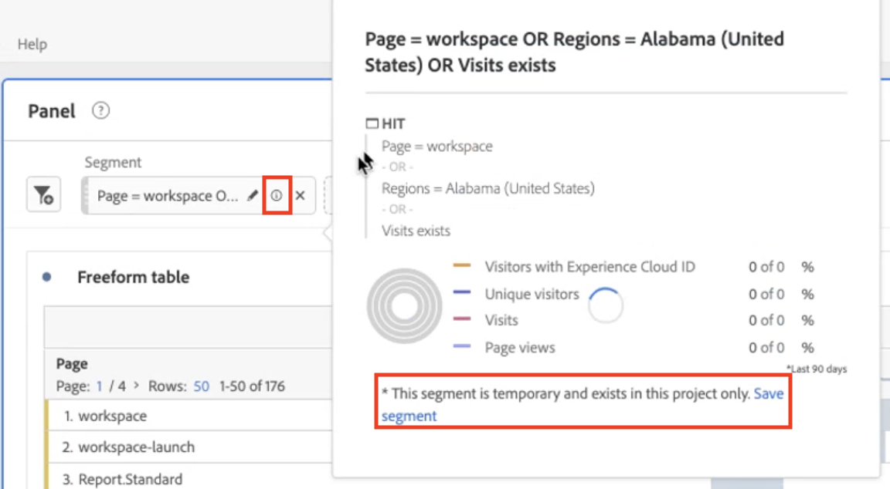

# Filtros rápidos

Puede crear filtros rápidos dentro de un proyecto para evitar la complejidad del [Generador de filtros](/help/components/filters/create-filters.md) completo. Filtros rápidos

* Se aplican solo a proyectos específicos (puede cambiar esto).
* Permitir hasta 3 reglas
* No se admiten contenedores anidados ni reglas secuenciales.
* Trabajar en paneles con varios grupos de informes

Para ver una comparación de lo que pueden hacer los filtros rápidos frente a los filtros de lista de componentes completa, vaya [aquí](/help/components/filters/filters-overview.md).

>[!IMPORTANT]
> Los filtros rápidos están actualmente en pruebas limitadas y no están disponibles en general todavía.

## Requisitos previos

Los usuarios necesitan el permiso [!UICONTROL Creación de filtros] en [Adobe Admin Console](https://experienceleague.adobe.com/docs/analytics/admin/admin-console/permissions/summary-tables.html?lang=en#analytics-tools) para poder crear filtros rápidos.

## Crear filtros rápidos

En una tabla improvisada, haga clic en el icono filter+ del encabezado del panel:

| Configuración | Descripción |
| --- | --- |
| Nombre | El nombre predeterminado de un filtro es una combinación de los nombres de reglas del filtro. Puede cambiar el nombre del filtro. |
| Incluir/excluir | Puede incluir o excluir componentes en la definición del filtro, pero no ambos. |
| Contenedor de visita/visita individual/visitante | Los filtros rápidos incluyen un [contenedor de filtros](https://experienceleague.adobe.com/docs/analytics/components/segmentation/seg-overview.html?lang=en#section_AF2A28BE92474DB386AE85743C71B2D6) que solo permite incluir una dimensión, métrica o intervalo de fechas en el filtro (o excluirlo de) él.  Visitante contiene datos globales específicos del visitante en las visitas y vistas de páginas. Un contenedor de [!UICONTROL visita] le permite establecer reglas para desglosar los datos del visitante en función de las visitas, y un contenedor de [!UICONTROL visita individual] le permite desglosar la información del visitante según las vistas de página individuales. El contenedor predeterminado es [!UICONTROL Visita]. |
| Componentes (Dimension/métrica/intervalo de fechas) | Defina hasta 3 reglas agregando componentes, dimensiones o métricas y/o intervalos de fechas y sus valores. Existen tres formas de encontrar el componente correcto:<ul><li>Empiece a escribir y el [!UICONTROL Generador de filtros rápidos] encuentre automáticamente el componente apropiado.</li><li>Utilice la lista desplegable para buscar el componente.</li><li>Arrastre y suelte los componentes desde el carril izquierdo.</li></ul> |
| Operador | Utilice el menú desplegable para buscar operadores estándar y operadores [!UICONTROL Distinct Count]. [Más información](https://experienceleague.adobe.com/docs/analytics/components/filteration/segment-reference/seg-operators.html?lang=en) |
| Signo más (+) | Añadir otra regla |
| Cualificadores AND/OR | Puede agregar calificadores &quot;AND&quot; u &quot;OR&quot; a las reglas, pero no puede combinar &quot;AND&quot; y &quot;OR&quot; en una sola definición de filtro. |
| Aplicar | Aplique este filtro al panel. Si el filtro no contiene datos, se le preguntará si desea continuar. |
| Abrir creador | Abre el Generador de filtros. Una vez guardado el filtro en el Generador de filtros, ya no se considera un &quot;filtro rápido&quot;. Forma parte de la biblioteca de filtros de lista de componentes. |
| Cancelar | Cancele este filtro rápido: no lo aplique. |
| Intervalo de fechas | El validador utiliza el intervalo de fechas del panel para la búsqueda de datos. Sin embargo, cualquier intervalo de fechas aplicado en un filtro rápido anula el intervalo de fechas del panel en la parte superior del panel. |
| Vista previa (parte superior derecha) | Le permite ver si tiene un filtro válido y su amplitud. Representa el desglose del conjunto de datos que verá al aplicar este filtro. podría recibir un aviso que indique que este filtro no tiene datos. Puede continuar o cambiar la definición del filtro. |

Este es un ejemplo de filtro que combina dimensiones y métricas:

El filtro aparece en la parte superior. Fíjese en su barra lateral con bandas azules, a diferencia de la barra lateral azul para los filtros de nivel de componente en la biblioteca de filtros de la izquierda.

## Editar filtros rápidos

1. Pase el ratón sobre el filtro rápido y seleccione el icono de lápiz.
1. Edite la definición del filtro o el nombre del filtro.

## Guardar filtros rápidos

Puede elegir guardar filtros rápidos en el [!UICONTROL Generador de filtros rápidos] o en el [!UICONTROL Generador de filtros].

>[!IMPORTANT]
>Una vez guardado o aplicado el filtro, ya no puede editarlo en el Generador de filtros rápidos, solo en el Generador de filtros normal.

### Guardar en el generador de filtros rápidos

1. Una vez aplicado el filtro rápido, pase el ratón sobre él y seleccione el icono de información (&quot;i&quot;).
1. Haga clic en **[!UICONTROL Poner a disposición de todos los proyectos y agregarlos a la lista de componentes]**.
1. (Opcional) Cambie el nombre del filtro.
1. Haga clic en **[!UICONTROL Guardar]**.

Observe cómo la barra lateral del filtro cambia de azul rayado a azul. Ahora aparece en la lista de componentes en el carril izquierdo.

### Guardar en el Generador de filtros

1. Pase el ratón sobre el filtro rápido y seleccione el icono de información (&quot;i&quot;).
1. Seleccione **[!UICONTROL Guardar filtro]**

   

1. Deje el nombre tal cual o cambie el nombre del filtro.

   Vuelva a Workspace y observe cómo el filtro ahora tiene una barra lateral azul. Esto indica que ya no se puede editar ni abrir en el Generador de filtros rápidos. Al guardarlo, pasa a formar parte de la lista de componentes.

   

Después de aplicar el filtro, puede elegir agregarlo a la lista de componentes del filtro y ponerlo a disposición de todos los proyectos.

1. Pase el ratón sobre el filtro guardado y seleccione el icono de lápiz.

1. En la parte superior del Generador de filtros, observe este cuadro de diálogo:

   

1. Seleccione la casilla de verificación situada junto a **[!UICONTROL Hacer que este filtro esté disponible para todos los proyectos y agréguelo a la lista de componentes.]**
1. Haga clic en **[!UICONTROL Guardar]**.
1. El filtro ahora aparece en la lista de componentes del filtro para todos los proyectos.
1. También puede [compartir el filtro](/help/components/filters/manage-filters.md) con otras personas de su organización.

## ¿Qué son los filtros de solo proyecto?

Los filtros de solo proyecto son filtros rápidos o filtros de proyecto específicos de Workspace. Al editarlos/abrirlos en el [!UICONTROL Generador de filtros], se mostrará el cuadro de solo proyecto. Si aplica un filtro rápido en el generador pero no marca la casilla de verificación para que esté disponible, entonces sigue siendo un filtro solo de proyecto, pero ya no se puede abrir en el [!UICONTROL Generador de filtros rápidos]. Si marca la casilla y hace clic en **[!UICONTROL SAVE]**, ahora es un filtro de lista de componentes.