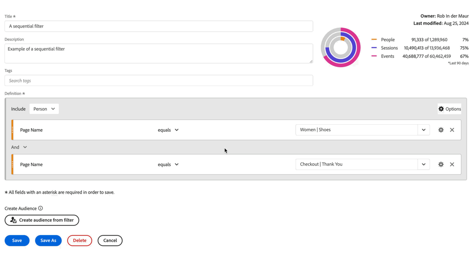
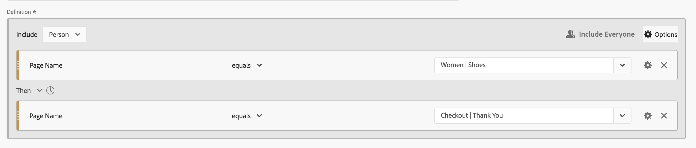
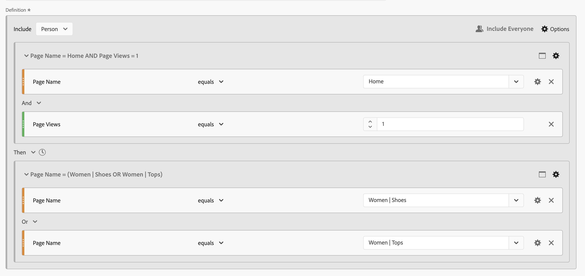
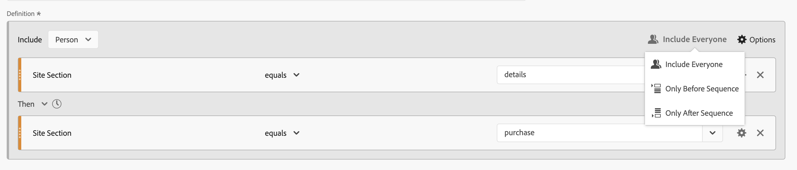
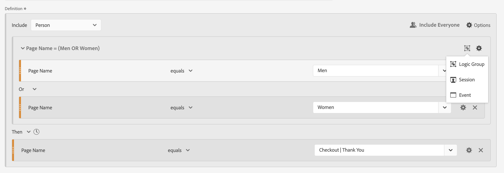
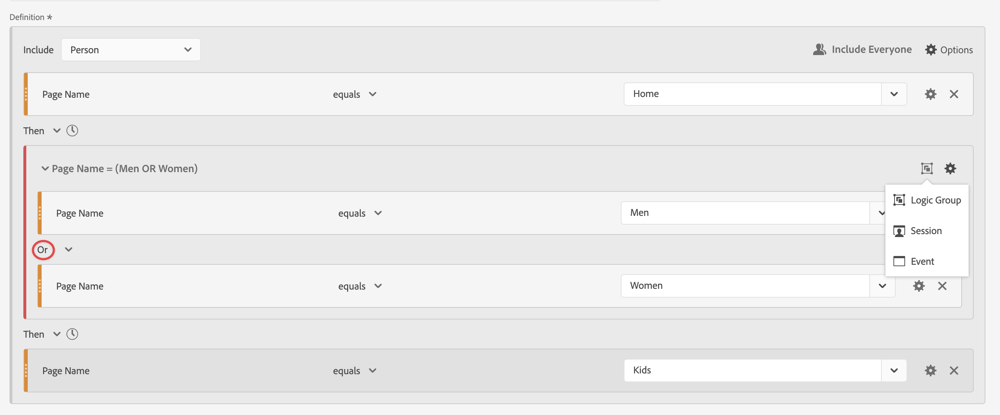
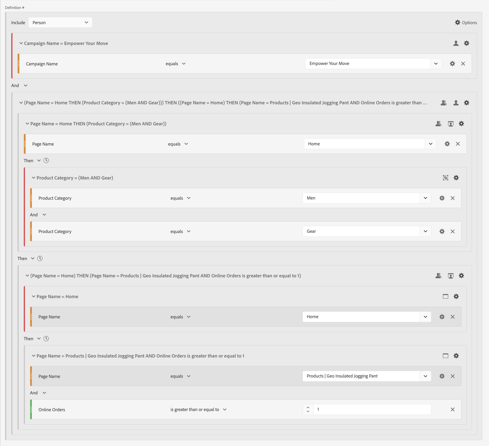

# Segmentos secuenciales

Puede crear segmentos secuenciales utilizando el operador lógico [!UICONTROL Then] entre componentes, contenedores y componentes o contenedores. El operador lógico [!UICONTROL Then] implica que se produce una condición de segmento, seguida de otra.

>[!BEGINSHADEBOX]

Consulte  [Segmentación secuencial](https://video.tv.adobe.com/v/25405/?quality=12&learn=on){target="_blank"} para ver un vídeo de demostración.

{{videoaa}}

>[!ENDSHADEBOX]

Un segmento secuencial tiene [funcionalidad básica](#basics) y opciones adicionales que puede configurar para agregar más complejidad al segmento secuencial:

* [Después y dentro de](#after-and-within) restricciones para la lógica Then en la definición del segmento de secuencia:

* Los datos que se van a [incluir](#include) como parte de la secuencia general para la definición del segmento. O para una secuencia definida como parte de un contenedor. De forma predeterminada, se tienen en cuenta todos los datos coincidentes. Esos datos son identificados por  [!UICONTROL Incluir a todos].

   * Seleccione  **[!UICONTROL Only Before Sequence]** para tener en cuenta solamente los datos anteriores a la secuencia.
   * Seleccione  **[!UICONTROL Only After Sequence]** para tener en cuenta solamente los datos después de la secuencia.

* Qué datos [excluir](#exclude) como parte de la definición del segmento secuencial.

* Cómo [agrupar lógicamente](#logic-group) condiciones en su definición de segmento secuencial.

## Conceptos básicos

Los conceptos básicos para crear un segmento secuencial no son diferentes a crear un segmento normal con el [Generador de segmentos](filter-builder.md). Puede usar el [generador de definiciones](filter-builder.md#definition-builder) para crear su definición de segmento. En esa construcción, se utilizan componentes, contenedores, operadores y lógica. Un segmento normal se convierte en un segmento secuencial en cuanto se selecciona el operador **[!UICONTROL Then]** en la definición principal o en cualquiera de los contenedores que se usan en el [generador de definiciones](filter-builder.md#definition-builder).

### Ejemplos

Los ejemplos siguientes ilustran cómo utilizar segmentos secuenciales en varios casos de uso.

#### Secuencia simple

Identifique a las personas que vieron una página y luego vieron otra página. Los datos de nivel de evento se segmentan mediante esta secuencia. Independientemente de las sesiones de personas anteriores, pasadas o intermedias, o el tiempo o el número de vistas de página que se producen entre las sesiones.

#### Secuencia entre sesiones

Identifique a las personas que vieron una página en una sesión y luego vieron otra página en otra sesión. Para diferenciar entre sesiones, use contenedores para generar la secuencia y definir el nivel de  **[!UICONTROL Sesión]** para cada contenedor.

#### Secuencia de nivel mixto

Identifique a las personas que ven dos páginas en un número indeterminado de sesiones y luego vean una tercera página en una sesión independiente. De nuevo, use contenedores para generar la secuencia y definir el nivel de  **[!UICONTROL Session]** en el contenedor que define la sesión independiente.

#### Secuencia agregada

Identifique a las personas que en su primera sesión visitaron una página específica y luego visitaron otras páginas. Para diferenciar entre la secuencia de eventos, use contenedores para separar la lógica en un nivel de contenedor  **[!UICONTROL Session]**.

#### Anidar una secuencia

Identifique todas las sesiones en las que una persona visita una página antes de otra y luego tenga sesiones de seguimiento en las que participen otras dos páginas. Por ejemplo, identifique todas las sesiones en las que una persona visita por primera vez la página de inicio, luego una página de categoría 1 y luego tenga otras sesiones en las que en cada sesión se visiten las páginas de categoría 2 y categoría 3.

## [!UICONTROL Después] y [!UICONTROL Dentro]

Puede usar el operador  **[!UICONTROL Después]** y  **[!UICONTROL En]** el operador **[!UICONTROL Entonces]** para definir [restricciones de tiempo](#time-constraints) o [restricciones adicionales para Eventos, Sesiones o Dimensiones](#event-session-and-dimension-constraints).

### Restricciones de tiempo

Para aplicar restricciones de tiempo al operador **[!UICONTROL Then]**:

1. Seleccione .
1. Seleccione **[!UICONTROL En]** o **[!UICONTROL Después]** del menú contextual.
1. Especifique un período de tiempo (**[!UICONTROL Minuto]**, **[!UICONTROL Hora]**, hasta **[!UICONTROL Años]**).
1. Seleccione  **[!UICONTROL *number *]**&#x200B;para abrir una ventana emergente que le permita escribir o especificar un número con&#x200B;**[!UICONTROL -]**&#x200B;o&#x200B;**[!UICONTROL +]**.

Para quitar una restricción de tiempo, use .

La tabla siguiente explica con más detalle los operadores de restricción de tiempo.

| Operadores | Descripción |
|--- |--- |
| **[!UICONTROL Después]** | El operador [!UICONTROL After] se usa para especificar un límite mínimo de tiempo entre dos puntos de comprobación. Al establecer los valores de Después, el límite de tiempo comienza cuando se aplica el segmento. Por ejemplo, si el operador [!UICONTROL After] se configura en un contenedor para identificar a las personas que visitan la página A, pero no regresan a la página B hasta después de un día, ese día empezará cuando el visitante abandone la página A.  Para que el visitante se incluya en el segmento, debe transcurrir un mínimo de 1440 minutos (un día) desde que se salió de la página A para ver la página B. |
| **[!UICONTROL En]** | El operador [!UICONTROL En] se usa para especificar un límite máximo de tiempo entre dos puntos de comprobación. Por ejemplo, si el operador [!UICONTROL Within] se configura en un contenedor para identificar a las personas que visitan la página A y luego regresan para visitar la página B en un día, ese día comienza cuando la persona abandona la página A. Para ser incluido en el segmento, la persona tiene un tiempo máximo de un día antes de abrir la página B. Para que la persona se incluya en el segmento, la apertura de la página B debe realizarse en un máximo de 1440 minutos (un día) después de salir de la página A para ver la página B. |
| **[!UICONTROL Después pero dentro de]** | Al usar los operadores [!UICONTROL After] y [!UICONTROL Within], ambos operadores comienzan y finalizan en paralelo, no en secuencia.  Por ejemplo, genera un segmento con el contenedor establecido en: `After = 1 Week(s) and Within = 2 Week(s)`. Las condiciones para identificar a los visitantes en este segmento solamente se cumplen entre una y dos semanas. Ambas condiciones se aplican desde el momento de la primera vista de página. |

#### Ejemplos

Algunos ejemplos de uso de las restricciones de tiempo.

##### Operador [!UICONTROL After]

Identifique a las personas que visitaron una página y luego otra página solo después de dos semanas. Por ejemplo, las personas que visitaron la página de inicio, pero las | La página de zapatos solo después de dos semanas.

Si se produce una vista de página para la página de inicio el 1 de junio de 2024 a las 00:01 horas, se generará una vista de página para la página Mujeres | Los zapatos coincidirán siempre que la vista de esa página se produzca después del 15 de junio de 2024 a las 00:01.

##### Operador [!UICONTROL Within]

Identifique a las personas que visitaron una página y luego otra en un plazo de cinco minutos. Por ejemplo, las personas que visitaron la página de inicio y luego la sección Mujer | Zapatos de la página en 5 minutos.

Si se produce una vista de página para la página de inicio el 1 de junio de 2024 a las 12:01, se generará una vista de página para la página Mujeres | Los zapatos coincidirán siempre que la vista de esa página se produzca antes del 15 de junio de 2024 a las 12:16.

##### [!UICONTROL Después de] pero [!UICONTROL Dentro de] operador

Identifique a las personas que visitaron una página y luego visitaron otra después de dos semanas pero dentro del plazo de un mes. Por ejemplo, las personas que visitaron la página de inicio y luego, después de dos semanas y dentro del plazo de un mes, las mujeres | Página de zapatos.

Cualquier persona que acceda a la página de inicio el 1 de junio de 2024 y que vuelva a visitar a las mujeres | La página de zapatos después del 15 de junio de 2019 a las 00:01 horas, pero antes del 1 de julio de 2019, cumple los requisitos para el segmento.

### Restricciones de [!UICONTROL Event], [!UICONTROL Session] y [!UICONTROL Dimension]

Las restricciones  **[!UICONTROL After]** y  **[!UICONTROL Within]** le permiten no solo especificar una restricción de tiempo, sino también una restricción de evento, sesión o dimensión. Seleccione **[!UICONTROL Evento(s)]**, **[!UICONTROL Sesión(es)]** o **[!UICONTROL Otras dimensiones]**  **[!UICONTROL *Nombre de Dimension *]**. Puede usar el campo [!UICONTROL *Buscar*] para buscar una dimensión.

#### Ejemplo

A continuación, se muestra un ejemplo de un segmento secuencial que busca personas que visitaron una página de categoría de producto (mujeres) | Zapatos), seguido de una página de pago (Checkout) | Gracias) en una página.

Las siguientes secuencias de ejemplo coinciden o no coinciden:

| Secuencia |  |
|--- | :---: |
| Página `Women \| Shoes` seguida de página `Checkout \| Thank You` |  |
| Página `Women \| Shoes` seguida de página `Women \| Tops` seguida de página `Checkout \| Thank You` |  |

## [!UICONTROL Inclusión]

Puede especificar qué datos desea incluir en el segmento secuencial o en un contenedor secuencial que forme parte del segmento secuencial.

### [!UICONTROL Todos] {#include_everyone}

Para crear un segmento secuencial que incluya a todos, seleccione la opción  **[!UICONTROL Incluir a todos]**.

El segmento secuencial identifica los datos que coinciden con el patrón determinado en su conjunto.  A continuación se muestra un ejemplo de segmento de secuencia básica que busca personas que visitaron una página de categoría de producto (mujeres) | Zapatos), seguido de una página de pago (Checkout) | Gracias). El segmento está establecido en  **[!UICONTROL Incluir a todos]**.

Las siguientes secuencias de ejemplo coinciden o no coinciden:

| | Secuencia |  |
|---:|--- | --- |
| 1 | `Women \| Shoes` entonces `Checkout \| Thank You` en la misma sesión |  |
| 2 | `Women \| Shoes` entonces `Men \| Shoes` entonces `Checkout \| Thank You` (en diferentes sesiones) |  |
| 3 | `Checkout \| Thank You` entonces `Women \| Shoes` |  |

### [!UICONTROL Solo antes de la secuencia] y [!UICONTROL Solo después de la secuencia]

Las opciones  **[!UICONTROL Only Before Sequence]** y  **[!UICONTROL Only After Sequence]** segmentan los datos en un subconjunto antes o después de la secuencia especificada.

*  **Only Before Sequence**: Incluye todos los datos anteriores a una secuencia y los primeros datos de la propia secuencia. Si la secuencia aparece varias veces como parte de los datos, [!UICONTROL Solo antes de la secuencia] incluye la primera visita de la última aparición de la secuencia y todas las visitas anteriores.
*  **Only After Sequence**: incluye todas las visitas posteriores a una secuencia y los últimos datos de la propia secuencia. Si la secuencia aparece varias veces como parte de los datos, [!UICONTROL Solo después de la secuencia] incluye la última visita de la primera aparición de la secuencia y todas las visitas posteriores.

Considere una definición que especifique la secuencia de un componente con criterios identificados por B, seguidos (Then) por un componente con criterios identificados por D. Las tres opciones identificarían los datos de la siguiente manera:

| B Entonces D | A | B | C | D | E | F |
|---|:---:|:---:|:---:|:---:|:---:|:---:|
| Incluir a todos |  |  |  |  |  |  |
| Solo Antes de la Secuencia |  |  |  |  |  |  |
| Solo Después de la Secuencia |  |  |  |  |  |  |

{style="table-layout:fixed"}

| B Entonces D (ocurre varias veces) | A | B | C | D | B | C | D | E |
|---|:---:|:---:|:---:|:---:|:---:|:---:|:---:|:---:|
| Incluir a todos |  |  |  |  |  |  |  |  |
| Solo Antes de la Secuencia |  |  |  |  |  |  |  |  |
| Solo Después de la Secuencia |  |  |  |  |  |  |  |  |

{style="table-layout:fixed"}

#### Ejemplo

Ha definido tres versiones de un segmento secuencial para las secciones del sitio. Uno con la opción  **[!UICONTROL Incluir a todos]**, otro con la opción  **[!UICONTROL Only Before Sequence]** y otro con la opción  **[!UICONTROL Only After Sequence]**. Asignó a los tres segmentos el nombre correspondiente.

Al crear informes en secciones del sitio que utilizan estos tres segmentos, el ejemplo que se muestra en una tabla de forma libre es el siguiente:

## [!UICONTROL Exclusión]

Las definiciones de segmentos incluyen todos los datos a menos que excluya específicamente los datos de  [!UICONTROL Persona],  [!UICONTROL Sesión] o  [!UICONTROL Evento] con **[!UICONTROL Excluir]**.

[!UICONTROL Excluir] le permite descartar datos comunes y crear segmentos más concretos. Excluir también le permite crear segmentos excluyendo grupos específicos de personas. Por ejemplo, para definir un segmento que especifique las personas que realizaron pedidos y luego excluir ese grupo de personas para identificar a *no compradores*. Una práctica recomendada es crear reglas que utilicen una definición amplia en lugar de intentar usar [!UICONTROL Excluir] para segmentar a personalidades específicas que coincidan con valores de inclusión específicos.

Ejemplo de definiciones de exclusión:

* **Exclusión de páginas**. Use una definición de segmento para eliminar una página específica (como *Página principal*) de un informe, cree una regla de evento en la que la página sea igual a `Home Page` y luego excluya la regla. Esta definición incluye automáticamente todas las páginas excepto la *Página principal*.
* **Exclusión de dominios de referencia**. Utilice una definición que incluya solo los dominios de referencia de Google.com y excluya todos los demás.
* **Identificación de los no compradores**. Identifique cuándo los pedidos son superiores a cero y luego excluya a [!UICONTROL Persona].

[!UICONTROL Excluir] se puede usar para identificar una secuencia en la que las personas no forman parte de sesiones específicas o no realizan eventos específicos. [!UICONTROL Excluir] también se puede incluir dentro de un [!UICONTROL grupo lógico] (ver a continuación).

Puede excluir contenedores, no componentes.

### Ejemplos

Vea a continuación algunos ejemplos del uso de [!UICONTROL Excluir].

#### [!UICONTROL Excluir] dentro de

Identifique a las personas que visitaron una página, no visitaron otra página y luego visitaron otra página. Excluye el contenedor mediante  [!UICONTROL Exclude]. Un contenedor excluido se identifica con una fina barra roja a la izquierda.

#### [!UICONTROL Excluir] al inicio

Identificar a las personas que visitaron una página sin ir nunca a otra. Por ejemplo, las personas que comprobaron una compra sin haber visitado nunca la página principal.

#### [!UICONTROL Excluir] al final

Identificar a las personas que visitaron una página pero nunca visitaron otras. Por ejemplo, las personas que visitaron su página de inicio pero nunca ninguna de las páginas de cierre de compra.

## [!UICONTROL Grupo lógico]

>[!NOTE]
>
>Un [!UICONTROL grupo lógico] solo se puede definir en un segmento secuencial, lo que significa que el operador [!UICONTROL Then] se usa dentro del contenedor.

Grupo lógico le permite agrupar condiciones en un único punto de comprobación secuencial de segmento. Como parte de la secuencia, la lógica definida en el contenedor identificado como grupo lógico se evalúa después de cualquier punto de comprobación secuencial anterior y antes de cualquier punto de comprobación secuencial siguiente.

Las condiciones dentro del propio grupo lógico pueden cumplirse en cualquier orden. Por el contrario, los contenedores no secuenciales (evento, sesión, persona) no requieren que se cumplan sus condiciones dentro de la secuencia general, lo que produce posibles resultados poco intuitivos si se utilizan con un operador Then.

[!UICONTROL Logic Group] se diseñó para tratar *varias condiciones como un grupo, sin ningún orden* entre las condiciones agrupadas. De lo contrario, el orden de las condiciones dentro de un grupo lógico es irrelevante.

Algunas prácticas recomendadas para utilizar el grupo lógico son las siguientes:

* Para agrupar puntos de comprobación secuenciales.
* Para simplificar la construcción de segmentos secuenciales.

### Ejemplos

A continuación se muestran ejemplos de cómo utilizar el contenedor de grupo lógico.

#### Cualquier pedido

Identifique a las personas que visitaron una página y luego vieron cada página de otro conjunto de páginas en cualquier orden. Por ejemplo, las personas que visitaron la página de inicio y luego visitaron cada una de las páginas Hombres, Mujeres y Niños, independientemente del orden.

Puede generar este segmento sin un [!UICONTROL grupo lógico], pero la construcción será compleja y laboriosa. Especifique cada secuencia de páginas que el visitante podría ver. Para mayor claridad, solo el primer contenedor se abre  y los demás contenedores se cierran . Puede derivar el contenido de los demás contenedores por los títulos.

Puede usar [!UICONTROL grupo lógico] para simplificar la creación de este segmento, como se muestra a continuación. Asegúrese de seleccionar  **[!UICONTROL Grupo lógico]** para el contenedor.

#### Primera coincidencia

Identifique a las personas que visitaron una página u otra página y luego visitaron otra página. Por ejemplo, las personas que visitaron la página Mujeres o la página Hombres y luego visitaron el cierre de compra | Página de agradecimiento.

#### [!UICONTROL Excluir] [!UICONTROL Y]

Identifique a las personas que visitaron una página y luego no visitaron explícitamente un conjunto de otras páginas, pero sí visitaron otra página. Por ejemplo, las personas que visitaron la página de inicio, no visitaron la página para hombres ni para mujeres, pero sí la página para niños.

#### [!UICONTROL Excluir] [!UICONTROL O]

Identifique a las personas que visitaron una página y luego no visitaron explícitamente ninguna página de un conjunto de páginas, pero sí visitaron otra página. Por ejemplo, las personas que visitaron la página de inicio, no visitaron la página Hombres y mujeres, pero sí la página Niños.

<!--
An example of a complex sequential segment if you want to find the persons that 

| Session One | Session Two | Session Three |
| --- | --- | --- |
| The person went to the main landing page A, excluded the campaign page B, and then viewed the Product page C.| The person again went to the main landing page A, excluded the campaign page B, and went again to the Product page C, and then to a new page D. | The person entered and followed that same path as in the first and second visits, then excluded page F to go directly to a targeted product on page G. |
-->

## Un ejemplo final

Por último, quiere identificar a las personas que han aprendido sobre una página de producto específica, sin que estas personas hayan sido tocadas por su campaña Empower Your Move. Y en su primera visita a su tienda en línea vio la página de inicio, pero no miró más lejos en cualquier fitness (engranaje) productos de la categoría Hombres. Sin embargo, en la siguiente sesión, justo después de eso, accedieron a una página de producto y realizaron un pedido en línea sin pasar primero por la página de inicio.

