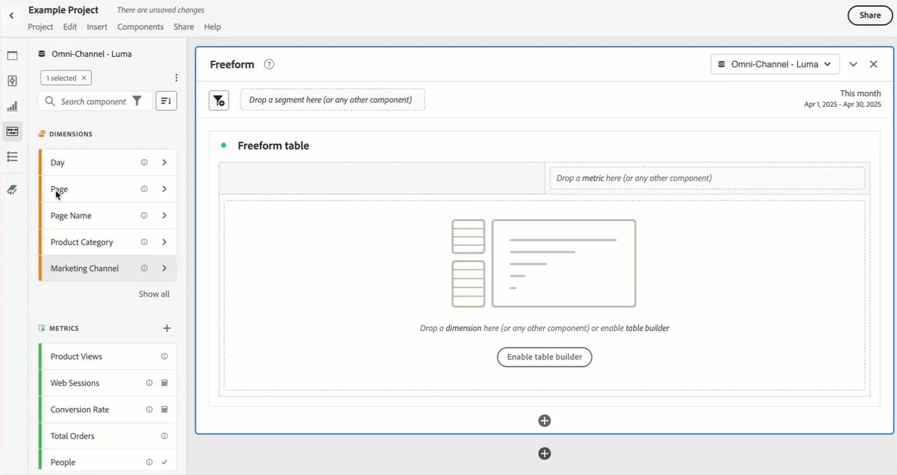

# Información general de componentes

Los componentes son funciones de Customer Journey Analytics que se pueden utilizar en las visualizaciones (como tabla de forma libre) o pueden complementar las funciones de informes.

Para administrar componentes desde la interfaz principal de Customer Journey Analytics.

1. Seleccione **[!UICONTROL Credenciales]** en la barra superior.
1. Seleccione **[!UICONTROL Componentes]** para ver una descripción general de los componentes que puede administrar o seleccionar directamente el componente que desea administrar en el menú.

Puede administrar los siguientes componentes:

* [Segmentos](segments/seg-overview.md): cree, gestione, comparta y aplique segmentos de público potentes y específicos a sus informes. Los segmentos le permiten identificar subconjuntos de personas basándose en sus características o en las interacciones.
* [Métricas calculadas:](calc-metrics/calc-metr-overview.md) usar las métricas y fórmulas como componentes nuevos para utilizarlas en sistemas de informes
* [Intervalos de fechas:](date-ranges/create.md) personalice y especifique las ofertas de Analysis Workspace en los intervalos de fechas.
* [Anotaciones](/help/components/annotations/overview.md): comunicar matices y perspectivas de datos contextuales a su organización.
* Las [alertas inteligentes](/help/components/c-intelligent-alerts/intelligent-alerts.md) permiten recibir notificaciones basadas en porcentajes modificados o puntos de datos específicos.
* [Proyectos programados](/help/analysis-workspace/export/t-schedule-report.md#scheduled-projects-manager): administre sus proyectos programados.
* [Preferencias](/help/analysis-workspace/user-preferences.md): administre las preferencias de Analysis Workspace.
* [Públicos](/help/components/audiences/audiences-overview.md): crea y publica públicos que hayas descubierto en Customer Journey Analytics para el [Perfil del cliente en tiempo real](https://experienceleague.adobe.com/es/docs/experience-platform/profile/home) en Adobe Experience Platform para la segmentación y personalización de clientes.
* [Exportaciones](/help/components/exports/manage-export-locations.md): administra tu cuenta de exportación y ubicaciones.

## Componentes de Analysis Workspace

Los componentes de Analysis Workspace están formados por métricas, dimensiones, segmentos y granularidades de tiempo que puedes arrastrar y soltar en un proyecto del espacio de trabajo. Los componentes personalizados que creas se añaden a estos paneles como, por ejemplo, la métrica calculada o los intervalos de fecha personalizados.

Para acceder al panel Componentes, selecciona  **[!UICONTROL Componentes]** en el panel Botón.

Consulta [Crear un proyecto](/help/analysis-workspace/home.md) para obtener información sobre el uso de Componentes en un proyecto.

## Administrar componentes {#actions}

Puedes crear rápidamente un nuevo componente con el menú **[!UICONTROL Componentes]** de Analysis Workspace. Consulta el [menú de Analysis Workspace](/help/analysis-workspace/home.md#menu) para obtener más información.

Puedes administrar componentes (de forma individual o seleccionando más de uno).

1. Selecciona uno o más componentes.

1. En el menú contextual o en el botón de acciones del componente  (en la parte superior de Componentes), selecciona una de las siguientes acciones.

   >[!TIP]
   >
   >Para seleccionar varios componentes, mantén pulsada **[!UICONTROL Mayús]**, o manteniendo pulsado **[!UICONTROL Comando]** (en macOS) o **[!UICONTROL Ctrl]** (en Windows).

   {width=100%}

   | Acción de componente | Descripción |
   |--- |--- |
   |  [!UICONTROL **Etiqueta**] | Organizar o administrar componentes aplicándoles etiquetas. A continuación, puedes buscar por etiqueta en el panel izquierdo haciendo clic en  o escribiendo `#`. Las etiquetas también actúan como filtros en los administradores de componentes. |
   |  [!UICONTROL **Favorito**] | Añadir el componente a la lista de favoritos. Al igual que las etiquetas, puedes buscar por Favoritos en el panel izquierdo y filtrar con este criterio en los administradores de componentes. |
   |  **[!UICONTROL No favorito]** | Eliminar el componente de la lista de favoritos. |
   |  [!UICONTROL **Aprobar**] | Marque los componentes como aprobados para indicar a los usuarios que el componente lo ha aprobado la organización. Al igual que las etiquetas, puedes buscar y filtrar por Aprobado en el panel izquierdo. Una  identifica los componentes aprobados. |
   |  [!UICONTROL **Compartir**] | Comparta componentes con usuarios de su organización. Esta opción solo está disponible para componentes personalizados, como segmentos o métricas calculadas. |
   |  [!UICONTROL **Eliminar**] | Elimine los componentes que ya no necesite. Esta opción solo está disponible para componentes personalizados, como segmentos o métricas calculadas. |

Los componentes personalizados también se pueden administrar a través de sus respectivos administradores de componentes. Por ejemplo, consulte [Administrar segmentos](/help/components/segments/seg-manage.md).

## Administrar la lista de componentes

Puedes buscar, filtrar y ordenar la lista de componentes en el panel izquierdo de Analysis Workspace para localizar rápidamente un componente en particular.

### Buscar

1. Selecciona **Componentes**  en el panel izquierdo.

2. En el campo de búsqueda, empiece a escribir el nombre del componente que desea utilizar en el proyecto.

   Un color y el icono identifican el tipo de componente. Las **dimensiones**  son de color naranja, los **segmentos**  son azules, los **intervalos de fechas**  son morados y las **métricas**  son verdes. El icono de Adobe  indica una plantilla de métrica calculada o una plantilla de segmento. El icono de la calculadora  indica una métrica calculada que ha creado un administrador de tu organización.

3. Seleccione el componente en el menú desplegable.

### Filtro

1. Selecciona el icono de **Componentes**  en el panel izquierdo.

2. Selecciona el **Filtro**  o escribe `#` en el campo de búsqueda.

3. Seleccione cualquiera de las siguientes opciones de filtro para filtrar la lista de componentes:

   | Icono | Opción de filtro | Descripción |
   |---------|---|----------|
   |  | **[!UICONTROL Aprobado]** | Mostrar solo los componentes marcados como Aprobado por un administrador. |
   |  | **[!UICONTROL Favoritos]** | Mostrar solo los componentes que se encuentran en la lista de Favoritos.  Para obtener información sobre cómo añadir componentes a la lista de favoritos, consulta[Información general sobre componentes](#manage-components). |
   |  | **[!UICONTROL Dimensiones]** | Mostrar solo los componentes que son dimensiones. |
   |  | **[!UICONTROL Métricas]** | Mostrar solo los componentes que son métricas. |
   |  | **[!UICONTROL Segmentos]** | Mostrar solo los componentes que son segmentos.  |
   |  | **[!UICONTROL Intervalos de fechas]** | Mostrar solo los componentes que son intervalos de fechas.  |
   |  | **[!UICONTROL *Nombre de etiqueta *]** | Mostrar solo los componentes con las etiquetas seleccionadas específicas. Hay disponible una etiqueta específica para la plantilla de Adobe, que son las [métricas calculadas predeterminadas](/help/components/calc-metrics/default-calcmetrics.md) de Adobe. |

   Selecciona  en un filtro para quitar el filtro.

4. Si lo deseas, puedes ordenar la lista de componentes, tal como se describe en [Ordenar la lista de componentes](#sort-the-component-list).

### Ordenar

<!-- {{release-limited-testing-section}}-->

1. (Opcional) Aplique cualquier filtro a la lista de componentes, tal como se describe en [Filtrado de la lista de componentes](#filter-the-component-list).

2. Selecciona el icono de **Componentes**  en el panel izquierdo.

3. Selecciona el icono de **Ordenar** , y a continuación, selecciona cualquiera de las siguientes opciones de filtro para ordenar la lista de componentes.

Las opciones de clasificación disponibles son las siguientes:

{{components-sort-options}}

## Acceder a permisos

En Analysis Workspace, los administradores pueden[depurar](/help/analysis-workspace/curate-share/curate.md) qué componentes se exponen a los usuarios en la creación de informes.
