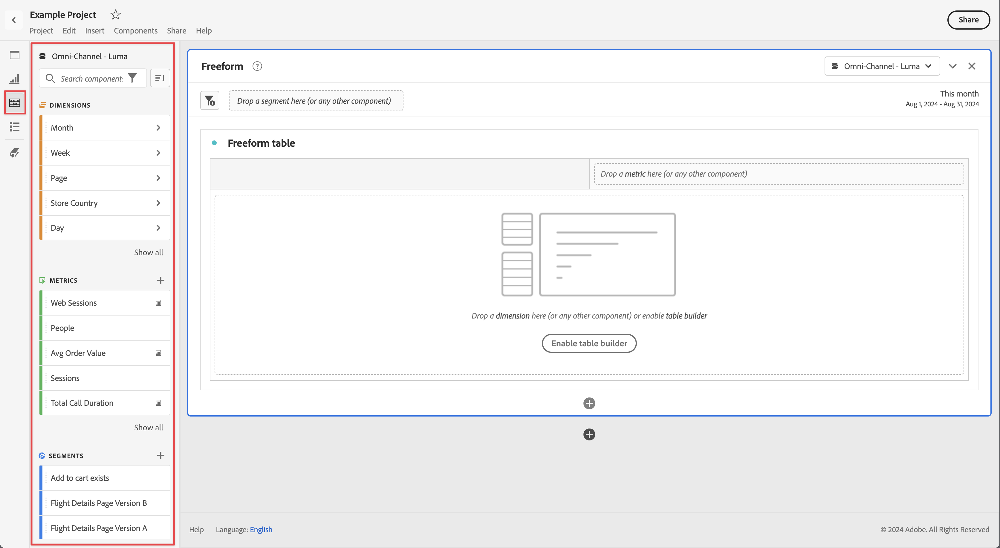

# Resumen de componentes

Los componentes son funciones de Customer Journey Analytics que se pueden utilizar en los informes o pueden complementar las funciones del sistema de informes. Puede administrar estos componentes siguiendo estos pasos:

1. Inicie sesión en [analytics.adobe.com](https://analytics.adobe.com) con sus credenciales de Adobe ID.
2. Vaya a [!UICONTROL Componentes] > [!UICONTROL Componentes] en el menú del encabezado.

Puede administrar los siguientes componentes:

* [**Filtros:**](filters/filters-overview.md) excluir partes de los datos para centrarse en elementos de dimensión comunes
* [**Métricas calculadas:**](calc-metrics/calc-metr-overview.md) usar las métricas y fórmulas como componentes nuevos para utilizarlas en sistemas de informes
* [**Intervalos de fechas:**](date-ranges/overview.md) personalizar y especificar las ofertas de Analysis Workspace en los intervalos de fechas
* [**Proyectos:**](/help/analysis-workspace/home.md) organizar y mantener sus proyectos en Analysis Workspace

## Componentes de Analysis Workspace

Los componentes de Analysis Workspace están formados por métricas, dimensiones, filtros y granularidades de tiempo que puede arrastrar y soltar en un proyecto. Los componentes personalizados que crea se añaden a estos paneles como, por ejemplo, los intervalos de fecha personalizados.

Para acceder al panel Componentes, haga clic en el icono **[!UICONTROL Componentes]** del carril izquierdo. Puede alternar entre paneles (Panel en blanco, [Panel de forma libre](/help/analysis-workspace/visualizations/freeform-table/freeform-table.md), [Información rápida](/help/analysis-workspace/c-panels/quickinsight.md), o [Attribution IQ](/help/analysis-workspace/c-panels/attribution.md) panel), [Visualizaciones](/help/analysis-workspace/visualizations/freeform-analysis-visualizations.md), y Componentes con los iconos del carril izquierdo o con [métodos abreviados de teclado](/help/analysis-workspace/build-workspace-project/fa-shortcut-keys.md).

Consulte [Crear un proyecto](/help/analysis-workspace/home.md) para obtener información sobre el uso de Componentes en un proyecto.

## Acciones de componente

Puede administrar componentes (de uno en uno o seleccionando más de uno) de diferentes formas. Haga clic con el botón secundario en un componente o haga clic en **[!UICONTROL Acciones]** en la parte superior de la lista de componentes.

>[!NOTE]
>
>Estas acciones no se aplican a los componentes de tiempo.

| Acción de componente | Descripción |
| --- | --- |
| Etiqueta | Organizar o administrar componentes aplicándoles etiquetas. A continuación, se muestra en el administrador de componentes pertinente, como [!UICONTROL Analytics] > [!UICONTROL Componentes] > [!UICONTROL Filtros], o [!UICONTROL Analytics] > [!UICONTROL Componentes] > [!UICONTROL Proyectos] |
| Favorito | Añadir el componente a la lista de favoritos. A continuación, se muestra en el administrador de componentes pertinente, como [!UICONTROL Analytics] > [!UICONTROL Componentes] > [!UICONTROL Filtros], o [!UICONTROL Analytics] > [!UICONTROL Componentes] > [!UICONTROL Proyectos]. |
| Aprobar | Aprobar el componente para hacerlo canónico. A continuación, se muestra en el administrador de componentes pertinente, como [!UICONTROL Analytics] > [!UICONTROL Componentes] > [!UICONTROL Filtros], o [!UICONTROL Analytics] > [!UICONTROL Componentes] > [!UICONTROL Proyectos] |
| Compartir | Solo se aplica a los filtros. |
| Eliminar | Solo se aplica a los filtros. |

Vea el vídeo sobre la creación de métricas, filtros y fechas:

>[!VIDEO](https://video.tv.adobe.com/v/23979)

## Permisos de acceso a los componentes

En Analysis Workspace, los administradores pueden [revisar](/help/analysis-workspace/curate-share/curate.md) qué componentes se exponen a los usuarios en la creación de informes.
