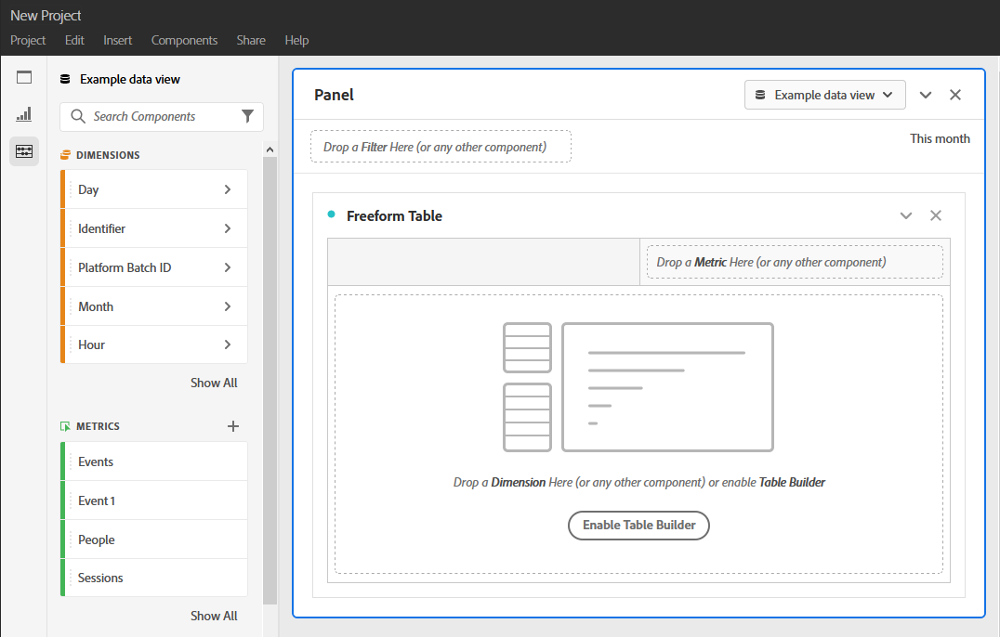

# Crear un proyecto

Existen dos métodos para crear un proyecto en Analysis Workspace:

* Haga clic [!UICONTROL Projects] en el encabezado y, a continuación, haga clic en [!UICONTROL Create New Project].
* Haga clic en [!UICONTROL Components] > [!UICONTROL Projects]y, a continuación, en  [!UICONTROL Add].

La creación de un proyecto le presenta un proyecto de Workspace en blanco:

<!-- This page serves as a placeholder for the 'Create project' modal that is currently in the old world. -->
