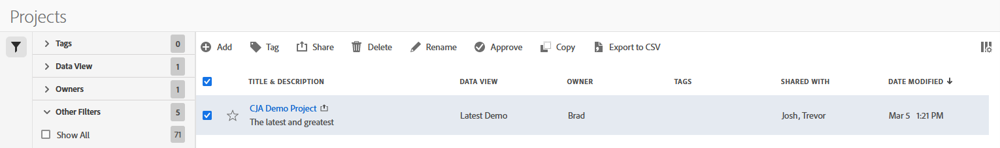

# Gestión de proyectos

Utilice el administrador de proyectos para compartir, cambiar el nombre o eliminar proyectos. Para llegar al administrador de fechas:

1. Log in to [analytics.adobe.com](https://analytics.adobe.com) using your AdobeID credentials.
1. Vaya a [!UICONTROL Components] > [!UICONTROL Projects].

## Interfaz

El administrador de proyectos incluye las siguientes opciones:

* **Agregar**: Cree un nuevo proyecto. Consulte [Creación de un proyecto](create.md) para obtener más información.
* **Buscar por título**: Busque un proyecto por título. Los resultados se filtran según el texto introducido aquí.
* **Filtro**: Filtre proyectos con la columna izquierda. Puede filtrar por etiqueta personalizada, propietario, creado por usted, sus favoritos, aprobado o compartido con usted. También puede buscar los filtros deseados.
* **Favorito**: Haga clic en el icono de  junto a un proyecto para agregarlo a sus favoritos.
* **Personalizar columnas**: Haga clic en el icono de  para mostrar u ocultar las columnas en el administrador de proyectos.

Haga clic en la casilla de verificación situada junto a uno o varios proyectos para ver más opciones.

* **Etiqueta**: Aplique una etiqueta a todos los proyectos seleccionados. Las etiquetas le ayudan a organizar proyectos y le permiten filtrarlos mediante la columna izquierda.
* **Compartir**: Comparta un proyecto con otros usuarios de Experience Cloud. Si es administrador de productos, también puede compartir con toda la organización o grupos. Los proyectos que se comparten con otros usuarios de la organización incluyen un icono  junto al título.
* **Eliminar**: Eliminar permanentemente los proyectos seleccionados.
* **Cambiar nombre**: Si selecciona un solo proyecto, puede cambiar su título.
* **Aprobar**: Si es administrador de un producto, puede agregar un sello de aprobación a un proyecto. Los proyectos aprobados informan a los usuarios de su organización de que son &quot;oficiales&quot;, diferenciándolos de los proyectos creados por otros usuarios de su organización. Los proyectos aprobados incluyen un icono  junto al título.
* **Desaprobar**: Si es administrador de un producto y selecciona un proyecto que ya está aprobado, puede desaprobarlo.
* **Copiar**: Cree una copia de los proyectos seleccionados. La copia de proyectos se anexa `(Copy)` al final del título de los proyectos recién copiados.
* **Exportar a CSV**: Exporta todos los proyectos seleccionados a un archivo CSV. Las columnas del archivo CSV resultante incluyen todas las columnas visibles en el administrador de proyectos.
