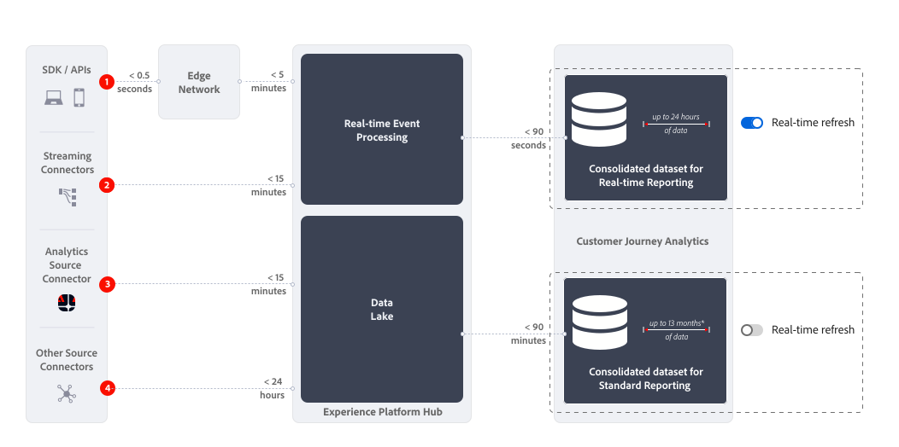

# Resumen de informes en tiempo real

La creación de informes en tiempo real en Customer Journey Analytics muestra y actualiza datos y visualizaciones en uno o varios paneles de Analysis Workspace en tiempo real.

{{ultimate-package}}

## Casos de uso

Esta sección proporciona información general sobre los casos de uso habituales y menos valiosos. Y también información sobre cuándo no considerar la creación de informes en tiempo real.

* Los casos de uso más valiosos para los informes en tiempo real son las principales ventas, promociones o lanzamientos de productos.
Como parte de ese lanzamiento, desea saber lo siguiente:

   * ¿Cómo se comparan las ventas con su última venta?
   * ¿En qué se diferencia este lanzamiento de producto del último?
   * ¿Funcionan realmente tus promociones para este importante día o evento?

* Los casos de uso relevantes, pero menos valiosos, para la creación de informes en tiempo real son los casos de uso de validación.
Desea validar, por ejemplo:

   * ¿Funciona realmente el recorrido de campaña que ha iniciado recientemente?
   * Cuando se lanzó la nueva página de productos, ¿está recopilando datos de clientes de la página?
   * ¿Funciona correctamente su evento de medios en directo?

No considere la creación de informes en tiempo real para las operaciones que supervisan casos de uso. Por ejemplo, para responder a la pregunta de si un sitio funciona correctamente. Dado que [cambio de actualización en tiempo real](use-real-time.md) se deshabilita automáticamente después de 30 minutos y el informe en tiempo real deja de actualizarse, no debería usar un informe en tiempo real como una fuente confiable para estos casos de uso.

## Funcionamiento

Los informes en tiempo real usan un conjunto de datos consolidado que es completamente independiente del [conjunto de datos consolidado (combinado)](/help/connections/combined-dataset.md) que se usa para los informes estándar. Utilice [la opción de actualización en tiempo real](use-real-time.md) para cambiar entre:

* Creación de informes en tiempo real en un conjunto de datos consolidado que contiene hasta 24 horas de datos móviles.
* Creación de informes estándar sobre el conjunto de datos consolidado que contiene hasta 13 meses de datos móviles (o más en caso de que tenga licencia del complemento de capacidad de datos extendida).

{zoomable="yes"}

### Latencias

La forma en que se recopilan los datos determina la latencia de los informes en tiempo real en Customer Journey Analytics. La ilustración anterior y la tabla siguiente muestran latencias aproximadas para varios escenarios de recopilación de datos al utilizar informes estándar y en tiempo real (para comparar).

| | Recopilación de datos | Latencia de informes en tiempo real  (aprox. menor que) | Latencia de informe estándar  (aprox. menor que) |
|:---:|---|--:|--:|
| 1 | SDK/API de Edge Network en Edge Network | 7 minutos | 95 minutos |
| 2 | Conectores de streaming | 17 minutos | 105 minutos |
| 3 | Conector de origen de Adobe Analytics | 17 minutos | 105 minutos |
| 4 | Otros conectores de origen en los conectores de origen (incluidos los datos por lotes) | 25 horas | 25 horas |

Si se produce una interrupción del servicio durante más de media hora, los datos en tiempo real no se rellenan con datos cuando se resuelven los problemas. En su lugar, los informes en tiempo real recopilan datos en tiempo real desde el momento en que los servicios empiezan a funcionar de nuevo. No se pierde ningún dato durante este periodo y aún está disponible utilizando las funciones de sistema de informes estándar fuera de los sistemas de sistema de informes en tiempo real.

## Limitaciones

Tenga en cuenta la siguiente limitación para los informes en tiempo real:

* Los informes en tiempo real solo incluyen datos disponibles en un periodo móvil de 24 horas. Datos superiores a   Los informes de 24 horas de antigüedad no están disponibles para los informes en tiempo real. Una vez que la [actualización en tiempo real](use-real-time.md) de un informe se haya deshabilitado o desactivado automáticamente, todos los datos relevantes volverán a estar disponibles en el [conjunto de datos consolidado](/help/connections/combined-dataset.md) que se suele usar para la generación de informes en Customer Journey Analytics.
* La atribución, la segmentación, las métricas calculadas y mucho más solo funcionan en los datos disponibles dentro del período móvil de 24 horas. Por ejemplo, un segmento de *Visitantes repetidos* incluye muy pocas personas en un informe en tiempo real, porque el informe solo incluye a las personas que lo visitaron varias veces en las últimas 24 horas. Se aplica una limitación similar cuando crea un informe en tiempo real sobre las personas que anteriormente hicieron clic en una campaña que ya no está activa.
* La creación de informes en tiempo real funciona mejor con datos de nivel de evento y sesión, y debe tener cuidado al utilizar la creación de informes en tiempo real con datos de nivel de persona. Dado que solo los eventos del periodo móvil de 24 horas están disponibles para los informes en tiempo real, el historial de eventos de una persona también se limita a esta ventana. Tenga en cuenta la preferencia por los datos de nivel de evento y de sesión al seleccionar una dimensión y métricas (calculadas). Y cuando utiliza funcionalidades como desgloses, siguiente o anterior, y más en el panel habilitado para la actualización en tiempo real.
* No se puede combinar la vinculación con los informes en tiempo real. La creación de informes en tiempo real trata de los datos de nivel de evento y de sesión, y es menos relevante para los datos basados en personas.
* No hay métricas de medios recopilados de Heartbeat disponibles, excepto métricas de inicio y cierre de medios. Por lo tanto, puede seguir utilizando los informes en tiempo real para habilitar un caso de uso de medios.
* Cuando use las [opciones de descarga o exportación](/help/analysis-workspace/export/download-send.md) para descargar un proyecto o exportar datos desde una tabla de forma libre, tenga en cuenta lo siguiente:
   * Un proyecto CSV descargado o un archivo CSV exportado contiene los datos en tiempo real disponibles en el momento de la descarga o exportación.
   * Un proyecto de PDF descargado contiene datos no en tiempo real, similares a los datos que se muestran cuando la actualización en tiempo real está desactivada.
