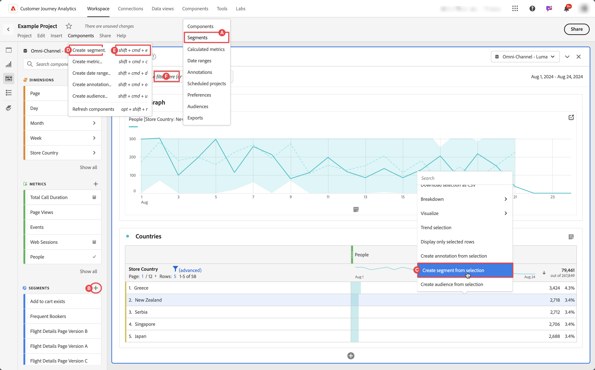

# Crear segmentos

Puede crear diferentes tipos de segmentos en Customer Journey Analytics.  El tipo que seleccione dependerá de la complejidad de los segmentos y de si solo deben aplicarse al proyecto de Workspace actual o a todos los proyectos. Puede crear segmentos directamente en la interfaz principal de Customer Journey Analytics o cuando trabaje en un proyecto de Workspace.

De forma predeterminada, solo los administradores pueden crear segmentos. Los usuarios tienen derechos para ver segmentos, de forma similar a como ven otros componentes (como anotaciones, métricas calculadas, etc.).

Sin embargo, los administradores pueden dar permiso a **[!UICONTROL Creación de segmentos]** para **[!UICONTROL Herramientas de creación de informes]** en **[!UICONTROL Editar permisos para CJA Workspace Access]** a los usuarios a través de [Admin Console](/help/technotes/access-control.md#user-level-access).

Puede crear un segmento de las siguientes maneras:

* **A**. En la interfaz principal, seleccione **[!UICONTROL Componentes]** y seleccione **[!UICONTROL Segmentos]**. Seleccione  [!UICONTROL **[!UICONTROL Add]**] del administrador de [[!UICONTROL segmentos]](/help/components/segments/seg-manage.md).
* **B**. En un proyecto de Workspace, en el panel izquierdo Componentes, seleccione  en  **Segmentos**.
* **C**. En un proyecto de Workspace, en el menú contextual de una visualización, seleccione **[!UICONTROL Crear segmento de selección]**.
* **D**. En un proyecto de Workspace, seleccione **[!UICONTROL Componentes]** en el menú y seleccione **[!UICONTROL Crear segmento]**.
* **E**. En un proyecto de Workspace, use el acceso directo **[!UICONTROL mayús+cmd+e]** (macOS) o **[!UICONTROL mayús+ctrl+e]** (Windows).
* **F**. Seleccione  en ***Colocar un segmento aquí (o cualquier otro componente)*** zona de colocación. Esta acción crea un segmento solo de proyecto.

Para definir el nuevo segmento, usa el [Generador de segmentos](/help/components/segments/seg-builder.md).

Cuando esté en un proyecto de Workspace, también puede crear un segmento rápidamente usando [Segmento rápido](/help/components/segments/seg-quick.md).
