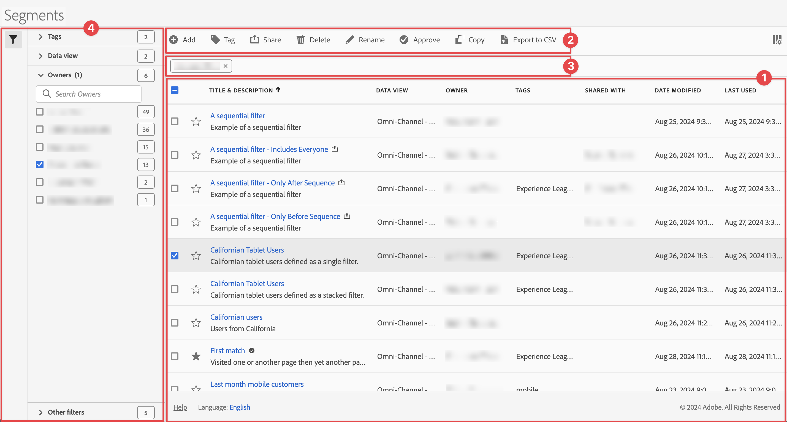

# Administración de segmentos

Puede [compartir](seg-share.md), [segmento](seg-filter.md), [etiqueta](seg-tag.md), [aprobar](seg-approve.md), cambiar el nombre, [copiar](seg-copy.md), eliminar, exportar segmentos y marcar segmentos como [favoritos](seg-favorite.md) desde una interfaz de administración central de [!UICONTROL Segmento]. Para administrar segmentos:

* Seleccione **[!UICONTROL Componentes]** en la interfaz principal y luego seleccione **[!UICONTROL Segmentos]**.

>[!NOTE]
>
>Los segmentos rápidos que cree en un proyecto específico de Workspace no aparecerán en el administrador de [!UICONTROL Segmento], a menos que haya puesto el segmento a disposición de todos sus proyectos.
>

## Administrador de segmentos

El Administrador de segmentos tiene los siguientes elementos de interfaz:

### Lista de segmentos

La lista de segmentos ➊ muestra todos los segmentos que posee, los segmentos a los que se ha dado ámbito en todos sus proyectos y los segmentos que se han compartido con usted. La lista tiene las siguientes columnas:

| Columna | Descripción |
| --- | --- | 
|  | Seleccione para favorecer a  o para anular el favor de  en un segmento. Ver [Marcar segmento como favorito](/help/components/segments/seg-favorite.md) |
| **[!UICONTROL Título y descripción]** | Para editar el segmento, seleccione el vínculo del título, que abre el [Generador de segmentos](seg-builder.md). Se ha indicado un segmento compartido con . |
| **[!UICONTROL Vista de datos]** | Las vistas de datos a las que se aplica este segmento. |
| **[!UICONTROL Propietario]** | El propietario del segmento. Como usuario, solo verá los segmentos que le pertenecen o las anotaciones que se han compartido con usted. |
| **[!UICONTROL Etiquetas]** | Las etiquetas de este segmento. |
| **[!UICONTROL Compartido con]** | El número de individuos o grupos con los que compartió el segmento. Seleccione esta opción para abrir el cuadro de diálogo **[!UICONTROL Compartir componente]**. Consulte [Compartir segmentos](seg-share.md) para obtener más información. |
| **[!UICONTROL Fecha de modificación]** | La fecha y la hora de la última modificación del segmento. |
| **[!UICONTROL Utilizado en]** | Muestre dónde se están utilizando los segmentos actualmente y cuántas veces se están utilizando en cada área. 
Por ejemplo, si el segmento se está utilizando en 40 proyectos y 2 alertas, el valor de esta columna se muestra como [!UICONTROL **42 componentes**].
 
Seleccione el valor de esta columna para ver el desglose de dónde se están utilizando los segmentos (por ejemplo, [!UICONTROL **Proyectos (40)**], [!UICONTROL **Cuadros de resultados móviles (2)**]). Además, puede ver la lista de elementos en los que se utilizan los segmentos. Por ejemplo, para ver la lista de proyectos en los que se están usando, seleccione el vínculo [!UICONTROL **Proyectos (40)**].

Cada una de las siguientes áreas muestra el número de instancias de segmentos que se están utilizando en esa área:
  <ul><li>[!UICONTROL **Proyectos**]
Contiene segmentos que se [crearon en el generador de segmentos](/help/components/segments/seg-builder.md#) y que están disponibles para todos los proyectos.
</li><li>[!UICONTROL **Componentes ad hoc**]
Contiene segmentos que se [crearon como segmentos rápidos](/help/components/segments/seg-quick.md) y que solo están disponibles dentro de un solo proyecto.
</li><li>[!UICONTROL **Proyectos programados**]</li><li>[!UICONTROL **Cuadros de resultados móviles**]</li><li>[!UICONTROL **Anotaciones**]</li><li>[!UICONTROL **Métricas calculadas**]</li><li>[!UICONTROL **Report Builder**]
Al seleccionar esta opción, se descarga un archivo CSV con las siguientes columnas de datos:
<ul><li>Nombre de Report Builder</li><li>Último acceso</li><li>ID usuario de IMS de último acceso</li><li>Nombre de usuario de último acceso</li></ul></li></ul>
Esta información puede ayudarle a determinar si un componente es valioso para los usuarios de su organización, dónde se utiliza y si debe eliminarse o modificarse.

Tenga en cuenta lo siguiente cuando vea esta columna:
<ul><li>Esta columna solo está disponible para los administradores del sistema.</li><li>La columna [!UICONTROL **Utilizado en**] no se muestra de manera predeterminada. Utilice  para configurar la visualización de esta columna.</li><li>Esta información no incluye el uso de la API o Data Warehouse.</li><li>Si no hay datos en esta columna para un componente determinado pero el componente tiene una fecha de [!UICONTROL **Último uso**], es posible que el componente se haya utilizado en un análisis sin que se haya guardado.</li><li>La información de uso está disponible a partir de septiembre de 2023.</li></ul>
Puede utilizar el [Diccionario de datos](/help/components/data-dictionary/data-dictionary-overview.md) junto con esta información para ayudarle a realizar un seguimiento y comprender mejor cómo se utilizan los componentes en su organización.
 |
| **[!UICONTROL Último uso]** | La última vez que se utilizó el segmento. |

Usa  para especificar qué columnas deseas mostrar.

### Barra de acciones

Puede realizar acciones en los segmentos mediante la barra de acciones ➋. La barra de acciones contiene las siguientes acciones:

| Acción | Descripción |
|---|---|
|  **[!UICONTROL Añadir]** | Agregue otro segmento con el [Generador de segmentos](seg-builder.md). |
|  [!UICONTROL *Búsqueda por el título*] | Cuando no haya ningún segmento seleccionado en la lista, busque segmentos utilizando este campo de búsqueda. |
|  **[!UICONTROL Etiqueta]** | Etiquete los segmentos seleccionados. En el cuadro de diálogo **[!UICONTROL Segmento de etiqueta]**, seleccione o anule la selección de las etiquetas de los segmentos seleccionados. Seleccione **[!UICONTROL Guardar]** para guardar las etiquetas de los segmentos seleccionados. Consulte [Etiquetar segmentos](/help/components/segments/seg-tag.md) para obtener más información. |
|  **[!UICONTROL Compartir]** | Compartir los segmentos seleccionados. En el cuadro de diálogo **[!UICONTROL Compartir segmento]**, puede  *Buscar individuos o grupos* o puede seleccionar **[!UICONTROL Organización]** o **[!UICONTROL Grupos]**. Seleccione **[!UICONTROL Guardar]** para guardar los detalles de uso compartido de los segmentos seleccionados. Consulte [Compartir segmentos](seg-share.md) para obtener más información. |
|  **[!UICONTROL Eliminar]** | Eliminar los segmentos seleccionados. Se le pedirá una confirmación. |
|  **[!UICONTROL Cambiar nombre]** | Cambiar el nombre de un solo segmento seleccionado. Cuando se selecciona, puede cambiar el nombre del segmento en línea. |
|  **[!UICONTROL Aprobar]** | Apruebe los segmentos seleccionados. Consulte [Aprobar segmentos](seg-approve.md) para obtener más información. |
|   **[!UICONTROL Copiar]** | Copie el segmento seleccionado. Los segmentos nuevos se crean con el mismo nombre y sufijo `(Copy)`. |
|  **[!UICONTROL Exportar a CSV]** | Exportar los segmentos a un archivo de `Segments List.csv`. |

### Barra de filtro activa

La barra de filtro ➌ muestra los segmentos activos aplicados desde el panel de filtro a la lista de segmentos (si los hay). Puedes quitar rápidamente un filtro con . Si se especifica más de un filtro, puede quitar todos los filtros usando **[!UICONTROL Quitar todos]**.

### Panel Filtro

Puede filtrar la lista de segmentos con el panel izquierdo  **[!UICONTROL Filtro]** ➍. El panel Filtro muestra el tipo de filtro y el número de segmentos que respetan el filtro específico. Seleccione  para alternar la visualización del panel Filtro.

Ver [Filtrar la lista de segmentos](seg-filter.md) para obtener más información.
