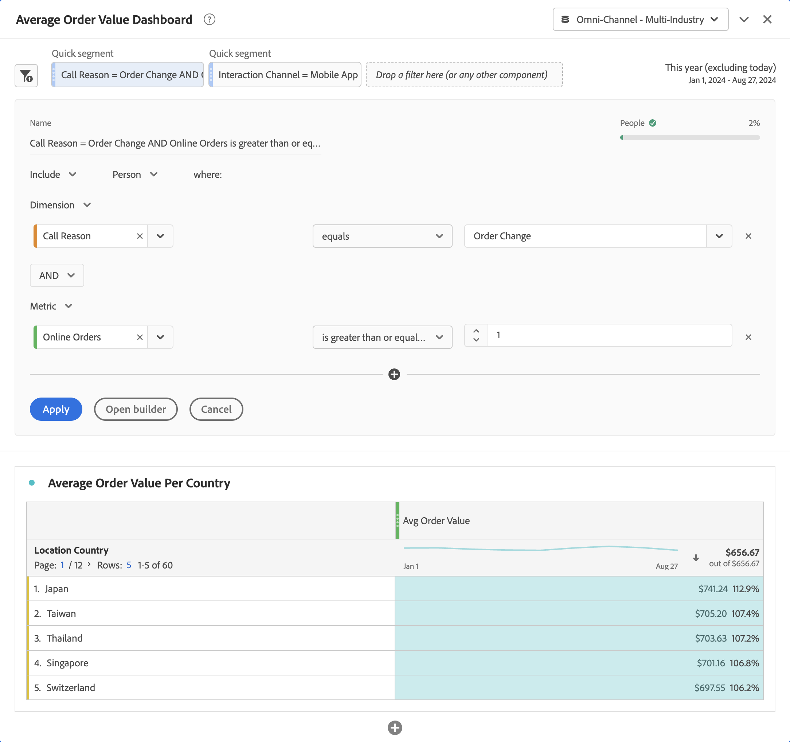

# Segmentos rápidos

Los segmentos rápidos le permiten explorar datos dentro de un proyecto de Workspace rápidamente, sin necesidad de crear un segmento en el [Generador de segmentos](/help/components/segments/seg-create.md).

>[!BEGINSHADEBOX]

Consulte  [Segmentos rápidos en Analysis Workspace](https://video.tv.adobe.com/v/345336/?quality=12&learn=on&captions=spa){target="_blank"} para ver un vídeo de demostración.

>[!ENDSHADEBOX]

Si desea utilizar segmentos rápidos, tenga en cuenta lo siguiente:

* Los segmentos rápidos se crean directamente en un proyecto de Workspace. Como resultado, un segmento rápido se aplica solo al proyecto de Workspace en el que crea el segmento rápido. Los segmentos rápidos del proyecto de Workspace no están disponibles en otros proyectos y no se pueden compartir con otros usuarios.
* Solo puede especificar tres condiciones como parte de un segmento rápido.
* Los segmentos rápidos no admiten contenedores anidados ni condiciones secuenciales.
* Puede editar segmentos rápidos dentro de un proyecto compartido de Workspace. Por lo tanto, otros usuarios pueden editar los segmentos rápidos de un proyecto de Workspace que haya compartido con estos usuarios.

## Crear

Los segmentos rápidos se aplican a los paneles. Puede crear uno o más segmentos rápidos para cada panel del proyecto de Workspace. Cualquier usuario de Analysis Workspace puede crear segmentos rápidos.

Para crear un segmento rápido haga lo siguiente:

* Seleccione  en la parte superior del panel.  A continuación, edite directamente el segmento en el [Generador de segmentos rápidos](#quick-segment-builder).
* Arrastre un componente desde el panel de componentes a la zona de colocación de segmentos en el encabezado del panel. Una vez colocado, pasa el ratón sobre el segmento y selecciona  para editar el segmento en el [Generador de segmentos rápidos](#quick-segment-builder).

Cuando cree un segmento rápido arrastrando y soltando, tenga en cuenta lo siguiente:

* No se admiten todos los tipos de componentes. Las métricas calculadas no son compatibles, y solo son compatibles las dimensiones y métricas desde las que se pueden crear segmentos.
* Para los componentes de dimensiones y métricas, el [Generador de segmentos rápidos](#quick-segment-builder) crea automáticamente una condición `exists`. Por ejemplo, si arrastra y suelta **[!UICONTROL Ciudad]**, se creará la condición **[!UICONTROL Ciudad]** **[!UICONTROL existe]**.
* Para los valores de dimensión, el [Generador de segmentos rápidos](#quick-segment-builder) crea automáticamente una condición **[!UICONTROL igual a]**. Por ejemplo, si arrastra y suelta **[!UICONTROL Amsterdam]** de la lista de dimensiones **[!UICONTROL City]**, se creará la condición **[!UICONTROL City]** **[!UICONTROL equals]** `Amsterdam`.
* Si arrastra y suelta **[!UICONTROL sin especificar]** o **[!UICONTROL ninguno]**, el [Generador de segmentos rápidos](#quick-segment-builder) crea automáticamente una condición **[!UICONTROL no existe]**.

Los segmentos rápidos que cree aparecerán en la parte superior del panel. Los segmentos rápidos tienen una barra izquierda fina de color azul claro. Cuando un segmento rápido se encuentra en modo de edición con el [Generador de segmentos rápidos](#quick-segment-builder), el fondo del segmento rápido es de color azul claro.

Los resultados de los segmentos rápidos que cree en un panel se aplican (mediante la lógica AND) a todas las visualizaciones que forman parte del panel.

## Administrar

Para administrar un segmento rápido, pasa el ratón sobre el **[!UICONTROL segmento rápido]** específico.

* Seleccione  para abrir el [Generador de segmentos rápidos](#quick-segment-builder) y editar el segmento rápido.
* Seleccione  para abrir una ventana emergente. La ventana emergente muestra información sobre el segmento. Puede seleccionar **[!UICONTROL Poner a disposición de todos los proyectos y agregar a su lista de componentes]** Para agregar el segmento a la lista de componentes  **[!UICONTROL Segmentos]** en el panel de componentes. Aparece el cuadro de diálogo **[!UICONTROL Guardar segmento rápido]**, que le solicita que especifique un nombre para el segmento. Seleccione **[!UICONTROL Guardar]** para continuar. Tu [!UICONTROL segmento rápido] se convierte en un **[!UICONTROL segmento]**. Ya no puede editar el segmento con el [Generador de segmentos rápidos](#quick-segment-builder). En su lugar, debe editar el segmento como segmento normal con el [Generador de segmentos](seg-builder.md).

## Generador de segmentos rápidos

Consulte a continuación un ejemplo del Generador de segmentos rápidos. En el ejemplo, el generador se abre para un segmento rápido denominado `Call Reason = Order Change AND Online Orders is greater than or equal 1`. Ambos segmentos rápidos de la parte superior se aplican al panel **[!UICONTROL Tablero de valor de pedido promedio]** y a todas las visualizaciones de, como la tabla de forma libre [!UICONTROL Valor de pedido promedio por país].

El generador de segmentos rápidos consta de las siguientes áreas y botones.

### Área de encabezado

El área de encabezado determina el nombre, tipo y ámbito del segmento rápido. También muestra una representación visual de los resultados del segmento rápido.

| Elemento | Descripción |
|---|---|
| **[!UICONTROL Nombre]** | El nombre se deriva automáticamente de la definición del segmento rápido. |
| **[!UICONTROL Personas]**    | Vista previa de los datos resultantes del segmento rápido. Una barra y un porcentaje proporcionan a insight la cantidad de datos generales que forman parte del resultado del segmento rápido. Una  indica que el segmento rápido no devuelve datos. |
| **[!UICONTROL Incluir]** **[!UICONTROL Excluir]** | Seleccione en la lista desplegable  si desea incluir o excluir los resultados del segmento rápido de los datos en el panel. |
| **[!UICONTROL Evento]** **[!UICONTROL Sesión]** **[!UICONTROL Persona]** | Seleccione en el menú desplegable  el ámbito del segmento rápido. |

### Área de condición

El área de condición especifica las condiciones (hasta un máximo de tres). Para cada condición, puede especificar lo siguiente:

| Elemento | Descripción |
|---|---|
| **[!UICONTROL Dimension]** **[!UICONTROL Métrica]** **[!UICONTROL Intervalo de fecha]** | Seleccione en el menú desplegable  si desea especificar una condición para una dimensión, métrica o intervalo de fecha. |
| **[!UICONTROL *componente *]** | El campo de componente de la condición. Puede [!UICONTROL *Escribir para añadir*] un componente, seleccionar un componente de la lista o arrastrar y soltar un componente desde el panel de componentes. Solo puede soltar componentes similares en el campo de componente de la condición. Por ejemplo, solo puede soltar un componente de dimensión del panel de componentes en una condición de dimensión.  También puede arrastrar y soltar para reemplazar un componente existente. Seleccione  para eliminar el componente del campo de componente. |
| **[!UICONTROL *operador *]** | El operador del componente. Consulte [Operadores](seg-operators.md) para obtener más información. Solo está disponible para dimensiones y métricas. |
| **[!UICONTROL *value *]** | El valor de la condición. Según el operador seleccionado, el valor puede seleccionarse de una lista o puede introducir un valor. |
|  | Seleccione esta opción para eliminar una condición del segmento rápido. |

### Botones

| Botón | Descripción |
|---|---|
| **[!UICONTROL AND]** **[!UICONTROL OR]** | Solo está disponible cuando se define más de una condición. Seleccione en el menú desplegable  entre las condiciones. La selección determina la lógica booleana para el segmento rápido. No se puede mezclar lógica cuando se tienen tres condiciones. La lógica booleana es **[!UICONTROL AND]** o **[!UICONTROL OR]**. |
|  | Añade otra condición al segmento rápido. Este botón solo está disponible cuando ha definido una o dos condiciones para el segmento rápido. |
| **[!UICONTROL Aplicar]** | Aplique los cambios al segmento rápido. |
| **[!UICONTROL Abrir creador]** | Se le solicitará confirmación con un cuadro de diálogo **[!UICONTROL ¿Está seguro?]**. Si seleccionas **[!UICONTROL Aceptar]**, ya no podrás modificar tu segmento en el [Generador de segmentos rápidos](#quick-segment-builder). Se ha cambiado el nombre de tu segmento rápido a **[!UICONTROL Segmento]** y ahora tiene una barra izquierda delgada de color azul más oscuro. Se abre el generador de segmentos [normal](seg-builder.md) con la opción de **[!UICONTROL Poner este segmento a disposición de todos los proyectos y agregarlo a la lista de componentes]**. <ul><li>Si selecciona esta opción y selecciona **[!UICONTROL Aplicar]**, el segmento se agrega a la lista de componentes  **[!UICONTROL Segmento]** en el panel de componentes.</li><li>Si no selecciona esta opción y selecciona **[!UICONTROL Aplicar]**, el segmento sigue siendo un segmento solo de proyecto de Workspace.</li></ul> |
| **[!UICONTROL Cancelar]** | Seleccione para cancelar la creación o edición de un segmento rápido. |

## Segmentos rápidos en comparación con segmentos

Los segmentos rápidos son exactamente como se llaman. Puede crear y editar segmentos rápidos rápidamente en línea y ver los efectos inmediatamente en el panel.

Los segmentos tienen las siguientes ventajas en comparación con los segmentos rápidos.

* Los segmentos pueden estar disponibles en todos sus proyectos de Workspace
* Los segmentos admiten una mayor complejidad al usar [contenedores](seg-builder.md#containers) y secuencias anidados y jerárquicos (con [segmentos secuenciales](seg-sequential-build.md)).

