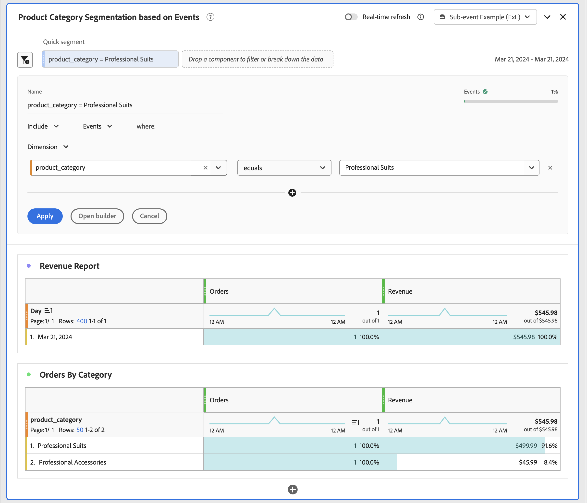
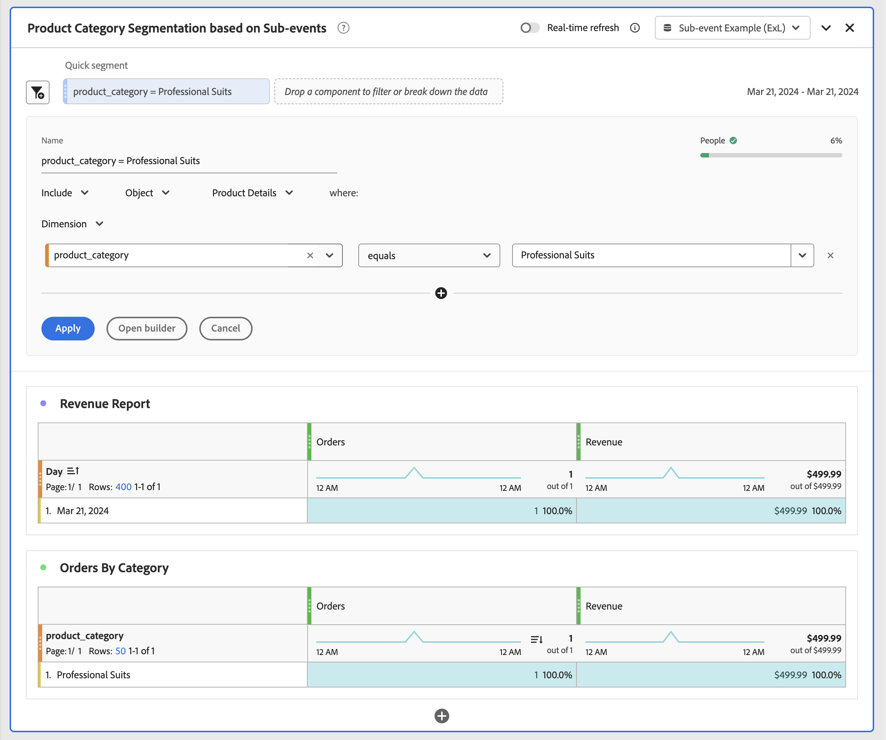

# Análisis de subeventos

{{release-limited-testing}}

El análisis de subeventos permite analizar los datos de eventos en un nivel más granular que el nivel de evento. En lugar de filtrar eventos completos, puede segmentar contenedores individuales dentro de los eventos. Por ejemplo:

* Segmentación en una categoría de producto específica sin incluir todos los demás productos comprados en el mismo pedido.
* Segmentación en una categoría de recursos específica dentro de los datos de análisis de contenido.
* Segmentación en un canal de medios específico dentro de los datos de análisis de medios.

En Customer Journey Analytics, puede definir contenedores dentro de una vista de datos para la que desea utilizar el análisis de subeventos. Sin el análisis de subeventos, la segmentación en un atributo de elemento de contenedor devuelve todos los eventos, sesiones, personas, cuentas (globales) [!BADGE B2B edition]{type=Informative url="https://experienceleague.adobe.com/es/docs/analytics-platform/using/cja-overview/cja-b2b/cja-b2b-edition" newtab=true tooltip="Customer Journey Analytics B2B Edition"}, grupos compradores [!BADGE B2B edition]{type=Informative url="https://experienceleague.adobe.com/es/docs/analytics-platform/using/cja-overview/cja-b2b/cja-b2b-edition" newtab=true tooltip="Customer Journey Analytics B2B Edition"}, oportunidades [!BADGE B2B edition]{type=Informative url="https://experienceleague.adobe.com/es/docs/analytics-platform/using/cja-overview/cja-b2b/cja-b2b-edition" newtab=true tooltip="Customer Journey Analytics B2B Edition"} u otros [contenedores](/help/data-views/create-dataview.md#containers-1) que haya definido. El resultado es una atribución incorrecta y métricas de ingresos infladas. El análisis de subeventos establece el ámbito del filtro en filas de contenedor individuales dentro de un evento y resuelve estos problemas.

En el análisis de subeventos, la lógica de exclusión se comporta de forma diferente a la exclusión estándar a nivel de evento en el contenedor. Cuando excluye atributos de elementos dentro del contenedor, el segmento devuelve eventos que **tienen elementos** dentro del contenedor, pero que no coinciden con los criterios de exclusión. El segmento no devuelve eventos sin elementos en absoluto.

## Ejemplo

Desea medir únicamente los ingresos de la categoría de trajes profesionales. Sin análisis de subeventos, la aplicación de un segmento para trajes profesionales incluye ingresos de cada producto en cualquier pedido (evento) que contenga al menos un producto con la categoría de trajes profesionales. Con el análisis de subeventos, el filtro se aplica al nivel de producto y solo se devuelven ingresos para los productos de la categoría de trajes profesionales.

También desea medir los ingresos en línea de todas las demás categorías, excepto la categoría de trajes profesionales.

>[!BEGINTABS]

>[!TAB Análisis de eventos]

En el generador de segmentación o como parte de un **[!UICONTROL segmento rápido]**, especificas **[!UICONTROL Incluir]** el **[!UICONTROL Dimension]** **[!UICONTROL product_category]** **[!UICONTROL es igual a]** **[!UICONTROL Trajes profesionales]** en el contenedor de **[!UICONTROL Eventos]**.

Como resultado, se tienen en cuenta todos los pedidos que contienen al menos **[!UICONTROL Trajes profesionales]** **[!UICONTROL product_category]**, y los ingresos de otros productos de esos pedidos se incluyen en la métrica **[!UICONTROL Ingresos]**.
Cuando se informa sobre categorías, se informa de todos los demás valores de **[!UICONTROL product_category]** que formaban parte de un pedido que incluía un producto con **[!UICONTROL Trajes profesionales]** **[!UICONTROL product_category]**.

>[!TAB Análisis de subeventos]

Ha definido un **[!UICONTROL contenedor personalizado]** de [detalles del producto](/help/data-views/create-dataview.md#containers) en su vista de datos con el fin de realizar análisis de subeventos en los productos.

En el generador de segmentación o como parte de un **[!UICONTROL segmento rápido]**, especificas **[!UICONTROL Incluir]** el **[!UICONTROL Dimension]** **[!UICONTROL product_category]** **[!UICONTROL es igual a]** **[!UICONTROL Trajes profesionales]** en el contenedor de **[!UICONTROL Detalles del producto]**.

Como resultado, se tienen en cuenta todos los pedidos que contienen al menos **[!UICONTROL Trajes profesionales]** **[!UICONTROL product_category]**, y solo se incluyen los ingresos de los productos que pertenecen a los **[!UICONTROL Trajes profesionales]** **[!UICONTROL product_category]** para la métrica **[!UICONTROL Ingresos]**.
Cuando se informa sobre categorías, solo se informa de **[!UICONTROL Trajes profesionales]** **[!UICONTROL product_category]**.

>[!TAB Análisis de subeventos (excluir)]

Ha definido un **[!UICONTROL contenedor personalizado]** de [detalles del producto](/help/data-views/create-dataview.md#containers) en su vista de datos con el fin de realizar análisis de subeventos en los productos.

En el generador de segmentación o como parte de un **[!UICONTROL segmento rápido]**, especificas **[!UICONTROL Excluir]** el **[!UICONTROL Dimension]** **[!UICONTROL product_category]** **[!UICONTROL es igual a]** **[!UICONTROL Trajes profesionales]** en el contenedor de **[!UICONTROL Detalles del producto]**.

Para excluir en el nivel de producto, se incluyen los eventos que contienen al menos un producto y, a continuación, la exclusión en el nivel de subevento se aplica dentro de ese ámbito. Esta exclusión difiere de la exclusión de nivel de evento, que excluye todo el evento.

>[!ENDTABS]
