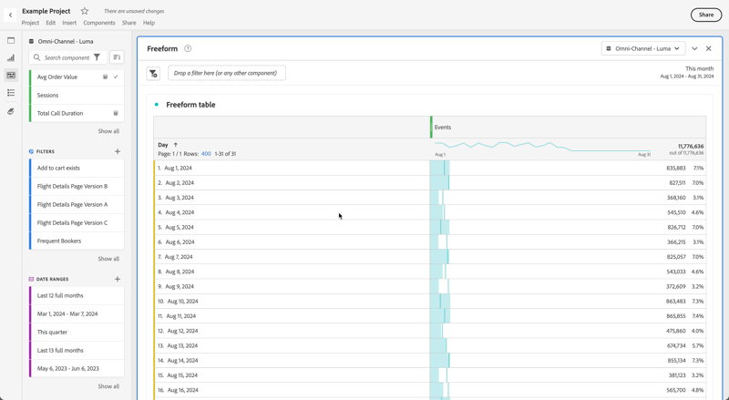
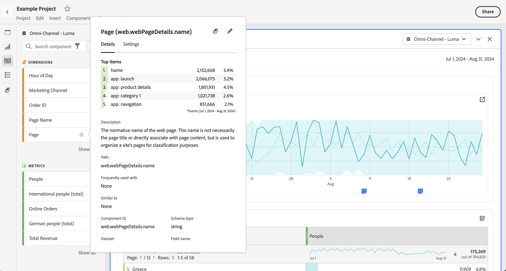

# Uso de componentes en Analysis Workspace

Los componentes constituyen los datos reales de cualquier proyecto en Analysis Workspace. Los componentes están formados por dimensiones, métricas, segmentos e intervalos de fechas. Puede añadir componentes a un proyecto arrastrándolos a visualizaciones o paneles.

Consulte la [Información general de componentes](/help/components/overview.md) para obtener más información sobre los tipos de componentes que puede añadir.

>[!TIP]
>
>Para obtener información sobre cada componente, use . Consulte [Información del componente](#component-info) para obtener más información.

## Adición de componentes a un proyecto

1. [Cree un proyecto en Analysis Workspace](/help/analysis-workspace/build-workspace-project/create-projects.md).

1. [Añada un panel](/help/analysis-workspace/c-panels/panels.md#create-a-panel) o [una visualización](/help/analysis-workspace/visualizations/freeform-analysis-visualizations.md#add-visualizations-to-a-panel) al proyecto en Analysis Workspace. Si añade un componente a un proyecto en blanco, ya se habrá creado una visualización de tabla de forma libre.

1. Seleccione  **[!UICONTROL Componentes]** en el panel de botones. Verá todos los componentes disponibles en el panel izquierdo. Consulte [Interfaz](/help/analysis-workspace/home.md#interface) para obtener más información.

1. Desplácese hasta el componente que desea añadir o búsquelo y arrástrelo hasta un panel o a una visualización dentro de su proyecto.

1. Por ejemplo, puede arrastrar un componente a la zona de colocación de segmentos en un encabezado de panel. Esta acción de arrastrar y soltar define el componente como un segmento y aplica el segmento a todo el contenido del panel.
Para obtener información sobre cómo usar la zona de colocación de segmentos en un panel para segmentar su panel, consulte [Zona de colocación](/help/analysis-workspace/c-panels/panels.md#drop-zone) en [Resumen de paneles](/help/analysis-workspace/c-panels/panels.md).

1. Para obtener información más detallada, consulte las siguientes secciones:

   * [Adición de dimensiones a un proyecto](#add-dimensions-to-a-project)

   * [Adición de métricas a un proyecto](#add-metrics-to-a-project)

   * [Adición de segmentos a un proyecto](#add-segments-to-a-project)

   * [Adición de intervalos de fechas a un proyecto](#add-date-ranges-to-a-project)

### Adición de dimensiones a un proyecto

Las [dimensiones](/help/components/dimensions/overview.md) son variables de Customer Journey Analytics que generalmente contienen valores de cadena. Por el contrario, las [métricas](/help/components/calc-metrics/calc-metr-overview.md) contienen valores numéricos que se vinculan a una dimensión. Un informe básico muestra filas de valores de cadena (dimensión) frente a una columna de valores numéricos (métrica).

1. Empiece a añadir una dimensión a su proyecto en Analysis Workspace, tal como se describe en [Adición de componentes a un proyecto](#add-components-to-a-project).

1. Elija uno de los siguientes métodos para añadir dimensiones y determinar el tipo de datos que desea analizar:

   

   * Arrastre una dimensión hasta una visualización (como una tabla de forma libre) en Analysis Workspace.

   * Arrastre una o varias dimensiones del panel izquierdo a la zona de colocación de segmentos para crear un segmento rápido, tal como se describe en [Adición de segmentos a un proyecto](#add-filters-to-a-project).

1. Si lo desea, puede desglosar dimensiones y elementos de dimensión en Analysis Workspace con otros componentes. Para obtener más información, consulte [Desglose de dimensiones en Workspace](/help/components/dimensions/t-breakdown-fa.md).

Para obtener más información sobre cómo usar dimensiones en Analysis Workspace, consulte [Vista preliminar de dimensiones](/help/components/dimensions/view-dimensions.md), [Desglose de dimensiones](/help/components/dimensions/t-breakdown-fa.md) y [Dimensiones de partición de tiempo](/help/components/dimensions/time-parting-dimensions.md).

### Adición de métricas a un proyecto

Las métricas permiten cuantificar los puntos de datos en Analysis Workspace. Normalmente se utilizan como columnas en una visualización y están vinculadas a las dimensiones.

Para añadir una métrica a un proyecto en Analysis Workspace, haga lo siguiente:

1. Empiece a añadir una dimensión a su proyecto en Analysis Workspace, tal como se describe en [Adición de componentes a un proyecto](#add-components-to-a-project).

1. Elija uno de los siguientes métodos para añadir una métrica en Analysis Workspace:

   

   * Arrastre una métrica a la zona de colocación de métricas en una tabla de forma libre vacía para ver las tendencias de esa métrica durante el período de fechas del proyecto.

   * Arrastre una métrica cuando haya una dimensión presente para verla para cada elemento de dimensión.

   * Arrastrar una métrica sobre un encabezado de métrica existente para reemplazarla.

   * Arrastre una métrica junto al lado izquierdo o derecho del encabezado de una métrica existente para añadir la nueva métrica.

   * Arrastre una métrica por encima o por debajo del encabezado de una métrica existente para crear un solapamiento de métricas.

Para obtener más información sobre métricas, consulte [Métricas](/help/components/apply-create-metrics.md).

### Adición de segmentos a un proyecto

Los [segmentos](/help/components/segments/seg-overview.md) le permiten identificar subconjuntos de personas, sesiones o eventos según las características o interacciones específicas.

Puede utilizar segmentos en Analysis Workspace de cualquiera de las siguientes maneras:

* Adición de segmentos a un panel
Cuando añade segmentos a un panel, los segmentos se aplican a todo el contenido del panel.
Para obtener información sobre cómo usar la zona de colocación de segmentos en un panel para segmentar su panel, consulte [Zona de colocación](/help/analysis-workspace/c-panels/panels.md#drop-zone) en [Resumen de paneles](/help/analysis-workspace/c-panels/panels.md).

* Adición de segmentos a una visualización
Cuando añade segmentos a una columna de una tabla de forma libre, los segmentos se aplican a todo el contenido de la columna de la tabla. También puede añadir segmentos como parte de una visualización de visitas en el orden previsto.

* Uso de segmentos en componentes
Cuando define componentes como [métricas calculadas](/help/components/calc-metrics/cm-workflow/metrics-with-segments.md), [anotaciones](/help/components/annotations/create-annotations.md#annotation-builder) o incluso [segmentos](/help/components/segments/seg-builder.md), puede usar segmentos como parte de la definición.

### Adición de intervalos de fechas a un proyecto

Los [intervalos de fechas](/help/components/date-ranges/overview.md) determinan el lapso de tiempo de creación de informes en Analysis Workspace y se pueden aplicar a uno o varios paneles dentro de un proyecto, así como a algunas visualizaciones (como la tabla de forma libre).

Cada panel incluye un intervalo de fechas de forma predeterminada. Existen varias formas de actualizar un intervalo de fechas para un panel. Una forma de actualizar el intervalo de fechas de un panel en Analysis Workspace es arrastrar un componente de intervalo de fechas desde el panel izquierdo:

1. De forma opcional puede añadir un intervalo de fechas a su proyecto en Analysis Workspace, tal como se describe en [Adición de componentes a un proyecto](#add-components-to-a-project).

1. Arrastre y suelte un intervalo de fechas desde el panel izquierdo hasta:

   * El intervalo de fechas actual para modificar el intervalo de fechas del panel.

     

   * Una métrica o dimensión en una visualización de tabla de forma libre. Consulte [Usar intervalos de fechas](/help/components/date-ranges/overview.md#use-date-ranges) para obtener más información. 

Para obtener más información sobre cómo usar y administrar intervalos de fechas en Analysis Workspace, consulte [Información general sobre los intervalos de fechas](/help/components/date-ranges/overview.md).

## Información del componente

Puede pasar el puntero por encima de cualquier componente para mostrar . Al seleccionarlo, se muestra una ventana emergente con información adicional sobre el componente.

En función del control de acceso, puede hacer lo siguiente:

* Acceder a las definiciones de  [!UICONTROL Diccionario de datos] para el componente.
* Acceder al generador de componentes  o a la vista de datos donde se definió el componente.
