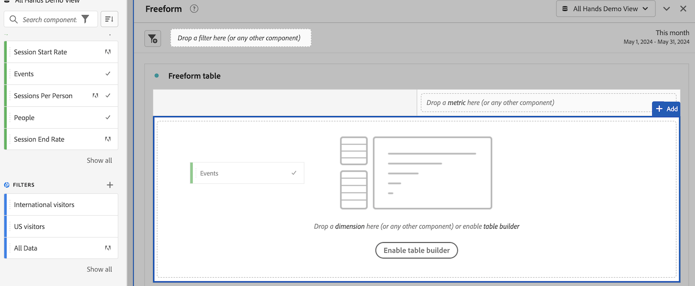
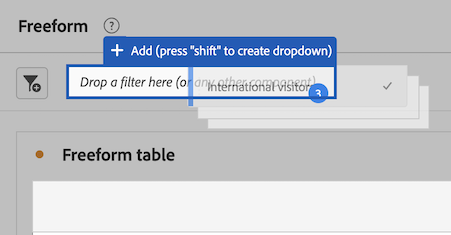

# Uso de componentes en Analysis Workspace

Los componentes constituyen los datos reales de cualquier proyecto de Analysis Workspace. Los componentes están formados por dimensiones, métricas, filtros e intervalos de fechas. Puede añadir componentes a un proyecto arrastrándolos a visualizaciones o paneles.

Para obtener información general sobre los tipos de componentes que puede agregar, consulte [Resumen de componentes](/help/components/overview.md).

>[!TIP]
>
>Para obtener información sobre cada componente, seleccione el icono de información junto al nombre de un componente en el carril izquierdo de Analysis Workspace.

## Empezar a añadir componentes a un proyecto

1. [Creación de un proyecto en Analysis Workspace](/help/analysis-workspace/build-workspace-project/create-projects.md) si aún no lo ha hecho.

1. [Agregar un panel](/help/analysis-workspace/c-panels/panels.md) o [añadir una visualización](/help/analysis-workspace/visualizations/freeform-analysis-visualizations.md#add-visualizations-to-a-panel) al proyecto en Analysis Workspace.

   Si agrega un componente a un proyecto en blanco, se crea automáticamente una visualización de tabla de forma libre.

1. Seleccione el icono **[!UICONTROL Componentes]** en el carril izquierdo.

   

1. Desplácese hasta el componente que desee añadir o búsquelo y arrástrelo a un panel o a una visualización dentro del proyecto.

   Por ejemplo, puede arrastrar un filtro a la zona de colocación de filtros en el encabezado de un panel.

   

1. Para obtener información más detallada, continúe con una de las siguientes secciones, según el tipo de componente que esté agregando:

   * [Adición de dimensiones a un proyecto](#add-dimensions-to-a-project)

   * [Agregar métricas a un proyecto](#add-metrics-to-a-project)

   * [Añadir filtro a un proyecto](#add-filters-to-a-project)

   * [Adición de intervalos de fechas a un proyecto](#add-date-ranges-to-a-project)

## Adición de dimensiones a un proyecto

[Dimension](/help/components/dimensions/overview.md) son variables en Adobe Analytics que generalmente contienen valores de cadena. Por el contrario, las [métricas](/help/components/calc-metrics/calc-metr-overview.md) contienen valores numéricos que se vinculan a una dimensión. Un informe básico muestra filas de valores de cadena (dimensión) frente a una columna de valores numéricos (métrica).

1. Comience a añadir una dimensión al proyecto en Analysis Workspace, tal como se describe en [Empezar a añadir componentes a un proyecto](#begin-adding-components-to-a-project).

1. Elija uno de los siguientes métodos para añadir dimensiones y determinar el tipo de datos que desea analizar:

   * Arrastre una dimensión a una visualización (como una tabla de forma libre) en Analysis Workspace.

     

   * Arrastre una o más dimensiones del carril izquierdo a la zona de colocación de filtros para crear un filtro ad hoc, tal como se describe en [Añadir filtros a un proyecto](#add-filters-to-a-project).

Para obtener más información sobre el uso de dimensiones en Analysis Workspace, consulte [Previsualizar dimensiones](/help/components/dimensions/view-dimensions.md), [Desglose de dimensiones](/help/components/dimensions/t-breakdown-fa.md), y [Dimensiones de partición de tiempo](/help/components/dimensions/time-parting-dimensions.md).

## Agregar métricas a un proyecto

Las métricas permiten cuantificar los puntos de datos en Analysis Workspace. Normalmente se utilizan como columnas en una visualización y están vinculadas a las dimensiones.

Para agregar una métrica a un proyecto en Analysis Workspace:

1. Comience a añadir una métrica al proyecto en Analysis Workspace, tal como se describe en [Empezar a añadir componentes a un proyecto](#begin-adding-components-to-a-project).

1. Elija uno de los siguientes métodos para agregar una métrica en Analysis Workspace:

   * Arrastre una métrica a la zona de colocación de métricas en una tabla de forma libre vacía para ver las tendencias de esa métrica durante el período de fecha del proyecto.

     

   * Arrastrar una métrica cuando haya una dimensión presente para verla en comparación con cada elemento de dimensión.

   * Arrastrar una métrica sobre un encabezado de métrica existente para reemplazarla.

   * Arrastrar una métrica junto a un encabezado para ver ambas métricas en paralelo.

Para obtener más información sobre las métricas, consulte [Resumen de métricas calculadas](/help/components/calc-metrics/calc-metr-overview.md).

## Añadir filtros a un proyecto

[Filtros](/help/components/filters/filters-overview.md) permiten identificar subconjuntos de visitantes en función de sus características o de interacciones específicas.

Para agregar un filtro a un proyecto en Analysis Workspace:

1. Comience a añadir un filtro al proyecto en Analysis Workspace, tal como se describe en [Empezar a añadir componentes a un proyecto](#begin-adding-components-to-a-project).

1. Elija uno de los siguientes métodos para empezar a filtrar el panel:

   * Arrastre un filtro individual desde el carril izquierdo a la zona de colocación de filtros.

     

   * Mantenga pulsada la tecla Mayús o Ctrl para seleccionar varios filtros en el carril izquierdo y, a continuación, mantenga pulsada la tecla Mayús mientras los suelta en la zona de colocación de filtros.

     

     Esto crea un menú desplegable, que permite a los usuarios del panel elegir el filtro que desean aplicar. El menú desplegable contiene un [!UICONTROL **Sin filtro**] que los usuarios pueden seleccionar, lo que deja el panel sin filtrar.

     Puede seleccionar la (x) para eliminar cualquier opción del menú desplegable. Si elimina el [!UICONTROL **Sin filtro**] , se requiere un filtro.

   * Cree filtros específicos arrastrando componentes que no sean filtros a la zona de colocación. Esto puede ahorrarle el tiempo y el tener que utilizar el Generador de filtros. Los filtros creados de esta manera se definen automáticamente como filtros de nivel de visita individual. Puede modificar esta definición haciendo clic en el icono de información (i) junto al filtro, seleccionando el icono de edición con forma de lápiz y editándola en el Generador de filtros.

     Los filtros ad hoc son un tipo de filtro rápido y son locales del proyecto. No aparecen en el carril izquierdo a menos que las haga públicas.

     Para obtener más información, consulte [Filtros rápidos](/help/components/filters/quick-filters.md).

Para obtener más información sobre cómo utilizar la zona de colocación de filtros en un panel para filtrar el panel, consulte [Zona de colocación](/help/analysis-workspace/c-panels/panels.md#drop-zone) in [Información general de paneles](/help/analysis-workspace/c-panels/panels.md).

## Adición de intervalos de fechas a un proyecto

[Intervalos de fechas](/help/components/date-ranges/custom-date-ranges.md) determine el lapso de tiempo de la creación de informes en Analysis Workspace y se pueda aplicar a uno o varios paneles dentro de un proyecto.

Cada panel incluye un intervalo de fechas de forma predeterminada. Existen varias formas de actualizar un intervalo de fechas para un panel. Una forma de actualizar el intervalo de fechas de un panel en Analysis Workspace es arrastrar un componente de intervalo de fechas desde el carril izquierdo:

1. Comience a añadir un intervalo de fechas al proyecto en Analysis Workspace, tal como se describe en [Empezar a añadir componentes a un proyecto](#begin-adding-components-to-a-project).

1. Arrastre un intervalo de fechas desde el carril izquierdo al intervalo de fechas actual en la parte superior derecha del panel.

   

Para obtener más información sobre cómo utilizar calendarios e intervalos de fechas en Analysis Workspace, consulte [Resumen de calendario e intervalos de fechas](/help/components/date-ranges/custom-date-ranges.md).
