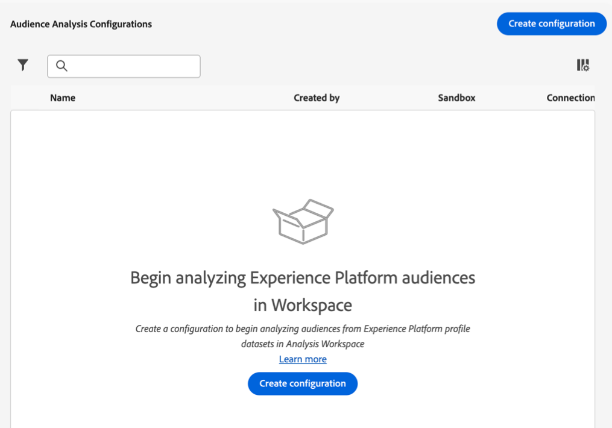
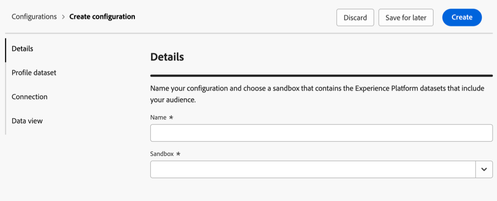
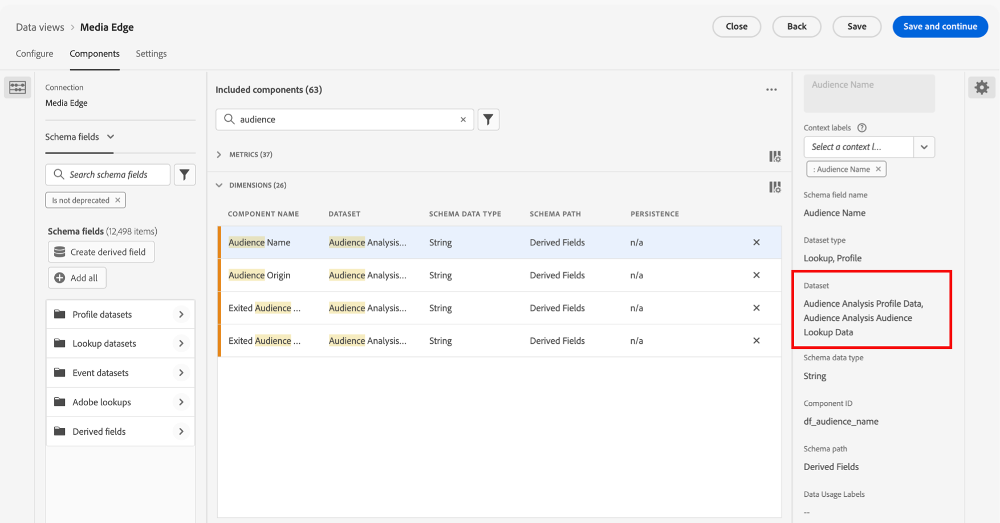

# Configuración del análisis de audiencia {#configure-audience-analysis}

<!-- markdownlint-disable MD034 -->

>[!CONTEXTUALHELP]
>id="cja-audience-analysis-merge-policy"
>title="Política de combinación"
>abstract="Las políticas de combinación combinan datos de perfil de varios conjuntos de datos en perfiles de cliente unificados utilizados para la creación de audiencias. Seleccione &quot;Predeterminado basado en el tiempo&quot; si ve varias políticas de combinación y no está seguro de cuál elegir. O bien, consulte con su equipo de datos para conocer qué audiencias están asociadas con cada política de combinación."

<!-- markdownlint-enable MD034 -->

<!-- markdownlint-disable MD034 -->

>[!CONTEXTUALHELP]
>id="cja-audience-analysis-sandbox"
>title="Zona protegida"
>abstract="Seleccione el simulador para pruebas que contiene los conjuntos de datos de perfil de Experience Platform correctos. Estos conjuntos de datos deben contener los datos de audiencia sobre los que desee informar en Analysis Workspace. "

<!-- markdownlint-enable MD034 -->

<!-- markdownlint-disable MD034 -->

>[!CONTEXTUALHELP]
>id="cja-audience-person-id"
>title="ID de la persona"
>abstract="Seleccione un campo del esquema que represente el ID de persona. La selección se limita a la lista de campos del esquema que están marcados como Identidad y tienen un área de nombres de identidad."

<!-- markdownlint-enable MD034 -->

<!-- markdownlint-disable MD034 -->

>[!CONTEXTUALHELP]
>id="cja-audience-namespace"
>title="Utilizar el espacio de nombres de identidad principal"
>abstract="Active esta opción si desea que Customer Journey Analytics encuentre la identidad en el mapa de identidad que está marcado con un atributo primary=true y, a continuación, utilice esa identidad como ID de persona para esa fila. Esta identidad es la clave principal que se utiliza en el Experience Platform para la partición.  Si deja esta opción deshabilitada, seleccione un área de nombres del campo Área de nombres de identidad a continuación. Customer Journey Analytics busca en el mapa de identidad de cada fila esta clave de área de nombres y utiliza la identidad de dicha área de nombres como ID de persona para esa fila."

<!-- markdownlint-enable MD034 -->

El análisis de audiencia le permite introducir datos de pertenencia a audiencias de conjuntos de datos de perfil de Experience Platform en una conexión de Customer Journey Analytics. Las audiencias están disponibles como nuevas dimensiones para su uso en Analysis Workspace. Para obtener información general más detallada acerca del análisis de audiencia, vea [Resumen del análisis de audiencia](/help/connections/audience-analysis/audience-analysis-overview.md).

## Creación de una configuración de análisis de audiencia

Al crear una configuración de análisis de audiencia, selecciona la zona protegida y la política de combinación asociadas a las audiencias de Experience Platform que desea analizar. Customer Journey Analytics crea un nuevo conjunto de datos de búsqueda y, a continuación, agrega automáticamente el conjunto de datos de búsqueda y el conjunto de datos de perfil a la conexión que elija.

Solo los administradores del sistema pueden crear configuraciones de análisis de audiencia.

Para crear una configuración de análisis de audiencia:

1. En Customer Journey Analytics, seleccione **[!UICONTROL Administración de datos]** > **[!UICONTROL Configuración de análisis de audiencia]**.

   

1. Seleccione **[!UICONTROL Crear configuración]**.

   

1. En la sección **[!UICONTROL Detalles]**, especifique la siguiente información:

   | Campo | Descripción |
   |---------|----------|
   | **[!UICONTROL Nombre]** | Especifique un nombre para la configuración. |
   | **[!UICONTROL Zona protegida]** | Seleccione el simulador para pruebas de Experience Platform que contiene el conjunto de datos de perfil que desea agregar a su conexión. Una sola zona protegida puede admitir hasta 100 configuraciones de análisis de audiencia. 
Adobe Experience Platform proporciona [zonas protegidas](https://experienceleague.adobe.com/es/docs/experience-platform/sandbox/home) limitadas que dividen una sola instancia de Platform en entornos virtuales independientes para ayudar a desarrollar y desarrollar aplicaciones de experiencia digital. Puede considerar las zonas protegidas como “silos de datos” que contienen conjuntos de datos. Las zonas protegidas se utilizan para controlar el acceso a los conjuntos de datos.
 |

1. En la sección **[!UICONTROL Conjunto de datos de perfil]**, especifique la siguiente información:

   | Campo | Descripción |
   |---------|----------|
   | **[!UICONTROL Política de combinación]** | Seleccione la política de combinación que corresponde al conjunto de datos de perfil que desea utilizar para el análisis de público. 
Las políticas de combinación determinan cómo Adobe Experience Platform combina los datos de perfil de varios conjuntos de datos en perfiles de cliente unificados que se utilizan para la creación de audiencias. La política de combinación que seleccione afecta a los atributos del perfil que se incluyen en las audiencias. Cada día se genera una instantánea de estos datos en Experience Platform. Esta instantánea proporciona una vista estática de los datos en un momento específico y no incluye datos de evento.

Seleccione la política de combinación **[!UICONTROL Basada en tiempo predeterminado]** si ve varias políticas de combinación y no está seguro de cuál elegir. También puede consultar con su equipo de datos para comprender mejor qué audiencias están asociadas con cada política de combinación.
 |
   | **[!UICONTROL Conjunto de datos de perfil]** | El conjunto de datos de perfil asociado a la política de combinación seleccionada. Este conjunto de datos de perfil incluye los datos de audiencia de Experience Platform que desea analizar. Este conjunto de datos de perfil se agrega a la conexión que seleccione.
Después de elegir una política de combinación, se muestra la exportación de instantáneas de perfil. Por ejemplo: `Profile-Snapshot-Export-abbc7093-80f4-4b49-b96e-e743397d763f`.

Para obtener más información, consulte [Conjuntos de datos de atributos de perfil](https://experienceleague.adobe.com/en/docs/experience-platform/dashboards/query#profile-attribute-datasets) en la Guía de paneles de Experience Platform.
 |

1. En la sección **[!UICONTROL Conexión]**, haga clic en **[!UICONTROL Seleccionar una conexión]**.

1. En el cuadro de diálogo Conexiones, seleccione la casilla de verificación situada junto a la conexión donde desea agregar el conjunto de datos de perfil y, a continuación, seleccione **[!UICONTROL Usar conexión]**.

   Una conexión solo se puede asociar a una configuración de análisis de audiencia.

1. Especifique la siguiente información para configurar la conexión:

   | Campo | Descripción |
   |---------|----------|
   | **[!UICONTROL ID de la persona]** | Seleccione un campo del esquema que represente el ID de persona. La selección se limita a la lista de campos del esquema que están marcados como Identidad y no tienen un área de nombres de identidad.
Si no hay ID de persona para elegir, significa que uno o más ID de persona no se han definido en el esquema. Consulte [Definición de campos de identidad en la IU](https://experienceleague.adobe.com/es/docs/experience-platform/xdm/ui/fields/identity) para obtener más información.
 |
   | **[!UICONTROL Usar área de nombres de identidad principal]** | Esta opción se muestra si selecciona **[!UICONTROL Mapa de identidad]** para el ID de persona.
Active esta opción si desea que Customer Journey Analytics encuentre la identidad en el mapa de identidad que está marcado con un atributo primary=true y, a continuación, utilice esa identidad como ID de persona para esa fila. Esta identidad es la clave principal que se utiliza en el Experience Platform para la partición. Y esta identidad también es la candidata principal para su uso como ID de persona de Customer Journey Analytics (según la configuración del conjunto de datos en una conexión de Customer Journey Analytics).
 |
   | **[!UICONTROL Área de nombres de identidad]** | Esta opción se muestra si selecciona **[!UICONTROL Mapa de identidad]** para el ID de persona. Esta opción está desactivada si utiliza el área de nombres de ID principal. 
Los espacios de nombres de identidad son un componente del [servicio de identidad de Experience Platform](https://experienceleague.adobe.com/es/docs/experience-platform/identity/features/namespaces). Los espacios de nombres sirven como indicadores del contexto al que se relaciona una identidad. Si especifica un área de nombres, Customer Journey Analytics busca en el mapa de identidad de cada fila esta clave de área de nombres y utiliza la identidad de dicha área de nombres como ID de persona para esa fila. Dado que Customer Journey Analytics no puede realizar una exploración completa de todos los conjuntos de datos de todas las filas para determinar qué áreas de nombres están presentes, en el menú desplegable se muestran todas las áreas de nombres posibles. Debe saber qué espacios de nombres se especifican en los datos; estos espacios de nombres no se detectan automáticamente.
 |

1. En la sección **[!UICONTROL Vistas de datos]**, haga clic en **[!UICONTROL Seleccionar vistas de datos]**.

1. En el cuadro de diálogo Vistas de datos, active la casilla que hay junto a una o varias vistas de datos que desea utilizar para analizar datos de audiencia de Experience Platform en Analysis Workspace. Estas vistas de datos se configuran automáticamente con los datos de audiencia de Experience Platform para la creación de informes.

1. Seleccione **[!UICONTROL Usar vistas de datos]**.

1. Seleccione **[!UICONTROL Crear]** para crear la configuración.

   >[!IMPORTANT]
   >
   >Dado que el conjunto de datos de perfil se actualiza una vez al día, las audiencias están disponibles en las vistas de datos de Customer Journey Analytics al día siguiente de crear la configuración de análisis de audiencia.

1. Después de 24 horas, [vea las dimensiones de audiencia en la vista de datos](#view-audience-dimensions-in-the-data-view) para verificar que estén disponibles en las vistas de datos que seleccionó.

## Visualización de dimensiones de audiencia en la vista de datos

Después de [crear una configuración de análisis de audiencia](#create-an-audience-analysis-configuration), puede comprobar que las dimensiones de audiencia se agregaron a las vistas de datos que seleccionó durante la configuración.

Para ver las dimensiones de audiencia en la vista de datos, debe ser administrador de perfiles de producto para el perfil de producto al que está asignada la vista de datos. Para obtener más información, consulte [Control de acceso](/help/technotes/access-control.md).

Para ver las dimensiones de análisis de audiencia en la vista de datos:

1. En Customer Journey Analytics, seleccione **[!UICONTROL Administración de datos]** > **[!UICONTROL Vistas de datos]**.

1. En la sección **[!UICONTROL Dimensiones]**, deberían estar disponibles las siguientes dimensiones:

   * **[!UICONTROL Nombre de audiencia]**

   * **[!UICONTROL Origen de audiencia]**

   * **[!UICONTROL Origen de audiencia saliente]**

   * **[!UICONTROL Nombre de audiencia saliente]**

   Tenga en cuenta que cada una de estas dimensiones se agregó al conjunto de datos de perfil asociado a la política de combinación que seleccionó durante la configuración de análisis de audiencia, y cada una se agregó al nuevo conjunto de datos de búsqueda que se creó.

   

1. Utilice las dimensiones de análisis de audiencia en Analysis Workspace.

   Los usuarios que tienen acceso para utilizar la vista de datos en Analysis Workspace ahora pueden ver las nuevas dimensiones y utilizarlas en sus análisis. Para obtener información sobre cómo usar las dimensiones de análisis de audiencia en Analysis Workspace, consulte [Análisis de audiencias de Experience Platform en Customer Journey Analytics](/help/connections/audience-analysis/analyze-audiences.md).

