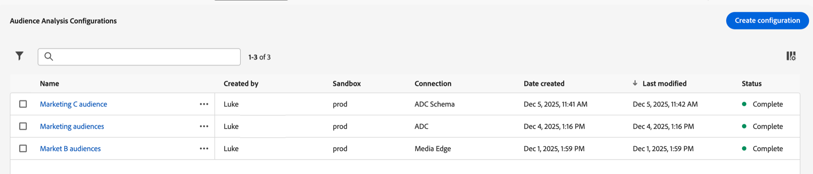

# Administrar configuraciones de análisis de audiencia{#manage-audience-analysis}

Después de [crear configuraciones de análisis de audiencia](/help/connections/audience-analysis/audience-analysis-configure.md), puede verlas, editarlas o eliminarlas.

Solo los administradores del sistema pueden administrar las configuraciones de análisis de audiencia.

Para obtener información acerca del análisis de audiencia, vea [Resumen del análisis de audiencia](/help/connections/audience-analysis/audience-analysis-overview.md).

## Ver y filtrar configuraciones existentes

Para ver las configuraciones de análisis de audiencia existentes:

1. En Customer Journey Analytics, seleccione **[!UICONTROL Administración de datos]** > **[!UICONTROL Configuración de análisis de audiencia]**.

   

   Las siguientes columnas de información están disponibles para cada configuración:

   * **[!UICONTROL Creado por]**: El usuario que creó la configuración.

   * **[!UICONTROL espacio aislado]**: El espacio aislado de Experience Platform que contiene el conjunto de datos de perfil que agregó a su conexión.

   * **[!UICONTROL Conexión]**: La conexión que agregó a su configuración.

   * **[!UICONTROL Fecha de creación]**: La fecha en que se creó la configuración.

   * **[!UICONTROL Última modificación]**: Fecha en la que se modificó la configuración por última vez.

   * **[!UICONTROL Estado]**: El estado de la configuración. Los estados posibles son Completo, En curso o Error. <!--true?-->

   Puede ocultar cualquier columna seleccionando el icono de columna , deseleccionando cualquier columna que desee ocultar y, a continuación, seleccionando **[!UICONTROL Aplicar]**.

1. (Opcional) Para filtrar la lista de configuraciones, seleccione **Filtro**  y, a continuación, filtre según cualquiera de los siguientes criterios:

   * **[!UICONTROL Conexión]**

   * **[!UICONTROL Creado por]**

   * **[!UICONTROL Zona protegida]**

   * **[!UICONTROL Estado]**

## Editar una configuración

Para editar una configuración de análisis de audiencia existente:

1. En Customer Journey Analytics, seleccione **[!UICONTROL Administración de datos]** > **[!UICONTROL Configuración de análisis de audiencia]**.

   

1. Seleccione el nombre de la configuración que desea editar.

   O bien

   Seleccione la casilla que está junto a la configuración que desea editar y, a continuación, seleccione **[!UICONTROL Editar]**.

1. Realice los cambios que desee en la configuración y, a continuación, seleccione **[!UICONTROL Guardar]**.

## Eliminar una configuración

Para eliminar una configuración de análisis de audiencia existente:

1. En Customer Journey Analytics, seleccione **[!UICONTROL Administración de datos]** > **[!UICONTROL Configuración de análisis de audiencia]**.

   

1. Seleccione la casilla de verificación situada junto a la configuración que desee eliminar y, a continuación, seleccione **[!UICONTROL Eliminar]**.
