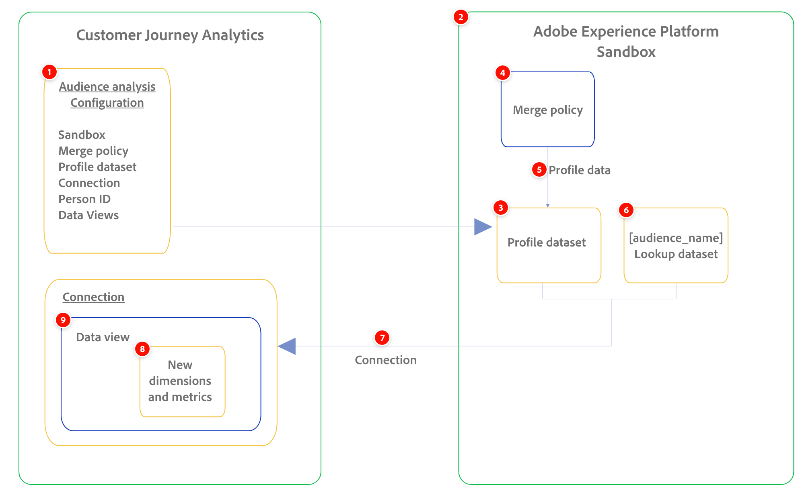

# Resumen de análisis de audiencia

<!-- add hidden text in this article when this feature releases: /help/components/audiences/audiences-overview.md and this article: /help/analysis-workspace/templates/use-templates.md-->

>[!NOTE]
>
>Comprenda la diferencia entre el análisis de audiencia y la publicación de audiencias:
>
>* **Análisis de audiencia**: le permite introducir datos de pertenencia a audiencias de conjuntos de datos de perfil de Experience Platform en una conexión de Customer Journey Analytics.
>* **Publicación de audiencias**: Permite crear y publicar audiencias que se hayan descubierto en Customer Journey Analytics en Adobe Experience Platform para personalización y segmentación de clientes. Para obtener información acerca de la publicación de audiencias, vea [Resumen de publicación de audiencias](/help/components/audiences/audiences-overview.md).

El análisis de audiencia le permite introducir datos de pertenencia a audiencias de conjuntos de datos de perfil de Experience Platform en una conexión de Customer Journey Analytics. Las audiencias están disponibles como nuevas dimensiones para su uso en Analysis Workspace.

El diagrama siguiente y la tabla asociada muestran una representación de alto nivel de cómo una configuración de análisis de audiencia en Customer Journey Analytics hace que los datos de audiencia de Experience Platform estén disponibles en Analysis Workspace:

| Número | Función | Función |
|---------|----------|---------|
| 1 | Configuración de análisis de audiencia | Interfaz de configuración en Customer Journey Analytics utilizada para configurar el análisis de audiencia. |
| 2 | Zona protegida | Debe contener el conjunto de datos de perfil que desee agregar a su conexión. |
| 3 | Conjunto de datos del perfil | Debe incluir los datos de audiencia de Experience Platform que desee analizar. Este conjunto de datos de perfil se agrega a la conexión que seleccione. |
| 4 | Política de combinación | La política de combinación asociada a las audiencias de Experience Platform que desea analizar. |
| 5 | Datos de perfil | Los datos de perfil asociados con la política de combinación que seleccione. Estos datos están disponibles en los conjuntos de datos de Experience Platform. |
| 6 | Nuevo conjunto de datos de búsqueda | Proporciona nombres descriptivos para las nuevas dimensiones de audiencia que se crean. El conjunto de datos de búsqueda se crea automáticamente y se agrega a la conexión, junto con el conjunto de datos de perfil que seleccione. |
| 7 | Conexión | Conexión en la que desea agregar el conjunto de datos de perfil seleccionado. |
| 8 | Nuevas dimensiones de audiencia | Nuevas dimensiones de audiencia <!--and metrics?--> que representan las audiencias de Experience Platform incluidas en el conjunto de datos de perfil que seleccionó y que están disponibles para la creación de informes en Analysis Workspace. Estas dimensiones se crean automáticamente. |
| 9 | Vistas de datos | Las vistas de datos que seleccione y que estén asociadas a la conexión. Estas son las vistas de datos que desea utilizar para analizar los datos de audiencia de Experience Platform en Analysis Workspace. Estas vistas de datos se configuran automáticamente con los datos de audiencia de Experience Platform para la creación de informes. |
| 10 | Analysis Workspace | Área de Customer Journey Analytics en la que se crean informes que incluyen las audiencias de Experience Platform que se incorporan. |

## Configuración del análisis de audiencia

Al configurar el análisis de audiencia, selecciona la zona protegida y la política de combinación asociadas con las audiencias de Experience Platform que desea analizar. Customer Journey Analytics crea un nuevo conjunto de datos de búsqueda y, a continuación, agrega automáticamente el conjunto de datos de búsqueda y el conjunto de datos de perfil a la conexión que elija.

Para obtener más información, consulte [Configurar análisis de audiencia](/help/connections/audience-analysis/audience-analysis-configure.md).

## Administrar configuraciones de análisis de audiencia

Puede administrar las configuraciones de análisis de audiencia una vez creadas. Puede ver, editar y eliminar configuraciones.

Para obtener información sobre cómo administrar las configuraciones de análisis de audiencia existentes, consulte [Administrar configuraciones de análisis de audiencia](/help/connections/audience-analysis/audience-analysis-manage.md).

## Analizar datos de audiencias en Customer Journey Analytics

Con los datos de audiencia disponibles en Customer Journey Analytics, puede obtener perspectivas procesables sobre cómo se comportan los miembros de la audiencia en varios canales.

Por ejemplo, puede rastrear el comportamiento de clientes individuales que se incluyeron en la misma promoción de correo electrónico. Con la audiencia disponible en Customer Journey Analytics, puede ver los siguientes tipos de información sobre cada miembro de la audiencia:

* Pulsaciones desde el correo electrónico hasta el sitio que finalmente dio lugar a una compra

* Miembros de la audiencia que finalmente realizaron una compra en la tienda

Para obtener más información, consulte [Analizar audiencias de Experience Platform en Customer Journey Analytics](/help/connections/audience-analysis/analyze-audiences.md).

## Función de análisis de audiencia y requisitos de permisos

Se requieren las siguientes funciones de Customer Journey Analytics y permisos de Experience Platform para el análisis de audiencias:

| Compatibilidad | Requisitos de rol o permiso de Customer Journey Analytics | Requisitos de permiso de Experience Platform |
|---------|----------|----------|
| [Crear configuraciones de análisis de audiencia](/help/connections/audience-analysis/audience-analysis-configure.md) | Administrador del sistema | <ul><li>Conjuntos de datos: permisos de lectura</li><li>Esquemas: leer, escribir</li><li>e Áreas de nombres de identidad: Lectura</li></ul> |
| [Ver dimensiones de análisis de audiencia en la vista de datos](/help/connections/audience-analysis/audience-analysis-configure.md#view-audience-dimensions-in-the-data-view) | Administrador de perfil de producto para el perfil de producto al que está asignada la vista de datos 
Para obtener más información, consulte [Control de acceso](/help/technotes/access-control.md).
 | N/A |
| Uso de dimensiones de análisis de audiencia en Analysis Workspace | Acceso a una vista de datos en la que se añadieron las dimensiones de análisis de audiencia | N/A |

