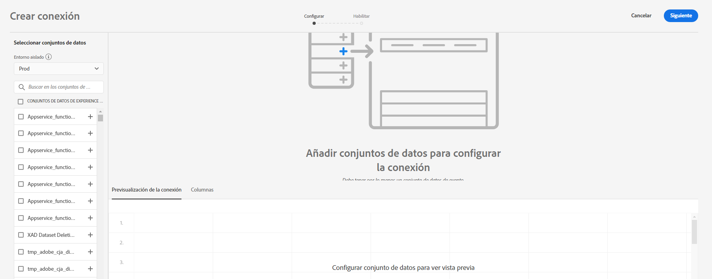
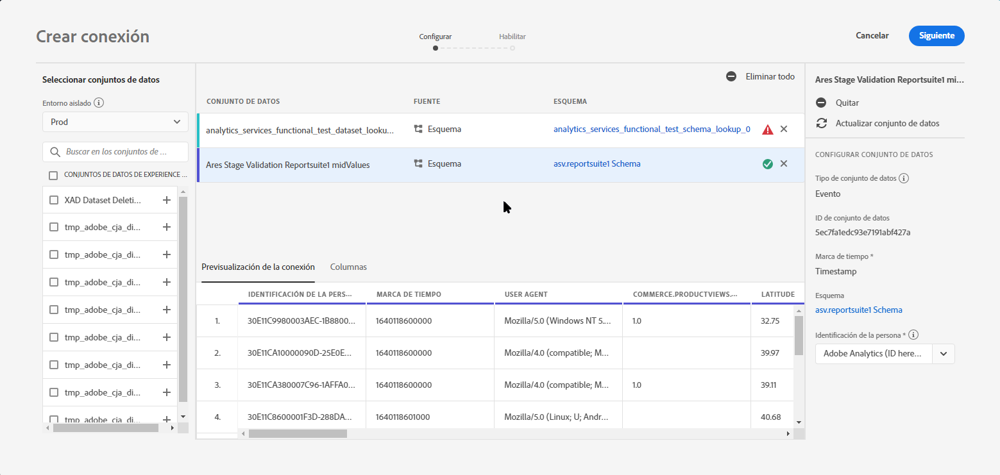
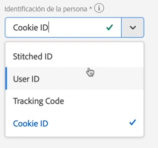
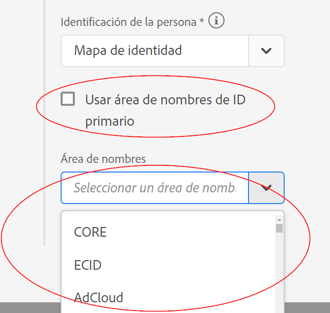
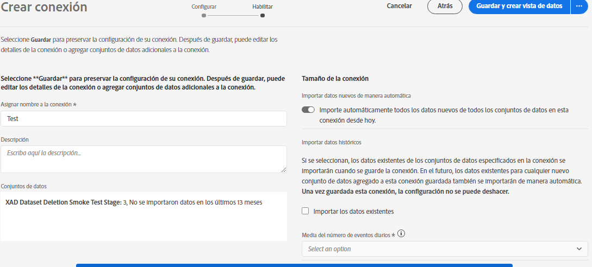

# Crear una conexión

Una conexión le permite integrar conjuntos de datos de [!DNL Adobe Experience Platform] en [!UICONTROL Workspace]. Para informar sobre conjuntos de datos de [!DNL Experience Platform], primero debe establecer una conexión entre conjuntos de datos en [!DNL Experience Platform] y [!UICONTROL Workspace].

Haga clic [aquí](https://experienceleague.adobe.com/docs/customer-journey-analytics-learn/tutorials/connecting-customer-journey-analytics-to-data-sources-in-platform.html?lang=en) para ver un vídeo de información general.

Para crear una conexión de CJA, necesita los siguientes permisos:

Adobe Experience Platform:
* Modelado de datos: Esquemas de vista, Administrar esquemas
* Administración de datos: Ver conjuntos de datos, Administrar conjuntos de datos
* Ingesta de datos: Administrar fuentes

Customer Journey Analytics
* Acceso de administrador de productos

>[!IMPORTANT]
>
>Puede combinar varios conjuntos de datos de [!DNL Experience Platform] en una sola conexión.

## Seleccionar entorno limitado y conjuntos de datos

1. Acceda a [https://analytics.adobe.com](https://analytics.adobe.com).

1. Haga clic en la pestaña **[!UICONTROL Conexiones]**.

1. Haga clic en **[!UICONTROL Crear nueva conexión]** en la parte superior derecha.

   

1. Elija un simulador para pruebas en Experience Platform que contenga los conjuntos de datos a los que desea conectarse.

   Adobe Experience Platform proporciona [entornos](https://docs.adobe.com/content/help/es-ES/experience-platform/sandbox/home.html) limitados que dividen una sola instancia de Platform en entornos virtuales independientes para ayudar a desarrollar y desarrollar aplicaciones de experiencia digital. Puede considerar los entornos limitados como “silos de datos” que contienen conjuntos de datos. Los Simuladores para pruebas se utilizan para controlar el acceso a los conjuntos de datos.  Una vez seleccionado el simulador para pruebas, el carril izquierdo muestra todos los conjuntos de datos del simulador de pruebas desde los que puede extraer datos.

   >[!IMPORTANT]
   >
   >No puede acceder a los datos de los entornos limitados, es decir, solo puede combinar conjuntos de datos ubicados dentro del mismo entorno limitado.

1. Seleccione uno o varios conjuntos de datos a los que desee extraer [!UICONTROL Customer Journey Analytics] y haga clic en **[!UICONTROL Añadir]**.

   (Si tiene muchos conjuntos de datos para elegir, puede buscar los correctos mediante la barra de búsqueda **[!UICONTROL Buscar conjuntos de datos]** que se encuentra arriba de la lista de conjuntos de datos).

## Configurar el conjunto de datos

En el lado derecho, ahora puede configurar el conjunto de datos que ha agregado.

1. **[!UICONTROL Tipo de conjunto de datos]**: para cada conjunto de datos que agregó a esta conexión, [!UICONTROL Customer Journey Analytics] establece de manera automática el tipo de conjunto de datos en función de los datos que ingresan.

   Existen tres tipos diferentes de conjuntos de datos: datos: datos [!UICONTROL de evento], datos [!UICONTROL de perfil] y datos [!UICONTROL de búsqueda].

   | Tipo de conjunto de datos | Descripción | Marca de tiempo | Esquema | ID de la persona |
   |---|---|---|---|---|
   | [!UICONTROL Evento] | Datos que representan eventos en el tiempo (p. ej., visitas web, interacciones, transacciones, datos de TPV, datos de encuesta, datos de impresión de publicidad, etc.). Por ejemplo, estos datos podrían ser datos típicos del flujo de navegación, con un ID de cliente o un ID de cookie y una marca de tiempo. Con los datos de evento, tiene flexibilidad para saber qué ID se utiliza como ID de persona. | Se establece automáticamente en el campo de marca de tiempo predeterminado a partir de los esquemas basados en eventos en [!UICONTROL Experience Platform]. | Cualquier esquema integrado o personalizado basado en una clase XDM con el comportamiento “Serie temporal”. Algunos ejemplos son “Evento de experiencias XDM” o “Evento de decisiones XDM”. | Puede elegir qué ID de persona desea incluir. Cada esquema del conjunto de datos definido en Experience Platform puede tener su propio conjunto de una o más identidades definidas y asociadas a un área de nombres de identidad. Cualquiera de ellos puede utilizarse como ID de persona. Algunos ejemplos son: ID de cookie, ID con título, ID de usuario, código de seguimiento, etc. |
   | [!UICONTROL Búsqueda] | Estos datos se utilizan para buscar valores o claves encontrados en los datos de Evento o de Perfil. Por ejemplo, puede cargar datos de búsqueda que asignen ID numéricos en los datos de evento a los nombres de producto. Consulte [este caso de uso](/help/use-cases/b2b.md) para ver un ejemplo. | N/A | Cualquier esquema integrado o personalizado basado en una clase XDM con el comportamiento “Record”, excepto la clase “XDM Individual Profile”. | N/D |
   | [!UICONTROL Perfil] | Datos que se aplican a sus visitas, usuarios o clientes en los datos de [!UICONTROL evento]. Por ejemplo, le permite cargar datos de CRM sobre sus clientes. | N/D | Cualquier esquema integrado o personalizado basado en la clase “XDM Individual Perfil”. | Puede elegir qué ID de persona desea incluir. Cada conjunto de datos definido en [!DNL Experience Platform] tiene su propio conjunto de uno o más ID de persona definidos, como ID de cookie, ID de título, ID de usuario, código de seguimiento, etc. **Nota**: si crea una conexión que incluye conjuntos de datos con distintos ID, el sistema de informes reflejará eso. Para combinar conjuntos de datos correctamente, necesita usar el mismo ID de persona. |

1. **[!UICONTROL ID de conjunto de datos]**: este ID se genera automáticamente.

1. **[!UICONTROL Marca de hora]**: solo para conjuntos de datos de evento, esta configuración se establece automáticamente en el campo de marca de tiempo predeterminado de esquemas basados en eventos en [!UICONTROL Experience Platform].

1. **[!UICONTROL Esquema]**: este es el [esquema](https://docs.adobe.com/content/help/es-ES/experience-platform/xdm/schema/composition.html) en función del cual se creó el conjunto de datos en Adobe Experience Platform.

1. **[!UICONTROL ID de persona]**: seleccione un ID de persona en la lista desplegable de identidades disponibles. Estas identidades se definieron en el esquema del conjunto de datos en Experience Platform. Consulte a continuación para obtener información sobre cómo usar el mapa de identidad como ID de persona.

   >[!IMPORTANT]
   >
   >Si no hay ID de persona para elegir, significa que uno o más ID de persona no se han definido en el esquema. Mire [este vídeo](https://youtu.be/G_ttmGl_LRU) sobre cómo definir una identidad en Experience Platform.

1. Haga clic en **[!UICONTROL Siguiente]** para ir al cuadro de diálogo [!UICONTROL Activar conexión].

### Use el mapa de identidad como ID de persona

Customer Journey Analytics ahora admite la capacidad de usar el mapa de identidad para su ID de persona. El mapa de identidad es una estructura de datos de mapa que permite a alguien cargar pares de clave -> valor. Las claves son áreas de nombres de identidad y el valor es una estructura que contiene el valor de identidad. El mapa de identidad existe en cada fila o evento cargado y se completa para cada fila en consecuencia.

El mapa de identidad está disponible para cualquier conjunto de datos que utilice un esquema basado en la clase [ExperienceEvent XDM](https://docs.adobe.com/content/help/es-ES/experience-platform/xdm/home.html). Al seleccionar un conjunto de datos para incluir en una conexión CJA, tiene la opción de seleccionar un campo como ID principal o el mapa de identidad:

Si selecciona Mapa de identidad, obtendrá dos opciones de configuración adicionales:

| Opción | Descripción |
|---|---|
| [!UICONTROL Usar área de nombres de ID primario] | Esto indica a CJA, por fila, que busque la identidad en el mapa de identidad que está marcado con un atributo primary=true y que la utilice como ID de persona para esa fila. Esto significa que esta es la clave principal que se utilizará en Experience Platform para la partición. También es el candidato principal para el uso como ID de visitante de CJA (según la configuración del conjunto de datos en una conexión de CJA). |
| [!UICONTROL Área de nombres] | (Esta opción solo está disponible si no utiliza el área de nombres de ID principal). Las áreas de nombres de identidad son un componente de [Identity Service de Adobe Experience Platform](https://docs.adobe.com/content/help/es-ES/experience-platform/identity/namespaces.html) que sirve de indicadores del contexto al que se relaciona una identidad. Si especifica un área de nombres, CJA buscará en el mapa de identidad de cada fila esta clave de área de nombres y utilizará la identidad en el área de nombres como ID de persona para esa fila. Tenga en cuenta que, como CJA no puede hacer una exploración completa de todos los conjuntos de datos de todas las filas para determinar qué áreas de nombres están realmente presentes, en la lista desplegable se enumeran todas las áreas de nombres posibles. Debe saber qué áreas de nombres se especifican en los datos. Esto no se puede detectar automáticamente. |

### Casos extremos del mapa de identidad

En esta tabla se muestran las dos opciones de configuración cuando están presentes los casos extremos y cómo se gestionan:

| Opción | No hay ID presentes en el mapa de identidad | Ningún ID está marcado como principal | Los ID múltiples se marcan como principales | La ID única se marca como principal | Área de nombres no válida con un ID marcado como principal |
|---|---|---|---|---|---|
| **«Usar área de nombres de ID primario» verificado** | La fila la abandona CJA. | La fila se borra con CJA, ya que no se especifica ningún ID principal. | Todos los ID marcados como principales, con todas las áreas de nombres, se extraen en una lista. A continuación, se ordenan alfabéticamente; con esta nueva clasificación, la primera área de nombres con su primer ID se utiliza como ID de persona. | El ID único marcado como principal se utiliza como ID de persona. | Aunque el área de nombres puede no ser válida (no está presente en AEP), CJA utilizará el ID principal de dicha área de nombres como ID de persona. |
| **Área de nombres de un mapa de identidad específica seleccionada** | La fila la abandona CJA. | Todos los ID del área de nombres seleccionada se extraen en una lista y el primero se utiliza como ID de persona. | Todos los ID del área de nombres seleccionada se extraen en una lista y el primero se utiliza como ID de persona. | Todos los ID del área de nombres seleccionada se extraen en una lista y el primero se utiliza como ID de persona. | Todos los ID del área de nombres seleccionada se extraen en una lista y el primero se utiliza como ID de persona. (Solo se puede seleccionar un área de nombres válida en el momento de la creación de la conexión, por lo que no es posible utilizar un área de nombres o ID no válida como ID de persona). |

## Habilitar conexión

1. Para habilitar una conexión, defina esta configuración para toda la conexión, es decir, todos los conjuntos de datos de la conexión:

   | Opción | Descripción |
   | --- | --- |
   | [!UICONTROL Asignar nombre a una conexión] | Asigne un nombre descriptivo a la conexión. La conexión no se puede guardar sin un nombre. |
   | [!UICONTROL Descripción] | Añada más detalles para distinguir esta conexión de otras. |
   | [!UICONTROL Conjuntos de datos] | Los conjuntos de datos que se incluyen en esta conexión. |
   | [!UICONTROL Importe automáticamente todos los conjuntos de datos nuevos en esta conexión desde hoy.] | Seleccione esta opción si desea establecer una conexión continua de modo que los lotes de datos nuevos que se agregan a los conjuntos de datos de esta conexión se transfieran de manera automática a [!UICONTROL Workspace]. |
   | [!UICONTROL Importar los datos existentes] | Al seleccionar esta opción y al guardar la conexión, se importarán todos los datos (históricos) existentes de [!DNL Experience Platform] de todos los conjuntos de datos de relleno de esta conexión. En el futuro, todos los datos históricos existentes para cualquier conjunto de datos nuevo agregado a esta conexión guardada también se importarán de manera automática. Consulte también [Rellenar datos históricos](https://docs.adobe.com/content/help/es-ES/analytics-platform/using/cja-connections/create-connection.html#backfill-historical-data) a continuación. **Tenga en cuenta que, una vez guardada esta conexión, la configuración no se puede modificar.** |
   | [!UICONTROL Cantidad promedio de eventos diarios] | Debe especificar la cantidad promedio de eventos diarios que se importarán (datos nuevos **y** datos de relleno) para todos los conjuntos de datos de la conexión. Seleccione una opción en el menú desplegable. Esto es para que Adobe pueda asignar espacio suficiente para estos datos. Si no conoce la cantidad promedio de eventos diarios que va a importar la compañía, puede hacer una consulta SQL simple en [Adobe Experience Platform Consulta Services](https://docs.adobe.com/content/help/es-ES/experience-platform/query/home.html) para averiguarlo. Consulte Cálculo del número medio de eventos diarios a continuación. |

1. Haga clic en **[!UICONTROL Guardar y crear vista de datos]**. Para ver la documentación, consulte [crear una vista de datos](/help/data-views/create-dataview.md).

### Rellenar con datos históricos

**[!UICONTROL Importar los datos existentes]** le permite rellenar con los datos históricos. Recuerde:

* Se ha eliminado la limitación de relleno (importación de datos históricos). Anteriormente, se podía rellenar un máximo de 2500 millones de filas por su cuenta y, de lo contrario, se requería la participación de técnicos. Ahora puede rellenar los datos por su cuenta sin ningún tipo de limitación.
* Priorizamos los nuevos datos agregados a un conjunto de datos en la conexión, por lo que estos datos tienen la latencia más baja.
* Cualquier dato de relleno (datos históricos) se importa a una velocidad más lenta. La latencia se ve afectada por la cantidad de datos históricos que tiene, combinados con la variable **[!UICONTROL Cantidad promedio de eventos diarios]** que seleccionó. Por ejemplo: si tiene más de mil millones de filas de datos por día, más 3 años de datos históricos, la importación podría tardar varias semanas. Por otro lado, si tiene menos de un millón de filas por día y una semana de datos históricos, eso tomaría menos de una hora.
* El relleno se aplica a toda la conexión, no a cada conjunto de datos individualmente.
* El [Conector de datos de Adobe Analytics](https://docs.adobe.com/content/help/es-ES/platform-learn/tutorials/data-ingestion/ingest-data-from-adobe-analytics.html) importa hasta 13 meses de datos, independientemente de su tamaño.

### Cálculo del número medio de eventos diarios

Este cálculo debe realizarse para todos los conjuntos de datos de la conexión.

1. Vaya a [Servicios de consulta de Adobe Experience Platform](https://docs.adobe.com/content/help/en/experience-platform/query/home.html) y cree una nueva consulta.

1. La consulta tendría un aspecto similar al siguiente: `Select AVG(A.total_events) from (Select DISTINCT COUNT (*) as total_events, date(TIMESTAMP) from analytics_demo_data GROUP BY 2 Having total_events>0) A;`

* En este ejemplo, &quot;analytics_demo_data&quot; es el nombre del conjunto de datos.
* Realice la consulta `Show Tables` para mostrar todos los conjuntos de datos que existen en AEP.
