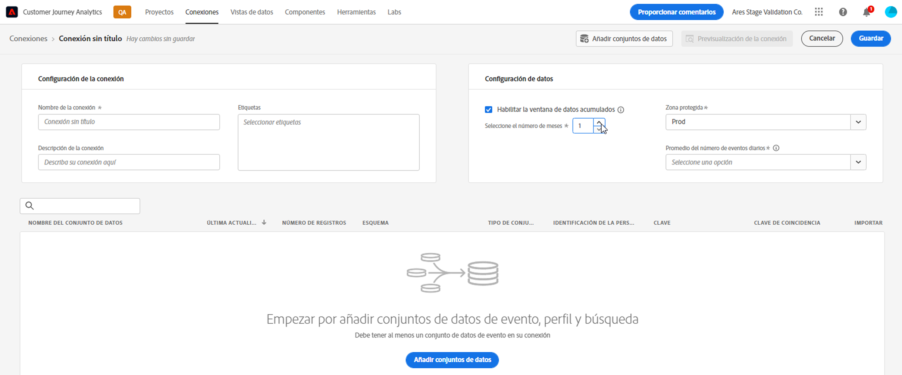
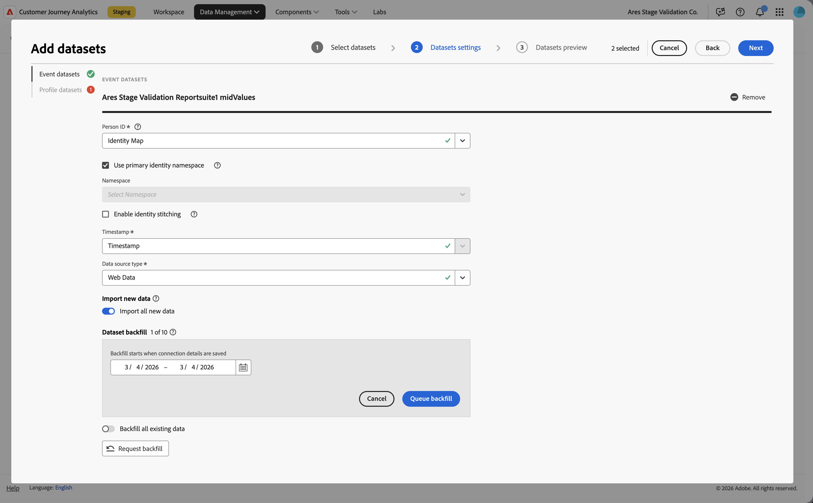
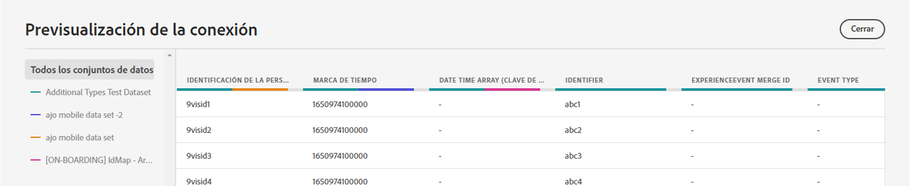
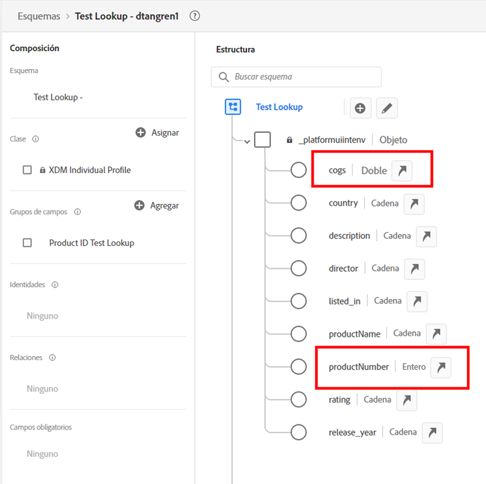
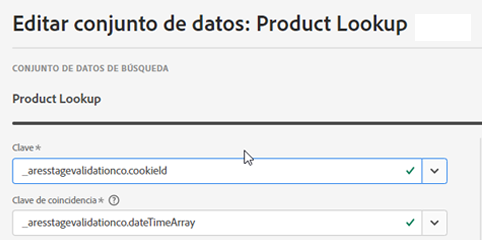

# Crear una conexión

Recientemente se ha lanzado un nuevo flujo de trabajo de conexiones en Customer Journey Analytics (CJA). La nueva experiencia de flujo de trabajo de creación y edición de conexiones reúne todos los ajustes de configuración del conjunto de datos y la conexión al centro de la pantalla con un flujo de trabajo de asistencia.  Hemos proporcionado una experiencia de revisión, configuración y selección de conjuntos de datos detallada con información crítica, como el tipo de conjunto de datos, el tamaño, el esquema, el identificador del conjunto de datos, el estado del lote, el estado de relleno, los ID de persona y mucho más para reducir el riesgo de configurar incorrectamente la conexión. A continuación se muestra una descripción general de las nuevas funciones:

* Puede habilitar un período de retención de datos móvil al crear la conexión.
* Puede agregar y eliminar conjuntos de datos de una conexión. (Al eliminar un conjunto de datos, éste se elimina de la conexión y afecta a las vistas de datos asociadas y a los proyectos de Analysis Workspace subyacentes).
* Puede habilitar y solicitar datos de relleno por conjunto de datos.
* Puede editar conjuntos de datos, por ejemplo, para solicitar otro relleno.
* Puede importar los datos existentes por conjunto de datos.

>[!VIDEO](https://video.tv.adobe.com/v/343044/?quality=12&learn=on)

## Creación y configuración de la conexión {#create-connection}

1. En CJA, haga clic en la pestaña **[!UICONTROL Conexiones]**.
1. Haga clic en **[!UICONTROL Crear nueva conexión]**.

   

1. Configure los ajustes de conexión.

   | Configuración | Descripción |
   | --- | --- |
   | **[!UICONTROL Nombre de la conexión]** | Introduzca un nombre único para la conexión. |
   | **[!UICONTROL Descripción de la conexión]** | Describa el propósito de esta conexión. |
   | **[!UICONTROL Zona protegida]** | Elija una zona protegida en Experience Platform que contenga los conjuntos de datos a los que desea conectarse.<p>Adobe Experience Platform proporciona [zonas protegidas](https://experienceleague.adobe.com/docs/experience-platform/sandbox/home.html?lang=es) limitadas que dividen una sola instancia de Platform en entornos virtuales independientes para ayudar a desarrollar y desarrollar aplicaciones de experiencia digital. Puede considerar los entornos limitados como &quot;silos de datos&quot; que contienen conjuntos de datos. Los entornos limitados se utilizan para controlar el acceso a los conjuntos de datos.<p>Una vez seleccionada la zona protegida, el carril izquierdo muestra todos los conjuntos de datos de la zona protegida desde los que puede extraer datos. |
   | **[!UICONTROL Activar la ventana de datos móviles]** | Si está marcada, esta casilla le permite definir la retención de datos de CJA como un período de tiempo variable en meses (1 mes, 3 meses, 6 meses, etc.), a nivel de conexión.<p>La retención de datos se basa en marcas de hora de conjuntos de datos de evento y se aplica solo a conjuntos de datos de evento. No existe ninguna configuración de ventana de datos móviles para conjuntos de datos de búsqueda o perfil, ya que no hay marcas de tiempo aplicables. Sin embargo, si la conexión incluye perfiles o conjuntos de datos de búsqueda (además de uno o más conjuntos de datos de evento), esos datos se conservarán durante el mismo período de tiempo.<p> La principal ventaja es que solo almacena o genera informes sobre datos que son aplicables y útiles, y elimina los datos más antiguos que ya no son útiles. Le ayuda a mantenerse por debajo de los límites del contrato y reduce el riesgo de costes adicionales.<p>Si deja el valor predeterminado (sin marcar), el período de retención se sustituirá por la configuración de retención de datos de Adobe Experience Platform. Si tiene datos de 25 meses en Experience Platform, CJA recibirá 25 meses de datos mediante el relleno. Si eliminase 10 de esos meses en Platform, CJA conservaría los 15 meses restantes. |
   | **[!UICONTROL Agregar conjuntos de datos]** (consulte más abajo) | Agregue conjuntos de datos si no aparecen conjuntos de datos en su lista de conjuntos de datos. |
   | **[!UICONTROL Nombre del conjunto de datos]** | Seleccione uno o varios conjuntos de datos a los que desee extraer Customer Journey Analytics y haga clic en **[!UICONTROL Añadir]**.<p>(Si tiene muchos conjuntos de datos para elegir, puede buscar los correctos mediante la barra de búsqueda Buscar conjuntos de datos que se encuentra arriba de la lista de conjuntos de datos). |
   | **[!UICONTROL Última actualización]** | Solo para conjuntos de datos de evento, esta configuración se establece automáticamente en el campo de marca de tiempo predeterminado de esquemas basados en eventos en Experience Platform. “N/A” significa que este conjunto de datos no contiene datos. |
   | **[!UICONTROL Esquema]** | Este es el [esquema](https://experienceleague.adobe.com/docs/experience-platform/xdm/schema/composition.html?lang=es) en función del cual se creó el conjunto de datos en Adobe Experience Platform. |
   | **[!UICONTROL Tipo de conjunto de datos]** | Para cada conjunto de datos que agregó a esta conexión, Customer Journey Analytics establece de manera automática el tipo de conjunto de datos en función de los datos que ingresan. Existen tres tipos diferentes de conjuntos de datos: datos: datos de evento, datos de perfil y datos de búsqueda. Consulte la siguiente tabla para obtener una explicación de los tipos de conjuntos de datos. |
   | **[!UICONTROL ID de la persona]** | Seleccione un ID de persona en la lista desplegable de identidades disponibles. Estas identidades se definieron en el esquema del conjunto de datos en Experience Platform. Consulte a continuación para obtener información sobre cómo usar el mapa de identidad como ID de persona.<p>IMPORTANTE: Si no hay ID de persona para elegir, significa que uno o más ID de persona no se han definido en el esquema. Mire [este vídeo](https://www.youtube.com/watch?v=G_ttmGl_LRU) sobre cómo definir una identidad en Experience Platform. |
   | **[!UICONTROL Clave]** | Solo para conjuntos de datos de búsqueda (como _id). |
   | **[!UICONTROL Clave de coincidencia]** | Solo para conjuntos de datos de búsqueda (como _id). |
   | **[!UICONTROL Importar datos nuevos]** | Establézcalo en Activado o Desactivado. |
   | **[!UICONTROL Datos de relleno]** | Puede solicitar rellenar los datos en un conjunto de datos en función de marcas de tiempo de evento. Por ejemplo, puede solicitar que se rellenen los datos de los últimos 7 días, configurar el ID de persona correcto y probar la conexión para obtener la configuración correcta. Si todo parece correcto, puede rellenar fácilmente todos los datos restantes.<p>Además, puede habilitar la importación de nuevos datos por conjunto de datos. Por ejemplo, puede habilitar la importación de nuevos datos solo para los datos de búsqueda. |
   | **[!UICONTROL Estado de relleno]** | Indica si se están procesando datos de relleno. |

   {style="table-layout:auto"}

## Agregar y configurar conjuntos de datos {#add-dataset}

El nuevo flujo de trabajo permite agregar un conjunto de datos de Experience Platform al crear una conexión.

1. En el cuadro de diálogo Configuración de conexión, haga clic en **[!UICONTROL Agregar conjuntos de datos]**.
1. Seleccione uno o varios conjuntos de datos y haga clic en **[!UICONTROL Siguiente]**.

   Tenga en cuenta que al menos un conjunto de datos de evento debe formar parte de la conexión.
1. Ahora configure los conjuntos de datos uno a uno.

   

   | Configuración | Descripción |
   | --- | --- |
   | **[!UICONTROL ID de la persona]** | Seleccione un ID de persona en la lista desplegable de identidades disponibles. Estas identidades se definieron en el esquema del conjunto de datos en Experience Platform. Consulte a continuación para obtener información sobre cómo usar el mapa de identidad como ID de persona.<p>Si no hay ID de persona para elegir, significa que uno o más ID de persona no se han definido en el esquema. Mire este vídeo sobre cómo definir una identidad en Experience Platform. |
   | **[!UICONTROL Marca de tiempo]** | Solo para conjuntos de datos de evento, esta configuración se establece automáticamente en el campo de marca de tiempo predeterminado de esquemas basados en eventos en Experience Platform. |
   | **[!UICONTROL Tipo de fuente de datos]** | Los tipos de fuentes de datos incluyen: [!UICONTROL Datos web], [!UICONTROL Datos de aplicaciones móviles], [!UICONTROL Datos de POS], [!UICONTROL Datos CRM], [!UICONTROL Datos de encuesta], [!UICONTROL Datos del centro de llamadas], [!UICONTROL Datos del producto], [!UICONTROL Datos de cuentas], [!UICONTROL Datos de transacciones], [!UICONTROL Datos de comentarios del cliente]y [!UICONTROL Otro]. |
   | **[!UICONTROL Importar datos nuevos]** | Seleccione esta opción si desea establecer una conexión continua de modo que los lotes de datos nuevos que se agregan a los conjuntos de datos de esta conexión se transfieran de manera automática a Workspace. Se puede configurar en [!UICONTROL Activado] o [!UICONTROL Off]. |
   | **[!UICONTROL Relleno del conjunto de datos]** | Haga clic en **[!UICONTROL Solicitar relleno]** para rellenar datos históricos.<ul><li>Puede rellenar cada conjunto de datos individualmente.</li><li>Priorizamos los nuevos datos agregados a un conjunto de datos en la conexión, por lo que estos datos tienen la latencia más baja.</li><li>Cualquier dato de relleno (datos históricos) se importa a una velocidad más lenta. La latencia se ve afectada por la cantidad de datos históricos que tiene.</li><li>El conector de origen de Adobe Analytics importa hasta 13 meses de datos (independientemente del tamaño) para los entornos limitados de producción. El relleno de los entornos limitados que no son de producción está limitado a 3 meses.</li></ul> |
   | **[!UICONTROL Estado de relleno]** | Los posibles indicadores de estado son:<ul><li>Correcto</li><li>Procesamiento de X rellenos</li><li>Off</li></ul> |
   | **[!UICONTROL ID de conjunto de datos]** | Este ID se genera automáticamente. |
   | **[!UICONTROL Descripción]** | La descripción dada a este conjunto de datos cuando se creó. |
   | **[!UICONTROL Tamaño del conjunto de datos]** | El tamaño del conjunto de datos. |
   | **[!UICONTROL Esquema]** | Este es el esquema en función del cual se creó el conjunto de datos en Adobe Experience Platform. |
   | **[!UICONTROL Conjunto de datos]** | El nombre del conjunto de datos. |
   | **[!UICONTROL Vista previa]**: `<dataset name>` | Previsualiza el conjunto de datos con columnas date, my ID y Identifier. |
   | **[!UICONTROL Eliminar]** | Puede eliminar o quitar el conjunto de datos y cambiar el ID de persona sin eliminar toda la conexión. Esto reduce los costes que implica la ingesta de datos y el engorroso proceso de volver a crear toda la conexión y las vistas de datos asociadas. |

   {style="table-layout:auto"}

## Previsualización de la conexión {#preview}

Para obtener una vista previa de la conexión que ha creado, haga clic en **[!UICONTROL Vista previa de conexión]** en el cuadro de diálogo Configuración de conexión.



Esta vista previa contiene varias columnas que enumeran la configuración de conexión. Los tipos de columnas que se muestran dependen de los conjuntos de datos individuales.

## Tipos de conjuntos de datos {#dataset-types}

Para cada conjunto de datos que agregó a esta conexión, [!UICONTROL Customer Journey Analytics] establece de manera automática el tipo de conjunto de datos en función de los datos que ingresan.

>[!IMPORTANT]
>
>Debe agregar al menos un conjunto de datos de evento como parte de una conexión.

Existen tres tipos diferentes de conjuntos de datos: datos: datos [!UICONTROL de evento], datos [!UICONTROL de perfil] y datos [!UICONTROL de búsqueda].

| Tipo de conjunto de datos | Descripción | Marca de tiempo | Esquema | ID de la persona |
|---|---|---|---|---|
| **[!UICONTROL Evento]** | Datos que representan eventos en el tiempo (p. ej., visitas web, interacciones, transacciones, datos de TPV, datos de encuesta, datos de impresión de publicidad, etc.). Por ejemplo, estos datos podrían ser datos típicos del flujo de navegación, con un ID de cliente o un ID de cookie y una marca de tiempo. Con los datos de evento, tiene flexibilidad para saber qué ID se utiliza como ID de persona. | Se establece automáticamente en el campo de marca de tiempo predeterminado a partir de los esquemas basados en eventos en [!UICONTROL Experience Platform]. | Cualquier esquema integrado o personalizado basado en una clase XDM con el comportamiento “Serie temporal”. Algunos ejemplos son “Evento de experiencias XDM” o “Evento de decisiones XDM”. | Puede elegir qué ID de persona desea incluir. Cada esquema del conjunto de datos definido en Experience Platform puede tener su propio conjunto de una o más identidades definidas y asociadas a un área de nombres de identidad. Cualquiera de ellos puede utilizarse como ID de persona. Algunos ejemplos son: ID de cookie, ID vinculado, ID de usuario, código de seguimiento, etc. |
| **[!UICONTROL Búsqueda]** | Estos datos se utilizan para buscar valores o claves encontrados en los datos de Evento o de Perfil. Por ejemplo, puede cargar datos de búsqueda que asignen ID numéricos en los datos de evento a los nombres de producto. Consulte [este caso de uso](/help/use-cases/b2b/b2b.md) para ver un ejemplo. | N/A | Cualquier esquema integrado o personalizado basado en una clase XDM con el comportamiento “Record”, excepto la clase “XDM Individual Profile”. | N/A |
| **[!UICONTROL Perfil]** | Datos que se aplican a sus visitas, usuarios o clientes en los datos de [!UICONTROL evento]. Por ejemplo, le permite cargar datos de CRM sobre sus clientes. | N/A | Cualquier esquema integrado o personalizado basado en la clase “XDM Individual Perfil”. | Puede elegir qué ID de persona desea incluir. Cada conjunto de datos definido en [!DNL Experience Platform] tiene su propio conjunto de uno o más ID de persona definidos, como ID de cookie, ID de título, ID de usuario, código de seguimiento, etc.<br>**Nota**: si crea una conexión que incluye conjuntos de datos con distintos ID, el sistema de informes reflejará eso. Para combinar conjuntos de datos correctamente, necesita usar el mismo ID de persona. |

{style="table-layout:auto"}

## Usar campos numéricos como claves de búsqueda y valores de búsqueda {#numeric}

Esta funcionalidad es útil si desea agregar un campo numérico como un coste o margen a un campo de clave basado en cadenas. Permite que los valores numéricos formen parte de búsquedas, ya sea como claves o como valores. En el esquema de búsqueda, es posible que tenga valores numéricos vinculados, por ejemplo, a sus nombres de producto, COGS, costos de marketing de campaña o márgenes. Este es un ejemplo de esquema de búsqueda en Adobe Experience Platform:



Ahora admitimos la introducción de estos valores como métricas o dimensiones en los informes de CJA. Al configurar la conexión y extraer los conjuntos de datos de consulta, puede editar los conjuntos de datos para seleccionar la [!UICONTROL Clave] y [!UICONTROL Clave de coincidencia]:



Al configurar una vista de datos basada en esta conexión, se agregan los valores numéricos como componentes a la vista de datos. Cualquier proyecto basado en esta vista de datos puede generar informes sobre estos valores numéricos.

## Use el mapa de identidad como ID de persona {#id-map}

Customer Journey Analytics admite la capacidad de usar el mapa de identidad para su ID de persona. El mapa de identidad es una estructura de datos de mapa que le permite cargar pares de clave -> valor. Las claves son áreas de nombres de identidad y el valor es una estructura que contiene el valor de identidad. El mapa de identidad existe en cada fila o evento cargado y se completa para cada fila en consecuencia.

El mapa de identidad está disponible para cualquier conjunto de datos que utilice un esquema basado en la clase [ExperienceEvent XDM](https://experienceleague.adobe.com/docs/experience-platform/xdm/home.html?lang=es). Al seleccionar un conjunto de datos para incluir en una conexión CJA, tiene la opción de seleccionar un campo como ID principal o el mapa de identidad:


Si selecciona Mapa de identidad, obtendrá dos opciones de configuración adicionales:

| Opción | Descripción |
|---|---|
| **[!UICONTROL Usar área de nombres de ID primario]** | Esto indica a CJA, por fila, que busque la identidad en el mapa de identidad que está marcado con un atributo primary=true y que la utilice como ID de persona para esa fila. Esto significa que esta es la clave principal que se utilizará en Experience Platform para la partición. También es el candidato principal para el uso como ID de visitante de CJA (según la configuración del conjunto de datos en una conexión de CJA). |
| **[!UICONTROL Área de nombres]** | (Esta opción solo está disponible si no utiliza el área de nombres de ID principal). Las áreas de nombres de identidad son un componente de [Identity Service de Adobe Experience Platform](https://experienceleague.adobe.com/docs/experience-platform/identity/namespaces.html?lang=es) que sirve de indicadores del contexto al que se relaciona una identidad. Si especifica un área de nombres, CJA buscará en el mapa de identidad de cada fila esta clave de área de nombres y utilizará la identidad en el área de nombres como ID de persona para esa fila. Tenga en cuenta que, como CJA no puede realizar una exploración completa del conjunto de datos de todas las filas para determinar qué áreas de nombres están realmente presentes, todas las áreas de nombres posibles se muestran en la lista desplegable. Debe saber qué áreas de nombres se especifican en los datos. Esto no se puede detectar automáticamente. |

{style="table-layout:auto"}

### Casos extremos del mapa de identidad {#id-map-edge}

En esta tabla se muestran las dos opciones de configuración cuando están presentes los casos extremos y cómo se gestionan:

| Opción | No hay ID presentes en el mapa de identidad | ID múltiples, ninguno marcado como principales | Los ID múltiples se marcan como principales | ID único, marcado como principal o no | Área de nombres no válida con un ID marcado como principal |
|---|---|---|---|---|---|
| **[!UICONTROL Usar área de nombres de ID primario] verificado** | La fila la abandona CJA. | La fila se borra con CJA, ya que no se especifica ningún ID principal. | Todos los ID marcados como principales, con todas las áreas de nombres, se extraen en una lista. A continuación, se ordenan alfabéticamente; con esta nueva clasificación, la primera área de nombres con su primer ID se utiliza como ID de persona. | El ID único se utiliza como ID de persona. | Aunque el área de nombres puede ser no válida (no está presente en AEP), CJA utilizará el ID principal de dicha área de nombres como ID de persona. |
| **[!UICONTROL Área de nombres de un mapa de identidad específica] seleccionada** | La fila la abandona CJA. | Todos los ID del área de nombres seleccionada se extraen en una lista y el primero se utiliza como ID de persona. | Todos los ID del área de nombres seleccionada se extraen en una lista y el primero se utiliza como ID de persona. | Todos los ID del área de nombres seleccionada se extraen en una lista y el primero se utiliza como ID de persona. | Todos los ID del área de nombres seleccionada se extraen en una lista y el primero se utiliza como ID de persona. (Solo se puede seleccionar un área de nombres válida en el momento de la creación de la conexión, por lo que no es posible utilizar un área de nombres o ID no válida como ID de persona) |

{style="table-layout:auto"}

## Cálculo del número medio de eventos diarios

Este cálculo debe realizarse para todos los conjuntos de datos de la conexión.

1. Vaya a [Servicios de consulta de Adobe Experience Platform](https://experienceleague.adobe.com/docs/experience-platform/query/home.html?lang=es) y cree una nueva consulta.

   La consulta tendría un aspecto similar al siguiente:

   ```
   Select AVG(A.total_events) from (Select DISTINCT COUNT (*) as total_events, date(TIMESTAMP) from analytics_demo_data GROUP BY 2 Having total_events>0) A;
   ```

   En este ejemplo, “analytics_demo_data” es el nombre del conjunto de datos.

1. Realice la consulta `Show Tables` para mostrar todos los conjuntos de datos que existen en AEP.
