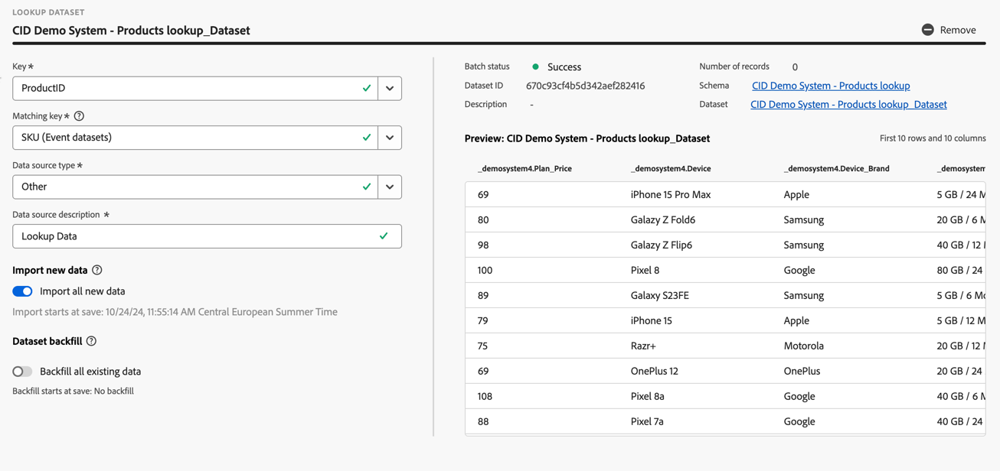

# Crear o editar una conexión {#create-or-edit-a-connection}

>[!CONTEXTUALHELP]
>id="cja_connections_recordsadded"
>title="Registros añadidos"
>abstract="El número de registros/filas añadidos a una conexión durante el intervalo de tiempo seleccionado para los conjuntos de datos seleccionados."

>[!CONTEXTUALHELP]
>id="cja_connections_recordsskipped"
>title="Registros omitidos"
>abstract="El número de registros/filas omitidas durante la transferencia de datos de una conexión durante el intervalo de tiempo seleccionado para los conjuntos de datos seleccionados."

>[!CONTEXTUALHELP]
>id="cja_connections_recordsdeleted"
>title="Registros eliminados"
>abstract="Número de registros (filas) eliminados de una conexión durante el intervalo de tiempo seleccionado para los conjuntos de datos seleccionados."

>[!CONTEXTUALHELP]
>id="cja_connection_lastadded"
>title="Última incorporación"
>abstract=" La marca de tiempo del último lote de cualquier conjunto de datos se ha transferido a una conexión."

>[!CONTEXTUALHELP]
>id="cja_connection_enablerollingdatawindow"
>title="Habilitar la ventana de datos acumulados"
>abstract="Defina la retención de datos como una ventana móvil en meses con respecto a la conexión."

>[!CONTEXTUALHELP]
>id="cja_connection_averagenumberofdailyuses"
>title="Promedio del número de eventos diarios"
>abstract="Seleccione un rango para la cantidad de eventos diarios previstos para toda la conexión."

>[!CONTEXTUALHELP]
>id="connections_recordsadded"
>title="Registros añadidos"
>abstract="El número de registros/filas añadidos a una conexión durante el intervalo de tiempo seleccionado para los conjuntos de datos seleccionados."

>[!CONTEXTUALHELP]
>id="connections_recordsskipped"
>title="Registros omitidos"
>abstract="El número de registros/filas omitidas durante la transferencia de datos de una conexión durante el intervalo de tiempo seleccionado para los conjuntos de datos seleccionados."

>[!CONTEXTUALHELP]
>id="connections_recordsdeleted"
>title="Registros eliminados"
>abstract="El número de registros/filas eliminados de una conexión durante el intervalo de tiempo seleccionado para los conjuntos de datos seleccionados."

>[!CONTEXTUALHELP]
>id="connection_lastadded"
>title="Última incorporación"
>abstract=" La marca de tiempo del último lote de cualquier conjunto de datos se ha transferido a una conexión."

>[!CONTEXTUALHELP]
>id="connection_enablerollingdatawindow"
>title="Habilitar la ventana de datos acumulados"
>abstract="Defina la retención de datos como una ventana móvil en meses con respecto a la conexión."

>[!CONTEXTUALHELP]
>id="connection_averagenumberofdailyuses"
>title="Promedio del número de eventos diarios"
>abstract="Seleccione un rango para la cantidad de eventos diarios previstos para toda la conexión."

>[!CONTEXTUALHELP]
>id="connection_change_personid"
>title="Cambiar ID de persona"
>abstract="Un cambio del ID de persona elimina todos los datos existentes en la conexión y vuelve a ingerir todos los datos del conjunto de datos en función del nuevo ID de persona. Esta acción puede tener implicaciones en los costes. <br/><br/>Cuando selecciona **[!UICONTROL Continuar]**, es posible que se retrase la creación de informes hasta que finalice el proceso."

>[!CONTEXTUALHELP]
>id="connection_change_accountid"
>title="Cambiar ID de cuenta"
>abstract="Un cambio del ID de cuenta elimina todos los datos existentes en la conexión y vuelve a ingerir todos los datos del conjunto de datos en función del nuevo ID de cuenta. Esta acción puede tener implicaciones en los costes. <br/><br/>Cuando selecciona **[!UICONTROL Continuar]**, es posible que se retrase la creación de informes hasta que finalice el proceso."

>[!CONTEXTUALHELP]
>id="connection_change_globalaccountid"
>title="Cambiar ID de cuenta global"
>abstract="Un cambio del ID de cuenta global elimina todos los datos existentes en la conexión y vuelve a ingerir todos los datos del conjunto de datos en función del nuevo ID de cuenta global. Esta acción puede tener implicaciones en los costes. <br/><br/>Cuando selecciona **[!UICONTROL Continuar]**, es posible que se retrase la creación de informes hasta que finalice el proceso."

>[!CONTEXTUALHELP]
>id="connection_change_opportunityid"
>title="Cambiar ID de oportunidad"
>abstract="Un cambio del ID de oportunidad elimina todos los datos existentes en la conexión y vuelve a ingerir todos los datos del conjunto de datos en función del nuevo ID de oportunidad. Esta acción puede tener implicaciones en los costes. <br/><br/>Cuando selecciona **[!UICONTROL Continuar]**, es posible que se retrase la creación de informes hasta que finalice el proceso."

>[!CONTEXTUALHELP]
>id="connection_change_buyinggroupid"
>title="Cambiar ID del grupo de compras"
>abstract="Un cambio del ID del grupo de compras elimina todos los datos existentes en la conexión y vuelve a ingerir todos los datos del conjunto de datos en función del nuevo ID del grupo de compras. Esta acción puede tener implicaciones en los costes. <br/><br/>Cuando selecciona **[!UICONTROL Continuar]**, es posible que se retrase la creación de informes hasta que finalice el proceso."

>[!CONTEXTUALHELP]
>id="connection_change_persistentid"
>title="Cambiar ID persistente"
>abstract="Un cambio del ID persistente elimina todos los datos existentes de la conexión y vuelve a ingerir todos los datos del conjunto de datos en función del nuevo ID persistente. Esta acción puede tener implicaciones en los costes. <br/><br/>Cuando selecciona **[!UICONTROL Continuar]**, es posible que se retrase la creación de informes hasta que finalice el proceso."


<!-- Start of contextual help entries for CJA connection dialogs -->

>[!CONTEXTUALHELP]
>id="connections_useincja_ajo"
>title="Usar esta conexión en Customer Journey Analytics"
>abstract="Esta opción le permite aprovechar las funciones avanzadas de creación de informes de Customer Journey Analytics con su conexión de Journey Optimizer. Estas funciones le permiten:<ul><li>Realizar un análisis en profundidad de los datos de Journey Optimizer en Customer Journey Analytics.</li><li>Edite la conexión de Journey Optimizer y las vistas de datos asociadas.</li><li>Analice los eventos de recorrido, las rutas de conversación y el rendimiento de la campaña.</li></ul>**Cuando esta opción está habilitada, cada fila de datos de la conexión se contabiliza en las filas de datos de la licencia cada mes para Customer Journey Analytics y aparece en la interfaz de usuario de uso de conexiones.**<br><br/> Explore esta opción solo si se siente cómodo con el uso adicional de filas de datos en Customer Journey Analytics. [Más información](https://experienceleague.adobe.com/en/docs/analytics-platform/using/integrations/ajo)."

>[!CONTEXTUALHELP]
>id="connections_disableuseincja_ajo"
>title="Quitar esta conexión de Customer Journey Analytics"
>abstract="Actualmente, esta conexión de Journey Optimizer se utiliza en Customer Recorrido Analytics. Las conexiones le permiten lo siguiente:<ul><li>Realizar un análisis en profundidad de los datos de Journey Optimizer en Customer Journey Analytics.</li><li>Edite la conexión de Journey Optimizer y las vistas de datos asociadas.</li><li>Analice los eventos de recorrido, las rutas de conversación y el rendimiento de la campaña.</li></ul>**Si elimina la conexión, ya no será posible realizar un análisis detallado en Customer Journey Analytics. La conexión y las vistas de datos asociadas se restablecen a su estado predeterminado y ya no se pueden editar.**<br/><br/>**La facturación de esta conexión en Customer Journey Analytics incluye el mes completo durante el cual se elimina la conexión.**<br/><br/> La conexión permanece habilitada en Journey Optimizer. [Más información](https://experienceleague.adobe.com/en/docs/analytics-platform/using/integrations/ajo)."

>[!CONTEXTUALHELP]
>id="connections_useincja_exl_brand_concierge"
>title="Usar esta conexión en Customer Journey Analytics"
>abstract="Esta opción le permite aprovechar las funcionalidades avanzadas de creación de informes de Customer Journey Analytics con su conexión de Brand Concierge. Estas capacidades le permiten:<ul><li>Realizar un análisis en profundidad de los datos de Brand Concierge en Customer Journey Analytics.</li><li>Edite la conexión de Brand Concierge y las vistas de datos asociadas.</li><li>Analice las métricas de participación, opinión y conversión conversacionales.</li></ul>**Cuando esta opción está habilitada, cada fila de datos de la conexión se contabiliza en las filas de datos de la licencia cada mes para Customer Journey Analytics y aparece en la interfaz de usuario de uso de conexiones.**<br><br/> Explore esta opción solo si se siente cómodo con el uso adicional de filas de datos en Customer Journey Analytics. [Más información](https://experienceleague.adobe.com/en/docs/analytics-platform/using/cja-workspace/templates/use-templates#brand-concierge-templates)."

>[!CONTEXTUALHELP]
>id="connections_disableuseincja_exl_brand_concierge"
>title="Quitar esta conexión de Customer Journey Analytics"
>abstract="Actualmente, esta conexión de Brand Concierge se utiliza en Customer Recorrido Analytics. Las conexiones le permiten lo siguiente:<ul><li>Realizar un análisis en profundidad de los datos de Brand Concierge en Customer Journey Analytics.</li><li>Edite la conexión de Brand Concierge y las vistas de datos asociadas.</li><li>Analice las métricas de participación, opinión y conversión conversacionales.</li></ul>**Si elimina la conexión, ya no será posible realizar un análisis detallado en Customer Journey Analytics. La conexión y las vistas de datos asociadas se restablecen a su estado predeterminado y ya no se pueden editar.**<br/><br/>**La facturación de esta conexión en Customer Journey Analytics incluye el mes completo durante el cual se elimina la conexión.**<br/><br/> La conexión permanece habilitada en Journey Optimizer. [Más información](https://experienceleague.adobe.com/en/docs/analytics-platform/using/cja-workspace/templates/use-templates#brand-concierge-templates)."

>[!CONTEXTUALHELP]
>id="connections_useincja_exl_product_usage"
>title="Usar esta conexión en Customer Journey Analytics"
>abstract="Esta opción le permite aprovechar las funcionalidades avanzadas de creación de informes de Customer Journey Analytics con su conexión de uso del producto. Estas capacidades le permiten:<ul><li>Realizar un análisis detallado de los datos de uso del producto en Customer Journey Analytics.</li><li>Edite la conexión de uso del producto y las vistas de datos asociadas.</li></ul>**Cuando esta opción está habilitada, cada fila de datos de la conexión se contabiliza en las filas de datos de la licencia cada mes para Customer Journey Analytics y aparece en la interfaz de usuario de uso de conexiones.**<br><br/> Explore esta opción solo si se siente cómodo con el uso adicional de filas de datos en Customer Journey Analytics. [Más información](https://experienceleague.adobe.com/es/docs/analytics-platform/using/tools/product-usage/usage-overview)."

>[!CONTEXTUALHELP]
>id="connections_disableuseincja_exl_product_usage"
>title="Quitar esta conexión de Customer Journey Analytics"
>abstract="Esta conexión de uso del producto se utiliza actualmente en Customer Recorrido Analytics. Las conexiones le permiten lo siguiente:<ul><li>Realizar un análisis detallado de los datos de uso del producto en Customer Journey Analytics.</li><li>Edite la conexión de uso del producto y las vistas de datos asociadas.</li></ul>**Si elimina la conexión, ya no será posible realizar un análisis detallado en Customer Journey Analytics. La conexión y las vistas de datos asociadas se restablecen a su estado predeterminado y ya no se pueden editar.**<br/><br/>**La facturación de esta conexión en Customer Journey Analytics incluye el mes completo durante el cual se elimina la conexión.**<br/><br/> La conexión permanece habilitada en Journey Optimizer. [Más información](https://experienceleague.adobe.com/es/docs/analytics-platform/using/tools/product-usage/usage-overview)."

>[!CONTEXTUALHELP]
>id="connections_useincja_legal_section_section"
>title="Implicaciones legales"
>abstract="El uso de Customer Journey Analytics puede provocar cambios adicionales basados en los volúmenes de datos de integración. Ver [detalles sobre facturación y uso de Customer Journey Analytics](https://experienceleague.adobe.com/es/docs/analytics-platform/using/cja-connections/manage-connections#connections-usage)"

<!-- End of contextual help entries for CJA connection dialogs -->


La experiencia de flujo de trabajo de creación y edición de conexiones reúne todos los ajustes de configuración del conjunto de datos y la conexión al centro de la pantalla con un flujo de trabajo de asistencia. Proporciona una experiencia detallada de selección, configuración y revisión de conjuntos de datos. Y le permite especificar información crítica como [tipo de conjunto de datos](#dataset-types), tamaño, esquema, id de conjunto de datos, estado de lote, estado de relleno, identidades y mucho más para reducir el riesgo de configuración de conexión incorrecta. A continuación se muestra una descripción general de las funciones:

* Puede habilitar un período de retención de datos móvil al crear la conexión.
* Puede agregar y eliminar conjuntos de datos de una conexión. (Al eliminar un conjunto de datos, éste se elimina de la conexión y afecta a las vistas de datos asociadas y a los proyectos de Analysis Workspace subyacentes).
* Puede habilitar y solicitar datos de relleno por conjunto de datos.
* Puede editar conjuntos de datos, por ejemplo, para solicitar otro relleno.
* Puede importar los datos existentes por conjunto de datos.


>[!BEGINSHADEBOX]

Consulte  [Crear y editar una conexión](https://video.tv.adobe.com/v/343044/?quality=12&learn=on){target="_blank"} para ver un vídeo de demostración.

>[!ENDSHADEBOX]


## Requisitos previos

El número máximo de conjuntos de datos que se pueden añadir a una conexión está limitado a 100. La combinación depende del paquete de Customer Journey Analytics que haya adquirido su compañía.

Póngase en contacto con el administrador si no sabe qué paquete de Customer Journey Analytics tiene.

| Paquete **Seleccionar** | Paquete de **Foundation** |
| --- | --- |
| Cualquier combinación de conjuntos de datos de evento, perfil, búsqueda o resumen que sume 100 | Un conjunto de datos de evento por conexión |
|  | Hasta 99 conjuntos de datos de perfil, consulta o resumen por conexión |

{style="table-layout:auto"}

## Crea una conexión {#create-connection}

Para crear una conexión:

1. En Customer Journey Analytics, seleccione **[!UICONTROL Conexiones]**, opcionalmente desde **[!UICONTROL Administración de datos]**, en el menú superior.
1. Seleccione **[!UICONTROL Crear nueva conexión]**.

Ahora puede [editar los detalles de su conexión](#edit-a-connection).

## Edición de una conexión {#edit-connection}

La forma de editar la conexión depende del paquete de Customer Journey Analytics con licencia:

* [Customer Journey Analytics](#customer-journey-analytics)
* [Customer Journey Analytics B2B Edition](#customer-journey-analytics-b2b-edition)

### Customer Journey Analytics

En la pantalla **[!UICONTROL Conexiones]** > **[!UICONTROL *Nombre de la conexión *]**:


1. Configure los ajustes de conexión.

   | Configuración | Descripción |
   | --- | --- |
   | **[!UICONTROL Nombre de la conexión]** | Introduzca un nombre único para la conexión. |
   | **[!UICONTROL Descripción de la conexión]** | Describa el propósito de esta conexión. |
   | **[!UICONTROL Etiquetas]** | Especifique etiquetas para añadir etiquetas a la conexión y así poder utilizarlas para buscar la conexión en una etapa posterior. |
   | **[!UICONTROL Habilitar la ventana de datos móviles]** | Si está marcada, esta casilla le permite definir la retención de datos de Customer Journey Analytics como un período de tiempo variable en meses (1 mes, 3 meses, 6 meses, etc.), a nivel de conexión.<p>La retención de datos se basa en marcas de hora de conjuntos de datos de evento y se aplica solo a conjuntos de datos de evento. No existe ninguna configuración de ventana de datos móviles para conjuntos de datos de búsqueda o perfil, ya que no hay marcas de tiempo aplicables. Sin embargo, si la conexión incluye perfiles o conjuntos de datos de búsqueda (además de uno o más conjuntos de datos de evento), esos datos se conservarán durante el mismo período de tiempo.<p> La principal ventaja es que solo almacena o genera informes sobre datos que son aplicables y útiles, y elimina los datos más antiguos que ya no son útiles. Le ayuda a mantenerse por debajo de los límites del contrato y reduce el riesgo de costes adicionales.<p><ul><li>Si deja el valor predeterminado (sin marcar), la configuración de retención de datos de Adobe Experience Platform reemplaza el período de retención. Si tiene datos de 25 meses en Experience Platform, Customer Journey Analytics recibirá 25 meses de datos mediante el relleno. Si eliminara 10 de esos meses en Experience Platform, Customer Journey Analytics conservaría los 15 meses restantes.</li><li>Si habilita una ventana de datos móviles, especifique en **[!UICONTROL Seleccione el número de meses]** el número de meses durante los cuales habilitará la ventana de datos móviles. |
   | **[!UICONTROL Zona protegida]** | Elija un simulador para pruebas en Experience Platform que contenga los conjuntos de datos para los que desea crear una conexión.<p>Adobe Experience Platform proporciona [zonas protegidas](https://experienceleague.adobe.com/es/docs/experience-platform/sandbox/home) limitadas que dividen una sola instancia de Platform en entornos virtuales independientes para ayudar a desarrollar y desarrollar aplicaciones de experiencia digital. Puede considerar las zonas protegidas como “silos de datos” que contienen conjuntos de datos. Las zonas protegidas se utilizan para controlar el acceso a los conjuntos de datos.<p>Una vez seleccionada la zona protegida, el carril izquierdo muestra todos los conjuntos de datos de la zona protegida desde los que puede extraer datos. |
   | **[!UICONTROL Añadir conjuntos de datos]** | Seleccione  **[!UICONTROL Agregar conjuntos de datos]** para agregar conjuntos de datos. Si la conexión aún no tiene conjuntos de datos, también puede seleccionar **[!UICONTROL Agregar conjuntos de datos]** en la tabla de conjuntos de datos. |


   Para los conjuntos de datos que ha configurado, la tabla de conjuntos de datos muestra las siguientes columnas:

   | Columna | Descripción |
   |---|---|
   | **[!UICONTROL Nombre del conjunto de datos]** | Seleccione uno o varios conjuntos de datos que desee incluir en Customer Journey Analytics y seleccione **[!UICONTROL Añadir]**.<p>(Si tiene muchos conjuntos de datos para elegir, puede buscar los correctos mediante la barra de búsqueda Buscar conjuntos de datos que se encuentra arriba de la lista de conjuntos de datos). |
   |  | Seleccione  para abrir un menú contextual para el conjunto de datos seleccionado. En función del (tipo de) conjunto de datos, puede seleccionar:<ul><li>  **[!UICONTROL Eliminar conjunto de datos]** para [eliminar un conjunto de datos](#delete-a-dataset).</li><li> **[!UICONTROL Editar conjunto de datos]** para [editar un conjunto de datos](#edit-a-dataset).</li><li> **[!UICONTROL Rellenos anteriores]** para mostrar [rellenos anteriores para el conjunto de datos](#past-backfills). |
   | **[!UICONTROL Última actualización]** | Solo para conjuntos de datos de evento, esta configuración se establece automáticamente en el campo de marca de tiempo predeterminado de esquemas basados en eventos en Experience Platform. “N/A” significa que este conjunto de datos no contiene datos. |
   | **[!UICONTROL Número de registros]** | El total de registros del mes anterior para el conjunto de datos en Experience Platform. |
   | **[!UICONTROL Esquema]** | Este es el [esquema](https://experienceleague.adobe.com/es/docs/experience-platform/xdm/schema/composition) en función del cual se creó el conjunto de datos en Adobe Experience Platform. |
   | **[!UICONTROL Tipo de conjunto de datos]** | Para cada conjunto de datos que agregó a esta conexión, Customer Journey Analytics establece de manera automática el [tipo de conjunto de datos](#dataset-types) en función de los datos que ingresan. Existen tres tipos diferentes de conjuntos de datos: datos: datos de evento, datos de perfil y datos de búsqueda. Consulte la siguiente tabla para obtener una explicación de los tipos de conjuntos de datos. |
   | **[!UICONTROL Granularidad]** | La granularidad de los datos del conjunto de datos; solo se aplica a los conjuntos de datos de resumen. |
   | **[!UICONTROL Tipo de fuente de datos]** | El tipo de fuente de datos del conjunto de datos. No es aplicable a los conjuntos de datos de resumen. |
   | **[!UICONTROL ID de la persona]** | El ID de persona que se utiliza para admitir la creación de informes basados en personas para el conjunto de datos. |
   | **[!UICONTROL Clave]** | La clave que se utiliza para un conjunto de datos de búsqueda. |
   | **[!UICONTROL Clave de coincidencia]** | La clave coincidente que se utiliza para un conjunto de datos de búsqueda. |
   | **[!UICONTROL Importar datos nuevos]** | Estado de la importación de nuevos datos para el conjunto de datos: <p>   **[!UICONTROL _x _Activado]**&#x200B;si el conjunto de datos está configurado para importar datos nuevos y<p>   **[!UICONTROL _x Desactivado_]** si el conjunto de datos está configurado para no importar datos nuevos. |
   | **[!UICONTROL Datos de relleno]** | El estado de los datos de relleno del conjunto de datos.<p>   **[!UICONTROL _x _rellenos fallidos]**&#x200B;para el número de rellenos fallidos,<p>   **[!UICONTROL _x _rellenos en procesamiento]**&#x200B;para el número de rellenos que se están procesando.<p>   **[!UICONTROL _x _rellenos completados]**&#x200B;para el número de rellenos completados, y<p>   **[!UICONTROL _Desactivado_]** en caso de que no se hayan configurado rellenos. |

   Puede buscar un conjunto de datos específico mediante el campo .

### Customer Journey Analytics B2B Edition

[!BADGE B2B Edition]{type=Informative url="https://experienceleague.adobe.com/es/docs/analytics-platform/using/cja-overview/cja-b2b/cja-b2b-edition" newtab=true tooltip="Customer Journey Analytics B2B Edition"}

En la pantalla **[!UICONTROL Conexiones]** > **[!UICONTROL *Nombre de la conexión *]**:


1. Configure los ajustes de conexión.

   | Configuración | Descripción |
   | --- | --- |
   | **[!UICONTROL Nombre de la conexión]** | Introduzca un nombre único para la conexión. |
   | **[!UICONTROL Descripción de la conexión]** | Describa el propósito de esta conexión. |
   | **[!UICONTROL Etiquetas]** | Especifique etiquetas para añadir etiquetas a la conexión y así poder utilizarlas para buscar la conexión en una etapa posterior. |
   | **[!UICONTROL ID principal]** | Seleccione el ID principal adecuado para la conexión: <ul><li> **[!UICONTROL Persona]** para una conexión basada en persona que normalmente usa en un escenario B2C.</li><li>  **[!UICONTROL Cuenta]** para una conexión basada en cuentas que normalmente usa en un escenario B2B.</li></ul>Tan pronto como agregue uno o más conjuntos de datos a su conexión, ya no podrá cambiar el ID principal. <br/>La selección del identificador principal define si la conexión se basa en personas o en cuentas. La base de conexión determina los [ajustes](#dataset-settings) disponibles para determinados tipos de conjuntos de datos. |
   | **[!UICONTROL Contenedores opcionales]** | Si ha seleccionado  **[!UICONTROL Account]** como **[!UICONTROL Primary ID]**, seleccione contenedores adicionales.<ul><li>**[!UICONTROL Cuenta global]**: habilita la configuración de cuentas globales en una conexión.</li><li>**[!UICONTROL Oportunidad]**: habilita la configuración de oportunidades en una conexión.</li><li>**[!UICONTROL Grupo de compra]**: habilita la configuración de grupos de compra en una conexión.</li><ul> |
   | **[!UICONTROL Zona protegida]** | Elija un simulador para pruebas en Experience Platform que contenga los conjuntos de datos a los que desea conectarse.<p>Adobe Experience Platform proporciona [zonas protegidas](https://experienceleague.adobe.com/es/docs/experience-platform/sandbox/home) limitadas que dividen una sola instancia de Platform en entornos virtuales independientes para ayudar a desarrollar y desarrollar aplicaciones de experiencia digital. Puede considerar las zonas protegidas como “silos de datos” que contienen conjuntos de datos. Las zonas protegidas se utilizan para controlar el acceso a los conjuntos de datos.<p>Una vez seleccionada la zona protegida, el carril izquierdo muestra todos los conjuntos de datos de la zona protegida desde los que puede extraer datos. |
   | **[!UICONTROL Habilitar la ventana de datos móviles]** | Si está marcada, esta casilla le permite definir la retención de datos de Customer Journey Analytics como un período de tiempo variable en meses (1 mes, 3 meses, 6 meses, etc.), a nivel de conexión.<p>La retención de datos se basa en marcas de hora de conjuntos de datos de evento y se aplica solo a conjuntos de datos de evento. No existe ninguna configuración de ventana de datos móviles para conjuntos de datos de búsqueda o perfil, ya que no hay marcas de tiempo aplicables. Sin embargo, si la conexión incluye perfiles o conjuntos de datos de búsqueda (además de uno o más conjuntos de datos de evento), esos datos se conservarán durante el mismo período de tiempo.<p> La principal ventaja es que solo almacena o genera informes sobre datos que son aplicables y útiles, y elimina los datos más antiguos que ya no son útiles. Le ayuda a mantenerse por debajo de los límites del contrato y reduce el riesgo de costes adicionales.<p><ul><li>Si deja el valor predeterminado (sin marcar), la configuración de retención de datos de Adobe Experience Platform reemplaza el período de retención. Si tiene datos de 25 meses en Experience Platform, Customer Journey Analytics recibirá 25 meses de datos mediante el relleno. Si eliminase 10 de esos meses en Platform, Customer Journey Analytics conservaría los 15 meses restantes.</li><li>Si habilita una ventana de datos móviles, especifique en **[!UICONTROL Seleccione el número de meses]** el número de meses durante los cuales habilitará la ventana de datos móviles. |
   | **[!UICONTROL Añadir conjuntos de datos]** | Seleccione  **[!UICONTROL Agregar conjuntos de datos]** a [agregar conjuntos de datos](#add-datasets). Si la conexión aún no tiene conjuntos de datos, también puede seleccionar **[!UICONTROL Agregar conjuntos de datos]** en la tabla de conjuntos de datos. |


   Para los conjuntos de datos que ha configurado, la tabla de conjuntos de datos muestra las siguientes columnas:

   | Columna | Descripción |
   |---|---|
   | **[!UICONTROL Nombre del conjunto de datos]** | Seleccione uno o varios conjuntos de datos que desee incluir en Customer Journey Analytics y seleccione **[!UICONTROL Añadir]**.<p>(Si tiene muchos conjuntos de datos para elegir, puede buscar los correctos mediante la barra de búsqueda Buscar conjuntos de datos que se encuentra arriba de la lista de conjuntos de datos). |
   |  | Seleccione  para abrir un menú contextual para el conjunto de datos seleccionado. En función del (tipo de) conjunto de datos, puede seleccionar:<ul><li>  **[!UICONTROL Eliminar conjunto de datos]** para [eliminar un conjunto de datos](#delete-a-dataset).</li><li> **[!UICONTROL Editar conjunto de datos]** para [editar un conjunto de datos](#edit-a-dataset).</li><li> **[!UICONTROL Rellenos anteriores]** para mostrar [rellenos anteriores para el conjunto de datos](#past-backfills). |
   | **[!UICONTROL Última actualización]** | Solo para conjuntos de datos de evento, esta configuración se establece automáticamente en el campo de marca de tiempo predeterminado de esquemas basados en eventos en Experience Platform. “N/A” significa que este conjunto de datos no contiene datos. |
   | **[!UICONTROL Número de registros]** | El total de registros del mes anterior para el conjunto de datos en Experience Platform. |
   | **[!UICONTROL Esquema]** | Este es el [esquema](https://experienceleague.adobe.com/es/docs/experience-platform/xdm/schema/composition) en función del cual se creó el conjunto de datos en Adobe Experience Platform. |
   | **[!UICONTROL Tipo de conjunto de datos]** | Para cada conjunto de datos que agregó a esta conexión, Customer Journey Analytics establece de manera automática el [tipo de conjunto de datos](#dataset-types) en función de los datos que ingresan. |
   | **[!UICONTROL Granularidad]** | La granularidad de los datos del conjunto de datos; solo se aplica a los conjuntos de datos de resumen. |
   | **[!UICONTROL Tipo de fuente de datos]** | El tipo de fuente de datos del conjunto de datos. No es aplicable a los conjuntos de datos de resumen. |
   | **[!UICONTROL ID de cuenta]** | (solo se muestra para conexiones basadas en cuentas) El ID de cuenta que se utiliza para admitir la creación de informes basados en cuentas para el conjunto de datos. |
   | **[!UICONTROL Id. de cuenta global]** | (solo se muestra para conexiones basadas en cuentas) El ID de cuenta global que se utiliza para admitir la creación de informes basados en cuentas para el conjunto de datos. |
   | **[!UICONTROL Id. de grupo de compra]** | (solo se muestra para conexiones basadas en cuentas) El ID del grupo de compra que se usa para buscar datos del grupo de compra. |
   | **[!UICONTROL ID de oportunidad]** | (solo se muestra para conexiones basadas en cuentas) El ID de oportunidad que se utiliza para buscar datos de oportunidades. |
   | **[!UICONTROL ID de la persona]** | El ID de persona que se utiliza para admitir la creación de informes basados en personas para el conjunto de datos. |
   | **[!UICONTROL Clave]** | La clave que se utiliza para un conjunto de datos de búsqueda. |
   | **[!UICONTROL Clave de coincidencia]** | La clave coincidente que se utiliza para un conjunto de datos de búsqueda. |
   | **[!UICONTROL Importar datos nuevos]** | Estado de la importación de nuevos datos para el conjunto de datos: <p>   **[!UICONTROL _x _Activado]**&#x200B;si el conjunto de datos está configurado para importar datos nuevos y<p>   **[!UICONTROL _x Desactivado_]** si el conjunto de datos está configurado para no importar datos nuevos. |
   | **[!UICONTROL Datos de relleno]** | El estado de los datos de relleno del conjunto de datos.<p>   **[!UICONTROL _x _rellenos fallidos]**&#x200B;para el número de rellenos fallidos,<p>   **[!UICONTROL _x _rellenos en procesamiento]**&#x200B;para el número de rellenos que se están procesando.<p>   **[!UICONTROL _x _rellenos completados]**&#x200B;para el número de rellenos completados, y<p>   **[!UICONTROL _Desactivado_]** en caso de que no se hayan configurado rellenos. |

   Puede buscar un conjunto de datos específico mediante el campo .

## Conjuntos de datos {#datasets}

Usted [agrega uno o más conjuntos de datos](#add-datasets) o [edita conjuntos de datos existentes](#edit-a-dataset) como parte del flujo de trabajo de conexión.

>[!NOTE]
>
>Los valores anteriores al año 1900 para los campos Fecha y Fecha-hora de una fila en cualquier tipo de conjunto de datos se reemplazan por el valor `null` antes de que se ingrese la fila.<br/>Las filas de un conjunto de datos de resumen o evento con un valor de marca de tiempo anterior al año 1900 se pierden de la ingesta.


{{relational-model-based}}


>[!CONTEXTUALHELP]
>id="cja_connection_primaryid"
>title="ID principal"
>abstract="Selecciona el ID principal adecuado para la conexión: persona para un escenario B2C. Cuenta para un escenario B2B."

>[!CONTEXTUALHELP]
>id="cja_connection_optionalcontainers"
>title="Contenedores opcionales"
>abstract="Selecciona contenedores adicionales.<br/><br/>**[!UICONTROL Cuenta global &#x200B;]**: habilita la configuración de cuentas globales en una conexión.<br/>**[!UICONTROL Oportunidad]**: habilita la configuración de oportunidades en una conexión.<br/>**[!UICONTROL Grupo de compra &#x200B;]**: habilita la configuración de grupos de compra en una conexión."

>[!CONTEXTUALHELP]
>id="cja_connection_accountid"
>title="ID de cuenta"
>abstract="Selecciona un ID de cuenta (el identificador único de una cuenta) entre las identidades disponibles definidas en el esquema del conjunto de datos en Experience Platform."

>[!CONTEXTUALHELP]
>id="cja_connection_accountfield"
>title="Campo de cuenta"
>abstract="Seleccione un campo que represente el ID de cuenta (el identificador único de una cuenta)."

>[!CONTEXTUALHELP]
>id="cja_connection_globalaccountid"
>title="ID de cuenta global"
>abstract="Seleccione un ID de cuenta global (el identificador único de una cuenta global) entre las identidades disponibles que haya definido en el esquema del conjunto de datos de Experience Platform."

>[!CONTEXTUALHELP]
>id="cja_connection_opportunityid"
>title="ID de oportunidad"
>abstract="Seleccione un ID de oportunidad (el identificador único de una oportunidad) entre las identidades disponibles que haya definido en el esquema del conjunto de datos en Experience Platform."

>[!CONTEXTUALHELP]
>id="cja_connection_buyinggroupid"
>title="ID del grupo de compras"
>abstract="Seleccione un ID de grupo de compras (el identificador único de un grupo de compras) entre las identidades disponibles que haya definido en el esquema del conjunto de datos de Experience Platform."

>[!CONTEXTUALHELP]
>id="cja_connection_personid"
>title="ID de la persona"
>abstract="Seleccione un ID de persona (el identificador único de una persona) entre las identidades disponibles que haya definido en el esquema del conjunto de datos de Experience Platform."

>[!CONTEXTUALHELP]
>id="cja_connection_matchingkey"
>title="Clave de correspondencia"
>abstract="Seleccione un campo para unir con uno de los conjuntos de datos de evento. Si esta lista está vacía, es probable que no haya añadido ni configurado ningún conjunto de datos de evento."

>[!CONTEXTUALHELP]
>id="cja_connection_importnewdata"
>title="Importar datos nuevos"
>abstract="Los lotes nuevos que se añadan al conjunto de datos de Experience Platform se sumarán automáticamente a esta conexión y estarán disponibles para su análisis."

>[!CONTEXTUALHELP]
>id="cja_connection_datasetbackfill"
>title="Relleno del conjunto de datos"
>abstract="Esta opción rellenará los datos (históricos) existentes de Experience Platform para este conjunto de datos en la conexión."

>[!CONTEXTUALHELP]
>id="cja_connection_transformdataset"
>title="Transformar conjunto de datos"
>abstract="Esta opción transformará el conjunto de datos para que pueda emplearse para búsquedas basadas en personas en escenarios B2B. Una vez activada, la transformación del conjunto de datos es irreversible."

>[!CONTEXTUALHELP]
>id="cja_connection_connectionmap"
>title="Mapa de conexión"
>abstract="El mapa Conexión visualiza las relaciones entre el evento, la persona, la cuenta y los conjuntos de datos de búsqueda relevantes (como oportunidades, miembros de campañas, etc.)."

>[!CONTEXTUALHELP]
>id="connection_primaryid"
>title="ID principal"
>abstract="Selecciona el ID principal adecuado para la conexión: persona para un escenario B2C. Cuenta para un escenario B2B."

>[!CONTEXTUALHELP]
>id="connection_optionalcontainers"
>title="Contenedores opcionales"
>abstract="Selecciona contenedores adicionales.<br/><br/>**[!UICONTROL Cuenta global &#x200B;]**: habilita la configuración de cuentas globales en una conexión.<br/>**[!UICONTROL Oportunidad]**: habilita la configuración de oportunidades en una conexión.<br/>**[!UICONTROL Grupo de compra &#x200B;]**: habilita la configuración de grupos de compra en una conexión."

>[!CONTEXTUALHELP]
>id="connection_personid"
>title="ID de la persona"
>abstract="Selecciona un ID de persona entre las identidades disponibles de los esquemas del conjunto de datos en Experience Platform."

>[!CONTEXTUALHELP]
>id="connection_accountid"
>title="ID de cuenta"
>abstract="Selecciona un ID de cuenta (el identificador único de una cuenta) entre las identidades disponibles definidas en el esquema del conjunto de datos en Experience Platform."

>[!CONTEXTUALHELP]
>id="connection_accountfield"
>title="Campo de cuenta"
>abstract="Seleccione un campo que represente el ID de cuenta (el identificador único de una cuenta)."

>[!CONTEXTUALHELP]
>id="connection_globalaccountid"
>title="ID de cuenta global"
>abstract="Seleccione un ID de cuenta global (el identificador único de una cuenta global) entre las identidades disponibles que haya definido en el esquema del conjunto de datos de Experience Platform."

>[!CONTEXTUALHELP]
>id="connection_opportunityid"
>title="ID de oportunidad"
>abstract="Seleccione un ID de oportunidad (el identificador único de una oportunidad) entre las identidades disponibles que haya definido en el esquema del conjunto de datos en Experience Platform."

>[!CONTEXTUALHELP]
>id="connection_buyinggroupid"
>title="ID del grupo de compras"
>abstract="Seleccione un ID de grupo de compras (el identificador único de un grupo de compras) entre las identidades disponibles que haya definido en el esquema del conjunto de datos de Experience Platform."

>[!CONTEXTUALHELP]
>id="connection_matchingkey"
>title="Clave de correspondencia"
>abstract="Seleccione un campo para unir con uno de los conjuntos de datos de evento. Si esta lista está vacía, es probable que no haya añadido ni configurado ningún conjunto de datos de evento."

>[!CONTEXTUALHELP]
>id="connection_matchingkeytype"
>title="Tipo de clave coincidente"
>abstract="Seleccione cómo desea unirse: mediante un coincidencia por campo o una coincidencia por contenedor.<br/><br/>**[!UICONTROL Coincidencia por campo &#x200B;]**: seleccione un campo para unirse con uno de los conjuntos de datos de evento. Si esta lista está vacía, es probable que no haya añadido ni configurado ningún conjunto de datos de evento.<br/>**[!UICONTROL Coincidencia por contenedor]**: seleccione un contenedor para utilizarlo para unirse a uno de los conjuntos de datos de evento. "

>[!CONTEXTUALHELP]
>id="connection_importnewdata"
>title="Importar datos nuevos"
>abstract="Los lotes nuevos que se añadan al conjunto de datos de Experience Platform se sumarán automáticamente a esta conexión y estarán disponibles para su análisis."

>[!CONTEXTUALHELP]
>id="connection_datasetbackfill"
>title="Relleno del conjunto de datos"
>abstract="Esta opción rellenará los datos (históricos) existentes de Experience Platform para este conjunto de datos en la conexión."

>[!CONTEXTUALHELP]
>id="connection_transformdataset"
>title="Transformar conjunto de datos"
>abstract="Esta opción transformará el conjunto de datos para que pueda emplearse para búsquedas basadas en personas en escenarios B2B. Una vez activada, la transformación del conjunto de datos es irreversible."

>[!CONTEXTUALHELP]
>id="connection_connectionmap"
>title="Mapa de conexión"
>abstract="El mapa Conexión visualiza las relaciones entre el evento, la persona, la cuenta y los conjuntos de datos de búsqueda relevantes (como oportunidades, miembros de campañas, etc.)."

>[!CONTEXTUALHELP]
>id="connection_stitching_enable"
>title="Habilitación de la vinculación de identidad"
>abstract="Habilite la vinculación de identidad para elevar este conjunto de datos de evento para el análisis en canales múltiples."
>additional-url="https://experienceleague.adobe.com/en/docs/analytics-platform/using/stitching/overview" text="Información general de vinculación"

>[!CONTEXTUALHELP]
>id="connection_stitching_dialog"
>title="Habilitación de la vinculación de identidad"
>abstract="La habilitación de la vinculación de identidad deriva un ID vinculado de un único conjunto de datos o de varios. Este proceso puede incluir la combinación de datos de usuario de sesiones autenticadas y no autenticadas.<br/><br/>Usted es responsable de cumplir con las leyes y regulaciones aplicables. Esta conformidad incluye que obtenga los permisos de usuario final necesarios antes de combinar conjuntos de datos."
>additional-url="https://experienceleague.adobe.com/en/docs/analytics-platform/using/stitching/overview" text="Información general de vinculación"

>[!CONTEXTUALHELP]
>id="connection_persistentid"
>title="ID persistente"
>abstract="Seleccione un ID persistente entre las identidades disponibles. Un ID persistente es un identificador disponible en todos los eventos del conjunto de datos del evento."
>additional-url="https://experienceleague.adobe.com/en/docs/analytics-platform/using/stitching/overview" text="Información general de vinculación"

>[!CONTEXTUALHELP]
>id="connection_lookbackwindow"
>title="Período de retroactividad"
>abstract="Seleccione el período de tiempo adecuado para que la ventana retroactiva se utilice en la reproducción de la vinculación."
>additional-url="https://experienceleague.adobe.com/en/docs/analytics-platform/using/stitching/overview" text="Información general de vinculación"

>[!CONTEXTUALHELP]
>id="connection_namespace_map"
>title="Mapa de identidad del espacio de nombres"
>abstract="Seleccione el espacio de nombres a utilizar para elegir el identificador del mapa de identidad."
>additional-url="https://experienceleague.adobe.com/en/docs/analytics-platform/using/stitching/overview" text="Información general de vinculación"

>[!CONTEXTUALHELP]
>id="connection_namespace_graph"
>title="Gráfico de identidad del espacio de nombres"
>abstract="Seleccione el espacio de nombres a utilizar para actualizar el identificador en el gráfico de identidad."
>additional-url="https://experienceleague.adobe.com/en/docs/analytics-platform/using/stitching/overview" text="Información general de vinculación"

>[!CONTEXTUALHELP]
>id="connection_changeto_identitygraph"
>title="Cambio en el gráfico de identidad"
>abstract="Asegúrese de haber terminado la configuración del gráfico de identidad antes de utilizarlo para la vinculación."

### Tipos de conjuntos de datos {#dataset-types}

Para cada conjunto de datos que agregó a esta conexión, [!UICONTROL Customer Journey Analytics] establece de manera automática el tipo de conjunto de datos en función de los datos que ingresan.

>[!IMPORTANT]
>
>Añada al menos un evento o un conjunto de datos de resumen (estándar o de tipo ad hoc o relacional) a su conexión.

Existen diferentes tipos de conjuntos de datos: datos de [!UICONTROL Evento], datos de [!UICONTROL Perfil], datos de [!UICONTROL Búsqueda] y datos de [!UICONTROL Resumen], cada uno basado en su esquema XDM correspondiente.

| Tipo de conjunto de datos | Descripción | Marca de tiempo | Esquema | ID de persona <br/> ID de cuenta [!BADGE B2B Edition]{type=Informative url="https://experienceleague.adobe.com/es/docs/analytics-platform/using/cja-overview/cja-b2b/cja-b2b-edition" newtab=true tooltip="Customer Journey Analytics B2B Edition"} |
|---|---|---|---|---|
| **[!UICONTROL Evento]** | Datos que representan eventos en el tiempo. Por ejemplo, visitas web, interacciones, transacciones, datos de TPV, datos de encuesta, datos de impresión de publicidad, etc. Estos datos podrían ser datos del flujo de navegación típicos, con un ID de cliente o un ID de cookie y una marca de tiempo. Con los datos de evento, tiene flexibilidad para saber qué ID se utiliza como ID de persona. | Establezca en el campo de marca de tiempo predeterminado a partir de los esquemas basados en eventos en [!UICONTROL Experience Platform]. | Cualquier esquema integrado o personalizado basado en una clase XDM con el comportamiento *Serie temporal*. Algunos ejemplos son *Evento de experiencia XDM* o *Evento de decisión XDM*. | Puede elegir qué ID de persona o ID de cuenta [!BADGE B2B edition]{type=Informative url="https://experienceleague.adobe.com/es/docs/analytics-platform/using/cja-overview/cja-b2b/cja-b2b-edition" newtab=true tooltip="Customer Journey Analytics B2B Edition"} desea incluir. Cada esquema del conjunto de datos definido en Experience Platform puede tener su propio conjunto de una o más identidades definidas y asociadas a un espacio de nombres de identidad. Cualquiera de estas identidades puede usarse como ID de persona o ID de cuenta [!BADGE B2B edition]{type=Informative url="https://experienceleague.adobe.com/es/docs/analytics-platform/using/cja-overview/cja-b2b/cja-b2b-edition" newtab=true tooltip="Customer Journey Analytics B2B Edition"}. Algunos ejemplos son: ID de cookie, ID con título, ID de usuario, código de seguimiento, ID de cuenta [!BADGE B2B edition]{type=Informative url="https://experienceleague.adobe.com/es/docs/analytics-platform/using/cja-overview/cja-b2b/cja-b2b-edition" newtab=true tooltip="Customer Journey Analytics B2B Edition"}, etc. |
| **[!UICONTROL Búsqueda]** | Ahora puede añadir conjuntos de datos como consultas de campos dentro de todos los tipos de conjuntos de datos: conjuntos de datos de perfil, consulta y evento (este último siempre ha sido compatible). Esta capacidad adicional amplía la capacidad de Customer Journey Analytics para admitir modelos de datos complejos, incluido B2B. Estos datos se utilizan para buscar valores o claves encontrados en los datos de Evento, Perfil o de Búsqueda. Puede agregar hasta dos niveles de búsquedas. (Tenga en cuenta que los [Campos derivados](/help/data-views/derived-fields/derived-fields.md) no se pueden usar como claves coincidentes para búsquedas dentro de Conexiones). Por ejemplo, puede cargar datos de búsqueda que asignen ID numéricos en los datos de evento a nombres de producto. Consulte el [ejemplo B2B](/help/use-cases/b2b/example.md) para ver un ejemplo. | N/A | Cualquier esquema integrado o personalizado basado en una clase XDM con el comportamiento *Record*, excepto la clase *XDM Individual Profile*. | N/A |
| **[!UICONTROL Perfil]** | Datos que se aplican a su cuenta, sus personas, usuarios o clientes en los datos de [!UICONTROL Evento]. Por ejemplo, le permite cargar datos de CRM sobre sus clientes. | N/A | Cualquier esquema integrado o personalizado basado en la clase *XDM Individual Profile*. | Puede elegir qué ID de persona/ID de cuenta [!BADGE B2B edition]{type=Informative url="https://experienceleague.adobe.com/es/docs/analytics-platform/using/cja-overview/cja-b2b/cja-b2b-edition" newtab=true tooltip="Customer Journey Analytics B2B Edition"} desea incluir. Cada conjunto de datos (excepto los de resumen) definido en [!DNL Experience Platform], tiene su propio conjunto de uno o más ID de persona o ID de cuenta [!BADGE B2B Edition]{type=Informative url="https://experienceleague.adobe.com/es/docs/analytics-platform/using/cja-overview/cja-b2b/cja-b2b-edition" newtab=true tooltip="Customer Journey Analytics B2B Edition"} definidos. Por ejemplo: ID de cookie, ID con título, ID de usuario, código de seguimiento, ID de cuenta, etc.<br>**Nota**: Si crea una conexión que incluye conjuntos de datos con distintos ID, lo refleja el sistema de informes. Para combinar conjuntos de datos, debe usar el mismo ID de persona o ID de cuenta [!BADGE B2B Edition]{type=Informative url="https://experienceleague.adobe.com/es/docs/analytics-platform/using/cja-overview/cja-b2b/cja-b2b-edition" newtab=true tooltip="Customer Journey Analytics B2B Edition"}. |
| **Resumen** | Datos de series temporales que no están asociados a un ID de persona individual. Los datos de resumen representan datos agregados en un nivel diferente de agregación, por ejemplo campañas. Puede utilizar estos datos en Customer Journey Analytics para admitir varios casos de uso. Consulte [Datos de resumen](/help/data-views/summary-data.md) para obtener más información. | Se establece automáticamente en el campo de marca de tiempo predeterminado a partir de los esquemas de métricas de resumen basados en eventos en Experience Platform. Solo se admite la granularidad por hora o por día. | Cualquier esquema integrado o personalizado basado en la clase *Métricas de resumen de XDM*. | N/A |

Alternativamente, los tipos de conjuntos de datos enumerados arriba pueden basarse en un esquema ad hoc o relacional en lugar de un esquema genérico basado en XDM.

| Tipo de conjunto de datos | Descripción | Marca de tiempo | Esquema | ID de la persona |
|---|---|---|---|---|
| **[!UICONTROL Ad hoc]** | Datos ad hoc basados en un [esquema ad hoc](https://experienceleague.adobe.com/en/docs/experience-platform/xdm/api/ad-hoc) con campos con espacio de nombres para que los use un solo conjunto de datos. | En función del tipo de conjunto de datos que seleccione para el conjunto de datos ad hoc. | Cualquier esquema ad hoc basado en una clase basada en el comportamiento *ad hoc* | En función del tipo de conjunto de datos que seleccione para el conjunto de datos ad hoc. |
| **[!UICONTROL Modelo]** | Datos relacionales basados en un esquema relacional. | Depende del tipo de conjunto de datos que seleccione para el conjunto de datos relacional. | Cualquier esquema relacional. | Depende del tipo de conjunto de datos que seleccione para el conjunto de datos relacional. |


### Añadir conjuntos de datos

Puede agregar uno o más conjuntos de datos de Experience Platform al crear o editar una conexión.


1. En **[!UICONTROL Conexión]** > **[!UICONTROL _Nombre de la interfaz de conexión_]**, seleccione  **[!UICONTROL Agregar conjuntos de datos]**.

1. En el paso ➊ **[!UICONTROL Seleccionar conjuntos de datos]** verá una lista de los conjuntos de datos de Experience Platform.

   

   Para cada conjunto de datos, la lista muestra:

   | Columna | Descripción |
   |---|---|
   | **[!UICONTROL Conjunto de datos]** | Nombre del conjunto de datos. Seleccione el nombre para dirigirle al conjunto de datos en Experience Platform. Seleccione  para mostrar una ventana emergente con más detalles para el conjunto de datos. Puede seleccionar **[!UICONTROL Editar en Platform]** para editar el conjunto de datos directamente en Experience Platform. |
   | **[!UICONTROL Tipo de conjunto de datos]** | El tipo de conjunto de datos: [Event](#event-dataset), [Profile](#profile-dataset), [Lookup](#lookup-dataset), [Summary](#summary-dataset), [Adhoc](#ad-hoc-dataset) o [Relational](#relational-dataset). |
   | **[!UICONTROL Número de registros]** | El total de registros del mes anterior para el conjunto de datos en Experience Platform. |
   | **[!UICONTROL Esquema]** | El esquema del conjunto de datos. Seleccione el nombre para dirigirle al esquema en Experience Platform. |
   | **[!UICONTROL Último lote]** | El estado del último lote ingerido en Experience Platform. Consulte [Estados de lotes](https://experienceleague.adobe.com/es/docs/experience-platform/ingestion/batch/troubleshooting#batch-states) para ver más información. |
   | **[!UICONTROL ID de conjunto de datos]** | El ID del conjunto de datos. |
   | **[!UICONTROL Última actualización]** | La última marca de tiempo actualizada del conjunto de datos. |

   * Para cambiar las columnas mostradas para la lista de conjuntos de datos, seleccione  y seleccione las columnas que desea mostrar en el cuadro de diálogo [!UICONTROL Personalizar tabla].
   * Para buscar un conjunto de datos específico, utilice el campo de búsqueda .
   * Para alternar entre mostrar u ocultar los conjuntos de datos seleccionados, seleccione  **[!UICONTROL Ocultar seleccionados]** o **[!UICONTROL Mostrar seleccionados]**.
   * Para quitar un conjunto de datos de la lista de conjuntos de datos seleccionados, utilice . Para quitar todos los conjuntos de datos seleccionados, seleccione **[!UICONTROL Borrar todo]**.
   * Para mostrar los detalles de un conjunto de datos, seleccione .


1. Seleccione uno o varios conjuntos de datos y luego, **[!UICONTROL Siguiente]**. Al menos un conjunto de datos de resumen o evento debe formar parte de la conexión.

1. Configure las [configuraciones para cada uno de los conjuntos de datos seleccionados](#dataset-settings), uno por uno, en el paso ➋ **[!UICONTROL Configuración de conjuntos de datos]** del cuadro de diálogo **[!UICONTROL Agregar conjuntos de datos]**.

   

1. Seleccione **[!UICONTROL Agregar conjuntos de datos]** para agregar los conjuntos de datos configurados a la conexión. Se le notificará cuando no haya proporcionado toda la configuración necesaria para cada uno de los conjuntos de datos que desee agregar.

   También puede seleccionar **[!UICONTROL Cancelar]** para cancelar la adición de conjuntos de datos a la conexión. O seleccione **[!UICONTROL Atrás]** para retroceder al paso ➊ **[!UICONTROL Seleccionar conjuntos de datos]**.


### Edición de un conjunto de datos

Para editar un conjunto de datos que ya está configurado para una conexión, en la interfaz **[!UICONTROL Conexiones]** > **[!UICONTROL _Nombre de la conexión_]**:

1. Seleccione  para el conjunto de datos enumerado en la tabla de conjuntos de datos que desea editar
1. Seleccione  **[!UICONTROL Editar conjunto de datos]**.

1. Configure [configuración del conjunto de datos](#dataset-settings) en el cuadro de diálogo **[!UICONTROL Editar conjunto de datos: _Nombre del conjunto de datos_]**.

   

   >[!NOTE]
   >
   >No puede editar **[!UICONTROL Tipo de conjunto de datos]**, **[!UICONTROL ID de persona]**, **[!UICONTROL área de nombres de identidad]** y **[!UICONTROL Marca de tiempo]** para un [conjunto de datos ad hoc](#ad-hoc-dataset) o [relacional](#relational-dataset) que forme parte de una conexión guardada. Para cambiar cualquiera de estas configuraciones:
   >
   >1. Elimine el conjunto de datos ad hoc o relacional existente de la conexión.
   >1. Agregue el mismo conjunto de datos con la configuración actualizada a la conexión.
   >

1. Seleccione **[!UICONTROL Aplicar]** para aplicar la configuración del conjunto de datos. Seleccione **[!UICONTROL Cancelar]** para cancelar.


### Configuración de conjuntos de datos

Al agregar conjuntos de datos o editar un conjunto de datos existente, se establece la configuración de cada conjunto de datos. La configuración disponible depende del [tipo de conjunto de datos](#dataset-types) y, para algunos tipos de conjuntos de datos, del tipo de conexión (basada en persona o en cuenta de [!BADGE B2B edition]{type=Informative url="https://experienceleague.adobe.com/es/docs/analytics-platform/using/cja-overview/cja-b2b/cja-b2b-edition" newtab=true tooltip="Customer Journey Analytics B2B Edition"}).

Todos los conjuntos de datos y tipos de conjuntos de datos tienen [configuración general y detalles](#general-dataset-settings-and-details), como si se importan o no datos nuevos y se solicitan rellenos.

#### conjunto de datos de evento

La configuración específica de un conjunto de datos de evento depende del tipo de conexión.

##### Conexión basada en personas


Para un conjunto de datos de evento en una conexión basada en persona, puede especificar lo siguiente:

| Configuración | Descripción |
| --- | --- |
| **[!UICONTROL ID de la persona]** | Seleccione un ID de persona en el menú desplegable de identidades disponibles. Estas identidades se definieron en el esquema del conjunto de datos en Experience Platform. Consulte [Usar el mapa de identidad como ID de persona](#id-map) para obtener información sobre cómo usar el mapa de identidad como ID de persona.<p>Si no hay ID de persona para elegir, significa que no se definen ID de persona en el esquema. Consulte [Definición de campos de identidad en la IU](https://experienceleague.adobe.com/es/docs/experience-platform/xdm/ui/fields/identity) para obtener más información. <p>El valor del ID de persona seleccionado se considera que distingue entre mayúsculas y minúsculas. Por ejemplo, `abc123` y `ABC123` son dos valores diferentes.<p>Si un registro no contiene un valor para la identidad seleccionada como ID de persona para el conjunto de datos de evento, se omitirá el registro. |
| **[!UICONTROL Marca de tiempo]** | Esta configuración se establece automáticamente en el campo de marca de tiempo predeterminado a partir de los esquemas basados en eventos en Experience Platform. |
| **[!UICONTROL Tipo de fuente de datos]** | Seleccione un tipo de fuente de datos. Los tipos de fuentes de datos incluyen: <ul><li>[!UICONTROL Datos web]</li><li>[!UICONTROL Datos de aplicación móvil]</li><li>[!UICONTROL Datos POS]</li><li>[!UICONTROL Datos CRM]</li><li>[!UICONTROL Datos de las encuestas]</li><li>[!UICONTROL Datos de centro de llamadas]</li><li>[!UICONTROL Datos del producto]</li><li> [!UICONTROL Datos de cuentas]</li><li> [!UICONTROL Datos de transacción]</li><li>[!UICONTROL Datos de comentarios del cliente]</li><li> [!UICONTROL Otro]</li></ul>Este campo se utiliza para estudiar los tipos de fuentes de datos que se utilizan. |
| **[!UICONTROL Descripción del origen de datos]** | Una descripción de la fuente de datos cuando haya seleccionado Otra como tipo de fuente de datos. |


##### Conexión basada en cuentas

[!BADGE B2B Edition]{type=Informative url="https://experienceleague.adobe.com/es/docs/analytics-platform/using/cja-overview/cja-b2b/cja-b2b-edition" newtab=true tooltip="Customer Journey Analytics B2B Edition"}

Para un conjunto de datos de evento en una conexión basada en cuentas, puede especificar lo siguiente:


| Configuración | Descripción |
| --- | --- |
| **[!UICONTROL Id. de cuenta global]** | Seleccione un ID de cuenta global (el identificador único de una cuenta) entre las identidades disponibles definidas en el esquema del conjunto de datos en Experience Platform. Aplicable cuando se ha añadido una cuenta global como contenedor a la conexión. <p>Si un registro no contiene un valor para la identidad seleccionada como ID de cuenta para el conjunto de datos de evento, se omitirá el registro. |
| **[!UICONTROL ID de cuenta]** | Seleccione un ID de cuenta (el identificador único de una cuenta) entre las identidades disponibles definidas en el esquema del conjunto de datos en Experience Platform. Aplicable cuando no ha añadido una cuenta global como contenedor a su conexión. |
| **[!UICONTROL ID de oportunidad]** | Seleccione un ID de oportunidad (el identificador único de una oportunidad) entre las identidades disponibles definidas en el esquema del conjunto de datos en Experience Platform. |
| **[!UICONTROL Id. de grupo de compra]** | Seleccione un ID de grupo de compra (el identificador único de un grupo de compra) entre las identidades disponibles definidas en el esquema del conjunto de datos en Experience Platform. |
| **[!UICONTROL ID de la persona]** | Seleccione un ID de persona en el menú desplegable de identidades disponibles. Estas identidades se definieron en el esquema del conjunto de datos en Experience Platform. Consulte [Usar el mapa de identidad como ID de persona](#id-map) para obtener información sobre cómo usar el mapa de identidad como ID de persona.<p>Si no hay ningún ID de persona para elegir, significa que uno o más ID de persona no se han definido en el esquema. Consulte [Definición de campos de identidad en la IU](https://experienceleague.adobe.com/es/docs/experience-platform/xdm/ui/fields/identity) para obtener más información. <p>El valor del ID de persona seleccionado se considera que distingue entre mayúsculas y minúsculas. Por ejemplo, `abc123` y `ABC123` son dos valores diferentes. |
| **[!UICONTROL Marca de tiempo]** | Esta configuración se establece automáticamente en el campo de marca de tiempo predeterminado a partir de los esquemas basados en eventos en Experience Platform. |
| **[!UICONTROL Tipo de fuente de datos]** | Seleccione un tipo de fuente de datos. Los tipos de fuentes de datos incluyen: <ul><li>[!UICONTROL Datos web]</li><li>[!UICONTROL Datos de aplicación móvil]</li><li>[!UICONTROL Datos POS]</li><li>[!UICONTROL Datos CRM]</li><li>[!UICONTROL Datos de las encuestas]</li><li>[!UICONTROL Datos de centro de llamadas]</li><li>[!UICONTROL Datos del producto]</li><li> [!UICONTROL Datos de cuentas]</li><li> [!UICONTROL Datos de transacción]</li><li>[!UICONTROL Datos de comentarios del cliente]</li><li> [!UICONTROL Otro]</li></ul>Este campo se utiliza para estudiar los tipos de fuentes de datos que se utilizan. |
| **[!UICONTROL Descripción del origen de datos]** | Una descripción de la fuente de datos cuando haya seleccionado Otra como tipo de fuente de datos. |

#### Conjunto de datos del perfil

La configuración específica de un conjunto de datos de perfil depende del tipo de conexión.

##### Conexión basada en personas


Para un conjunto de datos de perfil en una conexión basada en persona, debe especificar:

| Configuración | Descripción |
| --- | --- |
| **[!UICONTROL ID de la persona]** | Seleccione un ID de persona en el menú desplegable de identidades disponibles. Estas identidades se definieron en el esquema del conjunto de datos en Experience Platform. Consulte [Usar el mapa de identidad como ID de persona](#id-map) para obtener información sobre cómo usar el mapa de identidad como ID de persona.<p>Si no hay ID de persona para elegir, no se definen ID de persona en el esquema. Consulte [Definición de campos de identidad en la IU](https://experienceleague.adobe.com/es/docs/experience-platform/xdm/ui/fields/identity) para obtener más información. <p>El valor del ID de persona seleccionado se considera que distingue entre mayúsculas y minúsculas. Por ejemplo, `abc123` y `ABC123` son dos valores diferentes. <p>Si un registro no contiene un valor para la identidad seleccionada como ID de persona para el conjunto de datos de perfil, se omitirá el registro. |
| **[!UICONTROL Tipo de fuente de datos]** | Seleccione un tipo de fuente de datos. Los tipos de fuentes de datos incluyen: <ul><li>[!UICONTROL Datos web]</li><li>[!UICONTROL Datos de aplicación móvil]</li><li>[!UICONTROL Datos POS]</li><li>[!UICONTROL Datos CRM]</li><li>[!UICONTROL Datos de las encuestas]</li><li>[!UICONTROL Datos de centro de llamadas]</li><li>[!UICONTROL Datos del producto]</li><li> [!UICONTROL Datos de cuentas]</li><li> [!UICONTROL Datos de transacción]</li><li>[!UICONTROL Datos de comentarios del cliente]</li><li> [!UICONTROL Otro]</li></ul>Este campo se utiliza para estudiar los tipos de fuentes de datos que se utilizan. |
| **[!UICONTROL Descripción del origen de datos]** | Una descripción de la fuente de datos cuando haya seleccionado Otra como tipo de fuente de datos. |

#### Conexión basada en cuentas


Para un conjunto de datos de perfil en una conexión basada en cuentas, debe especificar:

| Configuración | Descripción |
| --- | --- |
| **[!UICONTROL ID de la persona]** | Seleccione un ID de persona en el menú desplegable de identidades disponibles. Estas identidades se definieron en el esquema del conjunto de datos en Experience Platform. Consulte [Usar el mapa de identidad como ID de persona](#id-map) para obtener información sobre cómo usar el mapa de identidad como ID de persona.<p>Si no hay ID de persona para elegir, no se definen ID de persona en el esquema. Consulte [Definición de campos de identidad en la IU](https://experienceleague.adobe.com/es/docs/experience-platform/xdm/ui/fields/identity) para obtener más información. <p>El valor del ID de persona seleccionado se considera que distingue entre mayúsculas y minúsculas. Por ejemplo, `abc123` y `ABC123` son dos valores diferentes. <p>Si un registro no contiene un valor para la identidad seleccionada como ID de persona para el conjunto de datos de perfil, se omitirá el registro. |
| **[!UICONTROL Campo de cuenta global]** | Seleccione un campo de cuenta global para admitir la creación de informes basados en cuentas para el conjunto de datos desde el menú desplegable de identidades disponibles. Aplicable cuando se ha añadido una cuenta global como contenedor a la conexión. |
| **[!UICONTROL Campo de cuenta]** | Seleccione un campo de cuenta para admitir la creación de informes basados en cuentas para el conjunto de datos desde el menú desplegable de identidades disponibles. Aplicable cuando no ha añadido una cuenta global como contenedor a su conexión. |
| **[!UICONTROL Tipo de fuente de datos]** | Seleccione un tipo de fuente de datos. Los tipos de fuentes de datos incluyen: <ul><li>[!UICONTROL Datos web]</li><li>[!UICONTROL Datos de aplicación móvil]</li><li>[!UICONTROL Datos POS]</li><li>[!UICONTROL Datos CRM]</li><li>[!UICONTROL Datos de las encuestas]</li><li>[!UICONTROL Datos de centro de llamadas]</li><li>[!UICONTROL Datos del producto]</li><li> [!UICONTROL Datos de cuentas]</li><li> [!UICONTROL Datos de transacción]</li><li>[!UICONTROL Datos de comentarios del cliente]</li><li> [!UICONTROL Otro]</li></ul>Este campo se utiliza para estudiar los tipos de fuentes de datos que se utilizan. |
| **[!UICONTROL Descripción del origen de datos]** | Una descripción de la fuente de datos cuando haya seleccionado Otra como tipo de fuente de datos. |

#### Buscar un conjunto de datos

La configuración específica de un conjunto de datos de búsqueda depende del tipo de conexión.

##### Conexión basada en personas



Para un conjunto de datos de búsqueda en una conexión basada en persona, debe especificar:

| Configuración | Descripción |
|---|---|
| **[!UICONTROL Clave]** | Clave que se utiliza para un conjunto de datos de búsqueda. <p>Si un registro no contiene un valor para la clave seleccionada para el conjunto de datos de búsqueda, se omitirá el registro. |
| **[!UICONTROL Clave de coincidencia]** | La clave coincidente para unirse a uno de los conjuntos de datos de evento. Si esta lista está vacía, es probable que no haya añadido ni configurado ningún conjunto de datos de evento. |
| **[!UICONTROL Tipo de fuente de datos]** | Seleccione un tipo de fuente de datos. Los tipos de fuentes de datos incluyen: <ul><li>[!UICONTROL Datos web]</li><li>[!UICONTROL Datos de aplicación móvil]</li><li>[!UICONTROL Datos POS]</li><li>[!UICONTROL Datos CRM]</li><li>[!UICONTROL Datos de las encuestas]</li><li>[!UICONTROL Datos de centro de llamadas]</li><li>[!UICONTROL Datos del producto]</li><li> [!UICONTROL Datos de cuentas]</li><li> [!UICONTROL Datos de transacción]</li><li>[!UICONTROL Datos de comentarios del cliente]</li><li> [!UICONTROL Otro]</li></ul>Este campo se utiliza para estudiar los tipos de fuentes de datos que se utilizan. |
| **[!UICONTROL Descripción del origen de datos]** | Una descripción de la fuente de datos cuando haya seleccionado Otra como tipo de fuente de datos. |
| **[!UICONTROL Transformación de un conjunto de datos]** | Para conjuntos de datos de consulta B2B específicos, puede habilitar la transformación de un conjunto de datos para escenarios adecuados de creación de informes basados en personas B2B. Consulte [Transformación de conjuntos de datos para búsquedas B2B](transform-datasets-b2b-lookups.md) para obtener más información. |


##### Conexión basada en cuentas

[!BADGE B2B Edition]{type=Informative url="https://experienceleague.adobe.com/es/docs/analytics-platform/using/cja-overview/cja-b2b/cja-b2b-edition" newtab=true tooltip="Customer Journey Analytics B2B Edition"}


Para un conjunto de datos de búsqueda en una conexión basada en cuentas, puede especificar lo siguiente:

| Configuración | Descripción |
|---|---|
| **[!UICONTROL Clave]** | Clave que se utiliza para un conjunto de datos de búsqueda. <p>Si un registro no contiene un valor para la clave seleccionada para el conjunto de datos de búsqueda, se omitirá el registro. |
| **[!UICONTROL Tipo de clave coincidente]** | Seleccione cómo unirse a los conjuntos de datos: en función de **[!UICONTROL Coincidir por campo]** o **[!UICONTROL Coincidir por contenedor]**. Consulte [Coincidencia por contenedor de campo](/help/getting-started/cja-b2b-concepts-features.md#match-by-container-or-field) para obtener más información. |
| **[!UICONTROL Clave de coincidencia]** | La clave coincidente para unirse a uno de los conjuntos de datos de evento. Si esta lista está vacía, es probable que no haya añadido ni configurado ningún conjunto de datos de evento. <br/><br/>Según el tipo de clave **[!UICONTROL coincidente]** que haya seleccionado, seleccione el valor apropiado:<ul><li>**[!UICONTROL Coincidencia por campo]**: <br/>Seleccione un campo del menú desplegable **[!UICONTROL Clave de coincidencia]** para unirse a uno de los conjuntos de datos de evento. Si esta lista está vacía, es probable que no haya añadido ni configurado ningún conjunto de datos de evento.</li><li>**[!UICONTROL Coincidencia por contenedor]**: <br/>Seleccione un contenedor del menú desplegable **[!UICONTROL Clave de coincidencia]** para utilizarlo para unirse a uno de los conjuntos de datos de evento. Los contenedores que ha incluido como parte de la configuración de la conexión determinan los contenedores disponibles que se deben seleccionar.</li></ul> |
| **[!UICONTROL Campo de cuenta global]** | Identificador de cuenta global que se utilizará para los informes basados en cuentas. |


#### Conjunto de datos resumidos

La configuración específica para un conjunto de datos de resumen es:

| Configuración | Descripción |
|---|---|
| **[!UICONTROL Marca de tiempo]** | Esta configuración se establece automáticamente en el campo de marca de tiempo predeterminado a partir de los esquemas basados en eventos en Experience Platform. |
| **[!UICONTROL Zona horaria]** | Seleccione la zona horaria adecuada para los datos de resumen de las series temporales. |
| **[!UICONTROL Granularidad]** | Representa el lapso de tiempo utilizado para agregar datos de resumen por hora o día. Derivado de los datos del conjunto de datos. |


#### Conjunto de datos ad hoc

>[!NOTE]
>
>Aunque es posible configurar y seleccionar, por motivos de rendimiento debe evitar utilizar un conjunto de datos ad hoc para datos de series temporales (evento, resumen). Los conjuntos de datos basados en XDM relacionales o genéricos son mucho más adecuados para los datos de series temporales que los conjuntos de datos ad hoc.

La configuración específica para un conjunto de datos ad hoc es:

| Configuración | Tipo de conjunto de datos seleccionado | Descripción |
|---|---|---|
| **[!UICONTROL Tipo de conjunto de datos]** | N/A | El tipo de datos del conjunto de datos ad hoc. Los valores posibles son: **[!UICONTROL Event]**, **[!UICONTROL Profile]**, **[!UICONTROL Lookup]** y **[!UICONTROL Summary]**. |
| **[!UICONTROL ID de la persona]** | Evento, Perfil | Seleccione un campo del esquema ad hoc o relacional que represente el ID de persona. Este campo puede ser cualquier campo del conjunto de datos. Seleccione entre **[!UICONTROL campos del área de nombres de identidad]** o entre **[!UICONTROL campos que no sean de identidad]**. <br/>Solo puede seleccionar un identificador de **[!UICONTROL área de nombres de identidad]** si uno o más de los campos del esquema ad hoc están etiquetados como una identidad y tienen un área de nombres de identidad. |
| **[!UICONTROL Área de nombres de identidad]** | Evento | Seleccione un área de nombres de identidad en caso de que haya seleccionado un ID de persona de **[!UICONTROL campos que no sean de identidad]**. |
| **[!UICONTROL Marca de tiempo]** | Evento, Resumen | Seleccione un campo del esquema ad hoc que represente el campo de marca de tiempo. Este campo puede ser cualquiera de los campos disponibles de tipo `DateTime`. |
| **[!UICONTROL Clave]** | Consulta | Clave que se utiliza para un conjunto de datos de búsqueda.<br/>Si un registro no contiene un valor para la clave seleccionada para el conjunto de datos de búsqueda, se omitirá el registro. |
| **[!UICONTROL Clave de coincidencia]** | Consulta | La clave coincidente para unirse a uno de los conjuntos de datos de evento o de búsqueda. Si esta lista está vacía, es probable que no haya agregado ni configurado ningún evento ni conjunto de datos de búsqueda. |


#### Conjunto de datos relacional

>[!NOTE]
>
>Los conjuntos de datos relacionales se utilizan principalmente para admitir la próxima capacidad de Experience Platform Data Mirror para Customer Journey Analytics.
>

La configuración específica para un conjunto de datos relacional es la siguiente:

| Configuración | Tipo de conjunto de datos seleccionado | Descripción |
|---|---|---|
| **[!UICONTROL Tipo de conjunto de datos]** | N/A | El tipo de datos del conjunto de datos relacional.<br/>Si el conjunto de datos contiene datos de series temporales, los valores posibles son: **[!UICONTROL Evento]** y **[!UICONTROL Resumen]**. <br/>Si el conjunto de datos contiene datos de registro, los valores posibles son: **[!UICONTROL Perfil]** y **[!UICONTROL Búsqueda]**. |
| **[!UICONTROL ID de la persona]** | Evento, Perfil | Seleccione un campo del esquema relacional que represente el ID de persona. La selección se limita a la lista de campos del esquema relacional que están marcados como Identidad y no tienen un área de nombres de identidad. |
| **[!UICONTROL Marca de tiempo]** | Evento, Resumen | El campo definido como el descriptor de marca de tiempo en el esquema. Este campo se rellena automáticamente. |
| **[!UICONTROL Clave]** | Consulta | Clave que se utiliza para un conjunto de datos de búsqueda.<br/>Si un registro no contiene un valor para la clave seleccionada para el conjunto de datos de búsqueda, se omitirá el registro. |
| **[!UICONTROL Clave de coincidencia]** | Consulta | La clave coincidente para unirse a uno de los conjuntos de datos de evento. Si esta lista está vacía, es probable que no haya agregado ni configurado ningún evento ni conjunto de datos de búsqueda. |


#### Configuración y detalles generales del conjunto de datos

Cada (tipo de conjunto de datos) tiene las siguientes configuraciones comunes:

{{common-dataset-settings}}


### Volver a ingerir datos

A veces, es necesario volver a ingerir datos de uno o varios conjuntos de datos en una conexión. Para el conjunto de datos ad hoc o relacional, debe [eliminar y luego agregar el conjunto de datos una vez más](#edit-a-dataset). Para otros conjuntos de datos, puede actualizar la configuración. Para ello, haga lo siguiente:

1. Para el conjunto de datos para el que desea volver a introducir los datos:

   1. Cambie cualquiera de las siguientes opciones:

      * Un identificador (ID de persona, ID de cuenta u otro ID) para un conjunto de datos de evento ya introducido.
      * Una clave, clave coincidente o tipo de clave coincidente (campo o contenedor) para un perfil o conjunto de datos de búsqueda ya ingerido.

      También puede alternar **[!UICONTROL Rellenar todos los datos existentes]** en el conjunto de datos.

   1. **[!UICONTROL Aplicar]** los cambios para el conjunto de datos.


1. **[!UICONTROL Guarde]** la conexión. Se vuelven a ingerir los datos para los conjuntos de datos específicos.


### Eliminar un conjunto de datos

Al eliminar un conjunto de datos, se le notifican las implicaciones de la eliminación. La eliminación de un conjunto de datos puede afectar a todas las conexiones, vistas de datos y proyectos asociados. Además, si elimina el único evento o conjunto de datos de resumen de la conexión, se le pedirá que agregue otro evento o conjunto de datos de resumen. Solo puede guardar una conexión que contenga al menos un evento o un conjunto de datos de resumen.


### Rellenos anteriores

Cuando selecciona  **[!UICONTROL Rellenos anteriores]** en la interfaz, un cuadro de diálogo **[!UICONTROL Rellenos anteriores: _Nombre del conjunto de datos_]**&#x200B;muestra los rellenos más recientes del conjunto de datos.


## Previsualización de la conexión {#preview}

Para obtener una vista previa de la conexión que ha creado, seleccione  **[!UICONTROL Vista previa de la conexión]** en el cuadro de diálogo Configuración de la conexión.


Esta vista previa contiene algunas columnas que indican la configuración de conexión. Los tipos de columnas que se muestran dependen de los conjuntos de datos individuales.


## Mapa de conexión

Para ver un mapa de las relaciones entre los conjuntos de datos que forman parte de su conexión, seleccione  **[!UICONTROL Mapa de conexión]** en el cuadro de diálogo Configuración de conexión.


Este mapa le ayuda a comprender mejor cómo ha definido la conexión y a configurar la relación entre los conjuntos de datos de evento, perfil, búsqueda y resumen mediante contenedores e identificadores.


## Usar campos numéricos como claves y valores de búsqueda {#numeric}

Esta funcionalidad de búsqueda es útil si desea agregar un campo numérico como un coste o margen a un campo de clave basado en cadenas. Permite que los valores numéricos formen parte de búsquedas, ya sea como claves o como valores. En el esquema de búsqueda, es posible que tenga valores numéricos vinculados, por ejemplo, a sus nombres de producto, COGS, costos de marketing de campaña o márgenes. Este es un ejemplo de esquema de búsqueda en Adobe Experience Platform:


Ahora se admite la introducción de estos valores como métricas o dimensiones en la creación de informes de Customer Journey Analytics. Al configurar la conexión y extraer los conjuntos de datos de consulta, puede editar los conjuntos de datos para seleccionar la [!UICONTROL Clave] y [!UICONTROL Clave de coincidencia]:


Al configurar una vista de datos basada en esta conexión, se agregan los valores numéricos como componentes a la vista de datos. Cualquier proyecto basado en esta vista de datos puede generar informes sobre estos valores numéricos.

## Use el mapa de identidad como ID de persona {#id-map}

Customer Journey Analytics admite la capacidad de usar el mapa de identidad para su ID de persona. El mapa de identidad es una estructura de datos de asignación que le permite cargar pares de valor clave. Las claves son espacios de nombres de identidad, y el valor es una estructura que contiene el valor de identidad. El mapa de identidad existe en cada fila o evento cargado y se completa para cada fila en consecuencia.

El mapa de identidad está disponible para cualquier conjunto de datos que utilice un esquema basado en la clase [ExperienceEvent XDM](https://experienceleague.adobe.com/es/docs/experience-platform/xdm/home). Al seleccionar un conjunto de datos para incluir en una conexión de Customer Journey Analytics, tiene la opción de seleccionar un campo como ID principal o el mapa de identidad:


Si selecciona Mapa de identidad, obtendrá dos opciones de configuración adicionales:

| Opción | Descripción |
|---|---|
| **[!UICONTROL Usar espacio de nombres de ID primario]** | Esta opción indica a Customer Journey Analytics que busque la identidad en el Mapa de identidad que está marcado con un atributo `primary=true` y que la utilice como ID de persona para esa fila. Esta identidad es la clave principal que se utiliza en el Experience Platform para la partición. Y esta identidad también es la candidata principal para su uso como ID de persona de Customer Journey Analytics (según la configuración del conjunto de datos en una conexión de Customer Journey Analytics). |
| Espacio de nombres **&#x200B;**&#x200B;| (Esta opción solo está disponible si no utiliza el espacio de nombres de ID principal). Los espacios de nombres de identidad son un componente del [servicio de identidad de Experience Platform](https://experienceleague.adobe.com/es/docs/experience-platform/identity/features/namespaces). Los espacios de nombres sirven como indicadores del contexto al que se relaciona una identidad. Si especifica un espacio de nombres, Customer Journey Analytics busca en el Mapa de identidad de cada fila esta clave de espacio de nombres y utilizará la identidad en el espacio de nombres como ID de persona para esa fila. Dado que Customer Journey Analytics no puede realizar una exploración completa de todos los conjuntos de datos de todas las filas para determinar qué áreas de nombres están presentes, en el menú desplegable se muestran todas las áreas de nombres posibles. Sepa qué espacios de nombres se especifican en los datos; estos espacios de nombres no se detectan automáticamente. |

{style="table-layout:auto"}

### Casos extremos del mapa de identidad {#id-map-edge}

En esta tabla se muestran las dos opciones de configuración cuando están presentes los casos extremos y cómo se gestionan:

| Opción | No hay ID presentes en el Mapa de identidad | ID múltiples, ninguno marcado como principales | Los ID múltiples se marcan como principales | ID único, marcado como principal o no | Espacio de nombres no válido con un ID marcado como principal |
|---|---|---|---|---|---|
| **[!UICONTROL Usar espacio de nombres de ID primario] verificado** | Customer Journey Analytics descarta la fila. | Customer Journey Analytics descarta la fila porque no hay ningún ID principal especificado. | Todos los ID marcados como principales, con todos los espacios de nombres, se extraen en una lista. A continuación, se ordenan alfabéticamente; con esta nueva clasificación, el primer espacio de nombres con su primer ID se utiliza como el ID de persona. | El ID único se utiliza como ID de persona. | Aunque el espacio de nombres puede no ser válido (no está presente en Adobe Experience Platform), Customer Journey Analytics utiliza el ID principal de dicho espacio de nombres como ID de persona. |
| **[!UICONTROL Espacio de nombres de un mapa de identidad específica] seleccionada** | Customer Journey Analytics descarta la fila. | Todos los ID del espacio de nombres seleccionado se extraen en una lista y el primero se utiliza como ID de persona. | Todos los ID del espacio de nombres seleccionado se extraen en una lista y el primero se utiliza como ID de persona. | Todos los ID del espacio de nombres seleccionado se extraen en una lista y el primero se utiliza como ID de persona. | Todos los ID del espacio de nombres seleccionado se extraen en una lista y el primero se utiliza como ID de persona. (Solo se puede seleccionar un espacio de nombres válido en el momento de la creación de la conexión, por lo que no es posible utilizar un espacio de nombres o ID no válido como ID de persona) |

{style="table-layout:auto"}

## Cálculo del número promedio de eventos diarios {#average-number}

Este cálculo debe realizarse para todos los conjuntos de datos de la conexión.

1. Vaya a [Servicios de consultas de Adobe Experience Platform](https://experienceleague.adobe.com/es/docs/experience-platform/query/home) y cree una consulta.

   La consulta tendría un aspecto similar al siguiente:

   ```
   Select AVG(A.total_events) from (Select DISTINCT COUNT (*) as total_events, date(TIMESTAMP) from analytics_demo_data GROUP BY 2 Having total_events>0) A;
   ```

   En este ejemplo, “analytics_demo_data” es el nombre del conjunto de datos.

2. Para mostrar todos los conjuntos de datos que existen en Adobe Experience Platform, realice la consulta `Show Tables`.


>[!MORELIKETHIS]
>
>* [Resumen de ingesta de datos](/help/data-ingestion/data-ingestion.md)
>* Blog: [Cómo aprovechar los conjuntos de datos de evento, búsqueda y perfil en Adobe Customer Journey Analytics](https://experienceleaguecommunities.adobe.com/t5/adobe-analytics-blogs/how-to-leverage-event-lookup-and-profile-datasets-in-adobe/ba-p/681478)

