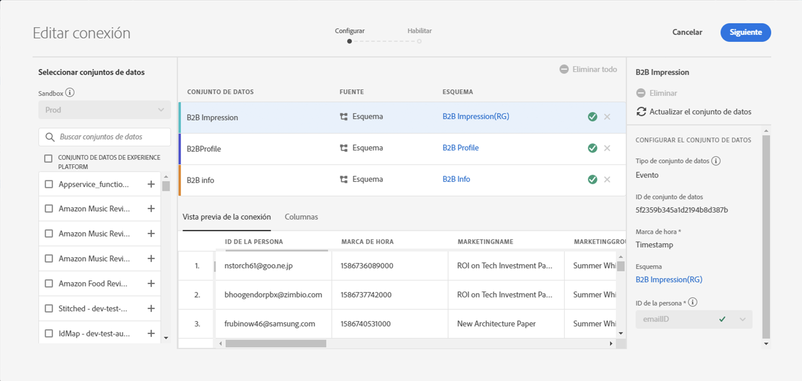
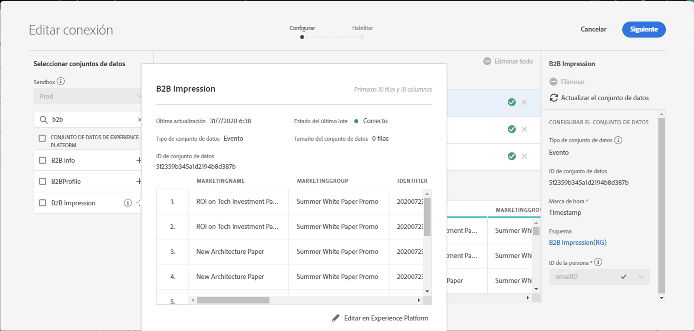
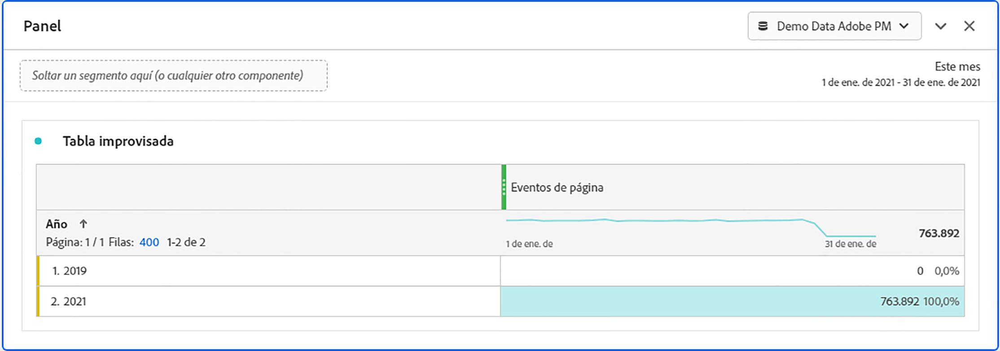

# Cálculo del tamaño de la conexión

Es posible que necesite saber cuántas filas de datos tiene actualmente en [!UICONTROL Customer Journey Analytics]. El propósito de este tema es mostrarle cómo informar sobre el uso actual de [!UICONTROL Customer Journey Analytics].

1. En [!UICONTROL Customer Journey Analytics], haga clic en la pestaña **[!UICONTROL Conexiones]**.
1. En la pantalla [!UICONTROL Editar conexión], seleccione una conexión para la que desee determinar el tamaño de uso/conexión.

   

1. Seleccione un conjunto de datos que forme parte de la conexión desde el carril izquierdo. En este caso, es el conjunto de datos Impresión B2B.

   

1. Haga clic en el icono azul (i) (información) junto a su nombre. Observará que el conjunto de datos tiene 3800 filas/eventos. Además, para el número exacto de filas, haga clic en **[!UICONTROL Editar en Experience Platform]** debajo de la tabla de previsualización. Esto lo redirigirá a los conjuntos de datos de [!UICONTROL Adobe Experience Platform].

   

1. Observe que los **[!UICONTROL registros totales]** de este conjunto de datos ascienden a 3830 registros, con un tamaño de datos de 388,59 KB.

1. Repita los pasos del 1 al 5 con los demás conjuntos de datos de la conexión y añada el número de registros/filas. El número final añadido será la métrica de uso de su conexión. Este es el número de filas de los conjuntos de datos de la conexión que va a introducir desde [!UICONTROL Adobe Experience Platform].

## Determinación del número de filas introducidas

El número de eventos introducidos realmente en [!UICONTROL Customer Journey Analytics] depende de la configuración de su conexión. Además, si seleccionó el ID de persona incorrecto o si este ID no está disponible para algunas filas de los conjuntos de datos, [!UICONTROL Customer Journey Analytics] ignorará dichas filas. Para determinar las filas reales de los eventos introducidos, realice los pasos siguientes:

1. Una vez guardada la conexión, cree una vista de datos de la misma conexión sin ningún filtro.
1. Cree un proyecto del Espacio de trabajo y seleccione la vista de datos correcta. Cree una tabla de formato libre y arrastre y suelte la métrica **[!UICONTROL Eventos]** con la dimensión **[!UICONTROL Año]**. Elija un intervalo de fechas lo suficientemente grande en el calendario de selección de fechas para encapsular todos los datos de la conexión. Esto le permite ver el número de eventos que se están ingiriendo en [!UICONTROL Customer Journey Analytics].

   

   >[!NOTE]
   >
   >Esto le permite ver el número de eventos que se están ingiriendo desde el conjunto de datos de eventos. No incluye conjuntos de datos de tipo de búsqueda y perfil. Siga los pasos del 1 al 3 en Cálculo del tamaño de la conexión con los conjuntos de datos de búsqueda y perfil, y añada los números para obtener el número total de filas para esta conexión.

## Diagnóstico de discrepancias

En algunos casos, es posible que observe que el número total de eventos que ha introducido su conexión es diferente al número de filas del conjunto de datos en [!UICONTROL Adobe Experience Platform]. En este ejemplo, el conjunto de datos Impresión B2B tiene 7650 filas, pero el conjunto de datos contiene 3830 filas en [!UICONTROL Adobe Experience Platform]. Existen varias razones por las que pueden producirse discrepancias y se pueden realizar los siguientes pasos para el diagnóstico:

1. Desglose esta dimensión por **[!UICONTROL ID de conjunto de datos de Platform]** y verá dos conjuntos de datos del mismo tamaño, pero con diferentes **[!UICONTROL ID de conjunto de datos de Platform]**. Cada conjunto de datos tiene 3825 registros. Esto significa que [!UICONTROL Customer Journey Analytics] ha omitido 5 registros debido a la falta de ID de persona o la falta de marcas de hora:

   

1. Además, si comprobamos [!UICONTROL Adobe Experience Platform], no hay ningún conjunto de datos con el ID &quot;5f21c12b732044194bffc1d0&quot;, por lo que alguien eliminó este conjunto de datos concreto de [!UICONTROL Adobe Experience Platform] cuando se creaba la conexión inicial. Más adelante se volvió a añadir a [!UICONTROL Customer Journey Analytics], pero se generó un [!UICONTROL ID de conjunto de datos de Platform] mediante [!UICONTROL Adobe Experience Platform].

Obtenga más información sobre las [implicaciones de la eliminación de conjuntos de datos y conexiones](https://experienceleague.adobe.com/docs/analytics-platform/using/cja-overview/cja-faq.html?lang=es#implications-of-deleting-data-components) en [!UICONTROL Customer Journey Analytics] y [!UICONTROL Adobe Experience Platform].
