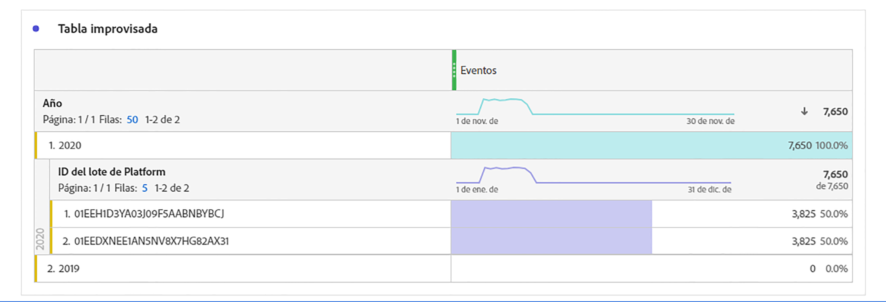

# Cálculo del tamaño de la conexión

Es posible que necesite saber cuántas filas de datos tiene actualmente en [!UICONTROL Customer Journey Analytics]. Para obtener una cuenta precisa del uso de los registros de datos de evento (filas de datos) de su organización, haga lo siguiente **para cada una de las conexiones creadas por su organización**.

1. En [!UICONTROL Customer Journey Analytics], haga clic en la pestaña **[!UICONTROL Conexiones]**.

   Ahora puede ver una lista de todas sus conexiones actuales.

1. Haga clic en cada nombre de conexión para llegar al Administrador de conexiones.

1. Agregue el **[!UICONTROL Registros de datos de evento disponibles]** para todas las conexiones creadas. (Según el tamaño de la conexión, el número puede tardar un tiempo en aparecer).

   

1. Una vez que tenga una suma de todas las filas de datos de evento, busque la asignación &quot;Filas de datos&quot; en el contrato de Customer Journey Analytics que su empresa firmó con el Adobe.

   Esto le proporciona el número máximo de filas de datos autorizadas en el pedido de ventas. Si el número de filas de datos resultantes del paso 3 es mayor que este número, se producirá un exceso.

1. Para solucionar esta situación, tiene varias opciones:

   * Cambie el [configuración de retención de datos](https://experienceleague.adobe.com/docs/analytics-platform/using/cja-connections/manage-connections.html?lang=es#set-rolling-window-for-connection-data-retention).
   * [Eliminar conexiones no utilizadas](https://experienceleague.adobe.com/docs/analytics-platform/using/cja-overview/cja-faq.html?lang=es#implications-of-deleting-data-components).
   * [Eliminar un conjunto de datos en AEP](https://experienceleague.adobe.com/docs/analytics-platform/using/cja-overview/cja-faq.html?lang=en#implications-of-deleting-data-components).
   * Póngase en contacto con el administrador de cuentas de Adobe para obtener una licencia de capacidad adicional.

## Acerca de los excedentes de uso

Los límites de uso están estrictamente monitorizados y aplicados por el Adobe, diariamente. &quot;Filas de datos&quot; significa las filas medias diarias de datos disponibles para su análisis dentro del Customer Journey Analytics.

Supongamos que la asignación de derechos del contrato limita el número de filas a 1 millón. Supongamos que en el día 1 del uso de Customer Journey Analytics se cargan 2 millones de filas de datos. El día 2, elimina 1 millón de filas y mantiene su uso en el máximo comprometido. Seguiría incurriendo en cargos de sobreuso para el Día 1.

## Diagnóstico de discrepancias

En algunos casos, es posible que observe que el número total de eventos que ha introducido su conexión es diferente al número de filas del conjunto de datos en [!UICONTROL Adobe Experience Platform]. En este ejemplo, el conjunto de datos Impresión B2B tiene 7650 filas, pero el conjunto de datos contiene 3830 filas en [!UICONTROL Adobe Experience Platform]. Existen varias razones por las que pueden producirse discrepancias y se pueden realizar los siguientes pasos para el diagnóstico:

1. Desglose esta dimensión por **[!UICONTROL ID de conjunto de datos de Platform]** y verá dos conjuntos de datos del mismo tamaño, pero con diferentes **[!UICONTROL ID de conjunto de datos de Platform]**. Cada conjunto de datos tiene 3825 registros. Esto significa que [!UICONTROL Customer Journey Analytics] ha omitido 5 registros debido a la falta de ID de persona o la falta de marcas de hora:

   

1. Además, si comprobamos [!UICONTROL Adobe Experience Platform], no hay ningún conjunto de datos con el ID &quot;5f21c12b732044194bffc1d0&quot;, por lo que alguien eliminó este conjunto de datos concreto de [!UICONTROL Adobe Experience Platform] cuando se creaba la conexión inicial. Más adelante se volvió a añadir a Customer Journey Analytics, pero se generó un [!UICONTROL ID de conjunto de datos de Platform] mediante [!UICONTROL Adobe Experience Platform].

Obtenga más información sobre las [implicaciones de la eliminación de conjuntos de datos y conexiones](https://experienceleague.adobe.com/docs/analytics-platform/using/cja-overview/cja-faq.html?lang=en#implications-of-deleting-data-components) en [!UICONTROL Customer Journey Analytics] y [!UICONTROL Adobe Experience Platform].
