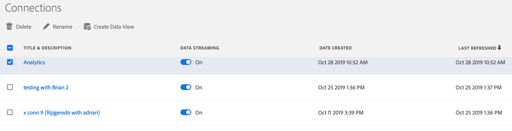

# Administrar conexiones

Una vez que haya creado una o varias conexiones, puede administrarlas en el [!UICONTROL Administrador] de conexiones. Puede

* Eliminar una conexión.
* Cambiar el nombre de una conexión.
* Crear una vista de datos a partir de una conexión.
* Inicio y parada de la transmisión de datos.

1. Haga clic en la pestaña **[!UICONTROL Conexiones]**.

2. Seleccione las conexiones que desea editar o administrar.

3. Complete una de las siguientes acciones:

   | Acción | Descripción |
   |---|---|
   | [!UICONTROL Eliminar] | Al eliminar una conexión, no se elimina el conjunto de datos, ya que los datos siguen en [!DNL Adobe Experience Platform]. Consulte la sección Eliminación de conexiones a continuación. |
   | [!UICONTROL Cambiar el nombre] | Puede cambiar el nombre de la conexión con un nombre más descriptivo. |
   | [!UICONTROL Crear vista de datos] | Este vínculo lo lleva al [creador de vistas de datos](/help/data-views/create-dataview.md). |
   | [!UICONTROL Iniciar o detener el flujo de datos] | &quot;Transmisión&quot; significa que, si se agregan lotes nuevos a cualquiera de los conjuntos de datos de la conexión, estos nuevos datos se incluirán en [!UICONTROL Customer Journey Analytics] para la creación de informes. |

## Eliminación de conexiones

| Y si... | Esto sucede |
| --- | --- |
| ¿Elimino una conexión en [!UICONTROL Customer Journey Analytics]? | Aparecerá un mensaje de error para indicar lo siguiente:<ul><li>Las vistas de datos creadas para la conexión eliminada ya no funcionarán.</li><li> Del mismo modo, los proyectos de Workspace que dependan de vistas de datos en la conexión eliminada dejarán de funcionar.</li></ul> |
| ¿Elimino un conjunto de datos en [!UICONTROL Adobe Experience Platform]? | Al eliminar un conjunto de datos en AEP, se detendrá el flujo de datos desde dicho conjunto de datos a cualquier conexión que incluya el conjunto de datos. Los datos de ese conjunto de datos no se eliminan automáticamente de las conexiones con CJA asociadas. |
| ¿Elimino un conjunto de datos en [!UICONTROL Customer Journey Analytics]? | Actualmente, no se puede eliminar un conjunto de datos de una conexión que se haya guardado. Tendría que eliminar toda la conexión y comenzar de nuevo. (Sin embargo, puede eliminar un conjunto de datos en [!UICONTROL Adobe Experience Platform].) |
| ¿Elimino un lote de un conjunto de datos (en [!UICONTROL Adobe Experience Platform])? | Si se elimina un lote de un conjunto de datos de [!UICONTROL Adobe Experience Platform], se eliminará el mismo lote de cualquier conexión de [!UICONTROL Customer Journey Analytics] que contenga ese lote específico. [!UICONTROL Customer Journey Analytics] recibirá una notificación de los lotes que se eliminaron en [!UICONTROL Adobe Experience Platform]. |
| ¿Elimino un lote **mientras se está introduciendo** en [!UICONTROL Customer Journey Analytics]? | Si solo hay un lote en el conjunto de datos, no aparecerán datos ni datos parciales de dicho lote en [!UICONTROL Customer Journey Analytics]. La introducción se revertirá. Si, por ejemplo, hay 5 lotes en el conjunto de datos y 3 de ellos ya se han introducido cuando se elimine el conjunto de datos, los datos de esos 3 lotes aparecerán en [!UICONTROL Customer Journey Analytics]. |
