# Administrar conexiones {#manage-connections}

>[!CONTEXTUALHELP]
>id="connections_use_ajo"
>title="Usar conexión de Journey Optimizer"
>abstract="Aprovecha las funcionalidades avanzadas de creación de informes de Customer Journey Analytics con Journey Optimizer."

>[!CONTEXTUALHELP]
>id="connections_cancel_ajo"
>title="Cancelar conexión de Journey Optimizer"
>abstract="Cancela las funciones avanzadas de creación de informes de Customer Journey Analytics con Journey Optimizer."

Una vez que haya [creado o editado una o más conexiones](/help/connections/create-connection.md), puede administrarlas en **[!UICONTROL Conexiones]**. La interfaz [!UICONTROL Connections] le permite:

* Vea todas las conexiones de un vistazo, incluido el propietario, el entorno de pruebas y cuándo se crearon y modificaron.
* Edición de una conexión
* Eliminar una conexión.
* Crear una vista de datos a partir de una conexión.
* Ver todos los conjuntos de datos de una conexión.
* Compruebe el estado de los conjuntos de datos de la conexión y del proceso de ingesta. Por ejemplo, cuándo están disponibles los datos para poder empezar con los informes y análisis en Analysis Workspace.
* Identifique cualquier discrepancia des datos debido a una configuración incorrecta. ¿Le faltan filas? En caso afirmativo, ¿qué filas le faltan y por qué? ¿No ha configurado correctamente las conexiones y esto ha hecho que falten datos en Customer Journey Analytics?
* Obtenga información sobre el uso de la filas ingeridas y notificables en todas las conexiones.

[!UICONTROL Conexiones] tiene dos interfaces: [[!UICONTROL Lista]](#list) y [[!UICONTROL Uso]](#usage).

## Lista

La interfaz **[!UICONTROL Lista]** es la interfaz predeterminada para Conexiones. Si no está seleccionada, seleccione la pestaña **[!UICONTROL Lista]** para tener acceso a la interfaz.

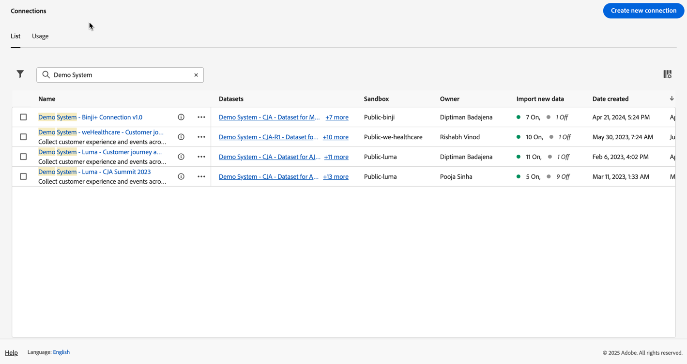

La interfaz [!UICONTROL List] muestra una tabla de todas las conexiones disponibles.

### Buscar una conexión

Puede buscar rápidamente una conexión usando el cuadro de búsqueda .

### Aplicación de un filtro a la lista de conexiones

Para aplicar un filtro a la lista de conexiones, seleccione el icono de filtro y, a continuación, elija una de las siguientes opciones de filtro:

| Opción de filtro | Descripción |
|---------|----------|
| **[!UICONTROL Conjuntos de datos]** | Solo se muestran las conexiones asociadas a los conjuntos de datos seleccionados. |
| **[!UICONTROL Propietario]** | Solo se muestran las conexiones propiedad de las personas seleccionadas. |
| **[!UICONTROL Zona protegida]** | Solo se muestran las conexiones disponibles en las zonas protegidas seleccionadas. |
| **[!UICONTROL Uso en CJA]** | Seleccione **[!UICONTROL Activado]** para mostrar solo las conexiones habilitadas para usar con Customer Journey Analytics. Seleccione **[!UICONTROL Desactivado]** para mostrar solamente las conexiones que aún no se han habilitado para usar con Customer Journey Analytics. |

### Columnas disponibles

En la tabla están disponibles las siguientes columnas o iconos.

| Columna o icono | Descripción |
| --- | --- |
| **[!UICONTROL _Nombre_]** | Nombre descriptivo de la conexión. Seleccione el nombre del hipervínculo para ver los [detalles de la conexión](#connection-details). |
|  | Para ver información sobre [!UICONTROL Conjuntos de datos incluidos], [!UICONTROL Zona protegida], [!UICONTROL Propietario] etc, seleccione  junto al nombre de la conexión.
Una ventana emergente muestra detalles sobre el conjunto de datos. 
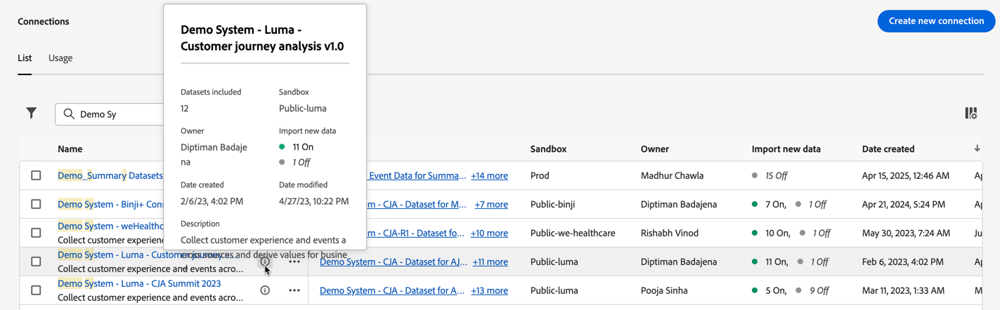 |
|  | Para [crear una vista de datos](#create-a-data-view) para la conexión, seleccione . Este icono solo se muestra cuando no hay ninguna vista de datos asociada a la conexión. |
|  | Seleccione  para abrir un menú contextual. Puede seleccionar: 
 **[!UICONTROL Editar]** para [editar](#edit-a-connection) una conexión.
 **[!UICONTROL Eliminar]** para [eliminar](#delete-a-connection) una conexión.
 **[!UICONTROL Cree una nueva vista de datos]** para [crear una nueva vista de datos](#create-a-data-view) para la conexión.
 **[!UICONTROL Mapa de conexión]** para ver un [mapa de conexión](#map-a-connection) para la conexión. |
| [!BADGE B2B edition]{type=Informative url="https://experienceleague.adobe.com/es/docs/analytics-platform/using/cja-overview/cja-b2b/cja-b2b-edition" newtab=true tooltip="Customer Journey Analytics B2B Edition"} **[!UICONTROL Tipo de conexión &#x200B;]** | El tipo de conexión: basada en **[!UICONTROL persona]** o en **[!UICONTROL cuenta]**. |
| **[!UICONTROL Conjuntos de datos]** | Uno o más vínculos a los conjuntos de datos que forman parte de la conexión. Puede seleccionar el hipervínculo del conjunto de datos para ver el conjunto de datos en la conexión. Si más conjuntos de datos forman parte de la conexión seleccionada, seleccione **[!UICONTROL +*x* más]** para mostrar el panel **[!UICONTROL Conjuntos de datos incluidos]**. Este panel muestra vínculos a todos los conjuntos de datos y una opción para  conjuntos de datos específicos que forman parte de la conexión.
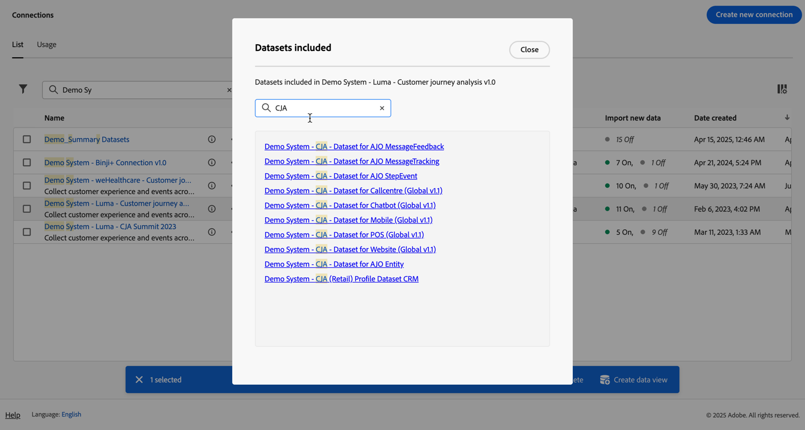
Seleccione un nombre de conjunto de datos para abrir el conjunto de datos en la interfaz de Experience Platform en una nueva pestaña. |
| **[!UICONTROL Zona protegida]** | La [zona protegida de Adobe Experience Platform](https://experienceleague.adobe.com/es/docs/experience-platform/sandbox/home) desde la que esta conexión obtiene sus conjuntos de datos. Seleccione esta zona protegida cuando cree la conexión. Una vez guardada una conexión, no se puede cambiar la zona protegida. |
| **[!UICONTROL Propietario]** | La persona que creó la conexión. |
| **[!UICONTROL Importar datos nuevos]** | Estado de la importación de nuevos datos para conjuntos de datos: 
   **[!UICONTROL _x _en]**&#x200B;para conjuntos de datos configurados para importar datos nuevos, y
   **[!UICONTROL _x Desactivado_]** para conjuntos de datos no configurados para importar datos nuevos. |
| **[!UICONTROL Fecha de creación]** | La marca de tiempo en la que se creó la conexión. |
| **[!UICONTROL Última modificación]** | La marca de tiempo en la que se actualizó la conexión por última vez. |
| **[!UICONTROL Datos de relleno]** | El estado para los datos de relleno entre conjuntos de datos.
   **[!UICONTROL _x _error de rellenos]**&#x200B;para el número de rellenos con error entre conjuntos de datos,
   **[!UICONTROL _x _rellenos en curso]**&#x200B;para el número de rellenos en procesamiento entre conjuntos de datos,
   **[!UICONTROL _x _rellenos completados]**&#x200B;para el número de rellenos completados para los conjuntos de datos, y
   **[!UICONTROL _Desactivado_]** en caso de que no se definan rellenos para los conjuntos de datos de la conexión. |
| **[!UICONTROL Integraciones]** | Muestra todas las aplicaciones de Experience Platform habilitadas con la conexión. |
| **[!UICONTROL Uso en CJA]** | Muestra si la conexión se ha habilitado para su uso con Customer Journey Analytics. |

Para configurar qué columnas mostrar en la tabla, seleccione . En el cuadro de diálogo Personalizar tabla, seleccione las columnas que desea mostrar.

### Edición de una conexión

Para editar una conexión:

1. Seleccione  junto al nombre de la conexión
1. Seleccione  **[!UICONTROL Editar]** en el menú contextual.

Como alternativa, puede:

1. Seleccionar la fila de conexión.

1. Seleccione  **[!UICONTROL Editar]** de la barra de acciones azul.

Consulte [Crear o editar una conexión](create-connection.md) para obtener más información.

### Eliminar una conexión {#connections-delete}

Para eliminar una conexión:

1. Seleccione  junto al nombre de la conexión.
1. Seleccione  **[!UICONTROL Eliminar]**.

Como alternativa, puede:

1. Seleccionar la fila de conexión.

1. Seleccione  **[!UICONTROL Eliminar]** de la barra de acciones azul.

Al eliminar una conexión, un panel **[!UICONTROL Eliminar conexión]** indica qué vistas de datos se eliminan y qué proyectos de Workspace se ven afectados.

* En ➊ **[!UICONTROL Información]**, se muestran las implicaciones de la eliminación de la conexión.

  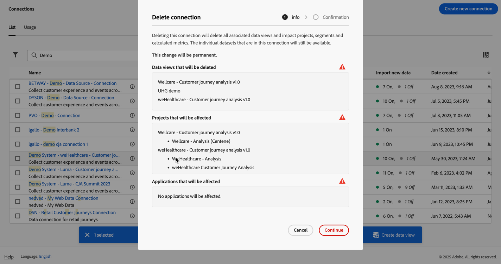

  Seleccione **[!UICONTROL Continuar]** para confirmar la eliminación.

* En ➋ **[!UICONTROL Confirmación]**, escriba el nombre de la conexión en **[!UICONTROL Escriba el nombre de la conexión]** y seleccione **[!UICONTROL Eliminar]** para eliminar la conexión. Seleccione **[!UICONTROL Cancelar]** para cancelar.

Consulte [Implicaciones de la eliminación](/help/technotes/deletion.md) para obtener más información sobre cómo eliminar una conexión.

### Crear una vista de datos para una conexión

Para crear una vista de datos para una conexión:

1. Seleccione  junto al nombre de la conexión.
1. Seleccione  **[!UICONTROL Crear nueva vista de datos]**.

Como alternativa, puede:

1. Seleccionar la fila de conexión.

1. Seleccione  **[!UICONTROL Crear vista de datos]** desde la barra de acciones azul.

Consulte [Creación o edición de una vista de datos](/help/data-views/create-dataview.md) para obtener más información.

### Conexiones de Journey Optimizer

Puede utilizar una conexión de Journey Optimizer en Customer Journey Analytics para aportar el siguiente valor adicional a su conexión:

* Realizar un análisis detallado de los datos de Journey Optimizer en Customer Journey Analytics (con el botón **[!UICONTROL Analizar en CJA]** de Journey Optimizer).

  Para obtener más información, consulte [Analizar en Customer Journey Analytics](https://experienceleague.adobe.com/es/docs/journey-optimizer/using/reporting/channel-report/report-cja-manage#cja-template) en la documentación de Journey Optimizer.

* Edite la conexión de Journey Optimizer y las vistas de datos asociadas.

  Para obtener más información acerca de las opciones de edición, vea [Editar una conexión](#edit-a-connection).

>[!IMPORTANT]
>
>Cuando se habilita una conexión de Journey Optimizer para usarla con Customer Journey Analytics como se describe en esta sección, cada fila de datos de la conexión se contabiliza en las filas de datos con licencia cada mes para Customer Journey Analytics y aparece en la interfaz de usuario de uso de conexiones. Seleccione la opción **[!UICONTROL Usar en CJA]** de la conexión solo si se siente cómodo con el uso adicional de filas de datos en Customer Journey Analytics.
>
>**Si tenía derecho a usar Customer Journey Analytics y Journey Optimizer entre octubre de 2024 y octubre de 2025, consulte el siguiente documento sobre [Conexiones habilitadas para AJO](https://view.adobe.com/viewer/1ed94fc35c7860b260766c620889e7a0#1)**.

Para habilitar esta funcionalidad, su organización necesita acceder a Customer Journey Analytics. Si no tiene acceso, póngase en contacto con su representante de ventas de Adobe.

#### Uso de una conexión de Journey Optimizer {#use-connection-in-cja}

Para utilizar una conexión de Journey Optimizer en Customer Journey Analytics:

1. Busque la conexión de Journey Optimizer que desea utilizar con Customer Journey Analytics.

   1. Seleccione  **[!UICONTROL Filtro]** en la ficha **[!UICONTROL Conexiones]**.

   1. En la sección **[!UICONTROL Usar en CJA]**, seleccione **[!UICONTROL Desactivado]**.

      Esto muestra todas las conexiones de Journey Optimizer que no están configuradas actualmente para su uso en Customer Journey Analytics.

      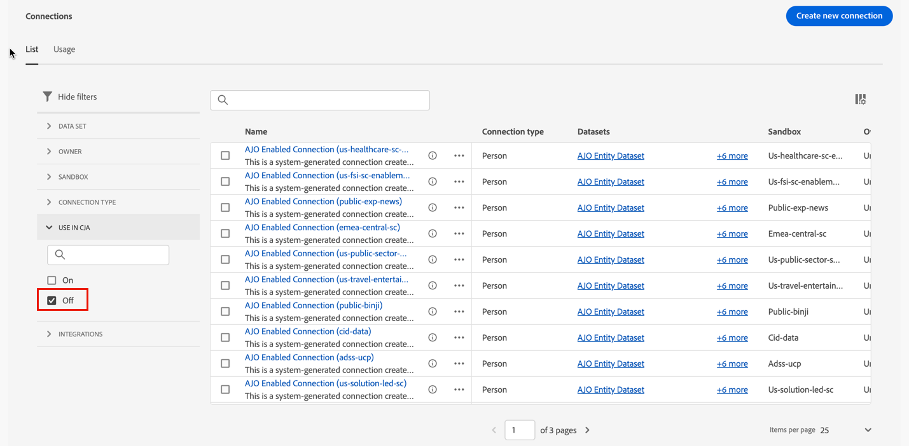

1. Seleccione el nombre de la conexión de Journey Optimizer.

1. Seleccionar  **[!UICONTROL Usar en CJA]**.

   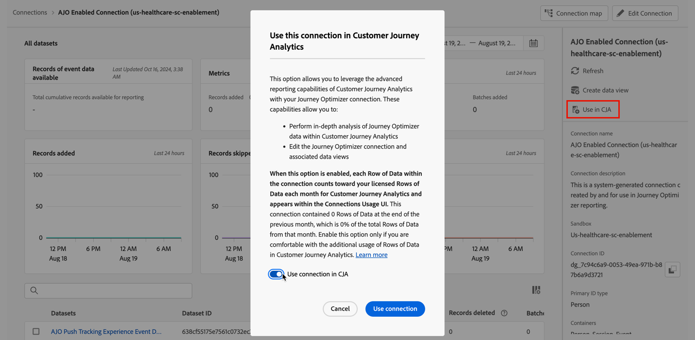

   Se muestra el cuadro de diálogo **[!UICONTROL Usar esta conexión en Customer Journey Analytics]**.

1. Habilite la opción **[!UICONTROL Usar conexión en CJA]**.

1. Seleccione **[!UICONTROL Usar conexión]**. <!-- double-check these dialog button names -->

#### Eliminación de una conexión de Journey Optimizer {#remove-connection-in-cja}

Puede quitar una conexión de Journey Optimizer de Customer Journey Analytics en cualquier momento. Sin embargo, si se elimina la conexión de Customer Journey Analytics después de usarla, se producirá lo siguiente:

* La conexión de Journey Optimizer y las vistas de datos asociadas se restablecen a su estado predeterminado y ya no se pueden editar

* Se eliminará cualquier campo derivado personalizado asociado a la conexión.

* Ya no puede realizar análisis exhaustivos de los datos de Journey Optimizer en Customer Journey Analytics.

  Esto significa que el botón **[!UICONTROL Analizar en CJA]** de Journey Optimizer está deshabilitado.

>[!IMPORTANT]
>
>La facturación de la conexión en Customer Journey Analytics incluye el mes completo durante el cual se elimina la conexión.

Para eliminar la conexión de Customer Journey Analytics:

1. Busque la conexión de Journey Optimizer que desea quitar de Customer Journey Analytics.

   1. Seleccione  **[!UICONTROL Filtro]** en la ficha **[!UICONTROL Conexiones]**.

   1. En la sección **[!UICONTROL Usar en CJA]**, seleccione **[!UICONTROL En]**.

      Esto muestra todas las conexiones de Journey Optimizer que están configuradas actualmente para su uso en Customer Journey Analytics.

      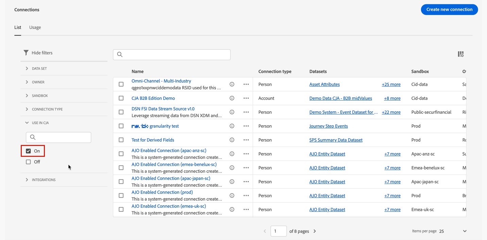

1. Para ver la conexión, seleccione el nombre de la conexión de Journey Optimizer que desea quitar de Customer Journey Analytics.

1. Cuando visualice la conexión de Journey Optimizer, seleccione **[!UICONTROL Quitar de CJA]**.

   Se muestra el cuadro de diálogo **[!UICONTROL Quitar esta conexión de Customer Journey Analytics]**:

   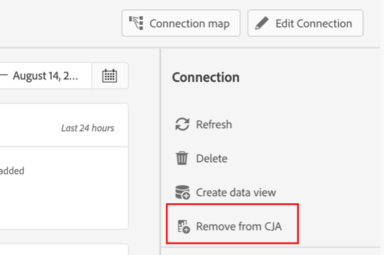

1. Deshabilite la opción **[!UICONTROL Quitar conexión de CJA]**.

1. Seleccione **[!UICONTROL Quitar conexión]**.

### Asignar una conexión

Para ver un [mapa de conexión](/help/connections/create-connection.md#connection-map) que detalla las relaciones entre los conjuntos de datos que forman parte de una conexión:

1. Seleccione  junto al nombre de la conexión.
1. Seleccione  **[!UICONTROL Mapa de conexión]**.

### Detalles de conexión {#connection-detail}

Para ir a los detalles de una conexión, seleccione un nombre de conexión con hipervínculo en la tabla de conexiones.

La página Detalles de conexiones le proporciona una vista detallada del estado de una conexión. Puedes realizar lo siguiente:

* Compruebe el estado de los conjuntos de datos de la conexión y del proceso de ingesta.
* Identifique los problemas de configuración que pueden provocar registros omitidos o eliminados.
* Ver cuándo están disponibles los datos para los informes.

| Interfaz de usuario | Descripción |
| --- | --- |
|  **[!UICONTROL Editar conexión]** | Para editar los detalles de una conexión, seleccione  **[!UICONTROL Editar conexión]**. Consulte [Crear o editar una conexión](create-connection.md) para obtener más información. |
| **[!UICONTROL *Selector de conjunto de datos *]** | Seleccione uno o todos los conjuntos de datos para mostrar los detalles de la conexión. No puede seleccionar conjuntos de datos múltiples. El valor predeterminado es **[!UICONTROL Todos los conjuntos de datos]**. |
| **[!UICONTROL *Selector de intervalo de fechas *]** | Seleccione un rango de datos para mostrar los detalles de la conexión. Edite la fecha de inicio, la fecha de finalización o seleccione  para abrir el selector de intervalos de fechas. En el selector de intervalos de fechas, seleccione un intervalo de fechas utilizando uno de los períodos predefinidos (por ejemplo, **[!UICONTROL Últimos 6 meses]**) o utilice el calendario para seleccionar las fechas de inicio y finalización. Seleccione **[!UICONTROL Aplicar]** para aplicar el nuevo intervalo de fechas a los detalles de conexión. |
| **[!UICONTROL Registros de datos de evento]** | El número total de filas del conjunto de datos de evento disponibles para la creación de informes, **para toda la conexión**. Este recuento es independiente de cualquier intervalo de fechas o selección de conjunto de datos. |
| [!UICONTROL **[!UICONTROL Métricas]**] | Resuma los registros de evento, búsqueda, perfil y conjunto de datos de resumen que se añaden, omiten y eliminan, y el número de lotes añadidos. Estas métricas se basan en **el conjunto de datos y el intervalo de fechas que ha seleccionado**.
Seleccione **[!UICONTROL Comprobar detalles]** para mostrar la ventana emergente **[!UICONTROL Comprobar detalles omitidos]**. La ventana emergente enumera el número de registros omitidos y el motivo de todos los conjuntos de datos de evento o conjuntos de datos seleccionados.
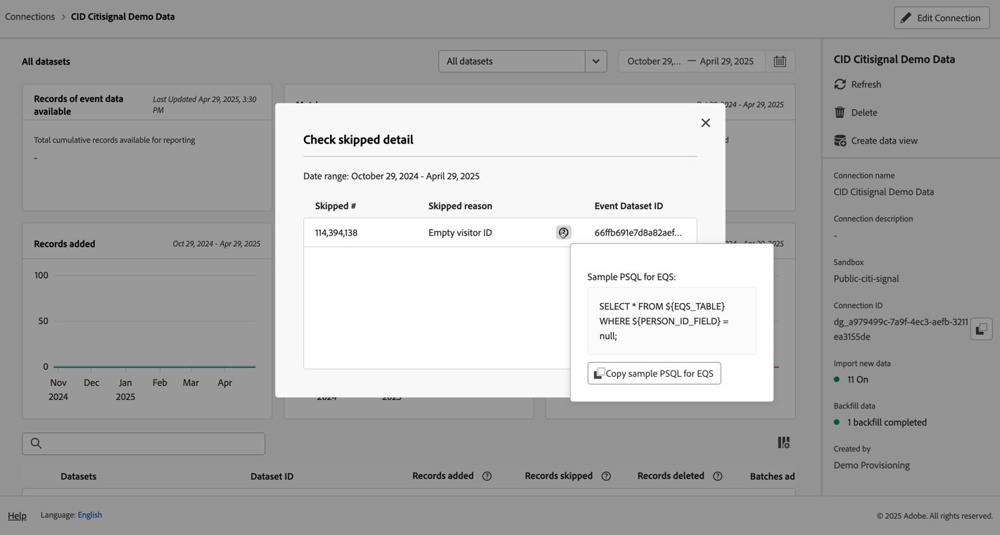
Seleccione la ventana emergente  para obtener más información. Por algunas razones omitidas, como [!UICONTROL ID de visitante vacío], la ventana emergente muestra **[!UICONTROL PSQL de muestra para EQS]** (Experience Platform para el servicio de consultas) que puede usar en [servicio de consultas](https://experienceleague.adobe.com/es/docs/experience-platform/query/home) para consultar los registros omitidos en el conjunto de datos. Seleccione  **[!UICONTROL Copiar PSQL de muestra para EQS]** para copiar el SQL. |
| **[!UICONTROL Registros añadidos]** | Una visualización para indicar cuántas filas se agregaron en el período de tiempo seleccionado, **para el conjunto de datos y el intervalo de fechas que ha seleccionado**. Se actualiza cada 10 minutos. |
| **[!UICONTROL Registros omitidos]** | Una visualización para indicar cuántas filas se omitieron en el período de tiempo seleccionado, **para el conjunto de datos y el intervalo de fechas que ha seleccionado**. Los motivos por los que se omiten registros son: faltan marcas de hora, falta ID de persona o ID de cuenta [!BADGE B2B edition]{type=Informative url="https://experienceleague.adobe.com/es/docs/analytics-platform/using/cja-overview/cja-b2b/cja-b2b-edition" newtab=true tooltip="Customer Journey Analytics B2B Edition"}, o no es válido, etc. Se actualiza cada 10 minutos. 
Los ID de persona no válidos (como `undefined`, `00000000` o cualquier combinación de números y letras en un [!UICONTROL ID de persona] que aparecen en un evento más de un millón de veces en un mes determinado) son ID que no se pueden atribuir a ningún usuario o persona en particular. Estas filas no se pueden ingerir en el sistema, y conllevan a la creación de informes e ingestas propensas a errores. Para corregir ID de persona o ID de cuenta [!BADGE B2B edition]{type=Informative url="https://experienceleague.adobe.com/es/docs/analytics-platform/using/cja-overview/cja-b2b/cja-b2b-edition" newtab=true tooltip="Customer Journey Analytics B2B Edition"} no válidos, tiene tres opciones:<ul><li>Utilice [Identificación](/help/stitching/overview.md) para rellenar los ID de usuario sin definir o todos cero con ID de usuario válidos.</li><li>Vacíe los ID de usuario, que luego se omiten durante la ingesta (preferible a los ID de usuario no válidos o todos cero).</li><li>Corrija cualquier ID de usuario no válido en el sistema antes de ingerir los datos.</li></ul> |
| **[!UICONTROL Registros eliminados]** | Una visualización para indicar cuántas filas se eliminaron en el período de tiempo seleccionado, **para el conjunto de datos y el intervalo de fechas que ha seleccionado**. Alguien podría haber eliminado un conjunto de datos en [!DNL Experience Platform], por ejemplo. Se actualiza cada 10 minutos.
En algunos casos, este valor también puede incluir registros reemplazados, como con la vinculación o algunas actualizaciones del conjunto de datos de búsqueda. Observe este ejemplo:
<ul><li>Carga un registro en un conjunto de datos de perfil individual de XDM, configurado para la ingesta como datos de búsqueda de perfil por parte de Customer Journey Analytics. En los detalles de la conexión, este conjunto de datos mostraría un registro añadido.</li><li>Carga un duplicado del registro original en el mismo conjunto de datos de AEP, que ahora contiene dos registros. Customer Journey Analytics ingiere el registro adicional del conjunto de datos de búsqueda de perfiles o cuenta [!BADGE B2B Edition]{type=Informative url="https://experienceleague.adobe.com/es/docs/analytics-platform/using/cja-overview/cja-b2b/cja-b2b-edition" newtab=true tooltip="Customer Journey Analytics B2B Edition"}. Al ver que ya se ha introducido un perfil o registro de cuenta en la conexión para ese ID de persona o ID de cuenta [!BADGE B2B edition]{type=Informative url="https://experienceleague.adobe.com/es/docs/analytics-platform/using/cja-overview/cja-b2b/cja-b2b-edition" newtab=true tooltip="Customer Journey Analytics B2B Edition"}, Customer Journey Analytics elimina su versión anterior y agrega los nuevos datos de perfil. En los detalles de la conexión, esta acción representaría 1 registro agregado y 1 registro eliminado, ya que Customer Journey Analytics solo conserva los datos de búsqueda de perfil más recientes para cualquier ID de persona o ID de cuenta ingeridos [!BADGE B2B edition]{type=Informative url="https://experienceleague.adobe.com/es/docs/analytics-platform/using/cja-overview/cja-b2b/cja-b2b-edition" newtab=true tooltip="Customer Journey Analytics B2B Edition"}.</li><li>En total, el conjunto de datos de AEP contiene dos registros que son idénticos. Por otro lado, los detalles de conexión de Customer Journey Analytics muestran el estado de sus datos ingeridos: 2 registros añadidos y 1 registro eliminado para este conjunto de datos de perfil. </li></ul> |
|  | Campo de búsqueda del conjunto de datos. Puede buscar la tabla de conjuntos de datos por nombre o ID de conjunto de datos. |
| [!UICONTROL Tabla de conjuntos de datos] | Los conjuntos de datos que forman parte de la conexión. Consulte la tabla siguiente para obtener más información. Seleccione  un solo conjunto de datos para mostrar solo los detalles de conexión del conjunto de datos seleccionado. Esto equivale a la selección de un conjunto de datos a partir de **[!UICONTROL _Selector de conjunto de datos_]**. |

La tabla de conjuntos de datos muestra las siguientes columnas para cada conjunto de datos:

| Columna | Descripción |
| --- | --- |
| **[!UICONTROL Conjuntos de datos]** | Nombre del conjunto de datos. Puede seleccionar el hipervínculo para abrir el conjunto de datos en la interfaz de usuario de Experience Platform en una nueva pestaña. Puede seleccionar la fila o la casilla de verificación para mostrar solo los detalles del conjunto de datos seleccionado. |
| **[!UICONTROL ID de conjunto de datos]** | ID del conjunto de datos generado por Experience Platform. |
| **[!UICONTROL Registros añadidos]** | El número de registros del conjunto de datos (filas) agregados a una conexión durante el intervalo de fechas seleccionado. |
| **[!UICONTROL Registros omitidos]** | El número de registros del conjunto de datos (filas) omitidos durante la transferencia de datos para una conexión durante el intervalo de fechas seleccionado. |
| **[!UICONTROL Registros eliminados]** | El número de registros del conjunto de datos (filas) quitados de una conexión durante el intervalo de fechas seleccionado. |
| **[!UICONTROL Lotes añadidos]** | El número de lotes que se han agregado a una conexión durante el intervalo de fechas seleccionado. |
| **[!UICONTROL Última incorporación]** | La marca de tiempo del último lote que se añadió a una conexión. |
| **[!UICONTROL Tipo de fuente de datos]** | El tipo de origen. El tipo de origen se define al agregar un conjunto de datos a una conexión. |
| **[!UICONTROL Tipo de conjunto de datos]** | El [tipo de conjunto de datos](create-connection.md#dataset-types). El tipo puede ser [!UICONTROL Event], [!UICONTROL Profile], [!UICONTROL Lookup] o [!UICONTROL Summary]. |
| **[!UICONTROL Esquema]** | El esquema de Adobe Experience Platform en el que se basa este conjunto de datos. |
| **[!UICONTROL Importar datos nuevos]** | Estado de la importación de nuevos datos para el conjunto de datos: 
   **[!UICONTROL _x _Activado]**&#x200B;si el conjunto de datos está configurado para importar datos nuevos y
   **[!UICONTROL _x Desactivado_]** si el conjunto de datos está configurado para no importar una nueva importación de datos. |
| **[!UICONTROL Datos de transformación]** | El estado de transformación de los conjuntos de datos de consulta B2B aplicables. Consulte [Transformación de conjuntos de datos para búsquedas B2B](transform-datasets-b2b-lookups.md) para obtener más información.
   **[!UICONTROL _x _Activado]**&#x200B;para conjuntos de datos aplicables habilitados para la transformación, 
   **[!UICONTROL _x Desactivado_]** para conjuntos de datos aplicables no habilitados para la transformación y
**[!UICONTROL N/A]** para todos los demás conjuntos de datos, no aplicables para la transformación. |
| **[!UICONTROL Datos de relleno]** | El estado de los datos de relleno del conjunto de datos.
   **[!UICONTROL _x _rellenos fallidos]**&#x200B;para el número de rellenos fallidos,
   **[!UICONTROL _x _rellenos en procesamiento]**&#x200B;para el número de rellenos que se están procesando.
   **[!UICONTROL _x _rellenos completados]**&#x200B;para el número de rellenos completados y
   **[!UICONTROL _Desactivado_]** en caso de que no se hayan configurado rellenos. |

>[!IMPORTANT]
>
>Los datos introducidos antes del 13 de agosto de 2021 no se reflejan en la interfaz [!UICONTROL Conexiones].
>

#### Panel de conexión

Cuando no se selecciona ningún conjunto de datos individual en la tabla de conjuntos de datos, el panel derecho muestra las opciones y los detalles de conexión.

| Opciones | Descripción |
| --- | --- |
|  **[!UICONTROL Actualizar]** | Para actualizar la conexión y permitir que se reflejen los registros añadidos recientemente, seleccione  **[!UICONTROL Actualizar]**. |
|  **[!UICONTROL Eliminar]** | [Elimine](#delete-a-connection) esta conexión. |
|  **[!UICONTROL Crear vista de datos]** | [Cree una vista de datos](#create-a-data-view) en función de la conexión. Consulte [Vistas de datos](https://experienceleague.adobe.com/es/docs/analytics-platform/using/cja-dataviews/data-views) para obtener más información. |
| **[!UICONTROL Uso en CJA]** | Utilice una conexión de Journey Optimizer en Customer Journey Analytics para añadir valor adicional a la conexión de Journey Optimizer. Para obtener más información, consulte [Usar una conexión Journey Optimizer en Customer Journey Analytics](#use-a-journey-optimizer-connection-in-customer-journey-analytics). |
| **[!UICONTROL Nombre de la conexión]** | Muestra el nombre descriptivo de la conexión. |
| **[!UICONTROL Descripción de la conexión]** | Muestra una descripción más detallada que describe el propósito de esta conexión. |
| **[!UICONTROL Zona protegida]** | La [zona protegida de Adobe Experience Platform](https://experienceleague.adobe.com/es/docs/experience-platform/sandbox/home) desde la que esta conexión obtiene sus conjuntos de datos. Seleccione esta zona protegida cuando cree la conexión. Una vez guardada una conexión, no se puede cambiar la zona protegida. |
| **[!UICONTROL ID de conexión]** | Un identificador generado para la conexión. Puede usar  para copiar el valor. |
| [!BADGE B2B edition]{type=Informative url="https://experienceleague.adobe.com/es/docs/analytics-platform/using/cja-overview/cja-b2b/cja-b2b-edition" newtab=true tooltip="Customer Journey Analytics B2B Edition"} **[!UICONTROL Tipo de ID principal &#x200B;]** | El tipo de identificador principal para la conexión: **[!UICONTROL Persona]** para una conexión basada en persona, **[!UICONTROL Cuenta]** para una conexión basada en cuenta. |
| [!BADGE B2B edition]{type=Informative url="https://experienceleague.adobe.com/es/docs/analytics-platform/using/cja-overview/cja-b2b/cja-b2b-edition" newtab=true tooltip="Customer Journey Analytics B2B Edition"} **[!UICONTROL Contenedores &#x200B;]** | Los contenedores configurados para la conexión. |
| **[!UICONTROL Vistas de datos mediante conexión]** | Las vistas de datos que utilizan esta conexión. |
| **[!UICONTROL Importar datos nuevos]** | Estado de la importación de nuevos datos para conjuntos de datos: 
   **[!UICONTROL _x _Activado]**&#x200B;para saber cuántos conjuntos de datos se han configurado para importar datos nuevos y
   **[!UICONTROL _x Desactivado_]** para cuántos conjuntos de datos se desactiva la nueva importación de datos nuevos. |
| **[!UICONTROL Datos de relleno]** | El estado de los datos de relleno para los conjuntos de datos.
   **[!UICONTROL _x _rellenos fallidos]**&#x200B;para el número de rellenos fallidos entre conjuntos de datos,
   **[!UICONTROL _x _rellenos en proceso]**&#x200B;para el número de rellenos en proceso entre conjuntos de datos,
   **[!UICONTROL _x _rellenos completados]**&#x200B;para el número de rellenos completados para los conjuntos de datos y
   **[!UICONTROL _Desactivado_]** en caso de que no se definan rellenos para los conjuntos de datos de la conexión. |
| **[!UICONTROL Datos de transformación]** | El estado de transformación de los conjuntos de datos de consulta B2B aplicables. Consulte [Transformación de conjuntos de datos para búsquedas B2B](transform-datasets-b2b-lookups.md) para obtener más información.
   **[!UICONTROL _x _Activado]**&#x200B;para el número de conjuntos de datos habilitados para la transformación. |
| **[!UICONTROL Creado por]** | El nombre de la persona que ha creado la conexión. |
| **[!UICONTROL Última modificación]** | La marca de tiempo del último cambio en la conexión. |
| **[!UICONTROL Última modificación de:]** | Nombre de la persona que modificó la conexión por última vez. |

#### Panel Conjunto de datos

Cuando se selecciona una fila de conjunto de datos en la tabla de conjuntos de datos, un panel a la derecha de la interfaz Conexiones muestra detalles del conjunto de datos seleccionado.

| Detalles | Descripción |
| --- | --- |
| [!BADGE B2B Edition]{type=Informative url="https://experienceleague.adobe.com/es/docs/analytics-platform/using/cja-overview/cja-b2b/cja-b2b-edition" newtab=true tooltip="Customer Journey Analytics B2B Edition"} **[!UICONTROL ID. de cuenta global &#x200B;]** | La identidad que ha especificado como identificador de cuenta global para la conexión. Solo se aplica a una conexión basada en cuentas para la que se ha configurado un contenedor de cuenta global. |
| [!BADGE B2B Edition]{type=Informative url="https://experienceleague.adobe.com/es/docs/analytics-platform/using/cja-overview/cja-b2b/cja-b2b-edition" newtab=true tooltip="Customer Journey Analytics B2B Edition"} **[!UICONTROL ID de cuenta &#x200B;]** | La identidad que ha especificado como ID de cuenta para la conexión. Solo se aplica a una conexión basada en cuentas para la que no se ha configurado ningún contenedor de cuenta global. |
| **[!UICONTROL ID de la persona]** | La identidad que ha especificado como ID de persona para la conexión. |
| **[!UICONTROL Clave]** | La clave que ha especificado para un conjunto de datos de consulta. |
| **[!UICONTROL Clave de coincidencia]** | La clave de coincidencia que ha especificado para un conjunto de datos de consulta. |
| **[!UICONTROL Marca de tiempo]** | La marca de tiempo definida para un conjunto de datos de evento. |
| **[!UICONTROL Registros disponibles]** | El número total de filas ingeridas para este conjunto de datos, para el período de tiempo particular seleccionado a través del calendario. Una vez añadidos, no hay latencia en cuanto a la aparición de datos en los informes. Sin embargo, cuando crea una conexión completamente nueva, hay [latencia](https://experienceleague.adobe.com/es/docs/analytics-platform/using/cja-overview/cja-b2c-overview/cja-faq). |
| **[!UICONTROL Registros añadidos]** | El número de registros del conjunto de datos (filas) agregados a una conexión durante el intervalo de fechas seleccionado. |
| **[!UICONTROL Registros omitidos]** | El número de registros del conjunto de datos (filas) omitidos durante la transferencia de datos para una conexión durante el intervalo de fechas seleccionado. |
| **[!UICONTROL Lotes añadidos]** | El número de lotes que se han agregado a una conexión. |
| **[!UICONTROL Registros eliminados]** | El número de registros del conjunto de datos (filas) quitados de una conexión durante el intervalo de fechas seleccionado. |
| **[!UICONTROL Última incorporación]** | La marca de tiempo del último lote que se añadió a una conexión. |
| **[!UICONTROL Importar datos nuevos]** | Estado de la importación de nuevos datos para el conjunto de datos: 
   **[!UICONTROL _x _Activado]**&#x200B;si el conjunto de datos está configurado para importar datos nuevos y
   **[!UICONTROL _x Desactivado_]** si el conjunto de datos está configurado para no importar datos nuevos. |
| **[!UICONTROL Datos de relleno]** | El estado de los datos de relleno del conjunto de datos.
   **[!UICONTROL _x _rellenos fallidos]**&#x200B;para el número de rellenos fallidos,
   **[!UICONTROL _x _rellenos en procesamiento]**&#x200B;para el número de rellenos que se están procesando.
   **[!UICONTROL _x _rellenos completados]**&#x200B;para el número de rellenos completados, y
   **[!UICONTROL _Desactivado_]** en caso de que no se hayan configurado rellenos.
Para mostrar un cuadro de diálogo con información general de los rellenos anteriores para el conjunto de datos, seleccione  **[!UICONTROL Rellenos anteriores]**. |
| **[!UICONTROL Tipo de fuente de datos]** | Tipo de fuente de datos definido cuando se agregó el conjunto de datos a la conexión. |
| **[!UICONTROL Tipo de conjunto de datos]** | El [tipo de conjunto de datos](create-connection.md#dataset-types). |
| **[!UICONTROL Esquema]** | El esquema de Adobe Experience Platform en el que se basa este conjunto de datos. |
| **[!UICONTROL ID de conjunto de datos]** | El ID del conjunto de datos, tal como se genera en Experience Platform. |

## Uso {#connections-usage}

>[!CONTEXTUALHELP]
>id="connections_usage_keyusagemetrics"
>title="Métricas de uso clave"
>abstract="Proporcione datos mensuales y totales para las filas principales e históricas notificables."

>[!CONTEXTUALHELP]
>id="connections_usage_monthlyingestedrows"
>title="Filas introducidas mensualmente"
>abstract="Mide el número total de registros añadidos al sistema cada mes para proporcionar información sobre el crecimiento de los datos y las tasas de ingesta."

>[!CONTEXTUALHELP]
>id="connections_usage_monthlyreportablerows"
>title="Filas mensuales notificables"
>abstract="Realiza el seguimiento del número de filas disponibles para la creación de informes. Las filas notificables son las filas introducidas menos las filas que se omiten y eliminan durante la ingesta. Las filas notificables sirven como métrica clave para la facturación y el uso de datos."

>[!CONTEXTUALHELP]
>id="connections_usage_detailbreakdown"
>title="Desglose detallado."
>abstract="Puede ver métricas detalladas por conexión, conjunto de datos, zona protegida y etiquetas, con la opción de descargar un archivo CSV de los datos."

>[!CONTEXTUALHELP]
>id="connections_usage_otherdatasets"
>title="Otros conjuntos de datos"
>abstract="Para los meses anteriores a septiembre de 2024, los datos se recopilaron en el nivel de conjunto de datos y se muestran como *Otros conjuntos de datos* para una mayor claridad. Desde septiembre de 2024, los datos se recopilan en un nivel de conjunto de datos granular y *Otros conjuntos de datos* dejan de aparecer."

>[!CONTEXTUALHELP]
>id="connections_usage_unknowndatasetsorconnections"
>title="Conjuntos de datos o conexiones desconocidos"
>abstract="Los conjuntos de datos o conexiones desconocidos se muestran con sus ID."

>[!CONTEXTUALHELP]
>id="connections_usage_datanotavailable"
>title="Datos no disponibles"
>abstract="Los datos históricos anteriores a septiembre de 2024 no están disponibles debido a limitaciones del sistema. Las métricas se recopilan y muestran a partir de septiembre de 2024. El gráfico muestra los últimos 18 meses en la cronología y los datos futuros aparecerán a medida que los datos estén disponibles."

>[!CONTEXTUALHELP]
>id="connections_corereportablerows"
>title="Filas principales notificables"
>abstract="Número total de filas disponibles durante los últimos 13 meses. Por ejemplo, el 1 de febrero de 2024, el número muestra el total de filas disponibles con una marca de tiempo de evento de enero de 2023 a enero de 2024."

>[!CONTEXTUALHELP]
>id="connections_historicalreportablerows"
>title="Filas históricas notificables"
>abstract="Número total de filas disponibles para el período anterior a 13 meses. Por ejemplo, el 1 de febrero de 2024, el número muestra el total de filas disponibles con una marca de tiempo de evento anterior a enero de 2023."

>[!CONTEXTUALHELP]
>id="connections_averagerowsize"
>title="Tamaño promedio de fila"
>abstract="Cantidad promedio de almacenamiento consumido por cada fila de datos ingerida y almacenada en Customer Journey Analytics (en KB) para el mes actual, con un cambio porcentual comparado con el mes anterior."

>[!CONTEXTUALHELP]
>id="connections_coredatavolume"
>title="Volumen de datos principales"
>abstract="Cantidad total de datos almacenados en el disco con marca de tiempo para el mes actual (en TB), con un cambio porcentual en comparación con el mes anterior."

>[!CONTEXTUALHELP]
>id="connections_breakdown_corereportablerows"
>title="Filas principales notificables"
>abstract="Las filas principales notificables son valores de instantáneas, no totales agregados. Estos valores se actualizan dinámicamente en función del último mes del intervalo de fechas seleccionado. Si un cliente selecciona de enero a marzo, los valores reflejarán la instantánea de marzo."

>[!CONTEXTUALHELP]
>id="connections_breakdown_historicalreportablerows"
>title="Filas históricas notificables"
>abstract="Las filas históricas notificables son valores de instantáneas, no totales agregados. Estos valores se actualizan dinámicamente en función del último mes del intervalo de fechas seleccionado. Si un cliente selecciona de enero a marzo, los valores reflejarán la instantánea de marzo."

>[!CONTEXTUALHELP]
>id="connections_breakdown_cumulativereportablerows"
>title="Filas notificables acumulativas"
>abstract="Las filas notificables acumulativas son valores de instantáneas, no totales agregados. Estos valores se actualizan dinámicamente en función del último mes del intervalo de fechas seleccionado. Si un cliente selecciona de enero a marzo, los valores reflejarán la instantánea de marzo."

La interfaz [!UICONTROL Uso] muestra el uso de filas ingeridas y notificables en todas las conexiones. Si no está seleccionada, seleccione la pestaña **[!UICONTROL Uso]** para tener acceso a la interfaz.

Esta interfaz le ayuda a determinar si el uso de Customer Journey Analytics cumple con lo acordado contractualmente. Además de la finalidad de monitorización, puede utilizar la interfaz de uso para planificar la renovación de su licencia de Customer Journey Analytics.

La interfaz de uso utiliza las siguientes métricas:

| Nombre de la métrica | Descripción |
|---|---|
| Filas históricas notificables | Recuento de filas para el periodo superior a 13 meses. |
| Filas principales notificables | Recuento de filas de los últimos 13 meses. |
| Filas ingeridas | Cuántas filas se ingieren para el periodo específico. |
| Filas notificables | Cuántas filas de datos tiene como parte de la conexión durante el período específico. |
| Filas acumuladas | Cuántas filas se incorporan hasta el mes específico. |

>[!NOTE]
>
>A partir de julio de 2024, se recopilan los datos de los registros principales, históricos y totales. Póngase en contacto con el administrador de cuentas para obtener los datos históricos anteriores.
>

La interfaz de uso consta de dos paneles:

* Panel **[!UICONTROL Métricas de uso clave]**: proporciona filas notificables de datos principales e históricos. El panel también realiza un seguimiento de los cambios porcentuales en comparación con el mes anterior, tanto para las filas de datos principales como para las históricas.

  El panel muestra una visualización que contiene:

   * **[!UICONTROL Filas notificables de datos principales]**

     Cuántas filas notificables ha tenido en los últimos 13 meses. El número de resumen es el número de filas principales sobre las que se pueden crear informes (por ejemplo, 741 millones) en el último mes (por ejemplo, diciembre de 2024).

   * **[!UICONTROL Filas notificables de datos históricos]**

     Cuántas filas notificables tiene para el período anterior a 13 meses. El número de resumen es el número de filas históricas sobre las que se puede crear un informe (por ejemplo, 127 millones) en el último mes (por ejemplo, diciembre de 2024).

  Cuando pasa el puntero por encima de cualquier barra apilada de la visualización, una ventana emergente muestra el número de filas de esa parte específica de la barra (por ejemplo).

  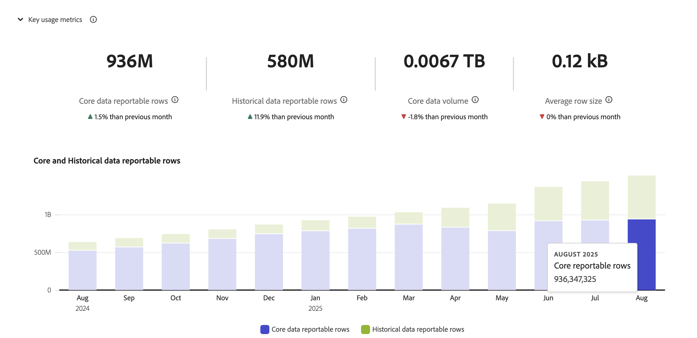

* Un panel combinado que muestra tres subpaneles para:

  +++ Filas ingeridas

  Las **[!UICONTROL Filas ingeridas]** mensualmente: mide el número total de registros añadidos al sistema cada mes, lo que proporciona información sobre el crecimiento de los datos y las tasas de ingesta. El subpanel ofrece un resumen del total de filas introducidas de este mes y el cambio con respecto al mes anterior.

  

  Puede pasar el puntero por encima de los puntos de datos en la visualización para mostrar una ventana emergente con más detalles.

  +++

  +++ Filas notificables

  La visualización **[!UICONTROL Filas notificables]** registra el número de filas disponibles para la creación de informes mediante la sustracción de las filas omitidas y eliminadas de las filas ingeridas, lo que sirve como una métrica clave para facturación y el uso de datos. El subpanel ofrece dos resúmenes:

   * **[!UICONTROL Total del último mes]**: un resumen del total de filas sobre las que se puede crear un informe hasta este mes.
   * **[!UICONTROL Este mes]**: un resumen del total de filas de este mes sobre las que se puede crear un informe y el cambio con respecto al mes anterior.

  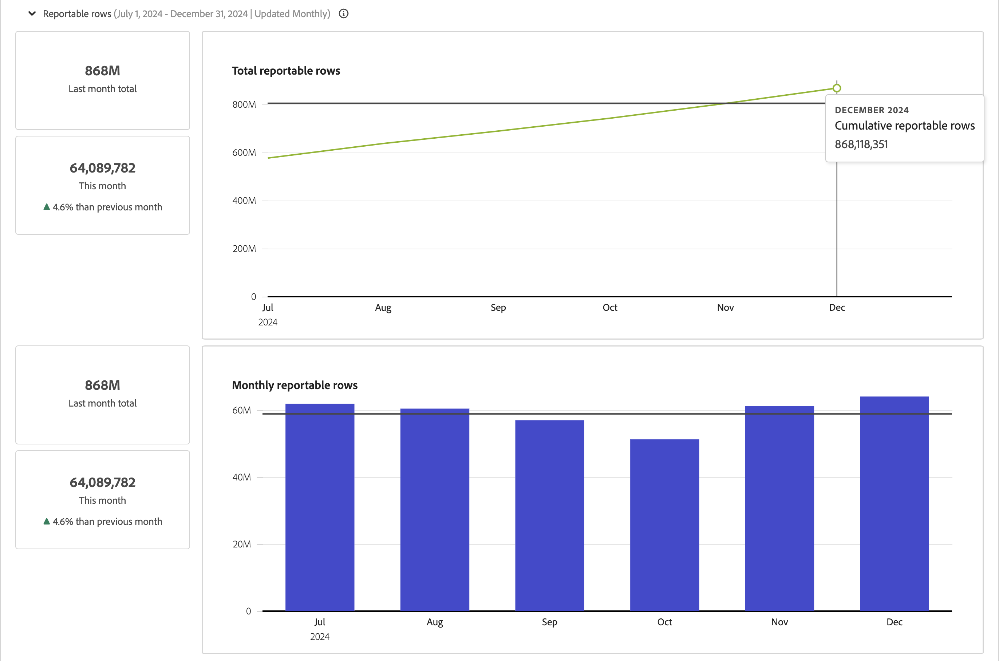

  Puede pasar el puntero por encima de los puntos de datos en las visualizaciones para mostrar una ventana emergente con más detalles.

  +++

  +++ Desglose de detalles

  Puede usar la tabla **[!UICONTROL Desglose de detalles]** para ver las métricas detalladas por conexión, conjunto de datos, zona protegida y etiquetas. Los conjuntos de datos se comunican utilizando ID en lugar de nombres, ya que los nombres de los conjuntos de datos se pueden modificar durante un período de creación de informes. Los conjuntos de datos o conexiones desconocidos se notifican con sus ID.

  Para los meses anteriores a septiembre de 2024, los datos se recopilaron en el nivel de conjunto de datos y se muestran como [!UICONTROL Otros conjuntos de datos] para una mayor claridad. A partir de septiembre de 2024, los datos se recopilarán en un nivel de conjunto de datos granular y [!UICONTROL Otros conjuntos de datos] dejarán de aparecer.

   * Para cambiar el desglose, seleccione una combinación para **[!UICONTROL Ver por]** y **[!UICONTROL Desglosar por]**.

     | Opciones de **[!UICONTROL Ver por]** | Opciones de **[!UICONTROL Desglosar por]**  |
     |---|---|
     | **[!UICONTROL Conexión]** | **[!UICONTROL -]** y **[!UICONTROL Conjunto de datos]** |
     | **[!UICONTROL Conjunto de datos]** | **[!UICONTROL -]** |
     | **[!UICONTROL Zona protegida]** | **[!UICONTROL Conexión]** |
     | **[!UICONTROL Etiqueta]** | **[!UICONTROL Conexión]** |

  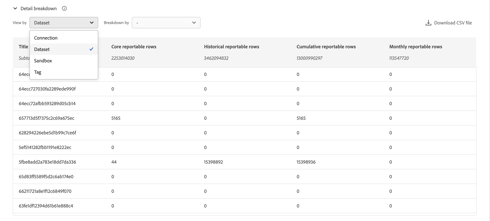

  +++

  Puede definir un **[!UICONTROL intervalo de tiempo]** en meses sobre el que informar. Utilice  para seleccionar el intervalo de tiempo.

>[!MORELIKETHIS]
>
>Tutorial [Ver, solucionar problemas y modificar la configuración de conexiónt](https://experienceleague.adobe.com/es/docs/customer-journey-analytics-learn/tutorials/connections/connections-details-experience-in-cja).
>&#x200B;>[Administrar el uso de Customer Journey Analytics](/help/technotes/estimate-usage.md)
>
